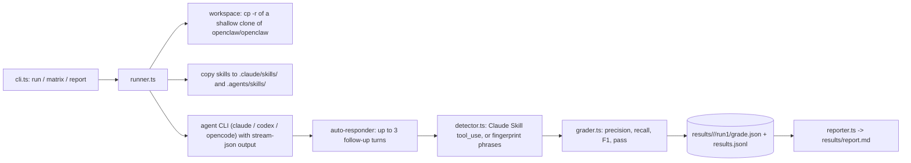

# superpowers-bench - do agents pick the right skill without being told?

Evidence was gathered read-only on 2026-09-23 from the local clone at `~/github/superpowers-bench` (branch `master`, HEAD `6a0e877`) and the committed `results/`.
Citations use `repo/path:line`.

## 1. TL;DR

superpowers-bench measures skill discovery: given the `obra/superpowers` skill set installed in a workspace and a task prompt, does a coding agent (Claude Code, Codex, OpenCode) invoke the skills a good engineer would expect, with and without a natural-language hint (`superpowers-bench/README.md:19`, `superpowers-bench/README.md:20`)?
It grades by set comparison (precision, recall, F1, and an exact-match pass) with no LLM judge, and the committed report covers 8 conditions x 18 tasks x 1 run each (`superpowers-bench/src/grader.ts:11`, `superpowers-bench/results/report.md:7`).
Upstream (Kun Chen, `kunchenguid/superpowers-bench`) built and ran it; the user's fork has no fork-specific commits, and it matters to the user's harness because the harness is itself a skill loadout whose value depends on agents discovering skills from their descriptions.

## 2. Problem it solves, and what breaks without it

Skills (`SKILL.md` files with a `name` and a "Use when" `description`) only help if the agent reaches for them unprompted.
Without measurement, a skill library can look complete while agents silently ignore half of it.
This benchmark isolates "skill selection" from code quality: "Did the agent reach for the right tools?" (`superpowers-bench/README.md:26`).

## 3. Architecture

Modules (`superpowers-bench/src/`): `cli.ts`, `config.ts`, `runner.ts`, `detector.ts`, `grader.ts`, `reporter.ts`, `results.ts`, `retry.ts`, `social.ts`, `types.ts`.
- Target repo for tasks is `openclaw/openclaw`, shallow-cloned once into a cache then copied per worker (`superpowers-bench/src/config.ts:10`, `superpowers-bench/src/runner.ts:51`, `superpowers-bench/src/runner.ts:61`).
- Skills are planted in both Claude Code and Codex discovery paths: `.claude/skills/<name>/SKILL.md` and `.agents/skills/<name>/SKILL.md` (`superpowers-bench/src/runner.ts:97`, `superpowers-bench/src/runner.ts:102`).
- Detection: for Claude, parse `tool_use` blocks named `Skill` from stream-json; for Codex and OpenCode, match distinctive phrases from each skill body listed in `config/fingerprints.yaml` (`superpowers-bench/src/detector.ts:17`, `superpowers-bench/src/detector.ts:42`).
- Up to 3 automatic follow-up turns so agents that ask clarifying questions still proceed (`superpowers-bench/src/runner.ts:41`).

State files: `results/<condition>/<task>/run<n>/grade.json`, `results/results.jsonl`, `results/report.md`; `run` and `matrix` wipe `results/` first (`superpowers-bench/src/results.ts:4`, `superpowers-bench/README.md:93`).

## 4. Interfaces

From `superpowers-bench/src/cli.ts` usage and `superpowers-bench/README.md`:

| Command | Flags | Effect |
| --- | --- | --- |
| `npm run bench -- run` | `--condition <id>` (required), `--task <id>` (required), `--repeat <n>` | one condition x task |
| `npm run bench -- matrix` | `--parallel <n>` (default 4), `--condition`, `--task`, `--repeat` | full grid |
| `npm run bench -- report` | none | markdown report from `results.jsonl` |
| `npm run fetch-skills` | none | downloads 8 skills from `obra/superpowers` (`superpowers-bench/scripts/fetch-skills.sh:7`) |

Unknown commands print usage and exit 1 (`superpowers-bench/src/cli.ts:344`).
Output formats: JSONL results, JSON grades, Markdown report.
Agents run with permission prompts disabled (`--dangerously-skip-permissions` for Claude, `--dangerously-bypass-approvals-and-sandbox` for Codex) because runs are unattended (`superpowers-bench/src/runner.ts:347`, `superpowers-bench/src/runner.ts:421`).

## 5. Configuration

| File | Content |
| --- | --- |
| `config/conditions.yaml` | 8 conditions: `claude`, `claude-opus-4-7`, `codex`, `opencode-gpt-5-4`, each baseline and `-triggered` (`superpowers-bench/config/conditions.yaml:1`) |
| `config/tasks.yaml` | 18 tasks, each with `category`, `expected_skills`, `prompt`, `trigger_hint` (`superpowers-bench/config/tasks.yaml:12`) |
| `config/fingerprints.yaml` | phrases per skill for non-Claude detection |

Trigger hints imply the workflow without naming a skill, for example "Let's think through the design options carefully before proposing anything" (`superpowers-bench/config/tasks.yaml:22`).
User's actual setting: unchanged; `node_modules` is not installed in the user's clone, so the benchmark has not been run locally.
Documentation drift: the README says "same 20 tasks" (`superpowers-bench/README.md:27`) but `config/tasks.yaml` defines 18 and the report shows 18 runs per condition.

## 6. Connections

- **User's skills (`~/.agents/skills`)**: the benchmark plants skills in exactly the layout the user's harness uses, `.agents/skills/<name>/SKILL.md` mirrored to `.claude/skills/` (`superpowers-bench/src/runner.ts:102`); the user's `~/.claude/skills/*` are symlinks into `~/.agents/skills/*` (verified with `ls -la ~/.claude/skills`, 2026-09-23).
  Its central finding (below) is direct evidence for why the user's skill descriptions are written as trigger conditions ("Use when ...", for example `~/.agents/skills/ship/SKILL.md:3`).
- **fleet-ops**: `kind: benchmark`, `default_branch: master`, alias `cdsb`, with a manifest note that the default branch is `master`, not `main` (`.fleet/manifest.yaml:251`, `.fleet/manifest.yaml:255`, `.fleet/aliases.zsh:36`); synced on 2026-09-23 (`.fleet/logs/sync-20260923.log:278`).
  See [fleet-ops](fleet-ops.md).
- **no-mistakes**: none; there is no `.github/workflows/` directory in this repo.
- **Other harness components**: no reference from `agents`, `firstmate`, `dotfiles-nix`, or hooks (grep, 2026-09-23).

## 7. Lifecycle walkthrough

Trace: `npm run bench -- run --condition claude --task debug_timeouts`.

1. `cli.ts` parses the command and resets `results/` (`superpowers-bench/src/cli.ts:330`, `superpowers-bench/src/results.ts:4`).
2. `runner.ts` ensures the cached shallow clone of `openclaw/openclaw`, copies it into an isolated worker workspace, and fails fast if skills were not fetched (`superpowers-bench/src/runner.ts:51`, `superpowers-bench/src/runner.ts:61`, `superpowers-bench/src/runner.ts:85`).
3. It copies each skill into `.claude/skills/` and `.agents/skills/` (`superpowers-bench/src/runner.ts:97`).
4. It runs `claude` with `--output-format stream-json`, the configured `--model`, and no permission prompts, then auto-responds up to 3 times via `--resume` (`superpowers-bench/src/runner.ts:344`, `superpowers-bench/src/runner.ts:345`, `superpowers-bench/src/runner.ts:41`).
5. `detectClaudeSkills` collects every `Skill` tool_use name from the JSONL (`superpowers-bench/src/detector.ts:8`).
6. `gradeSkills` drops the always-on meta-skill `using-superpowers`, then computes precision, recall, F1, and pass = no missing and no extra (`superpowers-bench/src/grader.ts:13`, `superpowers-bench/src/grader.ts:44`, `superpowers-bench/src/runner.ts:572`).
7. The result appends to `results.jsonl` and `report` renders tables.

## 8. Failure modes and safeguards

| Failure | Safeguard | Evidence |
| --- | --- | --- |
| Parallel workers interfere | per-worker copy of the target repo | `superpowers-bench/README.md:80` |
| Agent stalls on a clarifying question | auto-responder, max 3 turns | `superpowers-bench/src/runner.ts:41` |
| Transient CLI failure | `retryRun` with `maxRetries` | `superpowers-bench/src/retry.ts:7` |
| Stale results mixed with new | results dir wiped at start | `superpowers-bench/src/results.ts:4` |
| Codex / OpenCode have no explicit skill events | fingerprint phrase matching (a weaker, heuristic detector) | `superpowers-bench/src/detector.ts:42` |
| Empty expected set rewards doing nothing | defined: both empty scores 1.0, extra skills score precision 0 | `superpowers-bench/src/grader.ts:26` |

## 9. Testing and quality

- Tests: `npx tsx --test test/**/*.test.ts` over 6 files with 16 `test(` calls (`superpowers-bench/package.json:9`).
- No CI workflows and no linter config.
- I did not run the tests: `node_modules` is absent, and installing dependencies would modify the clone.

### Results on disk (`superpowers-bench/results/report.md:7` to `:14`, n = 18 tasks x 1 run per condition)

| Condition | Model | Pass | Precision | Recall | F1 |
| --- | --- | --- | --- | --- | --- |
| claude | claude-opus-4-6 | 33% | 100% | 38% | 40% |
| claude-triggered | claude-opus-4-6 | 39% | 100% | 42% | 43% |
| claude-opus-4-7 | claude-opus-4-7 | 44% | 95% | 69% | 70% |
| claude-opus-4-7-triggered | claude-opus-4-7 | 56% | 98% | 69% | 72% |
| codex | gpt-5.4 | 44% | 83% | 92% | 83% |
| codex-triggered | gpt-5.4 | 78% | 91% | 98% | 92% |
| opencode-gpt-5-4 | openai/gpt-5.4 | 50% | 90% | 73% | 74% |
| opencode-gpt-5-4-triggered | openai/gpt-5.4 | 56% | 90% | 86% | 82% |

How to read it:
- Claude conditions are high precision, low recall: when Claude invokes a skill it is almost always an expected one, but it skips many expected skills.
- Hints help recall most for Codex (pass 44% to 78%).
- `systematic-debugging` has 100% recall in every condition, while `verification-before-completion` is 0% for all four Claude conditions (`superpowers-bench/results/report.md:52` onward).
- Caveat: detection differs by agent (exact tool events for Claude, phrase fingerprints for others), so cross-agent comparisons mix two measurement methods, and n = 1 per cell.

## 10. Fork delta

No fork-specific commits; tracks upstream.
`git log upstream/master..HEAD` is empty; all 4 commits are by upstream authors.

## 11. Interview angle

**Q1. How do you evaluate tool or skill selection in an agent?**
Define an expected set per task, detect actual invocations from structured events where possible, and score with precision and recall rather than a single pass rate, because "invoked the wrong skill" and "invoked nothing" are different failures (`superpowers-bench/src/grader.ts:11`).

**Q2. What does this imply for writing skills or internal developer docs?**
Descriptions must encode when to use the skill, not just what it does, because discovery is driven by matching the situation.
The user's harness applies this: its skill descriptions end in explicit trigger clauses such as "Use when asked to build, implement, fix, or ship" (`~/.agents/skills/ship/SKILL.md:3`).

**Q3. What is wrong with these numbers?**
One sample per cell, heuristic detection for non-Claude agents, and a README that disagrees with the task file on the task count; any claim beyond "Claude is conservative about invoking skills in this setup" is overreach.

**Trade-off to defend.** Programmatic grading (no LLM judge) is cheap, deterministic, and reproducible, but it only measures whether a skill was invoked, not whether invoking it improved the work; the downside is a benchmark that can reward ceremony.
