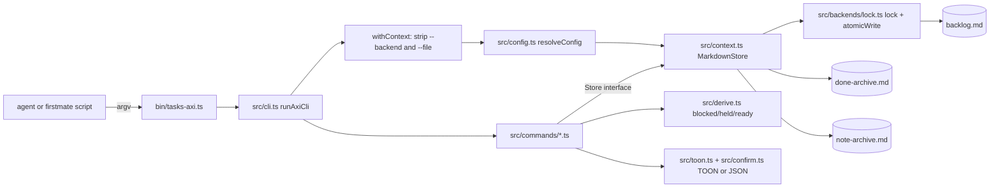
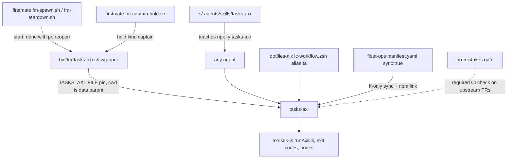
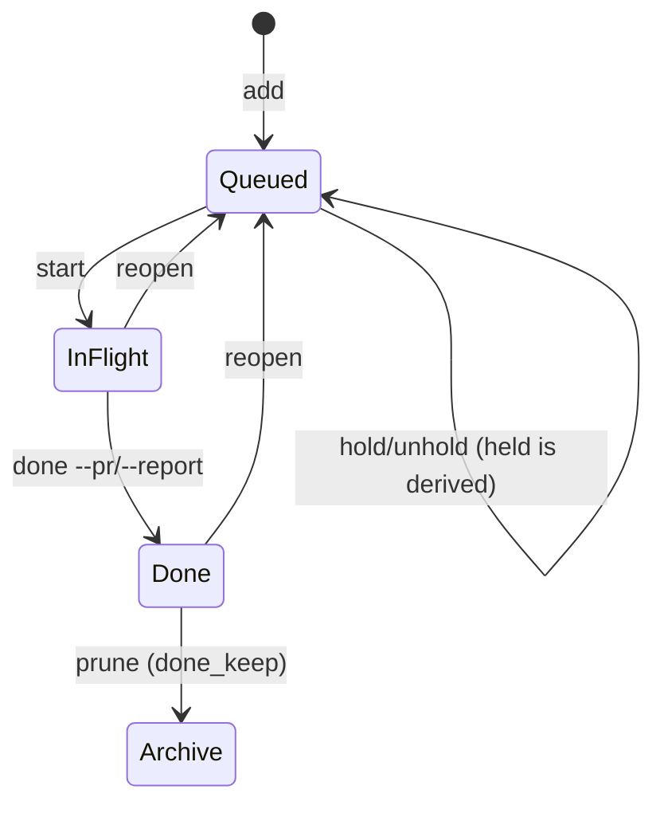

# tasks-axi - the harness backlog CLI

Evidence was measured on 2026-09-23 against the local clone at `~/github/tasks-axi` (HEAD `9401ff8`, release 0.2.6).
Citations use `repo/path:line`, with the repo name relative to `~/github`.

## 1. TL;DR

tasks-axi is an agent-facing CLI that makes small, structured, idempotent edits to a human-readable `backlog.md` instead of having an LLM regenerate the whole file on every state change.
It models a task as a row in one of three Markdown sections (In flight, Queued, Done), derives `blocked`, `held`, and `ready` from dependency edges and structured holds, and records the PR URL or report path when work closes.
Upstream (Kun Chen, `kunchenguid/tasks-axi`) built all of the code; the user's fork carries no fork-specific commits, and the user's own work is the integration: npm-link install, skill wiring, fleet sync, and firstmate's backlog contract that drives it.

## 2. Problem it solves, and what breaks without it

An agent supervisor (firstmate) keeps a durable queue of work items in `data/backlog.md`.
Without a tool, every status change means the model rereads and rewrites the Markdown, which spends expensive output tokens and risks dropped, duplicated, or reordered items (`tasks-axi/README.md:18`).
tasks-axi reduces that to one short command plus a compact confirmation that is read back as cheap input tokens (`tasks-axi/README.md:19`).

What breaks without it:

- Lost updates when a human hand-edit and an agent edit race on the same file; tasks-axi guards the read-modify-write window with a lockfile, an atomic temp-file rename, and a re-read check (`tasks-axi/README.md:207`).
- Dispatching work whose blocker has not landed, because readiness is prose rather than a computed query (`tasks-axi/src/derive.ts:35-50`).
- Captain decisions that silently get dispatched, because "HELD" was free text; structured holds are a readiness gate (`tasks-axi/src/derive.ts:53-61`).
- Missing PR evidence on closed work; `done --pr` validates and stores a canonical PR link (`tasks-axi/src/pr-url.ts:16-31`).

## 3. Architecture



### Modules

| Module | Role | Evidence |
| --- | --- | --- |
| `bin/tasks-axi.ts` | Executable entry; built to `dist/bin/tasks-axi.js` | `tasks-axi/package.json` (`bin` field) |
| `src/cli.ts` | Command table, aliases, global flag stripping, hands off to `runAxiCli` from `axi-sdk-js` | `tasks-axi/src/cli.ts:86-110`, `tasks-axi/src/cli.ts:150-159` |
| `src/config.ts` | Backend and path resolution with a minimal TOML reader | `tasks-axi/src/config.ts:203-248` |
| `src/context.ts` | Builds the `MarkdownStore`; any other backend is refused as `UNSUPPORTED` | `tasks-axi/src/context.ts:24-30` |
| `src/store.ts` | The narrow `Store` seam every backend implements | `tasks-axi/src/store.ts:56-84` |
| `src/model.ts` | `Task`, `Hold`, `Dep`, `TaskLink` types | `tasks-axi/src/model.ts:12-90` |
| `src/derive.ts` | Pure projections: `blockedIds`, `isHoldActive`, `readyTasks` | `tasks-axi/src/derive.ts:35-81` |
| `src/backends/markdown.ts` | Parse, mutate, re-render, persist, prune, move | `tasks-axi/src/backends/markdown.ts:419-1260` |
| `src/backends/markdown-grammar.ts` | Canonical tag grammar and rendering | `tasks-axi/src/backends/markdown-grammar.ts:295-331` |
| `src/backends/lock.ts` | Advisory lockfile and atomic write | `tasks-axi/src/backends/lock.ts:23-192` |
| `src/commands/state.ts` | start, done, reopen, block, unblock, hold, unhold, ready, mv | `tasks-axi/src/commands/state.ts:116-679` |
| `src/public-followup.ts` + `src/commands/public-followup.ts` | Typed, receipt-gated "promised public final" obligations (about 2,700 lines) | `tasks-axi/src/public-followup.ts`, `tasks-axi/README.md:140-192` |

### Data model

A `Task` has `id`, `title`, `state`, optional `kind`, `repo`, `body`, `priority`, `created`, `closed`, `hold`, plus arrays `links` and `deps` (`tasks-axi/src/model.ts:60-90`).
The three explicit states are `queued`, `in_flight`, and `done` (`tasks-axi/src/model.ts:12`).
`blocked` and `held` are derived projections, not stored states (`tasks-axi/src/model.ts:15-16`).
Hold kinds are `captain`, `external`, `load`, `parked`, and `future` (`tasks-axi/src/model.ts:18-24`).
A hold's `until` is a `YYYY-MM-DD` date gate, and the hold is inactive on and after that date (`tasks-axi/src/model.ts:32-33`).
Dependency types are `blocked-by`, `parent`, and `discovered-from`, borrowed from beads; only `blocked-by` gates readiness (`tasks-axi/src/model.ts:36-40`, `tasks-axi/src/derive.ts:41`).
The id is a caller-supplied join key (firstmate uses it for `state/<id>` and `data/<id>/report.md`), and `--mint` can generate a `slug-xx` id with a two-hex-character suffix (`tasks-axi/src/id.ts`).

### backlog.md format

State is carried by the section header, not the bullet style: `## In flight`, `## Queued`, `## Done` (`tasks-axi/src/backends/markdown.ts:68-70`, `tasks-axi/README.md:208`).
Normalized rows render as `- [ ] id - ...` for open work and `- [x] id - ...` for Done (`tasks-axi/README.md:209`).
Inline tags are the canonical fields: `(repo: X)`, `blocked-by: <id>` or `blocked-by: <id> - <reason>`, `(since <date>)`, `(merged <date>)` or `(reported <date>)`, `(kind: X)`, `(priority: 0-4)`, `(hold: <reason>)`, `(hold-kind: ...)`, `(hold-until: YYYY-MM-DD)`, and typed links (`tasks-axi/README.md:212-220`).
The closure verb is derived: a PR link renders `merged`, a report link renders `reported`, otherwise `done` (`tasks-axi/src/backends/markdown-grammar.ts:295-299`).
Reason-bearing dependency edges render after the parenthetical tags so a re-parse never lets the free-text reason swallow a trailing tag (`tasks-axi/src/backends/markdown-grammar.ts:326-331`).
The parser is lenient and the renderer is byte-exact on unchanged files: `render(parse(src)) === src`, and only the mutated task is re-rendered (`tasks-axi/README.md:197-198`).

A real file produced in a scratch directory by the commands in section 7:

```text
# Backlog

## In flight
## Queued
- [ ] fm-lease-adopt - adopt the durable lease blocked-by: lease-t4 (repo: firstmate) (kind: ship) (since 2026-09-23)
## Done
- [x] lease-t4 - treehouse lease primitive https://github.com/o/r/pull/42 (repo: treehouse) (kind: ship) (merged 2026-09-23)
```

### State files (what it persists and where)

| File | Content | Evidence |
| --- | --- | --- |
| `backlog.md` (or configured path) | The source of truth | `tasks-axi/src/config.ts:164-177` |
| `backlog.md.lock` | Advisory lock token `pid:nonce:time:counter`, removed on release | `tasks-axi/src/backends/lock.ts:42-45`, `tasks-axi/src/backends/lock.ts:130` |
| `backlog.md.tmp-<pid>-<n>` | Transient temp file, renamed over the target | `tasks-axi/src/backends/lock.ts:108-124` |
| `done-archive.md` next to the backlog (or `markdown.archive`) | Pruned Done rows, appended as `## Archived <date>` blocks | `tasks-axi/src/backends/markdown.ts:312-313`, `tasks-axi/src/backends/markdown.ts:1253` |
| `note-archive.md` next to the backlog | Bodies superseded with `update --archive-body` | `tasks-axi/src/backends/markdown.ts:314-315` |

tasks-axi keeps no database, daemon, or cache; every invocation re-reads the file.

## 4. Interfaces

All commands below were summarized from real `--help` output of the installed 0.2.6 binary.
The top-level help lists 19 command slots (`tasks-axi/src/cli.ts:65-81`).

| Command (aliases) | Inputs | Output and behavior |
| --- | --- | --- |
| (none) | none | Content-first dashboard: in-flight rows, queued summary, retained Done count, next-step help |
| `add` (`create`) | `<id> "<title>"`, `--kind`, `--repo`, `--body` or `--body-file`, `--start` or `--queue`, `--blocked-by` (repeatable, must exist), `--pr`, `--report`, `--priority 0-4`, `--mint [--prefix]`, `--json` | `ok: added ... -> Queued` plus the task record |
| `list` | `--state queued/in_flight/done/held`, `--repo`, `--kind`, `--blocked`, `--limit`, `--fields a,b,c` | TOON table; long bodies truncated |
| `show` (`view`) | `<id> [--full]` | One task; `--full` prints the complete body |
| `start` | `<id>`, `--json` | Moves to In flight, idempotent |
| `done` (`close`) | `<id>`, `--pr`, `--report`, `--note`, `--keep <n>`, `--no-prune`, `--json` | Moves to Done, auto-prunes Done beyond `done_keep`; re-running backfills links without changing the close date |
| `reopen` | `<id>`, `--json` | Back to Queued |
| `update` (`edit`) | `--title`, `--body` or `--body-file`, `--archive-body`, `--repo`, `--kind`, `--priority`, `--pr`, `--report`, `--json` | Wholesale body replacement, by design inspect-then-replace |
| `rm` (`delete`) | `<id>`, `--json` | Refuses while active tasks still block on the id |
| `block` / `unblock` | `<id> --by <other>`, `--json` | Adds or clears a `blocked-by` edge; the blocker must exist |
| `hold` / `unhold` | `<id> --reason "<text>"`, `--until YYYY-MM-DD`, `--kind captain/external/load/parked/future`, `--json` | Structured dispatch hold; reason must be single-line with no parentheses |
| `ready` | `--repo`, `--include-held` | Unblocked, unheld queued work; public follow-ups appear only in a separate group |
| `mv` | `<id> [<id>...] --to <path-or-dir>`, `--json` | Atomic cross-file move; refuses to strand a dependency |
| `prune` | `--keep <n>`, `--state`, `--json` | Archives surplus, never deletes |
| `render` | `--json` | Normalizes every id'd row to canonical form |
| `public-followup` | 10 subcommands (`add`, `bind-work`, `supersede-work`, `work-event`, `list`, `ready`, `begin-delivery`, `record-delivery`, `record-error`, `waive`) with file-backed JSON contracts | Typed state machine for promised public replies |
| `setup hooks` | none | Installs a SessionStart hook for Claude Code, Codex, and OpenCode |

Global flags `--backend` and `--file` are accepted after the command and stripped before the handler runs (`tasks-axi/src/cli.ts:163-232`).
The noun `task` is optional, so `tasks-axi task add ...` equals `tasks-axi add ...` (`tasks-axi/src/cli.ts:140-141`).

Output format:

- Default is TOON, with a leading `ok:` confirmation line on writes and state-aware `help[]` suggestions (`tasks-axi/README.md:123-127`).
- `--json` on any mutation returns `{ "ok": true, "action": ..., "task": {...} }`, and a no-op carries `already: true` (`tasks-axi/README.md:128-135`).
- Empty states are explicit, for example `ready: 0 unblocked queued tasks` (`tasks-axi/src/commands/state.ts` `readyCommand`, observed in section 7).

Exit codes come from `axi-sdk-js`: `VALIDATION_ERROR` exits 2 and every other `AxiError` exits 1 (`tasks-axi/node_modules/axi-sdk-js/dist/errors.js:11-16`).
Error codes are `VALIDATION_ERROR`, `NOT_FOUND`, `LOCKED`, `CONFLICT`, `UNSUPPORTED`, and `UNKNOWN` (`tasks-axi/src/errors.ts:7-13`).
Observed: an unknown command exits 2, `block nope --by x` exits 1 with `NOT_FOUND`, a parenthesized hold reason exits 2, and a contended lock exits 1 with `LOCKED` after about 2.6 seconds.

## 5. Configuration

Resolution order is `--backend`/`--file` flags, then `TASKS_AXI_BACKEND`/`TASKS_AXI_FILE` env, then project `.tasks.toml`, then `~/.tasks-axi/config.toml`, then defaults (`tasks-axi/src/config.ts:10-13`).

| Key | Default | Meaning | Evidence |
| --- | --- | --- | --- |
| `backend` | `markdown` | Only `markdown` ships; others are refused | `tasks-axi/src/config.ts:224-229`, `tasks-axi/src/context.ts:24-30` |
| `[markdown] path` | first existing of `backlog.md`, `data/backlog.md`, else `backlog.md` | Backlog file | `tasks-axi/src/config.ts:46`, `tasks-axi/src/config.ts:164-177` |
| `[markdown] archive` | `done-archive.md` next to the backlog | Prune destination | `tasks-axi/src/backends/markdown.ts:312-313` |
| `[markdown] done_keep` | `10` | Done rows retained before auto-prune | `tasks-axi/src/config.ts:45` |
| `TASKS_AXI_FILE` / `TASKS_AXI_BACKEND` | unset | Env overrides | `tasks-axi/src/config.ts:211-229` |

The TOML reader is deliberately tiny: it accepts only `backend` and the `[markdown]` table and throws `VALIDATION_ERROR` on anything else malformed (`tasks-axi/src/config.ts:49-105`).

The user's actual settings:

- There is no `~/.tasks-axi/config.toml` on this machine (checked with `ls`).
- firstmate tracks a `.tasks.toml` with `backend = "markdown"`, `path = "data/backlog.md"`, `archive = "data/done-archive.md"`, `done_keep = 10` (`firstmate/.tasks.toml`).
- The global binary is an npm link into the fork clone: `/opt/homebrew/bin/tasks-axi` resolves to `~/github/tasks-axi/dist/bin/tasks-axi.js` (checked with `readlink -f`), matching the fleet manifest's `install_mechanism: "npm-link into /opt/homebrew/lib/node_modules"` (`.fleet/manifest.yaml:131-144`).
- The ambient SessionStart hook is not installed: `~/.claude/settings.json` has no `SessionStart` entry, and the dotfiles README says "Not currently enabled here" (`dotfiles-nix/README.md:520-528`).
Why: the backlog is loaded on demand through the skill and firstmate scripts rather than injected into every session, which keeps unrelated sessions' context clean.

## 6. Connections



- **firstmate** is the primary caller.
Its backlog contract makes tasks-axi the durable queue and requires every routine call to go through `bin/fm-tasks-axi.sh` (`firstmate/AGENTS.md:534-544`).
The wrapper runs tasks-axi from the data directory's parent and pins `TASKS_AXI_FILE=<data>/backlog.md`, because a bare `tasks-axi` from the code root would fork the queue (`firstmate/bin/fm-tasks-axi.sh:17-29`).
It refuses a caller-supplied `--file` and a symlinked backlog, exiting 2 (`firstmate/bin/fm-tasks-axi.sh:34-43`).
- **firstmate lifecycle invariant**: `state/<id>.meta` exists if and only if the backlog row is In flight; `fm-spawn.sh` pairs meta publish with `tasks-axi start`, and `fm-teardown.sh` pairs meta removal with `tasks-axi done` or `reopen` (`firstmate/bin/fm-backlog-transition-lib.sh:7-20`).
Crash recovery relies on tasks-axi's idempotent `done`: replaying a close backfills links without moving the close date (`firstmate/bin/fm-backlog-transition-lib.sh:49-51`).
- **Version floor**: firstmate requires tasks-axi `0.2.4` or newer via `FM_TASKS_AXI_MIN` (`firstmate/bin/fm-tasks-axi-lib.sh:45`).
- **Captain decisions** are tasks held with `--kind captain` through `bin/fm-captain-hold.sh` (`firstmate/AGENTS.md:537`).
- **Skill**: `~/.agents/skills/tasks-axi` is a symlink to `~/github/tasks-axi/skills/tasks-axi`, and the skill defers all syntax to live `--help` (`tasks-axi/skills/tasks-axi/SKILL.md`).
- **agents manual**: the generated routing rule says "`tasks-axi`: track multi-step work in the workspace backlog; record the PR when completing a task" (`agents/ROUTING.md:24`).
- **dotfiles-nix**: aliases `ta='tasks-axi'` (`dotfiles-nix/files/zsh/ic-workflow.zsh:508`).
- **fleet-ops**: `sync: true`, `aliases: {jump: cdta, run: ta}` (`.fleet/manifest.yaml:131-144`).
- **no-mistakes**: upstream CI has a `no-mistakes-required.yml` workflow that requires PRs to be raised through the no-mistakes gate (`tasks-axi/.github/workflows/no-mistakes-required.yml`, `tasks-axi/README.md:275-277`).
- **Sibling notes**: [quota-axi](quota-axi.md), [compact-adviser](compact-adviser.md), and the firstmate note at [firstmate](firstmate.md).

## 7. Lifecycle walkthrough

The following was run in a scratch directory with `HOME` pointed at that directory, so no real backlog was touched.

1. `tasks-axi add lease-t4 "treehouse lease primitive" --kind ship --repo treehouse` prints `ok: added lease-t4 (ship, repo treehouse) -> Queued`.
`main` normalizes argv and calls `runAxiCli` (`tasks-axi/src/cli.ts:138-159`); `withContext` strips global flags and calls `resolveConfig`, which finds no config and targets `./backlog.md` (`tasks-axi/src/config.ts:172-176`).
2. `tasks-axi add fm-lease-adopt ... --blocked-by lease-t4` succeeds only because the blocker exists; the task shows `blocked: yes`.
3. `tasks-axi ready` returns one row, `lease-t4`, because `readyTasks` keeps only queued, non-public-followup, unblocked, unheld rows (`tasks-axi/src/derive.ts:72-81`).
4. `tasks-axi hold lease-t4 --reason "captain decision pending" --kind captain` validates the reason (`tasks-axi/src/commands/state.ts:334-349`) and calls `store.update(id, { hold })` (`tasks-axi/src/commands/state.ts:476-500`).
`ready` now prints `ready: 0 unblocked queued tasks`, and `ready --include-held` shows the row in a separate `held[1]` group with reason and kind.
5. `tasks-axi start lease-t4` calls `store.transition(id, "in_flight")`.
Inside, `withLock` creates `backlog.md.lock` with `O_EXCL` (`openSync(lockPath, "wx")`) and retries every 25 ms for up to 2.5 s (`tasks-axi/src/backends/lock.ts:23-25`, `tasks-axi/src/backends/lock.ts:137-158`).
The store re-loads the file, stamps `created`, moves the entry to the top of In flight, and calls `persist` (`tasks-axi/src/backends/markdown.ts:956-1016`).
`persist` first asserts the on-disk source still equals what was loaded, raising `CONFLICT` otherwise, then writes a temp file and renames it over the backlog (`tasks-axi/src/backends/markdown.ts:481-493`, `tasks-axi/src/backends/lock.ts:108-124`).
6. `tasks-axi done lease-t4 --pr https://github.com/o/r/pull/42 --json` validates the PR URL against the byte-exact GitHub `/pull/<n>` or Forgejo `/pulls/<n>` shape (`tasks-axi/src/pr-url.ts:16-31`), appends the link to the title, sets `closed`, and moves the row to Done (`tasks-axi/src/backends/markdown.ts:976-1012`).
`pruneDone` then archives Done rows beyond `done_keep` (`tasks-axi/src/commands/state.ts:254-265`, `tasks-axi/src/backends/markdown.ts:1161-1210`).
The JSON result was `{"ok": true, "action": "done", "pruned": 0, "task": {... "links": [{"kind": "pr", ...}], "blocked": false ...}}`.
7. `tasks-axi ready` now lists `fm-lease-adopt`, because its blocker is Done and `blockedIds` ignores edges to Done tasks (`tasks-axi/src/derive.ts:35-50`).
8. Re-running `done` prints `ok: done lease-t4 already -> Done (...)` with `already: true`, which is the idempotency firstmate's crash replay depends on (`tasks-axi/src/commands/state.ts:180-212`).



## 8. Failure modes and safeguards

| Failure | Safeguard | Evidence |
| --- | --- | --- |
| Two writers race | Advisory lock with `O_EXCL`, 2.5 s timeout, `LOCKED` error | `tasks-axi/src/backends/lock.ts:126-159` |
| Hand-edit lands mid-command | Re-read and compare before write, `CONFLICT` "Backlog changed on disk; retry the command" | `tasks-axi/src/backends/markdown.ts:481-489` |
| Torn write on crash | Temp file plus `rename`, so readers see old or new, never half | `tasks-axi/src/backends/lock.ts:16-21`, `tasks-axi/src/backends/lock.ts:108-124` |
| Stale lock after a crash | After 30 s the error says the lock looks stale and names the file to remove; it never auto-deletes | `tasks-axi/src/backends/lock.ts:23`, `tasks-axi/src/backends/lock.ts:76-95` |
| Lock-order deadlock in `mv` | `withLocks` sorts resolved paths before acquiring | `tasks-axi/src/backends/lock.ts:175-192` |
| Lock stolen by another process | Release only unlinks if the token matches | `tasks-axi/src/backends/lock.ts:59-74` |
| Prune fails after archive append | Archive is truncated back to its captured size | `tasks-axi/src/backends/markdown.ts:1198-1208` |
| Dangling dependency | `add --blocked-by` and `block --by` require the blocker to exist; `rm` refuses a task that still blocks active work | `tasks-axi/README.md:229`, `tasks-axi/src/backends/markdown.ts:407-417` |
| Legacy dangling edge | Treated as resolved, since firstmate drops the edge when a blocker lands | `tasks-axi/src/derive.ts:29-33` |
| Bad PR URL | Only canonical GitHub or Forgejo PR shapes are accepted | `tasks-axi/src/pr-url.ts:6-12` |
| Hold reason corrupts grammar | Parentheses rejected because they delimit tags | `tasks-axi/src/commands/state.ts:342-347` |
| Public promise bypassed | Generic `start`/`done`/`reopen` refuse `kind=public-followup` | `tasks-axi/src/backends/markdown.ts:969-977` |

The design is explicitly a low-contention, single-supervisor model; the lock reduces lost updates, and corruption safety comes from the atomic rename (`tasks-axi/src/backends/lock.ts:16-21`).

## 9. Testing and quality

- Suite: vitest, 22 test files across `test/`, `test/backends`, `test/commands`, `test/bin`, `test/workflows`.
- Real result (run 2026-09-23 with `HOME` redirected to a scratch directory): `Test Files 22 passed (22)`, `Tests 444 passed | 1 skipped (445)`, duration 2.73 s.
- Lint: `eslint .` exited 0 on the same checkout.
- The working tree stayed clean after both runs (`git status --short` empty).
- CI: `ci.yml` runs build, lint, test, and `build:skill -- --check` on Ubuntu, macOS, and Windows with Node 24 (`tasks-axi/.github/workflows/ci.yml`).
- Other workflows: `guard-generated-files.yml` (release-please output must not be hand-edited), `no-mistakes-required.yml`, `release-please.yml`.
- How to run:

```sh
cd ~/github/tasks-axi
pnpm test          # vitest run
pnpm lint          # eslint .
pnpm run build:skill -- --check
```

## 10. Fork delta

- Remotes: `origin` is `shreejitverma/tasks-axi`, `upstream` is `kunchenguid/tasks-axi`.
- `HEAD`, `origin/main`, and `upstream/main` are all `9401ff8` (last fetch 2026-09-23 10:00 local).
- `git log upstream/main..HEAD` is empty: no fork-specific commits; the fork tracks upstream.
- Authorship in history: Kun Chen (24 commits), release-please bot (9), one external contributor (1); no commits by the user in any branch (`git log --all --author=Shreejit` is empty).
- The user's contribution is integration: npm-link install, skill symlink, fleet `sync: true`, alias `ta`, and the firstmate contract that routes backlog state through it.

## 11. Interview angle

**Q1. Why not a SQLite or Jira backend from day one?**
The backlog must stay hand-editable and diffable by humans and agents, so Markdown is the source of truth, and a narrow `Store` interface keeps other backends pluggable later (`tasks-axi/src/store.ts:45-56`).
The cost of Markdown is that concurrency must be engineered explicitly, which is what the lock, conflict check, and atomic rename do.

**Q2. How do you make a mutation safe to retry after a crash?**
Every mutation is idempotent and reports `already: true` on a no-op, and `done` on a closed task only backfills links without changing the close date.
firstmate writes a `state/<id>.backlog-close` intent record before teardown and simply replays the same `done` on restart (`firstmate/bin/fm-backlog-transition-lib.sh:40-51`).
This is the same pattern as an idempotency key on an order-entry or settlement API.

**Q3. How is "ready to dispatch" computed?**
It is a pure function over the task list: queued, not a public follow-up, no `blocked-by` edge to a non-Done task, and no active hold, where a hold with `until` expires on that date (`tasks-axi/src/derive.ts:53-81`).
Because it is derived rather than stored, it can never drift from the underlying edges.

**Defensible trade-off.**
An advisory lockfile plus compare-before-write is weaker than a database transaction: a writer that ignores the lock can still interleave, and a crashed holder leaves a lock a human must remove after 30 s.
It was chosen because the workload is one supervisor with rare human edits, and it keeps the file plain text with zero services; the atomic rename still guarantees no torn file under any interleaving.
