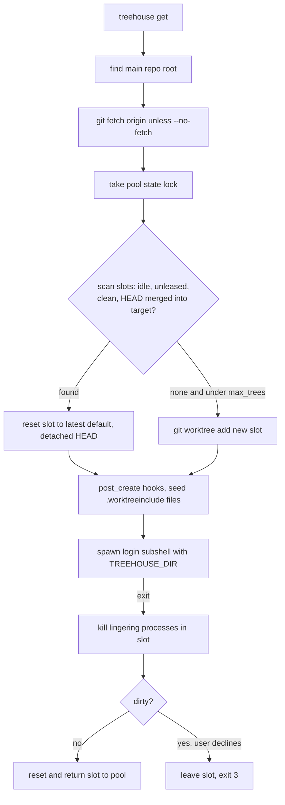

# treehouse - pooled git worktrees for parallel agents

Evidence was measured on 2026-09-23 against the local clone at `~/github/treehouse` (branch `main`, HEAD `02d9f5c`) and the installed binary at `~/go/bin/treehouse`, which reports version `dev` because it is built with `make build` and the Makefile defaults `VERSION ?= dev` (`treehouse/Makefile:3-4`).
Citations use `repo/path:line`, with the repo name relative to `~/github`.
Human-facing treehouse output decorates lines with a tree emoji; quotes below omit it.

## 1. TL;DR

treehouse is a Go CLI that keeps a per-repository pool of reusable git worktrees, hands one out in detached HEAD at the latest default branch (`treehouse get`), and on return kills lingering processes, resets, and recycles it, so many agents can work on one repo at once without branch or directory collisions.
Its core promises are isolation (a slot is never handed to two holders), safety (never reset or delete work it cannot prove landed), and durable leases that survive with no process inside.
Upstream (Kun Chen) wrote all of it; the user's fork has no fork-specific commits, and the harness uses it as firstmate's worktree provider for every tmux task, installed by the user's dotfiles into `~/go/bin`.

## 2. Problem it solves, and what breaks without it

Two agents in one checkout overwrite each other's files, and `git worktree add` by hand leaves the operator to name branches, clean up, and remember which directory is safe to delete.
treehouse "exists to make parallel coding-agent work routine by giving each task a fast, isolated, reusable Git worktree ... without making people or orchestration systems manage worktrees themselves" (`treehouse/VISION.md:3`).

Without it:

- firstmate would need its own worktree allocator, slot locking, and landed-work checks; today it delegates allocation to `treehouse get` and return to `treehouse return` (`firstmate/bin/fm-spawn.sh:3843`, `firstmate/bin/fm-teardown.sh:1702-1710`).
- Fresh `git worktree add` per task pays checkout and dependency setup each time; pooled slots are reset instead of recreated (`treehouse/README.md:95-163`).
- Crashed agents leave orphaned worktrees with unknown ownership; treehouse quarantines those instead of recycling them (`treehouse/VISION.md:30`).

## 3. Architecture

| Package | Responsibility |
| --- | --- |
| `cmd/` | cobra commands: `get`, `return`, `status`, `lease`, `enter`, `prune`, `destroy`, `init`, `update`, root |
| `internal/pool` | Pool state file, lock, acquire and release transactions, prune and destroy safety, worktree path templates |
| `internal/vcs` (`gitvcs`, `jjvcs`) | Git operations and the experimental Jujutsu backend |
| `internal/config` | `treehouse.toml` loading, precedence, pool directory resolution, `.gitignore`/exclude management |
| `internal/process` | Detect and terminate processes whose cwd is inside a slot |
| `internal/hooks` | User-level `post_create` and `pre_destroy` commands |
| `internal/shell` | Interactive login subshell for bash, zsh, fish |
| `internal/updater` | Self-update |

### Data model and state files

- Pool root defaults to `~/.treehouse/`; each repository gets `<root>/<repo>-<shorthash>/`, where the hash is taken from the `origin` URL, or the absolute path for a repo with no remote (`treehouse/internal/config/config.go:205-222`).
- Slots live at `{pool}/{slot}/{repo}` by default, for example `~/.treehouse/firstmate-8436e5/1/firstmate`.
- `treehouse-state.json` (schema version 4) lists worktrees with `name`, `path`, `created_at`, owner reservation (`owner_pid`, `owner_started_at`), lease fields (`leased`, `lease_id`, `lease_holder`, `leased_at`), `base_branch`, and seeded-file inventory with a keyed digest (`treehouse/internal/pool/state.go:20-81`).
- `treehouse-state.key` authenticates the seed inventory; `treehouse-state.lock` serializes writers; writes are atomic via temp file plus rename (`treehouse/README.md:357-369`).
- If the state file is empty or truncated, entries are rebuilt from disk and marked leased with holder `recovered: state file was corrupt or truncated; verify before reuse` (`treehouse/internal/pool/state.go:326-329`).

Three ownership facts are kept distinct: a live process in the slot, a short owner reservation during lifecycle commands, and a durable lease (`treehouse/VISION.md:28-29`).

On this Mac on 2026-09-23 there were 14 pools under `~/.treehouse`; 23 slots were marked leased, of which 11 carried the `recovered:` holder, meaning state recovery has run at some point and those slots await manual inspection (counted with `jq` over the state files; no names recorded here).
The firstmate pool had one slot, `available`, detached, with no processes (`treehouse status --json` in `~/github/firstmate`).

## 4. Interfaces

All summaries are from real `--help` output of the installed binary.

| Command | Purpose and key flags | Output |
| --- | --- | --- |
| `treehouse` / `treehouse get` | Acquire a slot and open a subshell; `--base <branch>`, `--no-fetch`, `--include-file <path>`, `--unique-leaf`, `--worktree-path <tmpl>`, `--lease` (no subshell), `--lease-holder <label>`, `--json` (requires `--lease`) | Banners on stderr; with `--lease`, only the absolute path on stdout, or JSON `{path, lease_id, lease_holder, leased_at, base_branch}` |
| `treehouse return [path\|name]` | Kill lingering processes, verify none remain, reset, release any lease; `--all`, `--force` (clean and return without prompting), `--if-lease-id`, `--if-lease-holder` | stderr text |
| `treehouse status` | Pool listing; `--json` | Table or JSON array `{name, path, status, branch, detached, flavor, lease_id, lease_holder, leased_at, processes}` |
| `treehouse lease <name>` | State-only durable lease of an existing slot; never resets or fetches; `--json`, `--lease-holder` | Path or JSON |
| `treehouse enter <name>` | Attach to any slot, even in use, without changing pool state; `--print-path` | Subshell or path |
| `treehouse prune` | Remove stale slots (managed, idle, clean, merged); dry run unless `--yes`; `--prune-orphans`, `--all`/`--global`, `-v` | Candidate list |
| `treehouse destroy <path> [--all]` | Dry run by default; `--yes` to act; risky classes opt-in: `--include-unlanded`, `--include-in-use`, `--include-leased` (exact path only, never with `--all`) | Risk preview |
| `treehouse init` | Write a default `treehouse.toml` | File |
| `treehouse update` | Self-update | text |

Global flag: `--root <dir>` overrides `TREEHOUSE_ROOT` and config; `"."` keeps the pool inside the project.
Exit codes: 1 for failure, 3 (`ExitNotReturned`) when a worktree and its lease were left exactly as found, for example a declined dirty return; 2 is deliberately unused (`treehouse/cmd/exit.go:9-19`).
`destroy` single-target skips exit non-zero, while bulk `--all` skips exit zero (`treehouse destroy --help`).
Inside the subshell, `TREEHOUSE_DIR` is set to the slot path (`treehouse/cmd/get.go:154-157`).

## 5. Configuration

| Setting | Where | Default | User's setting | Why |
| --- | --- | --- | --- | --- |
| `max_trees` | repo `treehouse.toml` | 16 (`treehouse/internal/config/config.go:74`) | No `treehouse.toml` in any `~/github/*` repo, so 16 | Bounds disk use per repo |
| `root` | toml, `TREEHOUSE_ROOT`, `--root` | `~/.treehouse` | default | Precedence `--root > TREEHOUSE_ROOT > repo file > user config > default` (`treehouse/treehouse.toml.example:8-15`) |
| `base_branch` | toml, `--base` | inferred: `origin/HEAD`, then checked-out branch, then `init.defaultBranch` | default | Fails closed if the named base does not exist |
| `unique_leaf` | toml, `TREEHOUSE_UNIQUE_LEAF`, `--unique-leaf` | off | off | Tools that key identity on the directory name |
| `worktree_path` | toml, `TREEHOUSE_WORKTREE_PATH`, `--worktree-path` | `{pool}/{slot}/{repo}` | default | Tools needing a specific location |
| `vcs` | toml, `TREEHOUSE_VCS` | `git` | git | `jj` is experimental |
| `[hooks] post_create`, `pre_destroy` | only `~/.config/treehouse/config.toml` | none | directory absent | Repo-level hooks are ignored so an untrusted clone cannot run code (`treehouse/README.md:655-660`) |
| `.worktreeinclude` | committed in repo, or `get --include-file` | none | none found | Seeds selected gitignored files (for example `.env`) into each slot |
| `TREEHOUSE_LEASE_HOLDER` | env | unset | unset | Default lease-holder label |

No `TREEHOUSE_*` variable was set in the shell environment checked on 2026-09-23.

## 6. Connections

| Component | Relationship | Evidence |
| --- | --- | --- |
| [firstmate](firstmate.md) | Worktree provider for tmux, herdr, zellij, and cmux backends: `fm-spawn.sh` types `treehouse get` into the task's new window and waits until the pane cwd is an isolated worktree; secondmate homes are `treehouse get --lease --lease-holder <id>`; teardown calls `treehouse return --force` only after its own landed-work and slot-ownership proofs | `firstmate/bin/fm-spawn.sh:3843-3902`, `firstmate/bin/fm-home-seed.sh:396`, `firstmate/bin/fm-teardown.sh:1702-1762`, `firstmate/docs/configuration.md:136` |
| firstmate bootstrap | Requires treehouse only for backends that use it, and treats an install without `get --lease` as missing | `firstmate/bin/fm-bootstrap.sh:56-57`, `firstmate/bin/fm-bootstrap.sh:928-929` |
| firstmate CI | Pins treehouse v2.0.1 for the real-Herdr lane | `firstmate/bin/fm-install-treehouse.sh:12-16` |
| [dotfiles-nix](dotfiles-nix.md) | Builds with `make build` and installs to `~/go/bin/treehouse`; `alias th='treehouse'` | `dotfiles-nix/README.md:456-459`, `dotfiles-nix/files/zsh/ic-workflow.zsh:504` |
| [fleet-ops](fleet-ops.md) | Manifest: `toolchain: [go, nix-flake]`, explicit install to `go/bin` because upstream `make install` reads `$(GOPATH)`, unset under launchd; `sync: true` | `.fleet/manifest.yaml:161-174` |
| [agents](agents.md) | The global manual lists `treehouse` as "one git worktree per independent stream of work" | `~/.claude/CLAUDE.md` toolchain list |
| [gnhf](gnhf.md) | No link: gnhf `--worktree` uses plain `git worktree` in `<repo>-gnhf-worktrees/` | `gnhf/src/core/git.ts:302-340` |
| [wheelhouse](wheelhouse.md) | The treehouse fork is in the wheelhouse scan fleet | `wheelhouse/wheelhouse.config.yml` fleet list |
| Git signing (dotfiles-nix) | The user's `tag.gpgsign true` breaks four treehouse tests that create lightweight tags (see section 9) | `dotfiles-nix/nix/home/common.nix:68-76` |

## 7. Lifecycle walkthrough: firstmate spawns a ship task in project X

1. `fm-spawn.sh` creates the tmux window in the project clone and sends the literal line `treehouse get` (`firstmate/bin/fm-spawn.sh:3843`).
2. `getRunE` finds the main repo root (so a call from inside a linked worktree still resolves the owning clone), loads config, resolves the pool directory, and ensures the pool is git-excluded (`treehouse/cmd/get.go:112-133`).
3. `acquire` fetches `origin` unless `--no-fetch`, resolves the base after the fetch, and takes the pool state lock (`treehouse/internal/pool/pool.go:355-371`).
4. Under the lock it scans slots and skips any that are leased, reserved, in use, dirty, or whose HEAD is not provably merged into the reset target; it resets a safe slot to the verified commit, or adds a new worktree if under `max_trees` (`treehouse/internal/pool/pool.go:433-457`).
5. `post_create` hooks and `.worktreeinclude` seeding run, then a login subshell starts in the slot with `TREEHOUSE_DIR` set (`treehouse/cmd/get.go:147-157`).
6. firstmate polls the pane's cwd until it is a distinct isolated worktree top-level, not the project clone, and only then launches the agent (`firstmate/bin/fm-spawn.sh:3845-3902`).
7. The worker creates branch `fm/<id>` inside the slot, commits, and ships through no-mistakes.
8. At cleanup, firstmate proves the work landed, then runs `treehouse return --force <path>` with bounded retries for transient lock contention (`firstmate/bin/fm-teardown.sh:1702-1762`).
9. `ReleaseConditional` kills lingering processes under the same state lock immediately before the reset, so no writer can slip in between the emptiness check and the destructive reset (`treehouse/cmd/get.go:218-229`, `treehouse/internal/pool/pool.go:815`).

## 8. Failure modes and safeguards

| Failure | Safeguard |
| --- | --- |
| Two acquirers race for one slot | Exclusive state lock plus owner reservation |
| Slot still has unmerged commits after a crash | Acquire skips it; prune leaves it; only an explicit `destroy --include-unlanded --yes` removes it (`treehouse/internal/pool/pool.go:433-438`) |
| Corrupt state file | Rebuild from disk and quarantine every recovered slot as leased (`treehouse/README.md:357-369`) |
| A slot holding a durable home is recycled | Leases block `get`, `prune`, and `destroy --all` (`treehouse lease --help`) |
| Lingering dev server holds files | Return terminates processes and verifies none remain |
| Untrusted repo config executes code | `[hooks]` in repo `treehouse.toml` are ignored with a warning (`treehouse/treehouse.toml.example` last block) |
| Blanket deletion | No global destroy; every destructive command is dry run by default; the old `--force` on destroy was removed in favor of per-risk `--include-*` flags (`treehouse destroy --help`) |
| Stale git worktree registrations | `get` prunes git's worktree bookkeeping before adding (`treehouse/README.md:163`) |

treehouse "isolates working directories and lifecycle ownership; it is not a security sandbox" (`treehouse/VISION.md:13`).
A subtle limit in this checkout: pools are keyed by the `origin` URL hash, so two clones of the same repository share one pool; upstream commit `1185dc6` (2026-09-23, not yet in the fork) changes reuse so a pooled worktree is reused only for the clone that owns it, which matters for firstmate, where a primary clone and secondmate homes of one repo coexist.

## 9. Testing and quality

- `make test` runs `go test ./...`; `make lint` runs `gofmt -l` and `go vet` (`treehouse/Makefile:9-17`).
- CI: gofmt and `go vet` on Ubuntu, then `go test ./...` and a build on Ubuntu, macOS, and Windows (`treehouse/.github/workflows/ci.yml:20-56`); `nix.yml` runs `nix flake check` and `nix build`; `no-mistakes-required.yml` gates PRs; `release.yml` builds and checksums releases.
- The repo root also carries `no_mistakes_gate_test.go` and `release_ci_exclusions_test.go`, which test its own CI wiring.

Real run on 2026-09-23: `go test ./internal/...`.

| Package | Result |
| --- | --- |
| `internal/config`, `hooks`, `process`, `shell`, `updater`, `vcs`, `vcs/jjvcs` | ok |
| `internal/pool` | FAIL: `TestPruneUsesFullLocalDefaultRefWithoutOrigin` (104 s package run) |
| `internal/vcs/gitvcs` | FAIL: `TestBranchExistsRejectsNonBranchRefs`, `TestBranchRefPrefersBranchOverSameNamedTag`, `TestAddWorktreeCutsFromBranchNotSameNamedTag` |

All four failures share the error `git tag ... failed: exit status 128 fatal: no tag message?`.
Root cause: the user's home-manager git config sets `tag.gpgsign true` (`git config --show-origin` points at `~/.config/git/config`, generated from `dotfiles-nix/nix/home/common.nix:68-76` and `darwin.nix`), which turns every `git tag <name>` into a signed annotated tag that needs a message; the tests call plain `git tag` without isolating global git config.
This is a test-hermeticity gap upstream plus a local environment interaction, not a product bug; the fix would be `GIT_CONFIG_GLOBAL=/dev/null` (or `-c tag.gpgsign=false`) in the test helpers (proposed, not applied).
`cmd/` end-to-end tests were not run.

## 10. Fork delta

No fork-specific commits; tracks upstream.
After `git fetch upstream` on 2026-09-23, `main` is 0 ahead and 1 behind `kunchenguid/treehouse`; the missing commit is `1185dc6` "fix(pool): reuse a pooled worktree only for the clone that owns it (#145)".
`git log --all --author=Shreejit` returns nothing; the local `treehouse` binary in the repo root is build output and is gitignored.

## 11. Interview angle

**Q1. Why detached HEAD instead of a branch per worktree?**
Git refuses to check out one branch in two worktrees, so named branches in pooled slots collide; detached HEAD at the latest default makes every slot interchangeable, and the task creates its own branch only after it owns the slot (`treehouse/README.md:146`).

**Q2. How do you recycle worktrees without ever destroying someone's work?**
A slot is reusable only if it is idle, unleased, clean, and its HEAD is provably merged into the reset target, all checked under an exclusive lock and re-verified at deletion time; any uncertainty leaves it in place, and recovery quarantines unknown ownership as leased.

**Q3. What is the difference between in-use, reserved, and leased?**
In-use is a live process with cwd in the slot; a reservation is a short-lived owner record held only during `get`, `destroy`, or `prune`; a lease is durable state with an immutable random ID that survives with zero processes, which is what a long-lived firstmate secondmate home needs (`treehouse/README.md:153-154`).

**Defensible trade-off.**
treehouse has no daemon: every command reads and writes a small locked JSON state file and scans processes inline.
That keeps it simple, portable across macOS, Linux, and Windows, and crash-recoverable, at the cost of per-command process scans and fetches (seconds, not milliseconds) and of needing explicit recovery quarantine when the state file is damaged, as the 11 recovered slots on this machine show.
