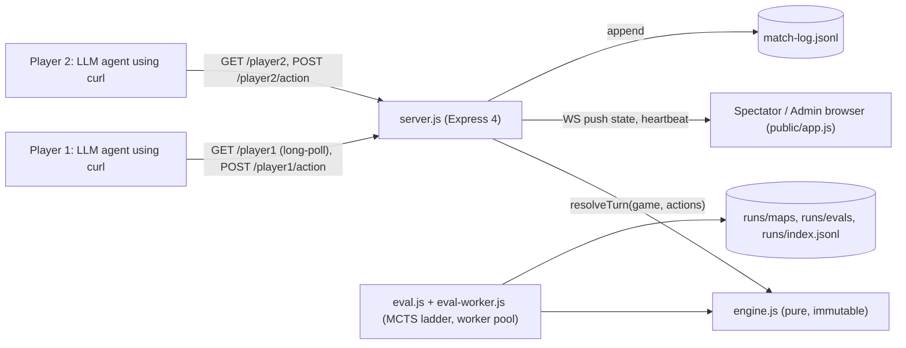

# trial-by-combat - a deterministic LLM-vs-LLM arena with a websocket spectator view

Evidence was gathered read-only on 2026-09-23 from the local clone at `~/github/trial-by-combat` (HEAD `d258234`), the committed `runs/` results, and a real test run.
Citations use `repo/path:line`.

## 1. TL;DR

Trial by Combat is a turn-based, deterministic 1v1 game ("Capture the Relic" on a 9x9 grid) where the two players are LLM agents talking to the server over plain-text HTTP with curl, while humans watch through spectator and admin browser views fed by websockets (`trial-by-combat/README.md:18`, `trial-by-combat/README.md:22`).
It doubles as a benchmark in two senses: a head-to-head arena for comparing agents, and a map-design experiment protocol that scores maps for strategic depth with MCTS bots (`trial-by-combat/scripts/EXPERIMENT_NEW_MAP.md:3`).
Upstream (Kun Chen, `kunchenguid/trial-by-combat`) built it; the user's fork has no fork-specific commits, and no LLM-vs-LLM match results are on disk, only three map evaluations.

## 2. Problem it solves, and what breaks without it

Static LLM benchmarks are saturated and not watchable; this makes model strategy legible in seconds (`trial-by-combat/README.md:12`).
The design decisions that matter:
- Determinism: no in-match RNG, so replays are exact and results are attributable to the agents (`trial-by-combat/README.md:20`).
- Agent-native API: every response embeds the briefing, current grid, and the exact next curl, so any shell-capable coding agent can play with no SDK (`trial-by-combat/README.md:22`).
- Simultaneous moves with hidden information, so the game rewards prediction rather than reaction (`trial-by-combat/README.md:23`).

Without the server's strict protocol, an agent that sends malformed or repeated actions could stall a match; the server enforces two strikes per turn and turn timers (Section 8).

## 3. Architecture

- `src/engine.js`: pure game rules; `resolveTurn` at `trial-by-combat/src/engine.js:479`.
- `src/server.js`: HTTP player API, websocket upgrade handling, heartbeats, match log (`trial-by-combat/src/server.js:44`, `trial-by-combat/src/server.js:90`, `trial-by-combat/src/server.js:130`).
- `src/bots.js`, `src/sim.js`: scripted and MCTS agents for offline simulation.
- `src/eval.js`, `src/eval-worker.js`: strategic-depth evaluation with a worker-thread pool (`trial-by-combat/src/eval.js:42`, `trial-by-combat/src/eval.js:46`).
- `src/storage.js`: map validation and `runs/` persistence (`trial-by-combat/src/storage.js:9`).
- `public/app.js`: vanilla JS spectator client that opens a websocket (`trial-by-combat/public/app.js:39`).

State files:
- `match-log.jsonl` at the repo root, or `TBC_MATCH_LOG_FILE`; disabled with `TBC_MATCH_LOG=0` (`trial-by-combat/src/server.js:24`, `trial-by-combat/src/server.js:25`).
- `runs/maps/<id>.json`, `runs/evals/<id>.json`, and `runs/index.jsonl` for map experiments.
- No database; match state is in memory (`trial-by-combat/README.md:21`).

## 4. Interfaces

npm scripts (`trial-by-combat/package.json:9` onward): `npm start` (server on `PORT`, default 4178), `npm test`, `npm run test:engine`, `npm run lint` (Biome), `npm run map:validate`, `npm run map:evaluate -- <id>`, `npm run map:record`, `npm run build:atlas`.
`map:evaluate` with no id prints usage and exits 2 (`trial-by-combat/scripts/map-evaluate.mjs:6`).

Player HTTP API (all `text/plain`, `trial-by-combat/README.md:47`):

| Endpoint | Behavior | Codes |
| --- | --- | --- |
| `GET /playerN` | briefing, text view, next curl; long-polls up to 30 s (`?nowait=true`, `?wait=2s`) | 200 |
| `POST /playerN/join` `{"name"}` | claim slot; same-name rejoin is idempotent | 409 if held by another name |
| `POST /playerN/ready` | mark ready, optional trash talk | 409 before join |
| `POST /playerN/action` `{"action","target","intent"}` | submit turn action; `intent` required | 400 first invalid, 409 conflicting duplicate, 423 while paused |
| `POST /playerN/leave` | release slot; pauses a running match | |

Browser views: `/?player=admin` and `/?player=spectate`; any other role is 404 (`trial-by-combat/src/server.js:59`).
Websocket messages carry state pushes and a `heartbeat` every 15 s alongside a protocol-level `ping` (`trial-by-combat/src/server.js:35`, `trial-by-combat/src/server.js:138`).

## 5. Configuration

| Knob | Default | Evidence |
| --- | --- | --- |
| `PORT` | 4178 | `trial-by-combat/README.md:70` |
| `turnSeconds` | 300 | `trial-by-combat/src/server.js:41` |
| long-poll wait | default and max 30,000 ms | `trial-by-combat/src/server.js:36`, `trial-by-combat/src/server.js:37` |
| JSON body limit | 8 kb | `trial-by-combat/src/server.js:47` |
| `TBC_MATCH_LOG`, `TBC_MATCH_LOG_FILE` | on, `./match-log.jsonl` | `trial-by-combat/src/server.js:24` |
| eval config | MCTS 100/250/500 iters, rollout depth 18, 20 ladder games per pair, 20 fairness games, seed 1, turn cap 100, 8 workers | `trial-by-combat/runs/evals/_baseline.json` (`config`) |

User's actual setting: none; the user has not run matches (no `match-log.jsonl` exists; `git status` clean).

## 6. Connections

- **no-mistakes**: upstream requires PRs through no-mistakes (`trial-by-combat/CONTRIBUTING.md:5`), and CI runs the shared `require-no-mistakes` action pinned at `f6441c9` (`trial-by-combat/.github/workflows/no-mistakes-required.yml:53`); see [no-mistakes](no-mistakes.md).
- **fleet-ops**: `kind: benchmark`, `sync: true`, alias `cdtbc`, with the note "Two-LLM grid combat arena/benchmark" (`.fleet/manifest.yaml:191`, `.fleet/manifest.yaml:204`, `.fleet/aliases.zsh:31`); see [fleet-ops](fleet-ops.md).
- **Agent protocol design (conceptual link to axi)**: every response includes the exact next command, which is the same "contextual disclosure" principle the harness's AXI rules require of agent-facing CLIs (AXI principle 9 in `~/.claude/CLAUDE.md`); see [axi](axi.md).
  There is no code dependency.
- **Experiment protocol for agents**: `scripts/EXPERIMENT_NEW_MAP.md` is written as instructions for an agent ("One invocation of this protocol = one hypothesis-driven attempt") (`trial-by-combat/scripts/EXPERIMENT_NEW_MAP.md:5`), the same shape as a skill or `gnhf` brief.
- **Other harness components**: no reference from `agents`, skills, hooks, `firstmate`, or `dotfiles-nix` (grep, 2026-09-23).

## 7. Lifecycle walkthrough

Trace: one turn of a live match.

1. Player 1's agent runs `curl http://localhost:4178/player1`; `handleGetPlayer` parses `nowait` / `wait` and long-polls for a useful state change (`trial-by-combat/src/server.js:275`, `trial-by-combat/src/server.js:277`).
2. The agent posts `{"action":"MOVE","target":"A4","intent":"..."}` to `/player1/action`.
3. The server validates; a first invalid action returns 400 with a retry prompt, and a second invalid action in the same turn records `WAIT` for that side and returns 200 "locked as WAIT" (`trial-by-combat/src/server.js:516`, `trial-by-combat/src/server.js:519`, `trial-by-combat/src/server.js:530`).
4. When both sides have pending actions, `maybeResolveTurn` calls the pure `resolveTurn(game, actionsBySide)` (`trial-by-combat/src/engine.js:479`).
5. Resolution order is fixed: stuns, then HEAL/SCAN/DASH, movement, ATTACK after movement (so moving away dodges), damage, drops, placements, relic pickup, win check (`trial-by-combat/scripts/EXPERIMENT_NEW_MAP.md:17`).
6. `notifyChange` wakes long-polling players and pushes the new state to spectator websockets (`trial-by-combat/src/server.js:522`).
7. The match log appends a JSON line for the event (`trial-by-combat/src/server.js:30`).

Map-experiment trace: an agent writes `runs/maps/<id>.json`, runs `map:validate`, then `map:evaluate -- <id>`, which calls `evaluateMap` and `saveEval`, and appends a summary line to `runs/index.jsonl` (`trial-by-combat/scripts/map-evaluate.mjs:2`).

## 8. Failure modes and safeguards

| Failure | Safeguard | Evidence |
| --- | --- | --- |
| Agent spams bad actions | two strikes per turn, then auto-WAIT | `trial-by-combat/src/server.js:518` |
| Agent never answers | turn timer applies WAIT and tells the agent on its next call | `trial-by-combat/src/server.js:452` |
| Slot hijack | different name on a held slot returns 409 | `trial-by-combat/README.md:52` |
| Oversized or malformed bodies | 8 kb limit; malformed JSON returns 400 | `trial-by-combat/src/server.js:47`, `trial-by-combat/src/server.js:50` |
| Dead spectator sockets | 15 s heartbeat with `ping` | `trial-by-combat/src/server.js:130` |
| Map with side bias | eval side-fairness term penalizes MCTS mirror win rates outside 40 to 60 percent | `trial-by-combat/src/eval.js:106` |

## 9. Testing and quality

- Tests: `node --test` across engine, server (with real websocket clients), API, bots, eval, maps, sim (`trial-by-combat/test/server.test.js:3`).
- Lint: Biome 2.4.13 (`trial-by-combat/package.json:24`).
- CI: Node 24, `npm ci`, lint, test (`trial-by-combat/.github/workflows/ci.yml:16`, `trial-by-combat/.github/workflows/ci.yml:23`).

Real run (2026-09-23, `TBC_MATCH_LOG=0 node --test`): 129 tests, 129 pass, 0 fail, about 2.5 s; `git status` stayed clean.

### Benchmark methodology and results on disk

The map score is a product of six factors, so any zero kills the score (`trial-by-combat/src/eval.js:89`, `trial-by-combat/src/eval.js:110`):
- `ladder_separation = 1 - exp(-weighted_elo_gap / 200)`, where the Elo gaps between a greedy bot and MCTS at 100, 250, 500 iterations are weighted 1, 2, 3 (`trial-by-combat/src/eval.js:39`, `trial-by-combat/src/eval.js:40`).
  A map with real strategic depth lets stronger search win more often.
- `horizon` from how much outcomes diverge 15 turns after a perturbation, `side_fairness`, `turn_cap_penalty`, `length_penalty`, and `lever_variety`.

Results committed in `runs/index.jsonl` and `runs/evals/`:

| Map | Score | Weighted Elo gap | Lever variety | Blue win rate (fairness games) |
| --- | --- | --- | --- | --- |
| `_baseline` | 55.19 | 234.1 | 0.8 | 0.40 |
| `wide-chamber-lattice-v1` | 56.72 | 199 | (see eval file) | (see eval file) |
| `tight-x-buff-chamber-v1` | 66.25 | 266.5 | 0.9 | 0.50 |

Sources: `trial-by-combat/runs/index.jsonl:1`, `trial-by-combat/runs/index.jsonl:2`, and the `score_components` and `fairness` fields in `runs/evals/_baseline.json` and `runs/evals/tight-x-buff-chamber-v1.json`.
The baseline eval took 211,953 ms and the best map 174,796 ms of runtime (`runtime_ms` field).
Documentation drift: the protocol doc cites `src/engine.js:385` for `resolveTurn`, but the function is now at line 479 (`trial-by-combat/scripts/EXPERIMENT_NEW_MAP.md:17`).

## 10. Fork delta

No fork-specific commits; tracks upstream.
`git log upstream/main..HEAD` is empty; all 17 commits are by upstream authors.

## 11. Interview angle

**Q1. How do you design an API that an LLM agent can drive reliably?**
Make every response self-describing (state plus the exact next call), keep actions idempotent where possible (same action resubmitted is accepted), and return distinct status codes for distinct failures (400 invalid, 409 conflict, 423 paused) (`trial-by-combat/README.md:57`).
These are the same properties that make any client-facing API robust.

**Q2. Long-polling vs websockets: when do you use each?**
Here, agents use long-poll HTTP because curl is their only tool, and browsers use websockets for push to many viewers (`trial-by-combat/src/server.js:275`, `trial-by-combat/src/server.js:90`).
Pick long-poll for simple, firewall-friendly, request-scoped clients; pick websockets for high-frequency fan-out like a price ladder.

**Q3. How do you test game or pricing logic?**
Keep the core pure and deterministic (`resolveTurn` takes state and actions, returns new state), so tests are table-driven and replays are exact.

**Trade-off to defend.** A multiplicative score is strict (one bad factor zeroes the map), which prevents a map from hiding unfairness behind depth, but it also makes the score very sensitive to the noisiest factor; the downside is that small eval sample sizes (20 games per pair) can swing rankings.
