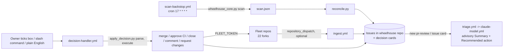

# wheelhouse - the maintainer decision queue on GitHub Issues and Actions

Evidence was measured on 2026-09-23 against the local clone at `~/github/wheelhouse` (branch `main`, HEAD `a0cf105`) and read-only `gh` queries against the user's public fork.
Citations use `repo/path:line`, with the repo name relative to `~/github`.

## 1. TL;DR

wheelhouse is a server-less "what needs my decision" command center: a GitHub repository whose open issues are decision cards (merge this PR, approve this fork CI run, triage this issue) about the maintainer's other repositories, created and executed entirely by GitHub Actions and Python scripts.
It sits beside the local agent harness rather than inside it: firstmate, gnhf, and no-mistakes produce work locally, while wheelhouse watches the resulting public forks for other people's pull requests and issues, with Claude used only for advisory triage and plain-English decisions.
The code is upstream work (103 of the 117 commits the fork carries beyond its current parent are by Kun Chen, from the original `kunchenguid/wheelhouse`, which no longer exists); the user's own commits configure the fleet list and document the fork's relationship to its renamed parent, `ImZoomBoy/wheelhouse`.

## 2. Problem it solves, and what breaks without it

A maintainer of 20-plus repositories cannot watch every notification stream; decisions that only the owner can make (merge, approve risky fork CI, close) get lost among bot noise and the owner's own PRs.
wheelhouse turns each such decision into exactly one issue with checkboxes, and "a workflow executes your call on the real repo and closes the card after a successful resolving action" (`wheelhouse/README.md:5-11`).

Without it:

- External contributor PRs on the user's forks (firstmate, gnhf, treehouse, no-mistakes, and others) go unnoticed, because the user's own no-mistakes PRs dominate notifications; wheelhouse filters out PRs and issues authored by the owner, the configured maintainer, and bots (`wheelhouse/README.md:7`).
- Approving fork CI by reflex is a "pwn request" risk; wheelhouse holds any fork CI change touching `.github/workflows`, `.github/actions`, or `action.yml` for manual review and fails closed (`wheelhouse/AGENTS.md:24-30`).
- There is no single audit trail of maintainer decisions; here every decision is an issue with labels and a hidden state block.

## 3. Architecture

"State lives in GitHub, not on disk. Open issue = pending decision; closed = consumed. Labels are state" (`wheelhouse/AGENTS.md:43-47`).

| Module | Responsibility |
| --- | --- |
| `.github/workflows/scan-backstop.yml` | Hourly best-effort scan; builds `scan.json`, runs maintainer-edits policy, scan-time auto-merge (`auto_merge.py preclaim`, `claim`, `validate`, `act`), then `reconcile.py` (`wheelhouse/.github/workflows/scan-backstop.yml:25`, `:106-195`) |
| `.github/workflows/decision-handler.yml` | On `issues: [edited, labeled]` and `issue_comment: [created]`: owner gate, `apply_decision.py parse`, optional NL routing, `execute` (`wheelhouse/.github/workflows/decision-handler.yml:110`, `:174`, `:1018`) |
| `.github/workflows/triage.yml`, `deep-review.yml`, `claude-model.yml` | Advisory model work through one reusable read-only model workflow |
| `.github/workflows/ingest.yml` | `repository_dispatch` types `wheelhouse-item` and legacy `triage-item`, plus manual runs |
| `.github/workflows/merge-assist.yml` | Captain-initiated conflict resolution with one plain non-force push |
| `scripts/wheelhouse_core.py` | GraphQL scan and classification, author filtering, CI safety verdict, auto-approval, authorization (`authorized` subcommand) |
| `scripts/render_card.py`, `reconcile.py`, `card_projection.py`, `projection_writer.py` | Card rendering, create or reuse, refresh, close |
| `scripts/apply_decision.py` | Parse checkbox, slash command, label, or plain-English reply; `do_merge`, `do_approve_ci`, `do_close`, `do_comment`, `do_request_changes` (`wheelhouse/scripts/apply_decision.py:1147-1420`) |
| `agent_runtime/` | Provider-agnostic model execution contract (`wheelhouse.agent-runtime/v1alpha1`), admission, redaction, sandbox |
| `scripts/agos_state.py`, `agos_project_bridge.py` | Upstream AGOS bridge; inert in this fork (section 6) |

### Data model

Each card body carries a hidden `<!-- wheelhouse-state: {...} -->` block with `{repo, number, kind, head_sha, options}` plus material fields `{comp, tests, priority, bucket, projection_freshness, projection_head_sha, projection_complete, pushability}`; a refresh rewrites the card only when a material field changes (`wheelhouse/AGENTS.md:48-60`).
Labels encode lifecycle: `needs-decision`, `pending-triage`, `processing`, `resolved`, `blocked`, plus `repo:<name>`, `kind:<pr-review|ci-approval|issue-triage>`, `priority:<high|med|low>` (`wheelhouse/README.md:22`).
Nothing persists locally; the only local artifact is the checked-out repository.

## 4. Interfaces

There is no CLI to install; the interfaces are GitHub events and the issue UI.

| Interface | Input | Effect |
| --- | --- | --- |
| Checkbox tick on a card | Issue `edited` event | `decision-handler` parses the diff of checked options and executes the action |
| Slash command reply | `issue_comment` such as `/request-changes <text>` | Parsed deterministically by `parse_slash` (`wheelhouse/scripts/apply_decision.py:269`) |
| Plain-English reply | `issue_comment` when `nl_decisions: true` | Claude proposes a structured decision; code validates it against an allow-set before `execute` |
| Investigate box | Label or tick | `deep-review.yml` posts a code-grounded read-only review |
| Manual runs | `workflow_dispatch` on scan, ingest, triage, deep review, merge assist | Operator replays and recovery |
| Source repo dispatch | `repository_dispatch` `wheelhouse-item` | Real-time card creation (fast path) |

Scripts use subcommands (for example `wheelhouse_core.py scan --cards cards.json`, `apply_decision.py parse|execute|nl-route`) and exchange JSON files between workflow steps; `approve_ci` uses a dedicated exit code 4 for the fork-CI HOLD (`wheelhouse/AGENTS.md:24-26`).
Outputs are GitHub side effects (issues, labels, comments, merges) plus JSON artifacts inside the run.

## 5. Configuration

`wheelhouse.config.yml` is "THE one file you edit"; the owner is never hard-coded and always comes from `github.repository_owner` (`wheelhouse/wheelhouse.config.yml:1-12`, `wheelhouse/AGENTS.md:14-18`).

| Key | Upstream parent default | User's fork value | Line |
| --- | --- | --- | --- |
| `repos` | parent lists its own fleet | 22 of the user's repos: `shreejitverma`, `lavish-axi`, `gnhf`, `firstmate`, `no-mistakes`, `axi`, `chrome-devtools-axi`, `gh-axi`, `autopreso`, `baby-menu`, `tasks-axi`, `quota-axi`, `short-pipe`, `trial-by-combat`, `justroll`, `treehouse`, `presize`, `org-bench`, `dotfiles`, `dotfiles-nix`, `superpowers-bench`, `programbench-bench` | `wheelhouse/wheelhouse.config.yml:22-190` |
| per-repo `compliance_check` | n/a | `"PR must be raised via no-mistakes"` for repos with the no-mistakes gate; `null` for the profile repo | `wheelhouse/wheelhouse.config.yml:26-45` |
| `maintainer` | `""` | `""` | `:200` |
| `agent_runtime` | absent | Claude primary, `claude-sonnet-4-6`, fallback `none`, Codex adapter disabled | `:211-283` |
| `auto_triage`, `auto_triage_issues` | `false` | `true` | `:285`, `:304` |
| `nl_decisions`, `card_issues` | `false` | `true` | `:362`, `:370` |
| `auto_approve_ci` | `false` | `true` (strict subset of the manual gate) | `:425` |
| `thank_on_merge` | `false` | `true` | `:436` |
| `auto_merge` | absent | `true` | `:463` |
| `assisted_merge` | absent | `false` | `:485` |

Attribution matters here: `git log --author=Shreejit -p -- wheelhouse.config.yml` shows the user's commits changed only the `repos` list (and the header comment); the feature toggles in the right column arrived with Kun Chen's original upstream history, not by the user's choice (diff against `16da790^` on 2026-09-23).
Secrets: one required `FLEET_TOKEN` for cross-repo actions, `CLAUDE_CODE_OAUTH_TOKEN` for agent-assisted features, optional `READONLY_TOKEN` (`wheelhouse/README.md:46`, `:64`, `:120`); which secrets are set on the fork was not inspected (names or values), so their presence is unverified beyond the scan succeeding.

## 6. Connections

| Component | Relationship | Evidence |
| --- | --- | --- |
| [no-mistakes](no-mistakes.md) | Cards treat the "PR must be raised via no-mistakes" check as each repo's compliance gate; wheelhouse's own PRs must also be raised through no-mistakes | `wheelhouse/wheelhouse.config.yml:26-45`, `wheelhouse/README.md:16-17` |
| [firstmate](firstmate.md) | The firstmate fork is scanned like any other fleet repo; separately, the merged upstream AGOS bridge can parse a hidden `firstmate-state` block from issues, but the fork documents that "No card path in this repository reads the `firstmate-state` block" | `wheelhouse/wheelhouse.config.yml:63`, `wheelhouse/docs/AGOS_STATE.md:3-5`, `wheelhouse/scripts/agos_state.py:228-258` |
| [gnhf](gnhf.md), [treehouse](treehouse.md), and the axi tools | Scanned fleet members; external PRs to them become cards | `wheelhouse/wheelhouse.config.yml` fleet list |
| [fleet-ops](fleet-ops.md) | Manifest records `upstream: ImZoomBoy/wheelhouse`, `kind: config`, nothing installs locally, `sync: true` so both sync layers keep watching the parent while the ff-only sync leaves the ahead fork untouched | `.fleet/manifest.yaml:313-326` |
| [dotfiles-nix](dotfiles-nix.md) | README tool table and fork setup loop map wheelhouse's parent to `ImZoomBoy`; the daily routine says to "check the wheelhouse queue on GitHub" | `dotfiles-nix/README.md:251`, `:441`, `:632` |
| Harness terminology | wheelhouse uses the same captain vocabulary as firstmate (captain-owned conflict handling, captain-initiated merges), because both come from the same upstream author | `wheelhouse/README.md:3`, commit `61da303` |

There is no code path from the local harness into wheelhouse: a grep of the `firstmate`, `gnhf`, `treehouse`, and `no-mistakes` workflow directories for `wheelhouse-item` or `triage-item` found nothing, so the user runs wheelhouse in "backstop only" mode, where the hourly scan is the only intake (`wheelhouse/README.md:326-330`).

## 7. Lifecycle walkthrough: an outside contributor opens a PR on the user's `treehouse` fork

1. The scheduled `scan-backstop` run starts (cron `17 * * * *`, best effort) inside the shared `wheelhouse-backstop` concurrency group (`wheelhouse/.github/workflows/scan-backstop.yml:25`, `:59-60`).
2. `wheelhouse_core.py scan --cards cards.json` queries every fleet repo with `FLEET_TOKEN`, drops owner, maintainer, and bot authored items, and classifies the PR as `pr-review` with compliance and test facts from `compliance_check` and `test_check_patterns` (`wheelhouse/.github/workflows/scan-backstop.yml:106`).
3. Scan-time auto-merge evaluates gates G0 to G6 read-only, claims, re-evaluates under claim, and runs G7 plus a final merge guard; a PR from an outside contributor that fails any gate falls through to a card (`wheelhouse/README.md:33`).
4. `reconcile.py` creates the card issue with the hidden state block and, because `auto_triage: true`, labels it `pending-triage` with no checkboxes until the first triage attempt finishes (`wheelhouse/.github/workflows/scan-backstop.yml:195`, `wheelhouse/README.md:59`).
5. `triage.yml` calls the reusable `claude-model.yml`, which verifies the caller's commit, runs the pinned Claude step read-only, and returns a schema-validated assessment; the card gains Summary, Product implications, and possibly an Accept recommendation box (`wheelhouse/README.md:44-50`).
6. The owner ticks "Merge it"; `decision-handler.yml` fires on `issues: edited`, checks `wheelhouse_core.py authorized` (sender must be the repository owner or maintainer), parses the checkbox diff, and runs `apply_decision.py execute` (`wheelhouse/.github/workflows/decision-handler.yml:110`, `:174`, `:1018`).
7. `do_merge` re-reads the live PR, refuses a stale head, blocks workflow-touching PRs for a manual UI merge, merges with the repo's `merge_method` (default squash), posts the thank-you comment, and closes the card `resolved`; a non-retryable error leaves it open with `blocked` (`wheelhouse/scripts/apply_decision.py:1147`, `wheelhouse/README.md:11`).

Observed state on 2026-09-23: the fork is public, `scan-backstop` runs succeeded on every one of the last 8 scheduled runs (roughly every 3 to 6 hours despite the hourly cron), and the queue had 0 open cards and 2 issues ever created (`gh run list`, `gh issue list`, read-only).

## 8. Failure modes and safeguards

| Failure | Safeguard |
| --- | --- |
| Someone else ticks a box on a public card | Every acting path is owner-gated (`sender == repository_owner` or the configured maintainer) (`wheelhouse/AGENTS.md:19-21`) |
| Handler re-triggers itself | Card edits use the default `GITHUB_TOKEN`, which raises no workflow events (`wheelhouse/AGENTS.md:21-24`) |
| Approving malicious fork CI | Risky-file HOLD (exit 4) fails closed; auto-approve is a strict subset of the manual gate (`wheelhouse/AGENTS.md:24-30`) |
| Duplicate cards from event plus scan | Shared concurrency group and post-write uniqueness check (`wheelhouse/AGENTS.md:109`) |
| Model output acts on its own | Triage is advisory; a recommendation acts only when the owner ticks Accept, and structured outputs are schema-validated before admission (`wheelhouse/README.md:26`) |
| Repeated unreadable repos hide silently | Scan-health ledger issue; persistent darkness eventually fails the run loudly (`wheelhouse/README.md:34`) |
| Contributor mentions leak from private queue | Card bodies show authors as plain text, never `@mention`, except the opt-in thank-you on the contributor's own PR (`wheelhouse/README.md:23`, `wheelhouse/README.md:31`) |

Documented upstream defects left deliberately unpatched to keep the AGOS files byte-identical to upstream: `replace_firstmate_state_block` passes rendered JSON as a regex replacement template, and `PROJECT_QUERY` reads only the first 100 ProjectV2 items while reporting ok (`wheelhouse/AGENTS.md:35-37`).

## 9. Testing and quality

- 67 files under `tests/`, plain Python scripts, all offline with mocked `gh` and LLM calls; the authoritative list is `wheelhouse/CONTRIBUTING.md:37-62`, starting with `py_compile`, `ruff check --select F821`, and `python scripts/agent_runtime.py verify-pins`.
- Only dependency: `PyYAML>=6.0.2` (`wheelhouse/requirements-dev.txt`).
- No workflow runs the Python test suite on PRs; CI-like workflows are `agent-runtime-canary.yml` (on runtime path changes) and the `no-mistakes-required.yml` PR gate, so tests run locally and inside the no-mistakes pipeline.

Real runs on 2026-09-23 with the system `python3` (PyYAML is not installed there, and installing was out of scope):

| Command | Result |
| --- | --- |
| `python3 tests/test_agos_state.py` | "Ran 8 tests ... OK" |
| `python3 tests/test_card_refresh.py` | "all card-refresh tests passed" |
| `python3 tests/test_check_status.py` | Not run: "PyYAML is required (pip install pyyaml)" |

## 10. Fork delta

`origin` is `shreejitverma/wheelhouse`; `upstream` is `ImZoomBoy/wheelhouse` (formerly `autoprintworks/wheelhouse`; GitHub redirects), and `gh repo view` confirms that parent.
After `git fetch upstream` on 2026-09-23, `main` is 117 ahead and 0 behind.
Of those 117 commits, 103 are Kun Chen's original `kunchenguid/wheelhouse` history (for example `c85026a` provider-agnostic model execution, `60bac6e` guarded scan-time auto-merge), which the current parent does not contain; the user authored 14.

User-authored commits, all small:

| Commit | Change |
| --- | --- |
| `16da790`, `c702d87` | Replace the fleet list in `wheelhouse.config.yml` with the user's repositories |
| `143108d`, `073662d` | Merge Kun Chen's `main`, then the `autoprintworks` parent (the AGOS bridge) |
| `6f4c2c3` | Drop a fleet entry for a repository that does not exist |
| `bbef6ad`, `9b6a8cd`, `22a8170`, `d3cc386`, `635920b`, `ff83d8d` | no-mistakes review and document fixes: AGOS setup scope, the upstream-verbatim AGOS invariant in `AGENTS.md`, fork-scope note in `docs/AGOS_STATE.md` |
| `e766f38` | Merge PR #3 (sync upstream AGOS bridge) |
| `eb20fec`, `a0cf105` | Name the parent by its current name, `ImZoomBoy/wheelhouse` (PR #4) |

No wheelhouse runtime code (`scripts/`, `agent_runtime/`, workflows) was changed by the user.

## 11. Interview angle

**Q1. Why build an ops tool on GitHub Issues and Actions instead of a service?**
There is no server, database, or bot to host: issues are the durable queue, labels are the state machine, Actions are the workers, and GitHub's own audit log records every decision, so a fork plus one config file and one secret is a complete deployment (`wheelhouse/README.md:12-14`).
The bank analogy is a change-approval queue where every approval is a recorded, attributable event.

**Q2. How do you let an LLM help without letting it act?**
Model output is advisory and schema-validated; it can only pre-fill a recommendation, and a human tick by an authorized sender is what triggers any mutating action, which runs in deterministic Python with live re-reads and fail-closed gates.

**Q3. What is the main supply-chain risk it guards against?**
Approving CI for a fork PR that edits workflow files can run attacker code with repository secrets; wheelhouse detects workflow, action, and `pull_request_target` changes, holds them for manual review, and makes automatic approval a strict subset of what a human could approve.

**Defensible trade-off.**
Using GitHub as the database gives zero infrastructure and a public audit trail, but it inherits GitHub's eventual consistency and scheduling: the hourly cron actually ran every 3 to 6 hours here, and the code carries extensive machinery (uniqueness checks, list-lag telemetry, two-epoch soft-close) purely to stay correct on top of an eventually consistent issue index.
