# Diagram Atlas A - System and deployment

Twelve system-level and deployment views of the harness that complement, and do not repeat, the six diagrams in [01 Architecture and diagrams](../01-Architecture-and-Diagrams.md).

## A.1 Layered stack with write authority

**What it shows:** the seven layers from the human down to machine config, labeled with the only things each layer is allowed to write.

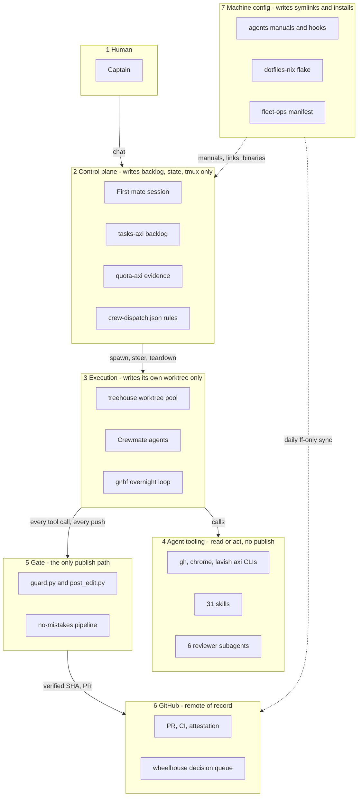

**How to explain it:**
Read it top to bottom as a chain of narrowing authority.
The control plane decides and tracks but never edits a project; its only writes are the backlog, its own state files, and tmux.
Workers can change code, but only inside a disposable worktree.
The gate is the single layer allowed to publish, and GitHub is where evidence lands.
Machine config sits beside the stack, not in it: it produces the files every other layer reads and has no runtime role.

**Evidence:** `firstmate/AGENTS.md:25-42` (never write to a project), `firstmate/bin/fm-spawn.sh:3843-3902` (isolation assertion), `agents/ROUTING.md:29` (no-mistakes is the ship path), [00 Executive summary](../00-Executive-Summary.md) section 3, [05 Configuration topology](../05-Configuration-Topology.md).

## A.2 Deployment view - processes and network on one Mac

**What it shows:** every long-lived or on-demand process on the laptop and every network edge that leaves it.

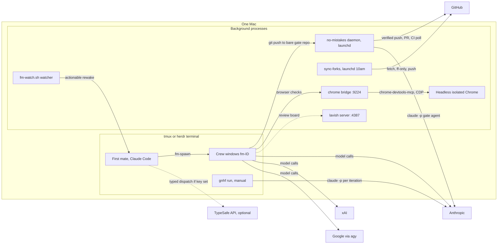

**How to explain it:**
Everything runs on one laptop; there is no server of mine anywhere.
Two things are launchd services: the no-mistakes daemon, which listens on a Unix socket and runs the gate, and the daily fork sync at 10am.
The lavish review server and the Chrome bridge are started on demand by their CLIs and detach, on fixed local ports.
Only four kinds of traffic leave the box: model calls to three vendors, GitHub pushes and API calls, and an optional classifier call.
The watcher is plain bash, so supervising idle crews costs zero model tokens.

**Evidence:** `launchctl list` shows `com.kunchenguid.no-mistakes.daemon.*` and `org.nix-community.home.sync-forks` (read 2026-09-23), `dotfiles-nix/nix/home/darwin.nix:79-96`, `lavish-axi/src/paths.js:176`, `chrome-devtools-axi/src/sessions.ts:28`, `chrome-devtools-axi/src/bridge.ts:700-706`, `firstmate/bin/fm-dispatch-resolve.sh:8-12`, [no-mistakes](../components/no-mistakes.md), [firstmate](../components/firstmate.md), [gnhf](../components/gnhf.md).

## A.3 Persistence map - every state location by lifecycle

**What it shows:** where each component keeps state on disk or remotely, grouped by how long it lives and whether git versions it.

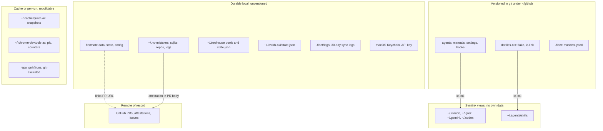

**How to explain it:**
Top row is everything I would lose nothing by deleting, because git holds it and the symlink views are rebuilt by `ic-link`.
The middle row is the operational memory: the firstmate home, the gate's SQLite run history, the worktree pool state, and the logs.
The honest gap is that some of it is policy, not just state: `crew-dispatch.json` and `~/.no-mistakes/config.yaml` are unversioned, so a new machine cannot rebuild routing or gate settings from git alone.
The bottom rows are caches and per-run folders that are safe to lose, and GitHub is the only remote record.

**Evidence:** [05 Configuration topology](../05-Configuration-Topology.md) sections 2 and 7, [firstmate](../components/firstmate.md) section 3, [no-mistakes](../components/no-mistakes.md) state table, [treehouse](../components/treehouse.md) data model, [quota-axi](../components/quota-axi.md), [lavish-axi](../components/lavish-axi.md), [chrome-devtools-axi](../components/chrome-devtools-axi.md), [gnhf](../components/gnhf.md), `dotfiles-nix/files/bin/sync-forks:41-47`, `dotfiles-nix/files/zsh/ic-workflow.zsh:538-550`.

## A.4 Trust boundaries and where each guard sits

**What it shows:** trusted, semi-trusted, and untrusted inputs, and the guard that stands between each boundary and the main branch.

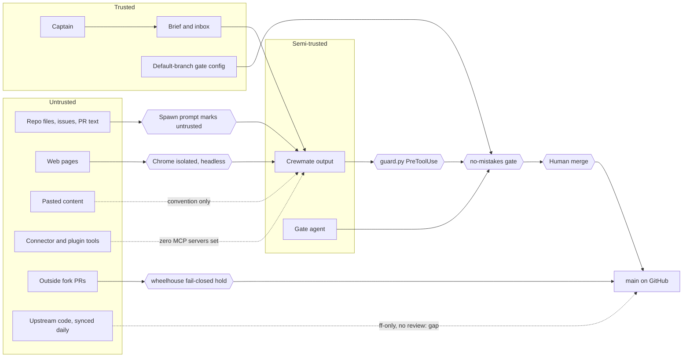

**How to explain it:**
The only fully trusted inputs are me, the brief firstmate writes from my words, and gate configuration read from the default branch rather than the pushed branch.
Agent output is semi-trusted: it is useful work, but it passes the tool-call guard, the full gate, and my merge decision before it reaches main.
Everything the agent reads from the world is untrusted, and the spawn prompt says so explicitly, while browser work runs in an isolated headless profile.
Two edges are weak and I name them: pasted content has no harness-specific control, and upstream code is fast-forwarded and rebuilt daily without review, which is a supply-chain exposure.
The guard is a backstop against accidents, not a sandbox; the real isolation is the worktree plus the gate.

**Evidence:** `firstmate/bin/fm-spawn.sh:1857`, `no-mistakes/docs/src/content/docs/reference/repo-config.md:8-13`, `firstmate/.no-mistakes.yaml:3-10`, `chrome-devtools-axi/src/bridge.ts:700-706`, `wheelhouse/AGENTS.md:24-30`, `agents/claude/hooks/guard.py:24-29`, `~/.claude.json` has empty `mcpServers`, [06 Safety and quality gates](../06-Safety-and-Quality-Gates.md) section 6, [07 Fleet operations](../07-Fleet-Operations.md) section 10.

## A.5 Repo dependency graph - who calls whom

**What it shows:** the runtime and build-time dependencies among the 24 repos, with the nine apps and benchmarks collapsed into two groups.

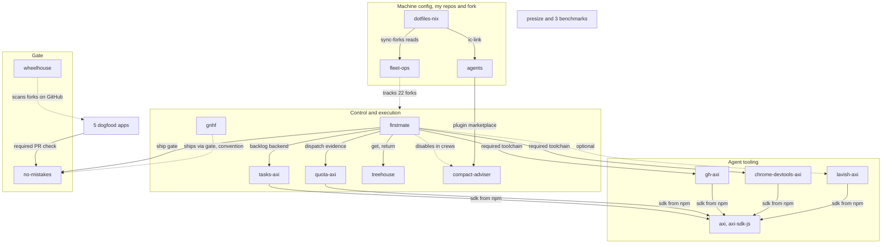

**How to explain it:**
firstmate is the hub: it depends on the backlog, quota, worktree, and gate tools, and it requires the GitHub and browser CLIs to be installed.
The five Node CLIs share one SDK, which is why they share one output format and one exit-code contract, and they resolve it from npm rather than from my clone.
My own repos sit at the bottom: dotfiles-nix links the agents repo into place and runs the sync engine that reads the fleet-ops manifest.
The apps and benchmarks are not runtime dependencies; five of the apps simply require a no-mistakes attestation on every PR, and presize plus the three benchmarks are tracked and synced only.
The dashed edges are conventions or optional paths, not code calls.

**Evidence:** [firstmate](../components/firstmate.md) section 6, [axi](../components/axi.md), `agents/claude/settings.json:41-53`, `dotfiles-nix/files/bin/ic-link:60-175`, `dotfiles-nix/files/bin/sync-forks:141-250`, `.fleet/manifest.yaml:11-341`, [apps-and-benchmarks-overview](../components/apps-and-benchmarks-overview.md), [wheelhouse](../components/wheelhouse.md), [gnhf](../components/gnhf.md).

## A.6 Upstream versus own work - authorship map

**What it shows:** which repos came from upstream unchanged, which carry my commits, and which are entirely mine.

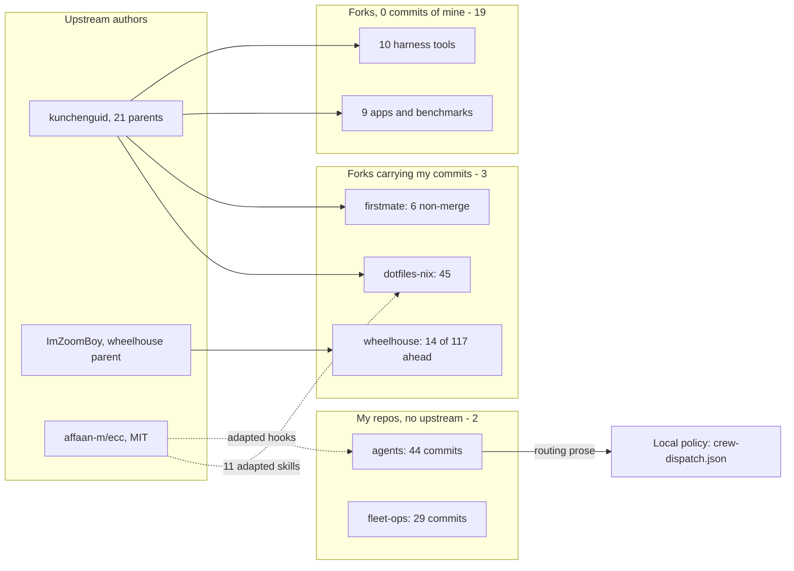

**How to explain it:**
I say this first in any interview: I did not write the agent tools.
Nineteen of the twenty-two forks carry zero commits of mine; I install, wire, and sync them.
Three forks carry my work: six small firstmate fixes, four of which the gate's own fix steps wrote under my identity, all 45 fork commits in dotfiles-nix, and 14 fleet and docs commits in wheelhouse, whose other 103 ahead commits are the original author's history.
Two repos are entirely mine, the manual generator with its hooks and the fleet manifest, and the routing policy lives in a local config file I own.
Where I adapted someone else's MIT code, the hooks and eleven skills, the source is attributed in the files.

**Evidence:** [02 Inventory](../02-Inventory.md) section 1, [00 Executive summary](../00-Executive-Summary.md) section 4, [firstmate](../components/firstmate.md) section 10, [dotfiles-nix](../components/dotfiles-nix.md) section 10, `agents/claude/hooks/guard.py:32-35`, `firstmate/.gitignore:13`.

## A.7 Capability mindmap

**What it shows:** the whole harness as capabilities rather than repos, with the component that provides each.

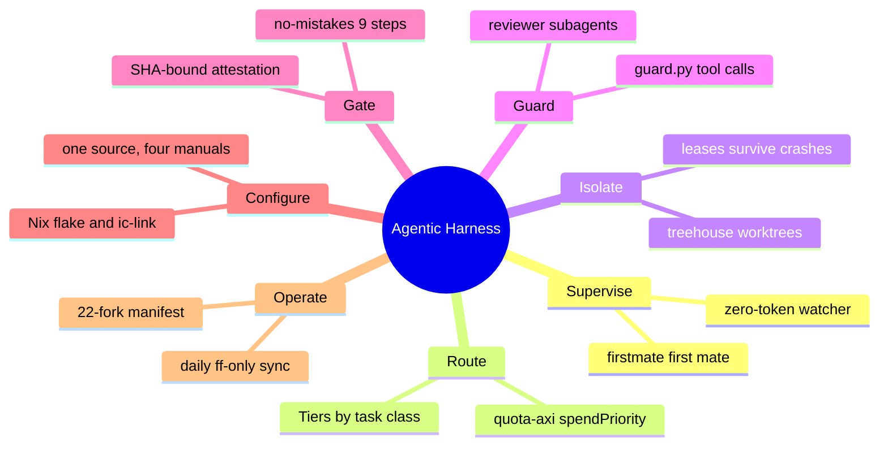

**How to explain it:**
If someone asks what the system does, I answer with these seven verbs, not with repo names.
Supervise and Route are the decision half: one conversational supervisor, and a two-step model choice by fit then quota.
Isolate, Guard, and Gate are the safety half: separate worktrees, a hook on every tool call, and a single gated path to GitHub.
Configure and Operate are the platform half that keeps the machine and 22 forks reproducible and current.

**Evidence:** [00 Executive summary](../00-Executive-Summary.md) sections 1 and 3, [04 Model routing and quota](../04-Model-Routing-and-Quota.md), [06 Safety and quality gates](../06-Safety-and-Quality-Gates.md), [07 Fleet operations](../07-Fleet-Operations.md), `no-mistakes/internal/pipeline/steps/common.go:361-376`.

## A.8 Multi-vendor model topology

**What it shows:** which agent surfaces call which vendor and model, and which surface only measures quota.

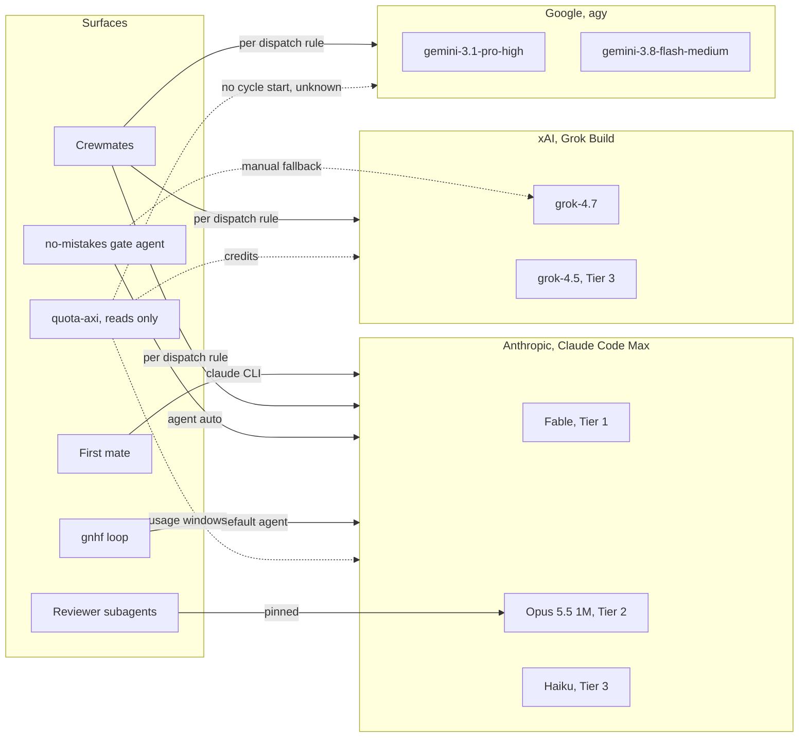

**How to explain it:**
Crewmates are the only surface that can land on any of the three vendors, because their model comes from the dispatch rules plus live quota.
Every other surface is effectively Claude: the gate agent resolves to Claude with a manual switch to Grok, gnhf defaults to Claude, and all six reviewer subagents are pinned to Opus so review never spends the Fable week.
Fable is reserved for Tier 1, and when it cannot carry the work the fallback order is Opus, then grok-4.7, then Gemini Pro, never a cheaper class.
quota-axi only reads usage; it cannot measure a cycle start for Gemini through agy, so Gemini stays eligible but unranked.

**Evidence:** `firstmate/config/crew-dispatch.json:2-56`, `agents/tools/claude.md:11-20`, `~/.no-mistakes/config.yaml:7-16`, [gnhf](../components/gnhf.md) configuration table, [agents](../components/agents.md) section 5, `quota-axi/src/interpretation.ts:461-584`, [04 Model routing and quota](../04-Model-Routing-and-Quota.md) sections 2, 3, and 8.

## A.9 Per-task state entities and join keys

**What it shows:** the records one task creates across firstmate, treehouse, no-mistakes, and GitHub, and how they link.

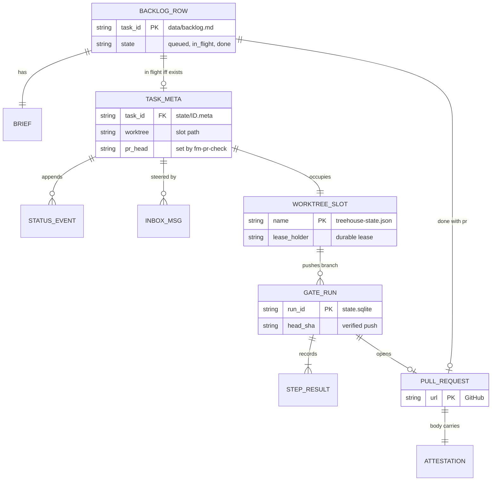

**How to explain it:**
The task id is the join key: it names the backlog row, the brief folder, the meta file, the status log, and the inbox.
The key invariant is that a meta file exists if and only if the backlog row is In flight, and spawn and teardown change the two together under one lock with a crash-replay marker.
The gate run is keyed by its own run id in SQLite and binds to a head SHA, and the PR body carries an attestation bound to that same SHA.
Closing the task records the PR URL back on the backlog row, so the whole chain can be walked in either direction.

**Evidence:** `firstmate/bin/fm-backlog-transition-lib.sh:7-20`, [firstmate](../components/firstmate.md) persistent state table, [tasks-axi](../components/tasks-axi.md), `treehouse/internal/pool/state.go:20-81`, [no-mistakes](../components/no-mistakes.md), `no-mistakes/.github/actions/require-no-mistakes/action.yml:1-5`, [06 Safety and quality gates](../06-Safety-and-Quality-Gates.md) section 8.

## A.10 A day on the harness

**What it shows:** the scheduled jobs at their configured times, and the human-driven sessions in relative order.

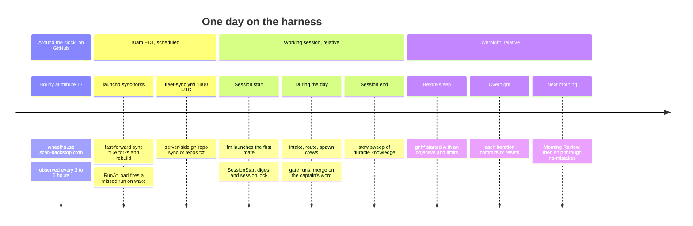

**How to explain it:**
Only three things run on a clock: the hourly wheelhouse scan on GitHub, the local fork sync at 10am, and the server-side sync at 14:00 UTC, which is the same instant in EDT.
Having both syncs fire together is a known issue I would fix by shifting one schedule.
Everything else is driven by me: a working session starts with `fm`, and the first mate reloads its state from disk rather than from memory.
Overnight work goes to gnhf, which leaves a branch of small commits that I review in the morning and still ship through the gate.

**Evidence:** `dotfiles-nix/nix/home/darwin.nix:79-96`, `.fleet/.github/workflows/fleet-sync.yml:13`, `wheelhouse/.github/workflows/scan-backstop.yml:25`, [wheelhouse](../components/wheelhouse.md) observed runs, [07 Fleet operations](../07-Fleet-Operations.md) section 10, `firstmate/bin/fm-session-start.sh:26-55`, `gnhf/skills/gnhf/SKILL.md:119-157`, [03 End-to-end lifecycle](../03-End-to-End-Lifecycle.md).

## A.11 Scaling out to a team - PROPOSAL, not built

**What it shows:** how each local control would map onto a team or enterprise equivalent; the right-hand column is a design proposal only.

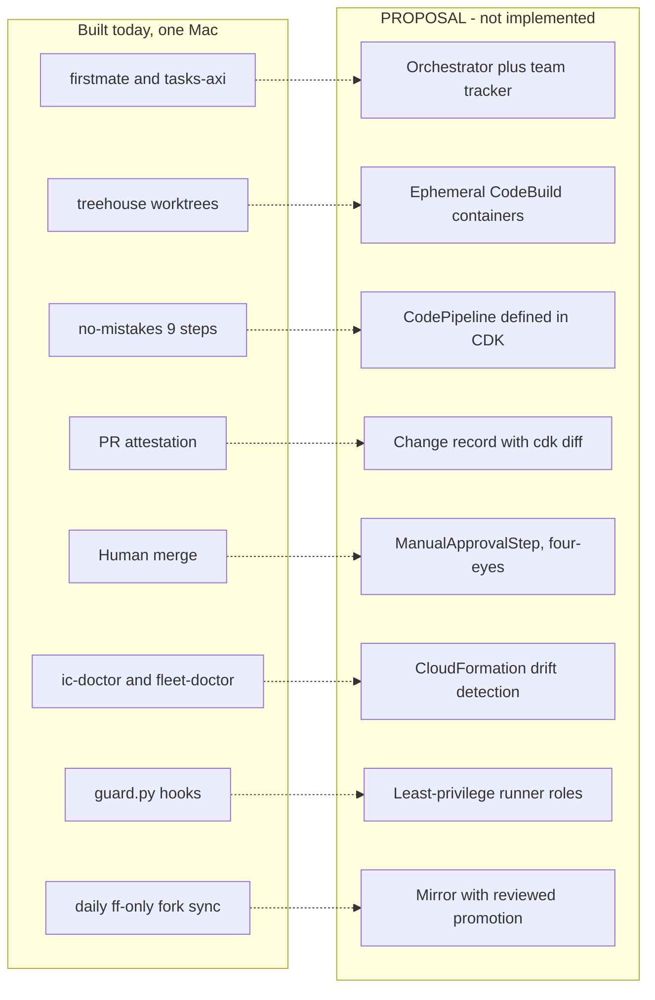

**How to explain it:**
This is a whiteboard proposal, and I say so: there is no AWS CDK, CloudFormation, or CodeBuild anywhere in these repos.
The gate's steps become CodeBuild stages in a self-mutating CDK pipeline that runs the same lint and test commands, and the attestation becomes a change record carrying the `cdk diff` and change set.
The human merge becomes a manual approval step with separate accounts per stage, and the doctors become drift detection.
Two items close gaps I already found locally: least-privilege runners replace bypassed permission prompts, and reviewed promotion replaces the unreviewed daily reinstall of upstream code.
The services are new to me; the control design is the one I already run.

**Evidence:** [JD mapping](../interview/JD-Mapping.md) section 4 (bridge design and the `git grep` showing no AWS code), [08 Design principles and trade-offs](../08-Design-Principles-and-Tradeoffs.md), [06 Safety and quality gates](../06-Safety-and-Quality-Gates.md) sections 4 and 9, [07 Fleet operations](../07-Fleet-Operations.md) section 10.

## A.12 Execution contexts and guard coverage

**What it shows:** each context in which an agent or job runs, whether a human is present, and which controls actually cover it.

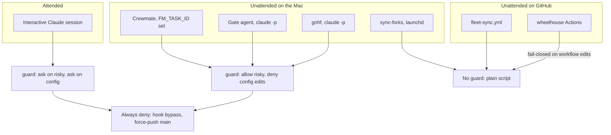

**How to explain it:**
The guard hook decides presence from two environment signals, so the same hook behaves differently in each context.
With me at the keyboard it asks before destructive commands and config edits.
Unattended it cannot ask without deadlocking, so it allows the risky class inside a disposable worktree but denies edits to lint and gate configs, because weakening a check is the characteristic unattended failure.
Every Claude context always denies hook bypass and force-push to shared branches, but the launchd sync and the GitHub Actions jobs are plain scripts outside the hook entirely, which is why they are fast-forward-only by design.
One open question I state honestly: whether Claude Code honors a hook deny while running with permission prompts bypassed was not tested.

**Evidence:** `agents/claude/hooks/guard.py:13-22`, `agents/claude/hooks/guard.py:59-65`, `firstmate/bin/fm-spawn.sh:4737`, `no-mistakes/internal/agent/claude.go:178-203`, `gnhf/src/core/agents/claude.ts:183`, `dotfiles-nix/files/bin/sync-forks:206-249`, `wheelhouse/AGENTS.md:24-30`, [06 Safety and quality gates](../06-Safety-and-Quality-Gates.md) sections 3 and 5.
