# Diagram Atlas B - Orchestration

Thirteen views of the orchestration internals (firstmate, treehouse, gnhf, wheelhouse, and tasks-axi as the dispatch record) that go one level below [01 Architecture and diagrams](../01-Architecture-and-Diagrams.md), [03 End-to-end lifecycle](../03-End-to-End-Lifecycle.md), and the component notes.
Citations use `repo/path:line` relative to `~/github`, verified read-only against the local clones on 2026-09-23.

## B.1 Who may write where: captain, first mate, secondmate, crewmate

**What it shows:** the four roles in a firstmate fleet and the exact stores each one is allowed to write, with the project clone read-only to every supervisor.

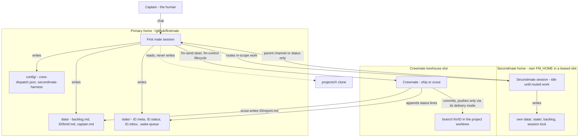

**How to explain it:**
The captain talks to exactly one agent, the first mate, and every arrow out of it lands in its own home, never in a project.
Hard rule 1 says the first mate never writes to a project, so all code changes happen in a crewmate's disposable worktree on a branch named `fm/<id>`.
A crewmate's only writes outside its worktree are appending status lines and, for a scout, writing its report, and it never talks to the captain directly.
A secondmate is the same crewmate idea with its own isolated home and backlog, and it reaches the captain only through its parent's channel.
Secondmates do not spawn secondmates, which keeps the tree at most two levels deep.

**Evidence:** `firstmate/AGENTS.md:23`, `:27-31` (hard rule 1), `:38-40` (hard rule 4), `:55`, `:75` (secondmates do not spawn secondmates), `:269`, `:522`; worker role text `firstmate/bin/fm-dod-lib.sh:46-56`; scout report path `firstmate/bin/fm-brief.sh:463`; secondmate lease `firstmate/bin/fm-home-seed.sh:396`; see also [firstmate](../components/firstmate.md).

## B.2 Dispatch sequence: intake to crewmate start

**What it shows:** the scripts that run between "captain asks" and "crewmate is working", in the order `fm-spawn.sh` actually executes them.

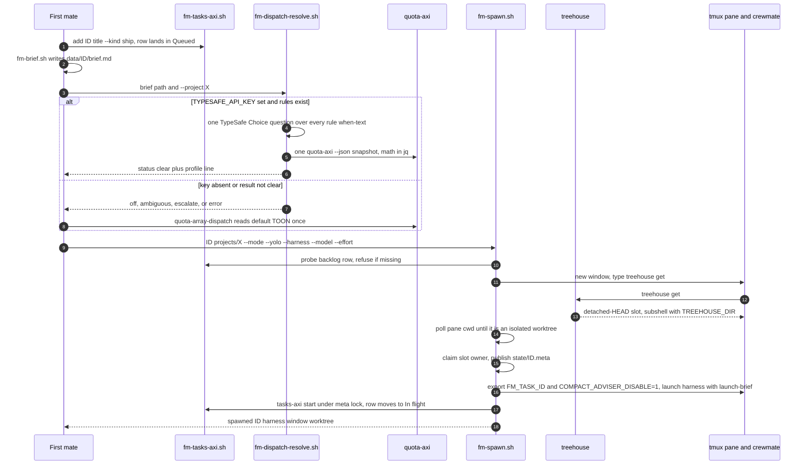

**How to explain it:**
The backlog row is created first, so no worker can exist without a durable record that owns it.
Routing is a two-path choice: the optional typed resolver classifies the brief against my rules and does all quota math in jq, and anything other than a clear answer falls back to the quota-array-dispatch skill.
`fm-spawn.sh` refuses to run without an explicit harness while the dispatch file exists, and it probes the backlog row before it creates any window, because a refusal is free at that point.
It types `treehouse get` into the pane and waits until the pane's working directory is a distinct worktree, claims the slot, and publishes the task record.
Only after the launch succeeds does the row move to In flight, which is the invariant that meta file exists if and only if the row is In flight.

**Evidence:** `firstmate/bin/fm-dispatch-resolve.sh:8-48`; explicit harness refusal `firstmate/bin/fm-spawn.sh:2088-2090`; backlog probe `:3100-3115`; `treehouse get` `:3843`; slot owner claim `:3910-3920`; meta publish `:4514`; launch env `:4727-4737`; In flight commit `:4930-4945`; spawned line `:4982`; pairing invariant `firstmate/bin/fm-backlog-transition-lib.sh:7-20`; `firstmate/AGENTS.md:331`.

## B.3 Work item lifecycle: backlog states and status events

**What it shows:** the three stored tasks-axi states, the derived ready, blocked, and held views of Queued, and the crewmate status verbs that drive supervision while a row is In flight.

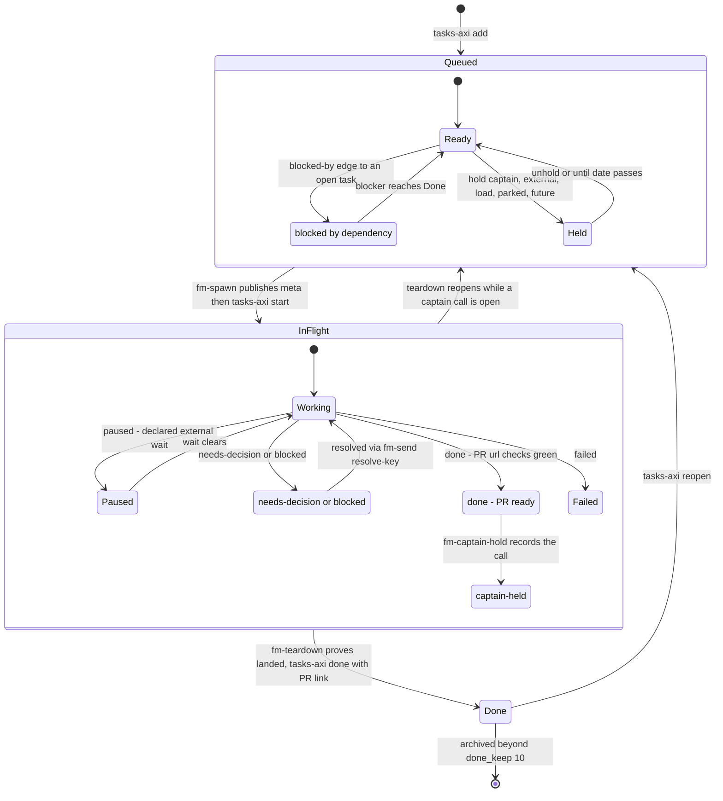

**How to explain it:**
tasks-axi stores only three states, Queued, In flight, and Done, which are literally the three Markdown sections of the backlog.
Blocked, held, and ready are computed on read: only a `blocked-by` edge gates readiness, and a hold with an `until` date expires by itself.
Inside In flight, the substates are not stored in the backlog at all; they are the worker's append-only status verbs, which the watcher classifies.
`paused` means a bounded wait expected to clear on its own, while `blocked` and `needs-decision` mean the first mate must act.
Teardown is the only normal exit from In flight, and it reopens rather than closes the row if a captain decision is still open.

**Evidence:** `tasks-axi/src/model.ts:10-40`; `tasks-axi/src/derive.ts:35-81`; `start`, `done`, `reopen`, `hold` in `tasks-axi/src/commands/state.ts:116-679`; status verbs `firstmate/bin/fm-classify-lib.sh:78-128`, `:169`; paused versus blocked `firstmate/AGENTS.md:435`; reopen on open captain call `firstmate/bin/fm-teardown.sh:30-43`; `done_keep = 10` in `firstmate/.tasks.toml`; see [tasks-axi](../components/tasks-axi.md).

## B.4 Supervision loop: Stop hook, zero-token watcher, wake queue

**What it shows:** how the first mate waits for a fleet without spending model tokens, and which wakes are absorbed in bash versus surfaced to the model.

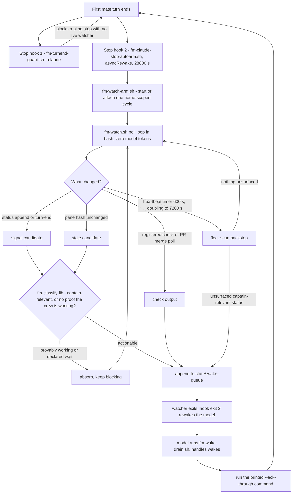

**How to explain it:**
The first mate never polls; every time its turn ends, a Stop hook arms a bash watcher asynchronously, so waiting costs zero tokens.
The watcher looks at four sources, status appends, unchanged panes, registered checks such as a PR merge poll, and a heartbeat that backs off from 10 minutes to 2 hours on an idle fleet.
Anything that is provably still working, for example an active no-mistakes step, is absorbed in bash; a provably working pane that stays quiet past 240 seconds is escalated as a possible wedge.
Actionable wakes are written to a durable queue before the model is woken, and they are acknowledged only after handling, so a crash mid-turn replays the wake instead of losing it.
The turn-end guard is the backstop that refuses to let the session stop blind while work is under way.

**Evidence:** `firstmate/.claude/settings.json` (Stop hooks, `asyncRewake`, `timeout: 28800`); `firstmate/docs/supervision-protocols/claude.md:1-9`; watcher reasons `firstmate/bin/fm-watch.sh:1-20`, `:113`; `HEARTBEAT=600`, `HEARTBEAT_MAX=7200` `:230-231`; `STALE_ESCALATE_SECS=240` `:266`; backoff `:2834-2841`; durable queue `firstmate/docs/architecture.md:64`; drain and ack `firstmate/AGENTS.md:428-433`.

## B.5 Teardown: landed-work proof before `treehouse return --force`

**What it shows:** the checks `fm-teardown.sh` passes, in order, before it is allowed to destroy a worktree and close the backlog row.

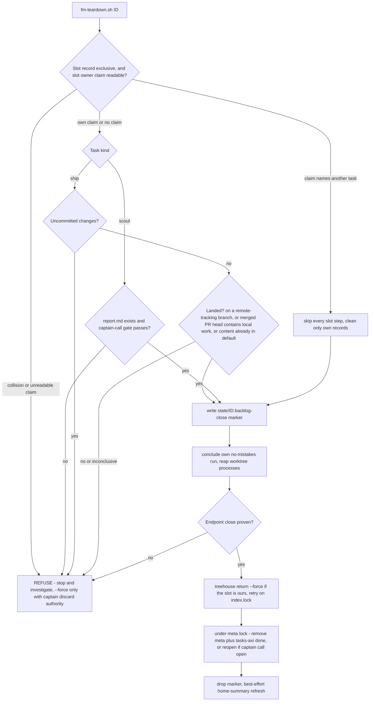

**How to explain it:**
Teardown is the one place the system destroys state, so it is written as a chain of refusals where every uncertain answer stops.
First it proves the pool slot is still this task's, because slots are recycled and a stale record once returned a slot out from under a live worker.
Then it proves the work landed: reachable from a remote branch, or contained in a merged PR's head, or already present in the default branch, which covers squash-merge-then-delete.
Before anything destructive it writes a pending-close marker, so a crash between returning the worktree and closing the backlog row is replayed at the next session start.
The worktree return and the backlog close are paired under one lock, so the system never ends with a Done row and a live worktree, or the reverse.

**Evidence:** header contract `firstmate/bin/fm-teardown.sh:15-22` (marker), `:42-68` (landed-work test), `:81-120` (slot ownership, incident dated 2026-09-07); main-flow order `firstmate/bin/fm-teardown.sh` after line 3217 (slot checks, scout gate, marker write, run conclusion, `fm_backend_kill`, return, paired transition); `teardown_treehouse_return` `:1702-1762`; hard rule 3 `firstmate/AGENTS.md:34-37`.

## B.6 treehouse slot lifecycle and leases

**What it shows:** the states a pooled worktree moves through, including the durable lease, the exit-3 dirty case, and the quarantine states that exist so treehouse never resets work it cannot prove landed.

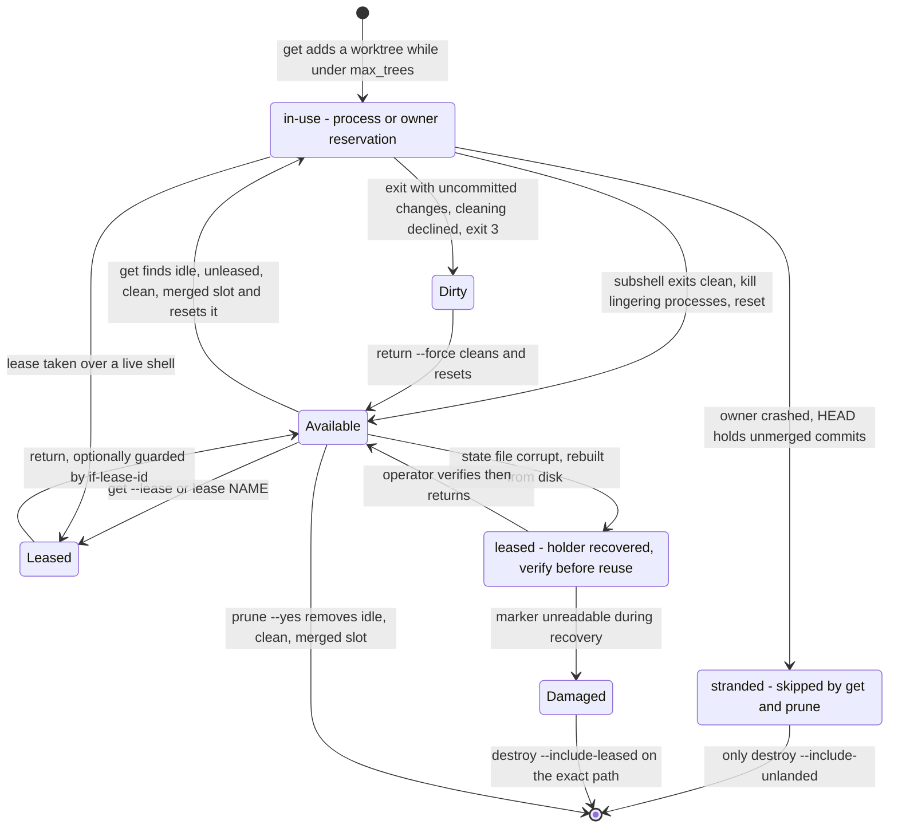

**How to explain it:**
A slot starts in use when `get` creates it, and returns to available only after treehouse kills lingering processes and resets it under the pool lock.
A durable lease is different from being in use: it has a random ID and survives with no process inside, which is how a secondmate home keeps its slot across restarts.
A dirty exit leaves the slot exactly as found with exit code 3, which callers treat as "not returned" rather than "retry".
If an owner crashes with unmerged commits, `get` and `prune` both skip the slot, and only an explicit destroy flag can remove it.
A corrupt state file never hands out slots; recovery marks every slot as leased with a "verify before reuse" holder, and the operator decision after that is inferred from the holder text rather than a documented procedure.

**Evidence:** status constants `treehouse/internal/pool/pool.go:19-31`; acquire scan `:425-457`; `List` classification `:966-1090`; dead-owner healing `:1120-1137`; lease fields `treehouse/internal/pool/state.go:19-66`; recovered holder `:329`; exit 3 `treehouse/cmd/exit.go:9-19`, `treehouse/cmd/get.go:186-201`, `treehouse/cmd/return_cmd.go:113-126`; `max_trees` default 16 `treehouse/internal/config/config.go:74`; see [treehouse](../components/treehouse.md).

## B.7 treehouse data model: treehouse-state.json schema v4

**What it shows:** the on-disk pool state, grouped by the three ownership facts treehouse keeps separate.

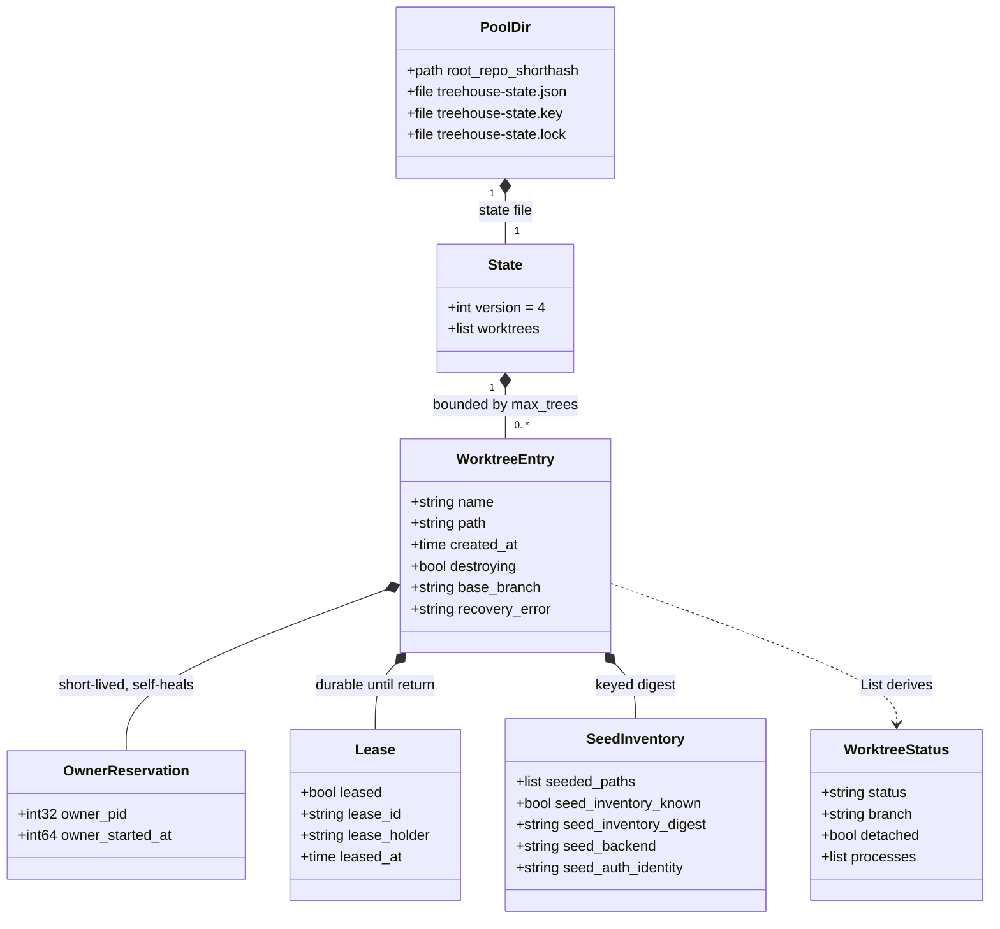

**How to explain it:**
Each repository gets one pool directory holding a JSON state file, an HMAC key, and a lock file that serializes every writer.
The state file is a version number plus a flat list of worktree entries; I grouped the fields into three classes to show the design, but on disk they are one flat JSON object.
The owner reservation is a PID plus its start time, so a reused PID cannot impersonate the owner, and it heals itself when that process dies.
The lease is durable with an immutable random ID, and the seed inventory records which ignored files were copied in, authenticated by the key.
The status you see in `treehouse status` is never stored; `List` derives it on every call from these fields plus a live process scan and a dirty check.

**Evidence:** `treehouse/internal/pool/state.go:19-66` (fields and JSON names), `:76-81` (`State`, `stateVersion = 4`), `:87-101` (key and lock paths); pool path hashing `treehouse/internal/config/config.go:205-222`; `ownerAlive` `treehouse/internal/pool/pool.go:1208-1215`; derived status `:966-1090`.

## B.8 gnhf iteration internals

**What it shows:** what one gnhf iteration does with each possible outcome, including the fallback model, commit repair, and the difference between pre-iteration and post-iteration stop checks.

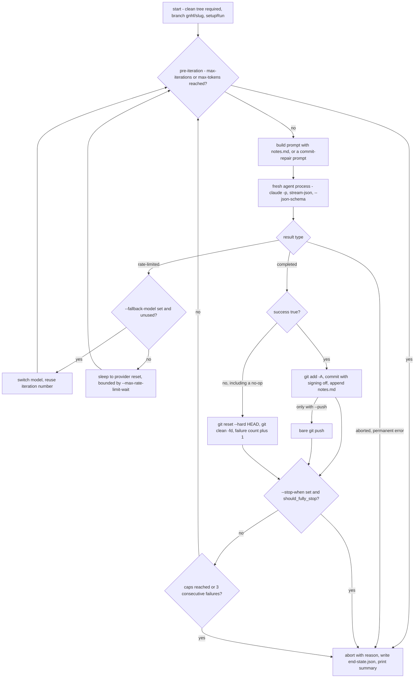

**How to explain it:**
Every iteration is a fresh agent process, and the only memory carried forward is `notes.md`, so a bad iteration cannot poison the next one's context.
A rate-limit rejection does no work, so it reuses the same iteration number and never counts against the failure breaker; with `--fallback-model` it switches model once, otherwise it sleeps until the provider's reset.
Success commits with signing disabled, and failure hard-resets and cleans the tree; a no-op must report failure, which is what stops a loop that spins without progress.
If the commit itself fails, the work is kept and the next prompt asks the agent to repair it.
In my harness the `--push` branch is never used, because a bare push would bypass the no-mistakes gate.

**Evidence:** loop `gnhf/src/core/orchestrator.ts:305-330`; rate-limit and fallback model `:363-405`; stop-when, caps, failure breaker `:435-452`; cap checks `:1053-1073`; commit, push, reset `gnhf/src/core/git.ts:238-252`, `:273-291`, `:293-296`; no-op rule `gnhf/src/templates/iteration-prompt.ts:14`; commit repair `gnhf/README.md:154`; push forbidden by `agents/ROUTING.md:29`; see [gnhf](../components/gnhf.md).

## B.9 gnhf versus firstmate: attended supervisor versus unattended loop

**What it shows:** the two supervisors side by side, with the durable state each keeps, and the fact that no code connects them.

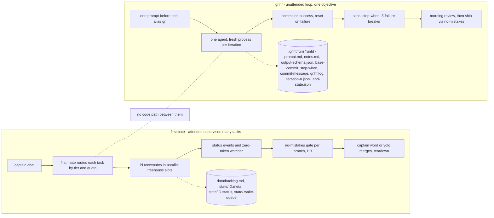

**How to explain it:**
firstmate is breadth: one supervisor, many parallel tasks, a human in the loop for merges, and state spread across a backlog and per-task status files.
gnhf is depth: one objective, one agent restarted each iteration, no human until morning, and state in a single run directory excluded from git.
They share ideas, fresh context per unit of work and durable notes on disk, but a grep of `firstmate/bin` finds no gnhf call, so I start gnhf by hand.
Both end at the same gate: firstmate's crewmates run no-mistakes themselves, and a finished gnhf branch is reviewed and then shipped through no-mistakes.

**Evidence:** run directory `gnhf/src/core/run.ts:47-50`, `:199-260`; `.git/info/exclude` entry `:175-190`; `gn` alias `dotfiles-nix/files/zsh/ic-workflow.zsh:506`; no firstmate reference (grep, 2026-09-23) per [firstmate](../components/firstmate.md) section 6; morning review `gnhf/skills/gnhf/SKILL.md:119-157`; firstmate state `firstmate/AGENTS.md:60-161`.

## B.10 wheelhouse auto-merge gates and its boundary with the harness

**What it shows:** the G0 to G7 gate chain wheelhouse runs on outside contributors' PRs, and why the harness's own PRs never enter it.

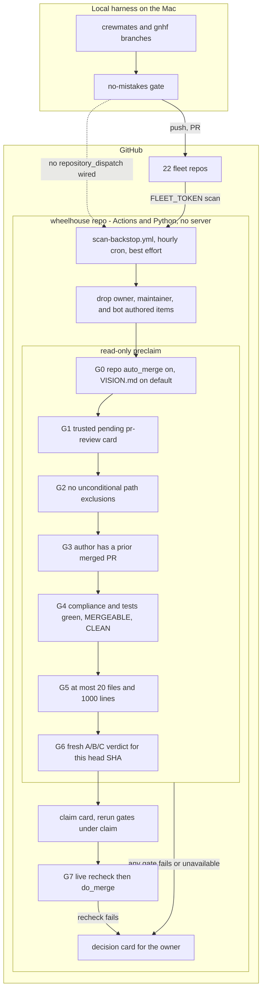

**How to explain it:**
wheelhouse is not part of the local pipeline; it is a GitHub-only queue that watches my public forks for other people's PRs and issues.
My own PRs from the harness are filtered out at scan time, and no source repo sends a dispatch event, so the hourly scan is its only intake.
Auto-merge is a strict subset of what a human could approve: seven read-only gates run before anything is claimed, then the gates rerun under the claim, and G7 rechecks live state immediately before merging.
Any missing, stale, or unreadable input holds the PR and turns it into a decision card for me instead.
The model verdict in G6 is one input among eight and can never merge anything on its own.

**Evidence:** gate contract `wheelhouse/scripts/auto_merge.py:14-27`; G7 act `:2265`; preclaim before claim `wheelhouse/docs/OPTION_B_CARD_PROJECTION.md:90`; scan workflow `wheelhouse/.github/workflows/scan-backstop.yml:25`, `:106-195`; backstop-only mode `wheelhouse/README.md:330`; author filtering `wheelhouse/README.md:7`; `auto_merge: true` `wheelhouse/wheelhouse.config.yml:463`; see [wheelhouse](../components/wheelhouse.md).

## B.11 Session startup sequence

**What it shows:** what happens between launching `fm` and the first mate's first turn, including source routing, the session lock, and where the home summary and memory budget fit.

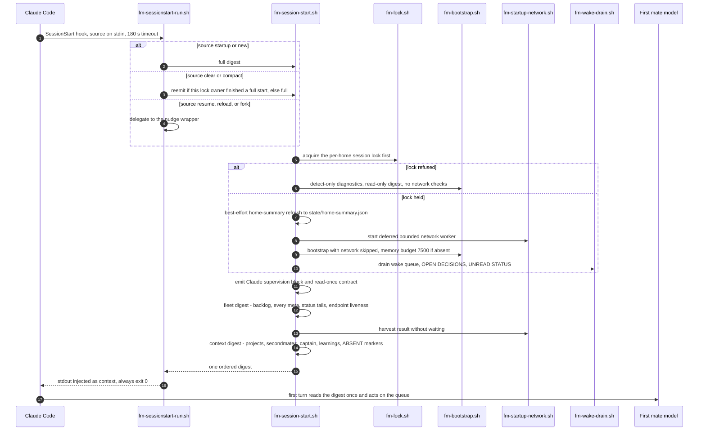

**How to explain it:**
The hook runs the digest instead of asking the model to, so the supervisor takes the helm before its first turn no matter what the first prompt is.
The lock comes first, before anything mutates, so a second session on the same home degrades to a read-only observer that cannot spawn, steer, or merge.
Slow network checks run in a detached bounded worker and are harvested without waiting, so a slow GitHub call can never block session start.
The startup memory files are capped by a per-home budget, 7,500 estimated tokens by default, which keeps the always-loaded context bounded.
The script always exits 0, because a failed SessionStart hook would block the session instead of telling the model what went wrong.

**Evidence:** hook `firstmate/.claude/settings.json` (`SessionStart`, `timeout: 180`); source routing `firstmate/bin/fm-sessionstart-run.sh:14-40`; order `firstmate/bin/fm-session-start.sh:26-70`, lock `:631`, summary `:663`, network start `:676`, bootstrap variants `:684-697`, drain `:741`, supervision `:790`, harvest `:937`; read-only rule `firstmate/AGENTS.md:179-180`; budget `firstmate/docs/configuration.md:255-267`, `firstmate/bin/fm-bootstrap.sh:72-76`.

## B.12 Parallel crew fan-out through one gate

**What it shows:** several crewmates working the same repository at once in isolated slots and branches, converging through a gate that serializes only per branch.

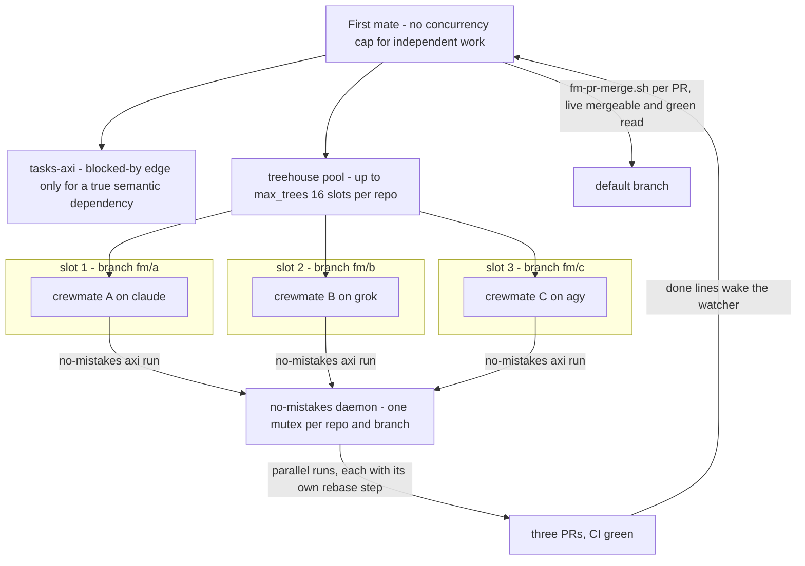

**How to explain it:**
The first mate dispatches independent work immediately with no concurrency cap, and serializes only on a real semantic dependency recorded as a `blocked-by` edge in the backlog.
Each crewmate gets its own slot at detached HEAD and creates its own branch, so git never has two worktrees fighting over one branch.
Routing is per task, so the three crewmates can run on three different model subscriptions at the same time.
The gate daemon locks per repository and branch, so different branches validate in parallel, and each run rebases onto the latest default branch itself.
Merges happen one PR at a time through `fm-pr-merge.sh`, which re-reads live mergeability and checks before each merge rather than trusting recorded state.

**Evidence:** `firstmate/AGENTS.md:322-323`; readiness `tasks-axi/src/derive.ts:35-50`; `max_trees` `treehouse/internal/config/config.go:74`; `treehouse get` per task `firstmate/bin/fm-spawn.sh:3843`; branch lock `no-mistakes/internal/daemon/manager.go:1274-1281`; step list with rebase `no-mistakes/internal/pipeline/steps/common.go:361-376`; merge guard `firstmate/docs/architecture.md:355-359`; the specific harness mix shown is illustrative.

## B.13 Failure and recovery flows

**What it shows:** the three recovery paths an interviewer is most likely to probe: a crashed or wedged crewmate, a stale slot or lease, and quota running out mid-task.

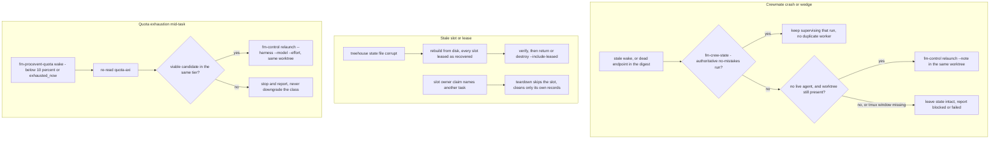

**How to explain it:**
For a crash, the no-mistakes run record outranks the dead pane: if a run still owns the branch, the first mate keeps supervising it rather than starting a duplicate.
Relaunch reuses the same worktree and brief plus a progress note, so commits survive, and on tmux a missing window refuses relaunch because a live agent may still hold the worktree.
For slots, uncertainty is quarantine: a corrupt state file turns every slot into a recovered lease, and a slot claimed by another task is skipped rather than returned.
For quota, an optional process-event watch wakes the first mate when a provider drops below its threshold; combining that wake with a re-read of quota-axi and a relaunch on a different harness is my reading of three documented rules, not one scripted procedure.
If no candidate in the same tier has runway, the rule is to stop and report rather than silently trade down.

**Evidence:** `firstmate/.agents/skills/stuck-crewmate-recovery/SKILL.md` (dead-endpoint reconciliation, tmux refusal, relaunch with `--harness`, `--model`, `--effort`); `firstmate/bin/fm-control.sh` via `firstmate/AGENTS.md:339`; `treehouse/internal/pool/state.go:326-329`; slot claim `firstmate/bin/fm-teardown.sh:81-120`; quota watch `firstmate/bin/fm-procevent-quota.sh:1-30`, `firstmate/.agents/skills/quota-array-dispatch/SKILL.md:35`; handover rule `agents/ROUTING.md:21`; Tier 1 no-downgrade `firstmate/.agents/skills/quota-array-dispatch/SKILL.md:97-101`.
