# Diagram Atlas C - Gate, safety, and compliance

Thirteen diagrams for the release-compliance story: how agent-written code is gated, what the hooks enforce, where the gaps are, and how the same controls would look on AWS.

## C.1 The no-mistakes run as a state machine

**What it shows:** one gate run from `axi run --intent` to a terminal outcome, with every point where a human or driving agent must respond.

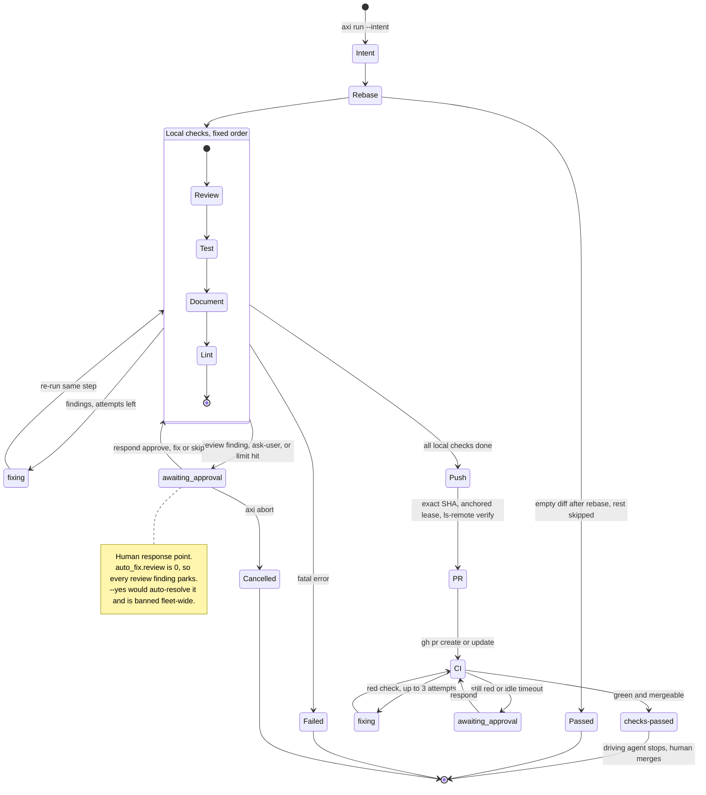

**How to explain it:**
The run starts only with an explicit intent string, because the reviewer uses it to tell a deliberate choice from a mistake.
Rebase runs first, and an empty diff after rebase short-circuits the rest as skipped.
Review, test, document, and lint run in a fixed order that a repo can add to but never reorder or remove.
Mechanical findings auto-fix up to three times; review findings and anything marked ask-user park at `awaiting_approval` until someone answers approve, fix, or skip.
Only after the local checks pass does the pipeline push an exact verified SHA, open the PR, and babysit CI to `checks-passed`, where the agent stops and a human merges.
The `--yes` flag would let an agent answer its own ask-user findings, so firstmate bans it in every ship brief.

**Evidence:** `no-mistakes/internal/types/types.go:50-62` (closed step enum), `no-mistakes/docs/src/content/docs/concepts/pipeline.md` (step table and auto-fix limits), `no-mistakes/docs/src/content/docs/concepts/auto-fix.md` (fix loop, fail-closed `ask-user`), `no-mistakes/docs/src/content/docs/reference/pipeline-steps.md:375` (step statuses), `firstmate/bin/fm-dod-lib.sh:305` (`--yes` banned fleet-wide), [no-mistakes](../components/no-mistakes.md) section 5 (`auto_fix.review: 0`).

## C.2 Sequence - an agent drives the gate to a ready PR

**What it shows:** the calls between the driving agent, the AXI CLI, the local gate, the pipeline agent, the human, and GitHub during one successful run.

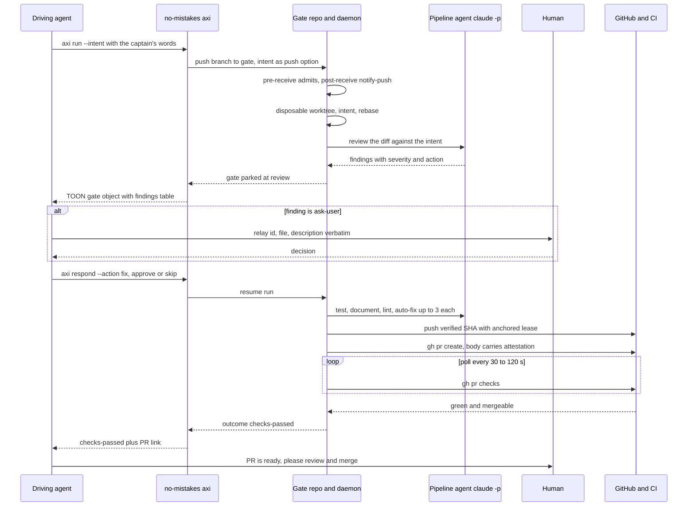

**How to explain it:**
The driving agent never pushes to origin; it calls `no-mistakes axi run`, which pushes to a local gate and blocks until the first decision point.
The pipeline agent is a separate `claude -p` process working in a disposable worktree, so the author and the reviewer do not share a context window.
When a gate parks, the driving agent only decides; it never edits code mid-run, and ask-user findings go to a human verbatim.
After the local steps, the daemon itself pushes, opens the PR with a machine-readable attestation, and polls CI with backoff.
The run returns `checks-passed` and the agent stops, because merging is a human act.

**Evidence:** `no-mistakes/internal/cli/axi_drive.go:128` (`axi run`), `no-mistakes/internal/git/hook.go:133-209` (post-receive notify-push), `no-mistakes/internal/agent/claude.go:178-203` (`claude -p` invocation), `no-mistakes/docs/src/content/docs/reference/pipeline-steps.md:317` (CI polling cadence), `~/.agents/skills/no-mistakes/SKILL.md` (escalate ask-user findings, never fix mid-run), [no-mistakes](../components/no-mistakes.md) section 7.

## C.3 How the gate intercepts a push

**What it shows:** the deployment view of the named-remote proxy, the checks on the way in and out, and the bypass path that nothing on the remote blocks.

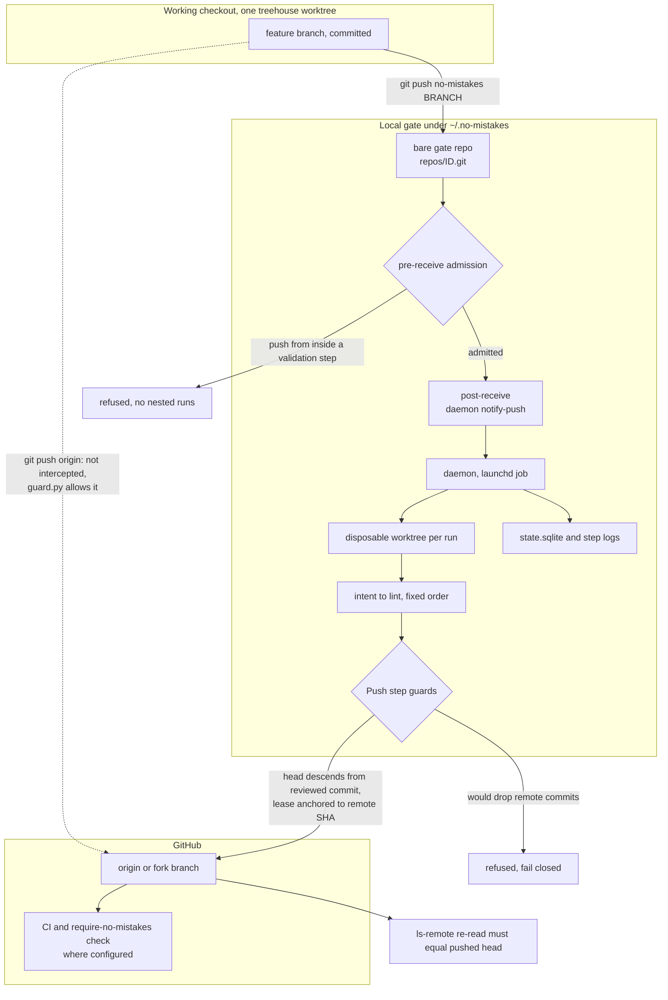

**How to explain it:**
`no-mistakes init` adds a second remote named `no-mistakes` that points at a local bare repo, and leaves `origin` untouched on purpose.
The pre-receive hook asks the daemon to admit the push, which is how a pipeline agent is stopped from starting a pipeline inside a pipeline.
The daemon validates in a disposable worktree, so fixes and test runs never touch my checkout.
The Push step publishes an exact SHA that must descend from the review-approved commit, uses a lease anchored to the observed remote SHA, and re-reads the remote afterwards.
The dashed edge is the honest gap: a plain `git push origin` is allowed by the guard and no branch protection blocks it, so the single ship path is a convention backed by habit and briefs.

**Evidence:** `no-mistakes/docs/src/content/docs/concepts/gate-model.md:56` (pre-receive admission), `:72` (named remote), `no-mistakes/internal/gate/gate.go:190-249` (provision gate, add remote), `no-mistakes/internal/pipeline/steps/push.go:149` (`assertReviewApprovedPushHead`), `:200` (anchored lease), [06 Safety](../06-Safety-and-Quality-Gates.md) sections 4 and 6 (plain push allowed, no branch protection).

## C.4 guard.py decision tree for a Bash command

**What it shows:** how the PreToolUse guard turns one shell command into deny, ask, or allow, and how human presence changes the ask class.

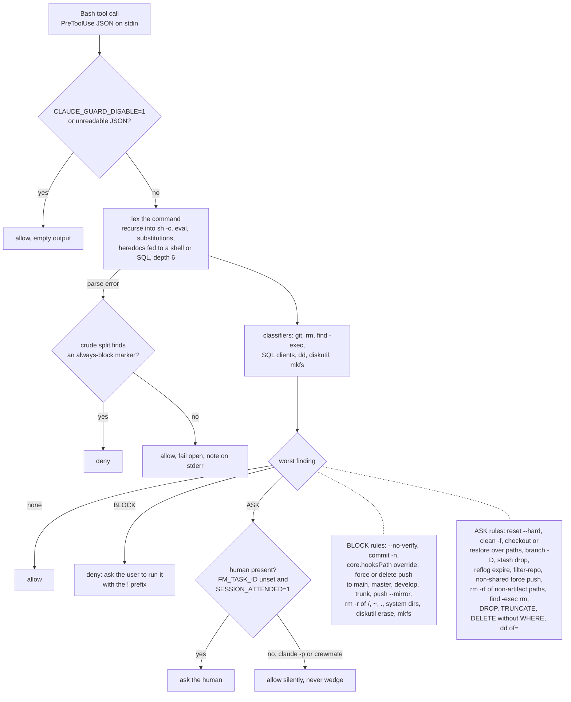

**How to explain it:**
The guard is a small bash-subset lexer, so it sees through `sh -c`, `eval`, command substitution, and a heredoc piped into a shell.
Every segment goes through classifiers, and only the worst finding counts.
Block-class commands, like skipping git hooks or force-pushing main, are denied whether or not a human is present, and the only way through is the human typing it with the `!` prefix.
Ask-class commands prompt a human at the keyboard but are allowed unattended, because a prompt nobody answers would deadlock the pipeline, and the damage is bounded by the worktree and the gate.
It fails open on parse or internal errors, except that a crude split still denies an always-block marker, and the source says plainly it is a backstop, not a sandbox.

**Evidence:** `agents/claude/hooks/guard.py:59-65` (presence), `:699-749` (push rules), `:752-792` (git ask rules), `:869-917` (rm), `:922-936` (SQL), `:953-978` (classifier dispatch, diskutil, mkfs), `:1121-1155` (fallback and decision), `:1176-1204` (kill switch, fail open), `agents/claude/settings.json` (PreToolUse on `Bash`).

## C.5 Edit-time hooks - config protection before, lint feedback after

**What it shows:** the guard's edit path and `post_edit.py`, which together stop an agent weakening a check and tell it about lint problems in the same turn.

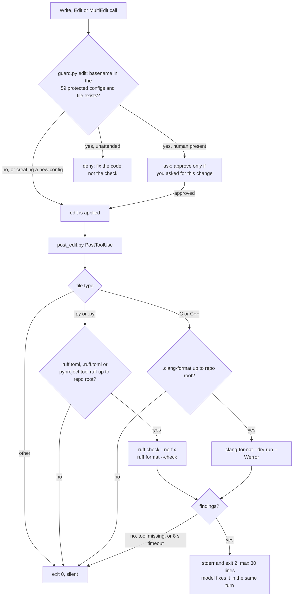

**How to explain it:**
Before an edit, the guard checks the file name against 59 lint, format, and gate config names such as `.no-mistakes.yaml`, `ruff.toml`, and `.clang-format`.
Creating a config is fine, but editing an existing one asks a human, and is denied outright when nobody is watching, because loosening the check is the classic unattended failure.
After the edit, `post_edit.py` runs only the linter the project itself configures, so it never imposes a style the repo did not choose.
Findings come back on stderr with exit 2, which Claude Code shows to the model after the edit already happened, so it is feedback, not a gate.
A missing tool, a timeout, or any internal error exits 0, so a hook bug never blocks work.

**Evidence:** `agents/claude/hooks/guard.py:1016-1085` (`PROTECTED_CONFIGS`, 59 entries counted with Python), `:1087-1105` (existing-file check), `:1158-1173` (`decide_edit`), `agents/claude/hooks/post_edit.py:38-44` (limits, suffixes), `:47-58` (config discovery), `:86-118` (ruff and clang-format), `:150-161` (exit 2, fail open).

## C.6 Defense in depth, labeled honestly

**What it shows:** the eight layers between an agent's change and `main`, each labeled enforced, default, advisory, convention, or absent, with the known holes.

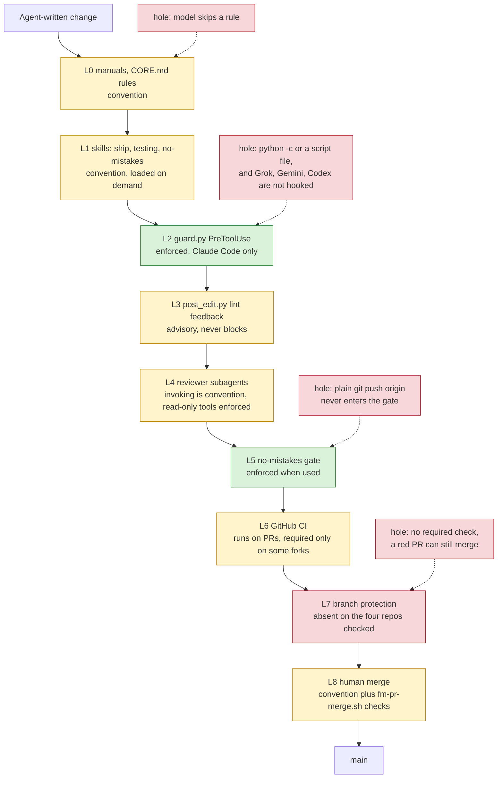

**How to explain it:**
Read it top to bottom as slices of cheese: green is a mechanical control, yellow is a default or a convention, and red is a hole or a missing layer.
The strong controls are local: the guard at the tool boundary and the no-mistakes gate before publication.
The weakest slice is the remote, because none of the four repos I checked has branch protection, so "ship only through the gate" is followed in practice but not enforced.
The guard is also scoped to Claude Code, so a different agent CLI or a `python -c` bypasses it, which is why the source calls it a backstop.
The fix I would make first is one API call per repo: require the "PR must be raised via no-mistakes" check and CI on `main`.

**Evidence:** [06 Safety](../06-Safety-and-Quality-Gates.md) sections 1 to 4 (layer status, branch protection API result on 2026-09-23), `agents/CORE.md:59` (ship rule), `agents/claude/hooks/guard.py:24-29` (backstop, not sandbox), `firstmate/.github/workflows/no-mistakes-required.yml:24` (required check name), `firstmate/bin/fm-pr-merge.sh:18` (merge preconditions).

## C.7 Reviewer subagents - fan-out and fan-in to the gate

**What it shows:** which fresh-context reviewer runs for which kind of change, what tools each has, and how their findings reach the gate.

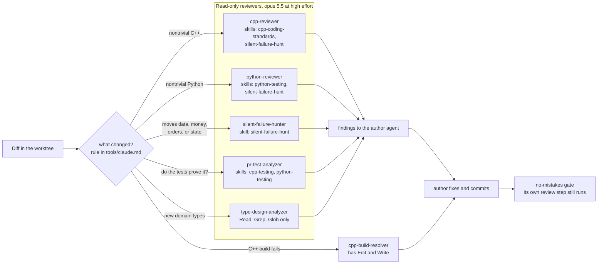

**How to explain it:**
The author agent picks reviewers by what the diff touches, following a rule in the Claude tuning file.
Each reviewer starts with a fresh context and no stake in the code, and is pinned to Opus 5.5 at high effort so reviews never spend the scarcer Fable window.
Five of the six have no Edit or Write tool, which Claude Code enforces; only the build resolver can change files.
Findings come back to the author, who fixes and commits, and the gate then runs its own independent review, because these subagents feed the gate and never replace it.
One caveat: four reviewers keep Bash, so "read-only" means no edit tools, and their shell calls still pass through the guard.

**Evidence:** `agents/tools/claude.md:28-29` (when to invoke, feed the gate), `agents/claude/agents/cpp-reviewer.md:1-10`, `python-reviewer.md:1-10`, `silent-failure-hunter.md:1-8`, `pr-test-analyzer.md:1-10`, `type-design-analyzer.md:1-6`, `cpp-build-resolver.md:1-8` (tools, model, effort, skills frontmatter).

## C.8 The RED gate for a bug fix

**What it shows:** the reproduce, failing test, fix, green sequence the testing skills require before production code changes, and where it meets the gate.

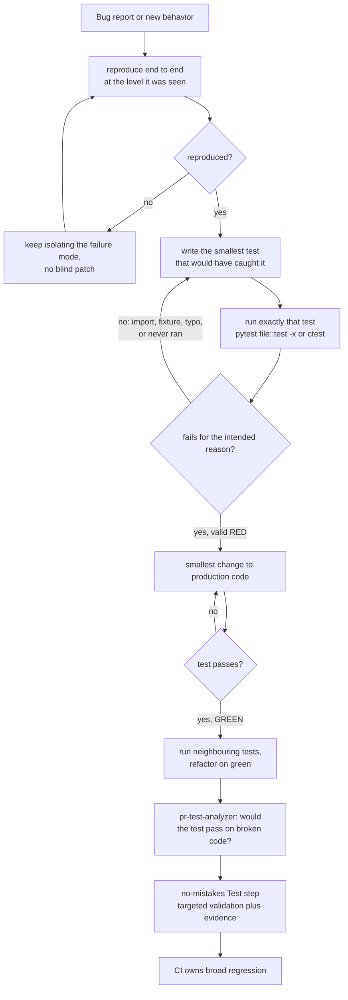

**How to explain it:**
A bug fix starts with reproducing the failure where it actually happened, a backtest, a job, or a real capture, not with editing code.
Then I pin it with the smallest test and run exactly that test, and it only counts as RED if it fails for the intended reason; a test that was never run, or fails on an import error, is not RED.
Only then does production code change, until that test turns green and the neighbours stay green.
The test analyzer asks the uncomfortable question, whether the test would still pass on broken code, and the gate's Test step re-validates against the stated intent with evidence.
Tests are never edited to make broken behavior pass unless the spec changed, which is a manual rule every agent reads.

**Evidence:** `dotfiles-nix/files/skills/python-testing/SKILL.md:13-22` (RED gate), `dotfiles-nix/files/skills/cpp-testing/SKILL.md:13-22` (runtime and compile-time RED), `agents/CORE.md:131` (reproduce end to end), `~/.agents/skills/no-mistakes/SKILL.md` (test-quality rule, fail before and pass after), `no-mistakes/docs/src/content/docs/concepts/pipeline.md` (Test step is targeted, CI owns remote validation).

## C.9 SDLC and STLC mapped onto the harness

**What it shows:** each lifecycle phase and the harness step or tool that performs it, with the STLC activities called out inside Test.

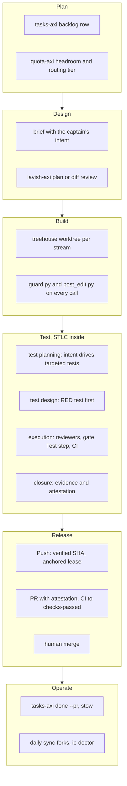

**How to explain it:**
Plan is a backlog row plus a quota check, so long runs are sized before they start.
Design is the brief, whose intent section later becomes the gate's `--intent`, plus optional visual review of a plan.
Build happens in an isolated worktree under the two hooks.
Inside Test, the STLC phases are all present: intent-driven planning, RED-first design, execution by reviewers, the gate, and CI, and closure through stored evidence and the PR attestation.
Release is the gate's Push, PR, and CI steps ending at a human merge, and Operate is closing the backlog item with the PR link and the daily fleet sync and health check.
The honest gap is formal STLC paperwork: there is no separate test plan document, traceability matrix, or UAT sign-off.

**Evidence:** `dotfiles-nix/files/skills/ship/SKILL.md:15-82` (phases 0 to 6), [03 Lifecycle](../03-End-to-End-Lifecycle.md) section 0, `no-mistakes/docs/src/content/docs/concepts/pipeline.md` (Test step, evidence), `firstmate/bin/fm-dod-lib.sh:17-19` (intent contract), [JD mapping](../interview/JD-Mapping.md) section 1 (STLC gap).

## C.10 Bank release controls mapped to harness mechanisms

**What it shows:** six controls a regulated release process expects, the mechanism that provides each, and the gap that remains.

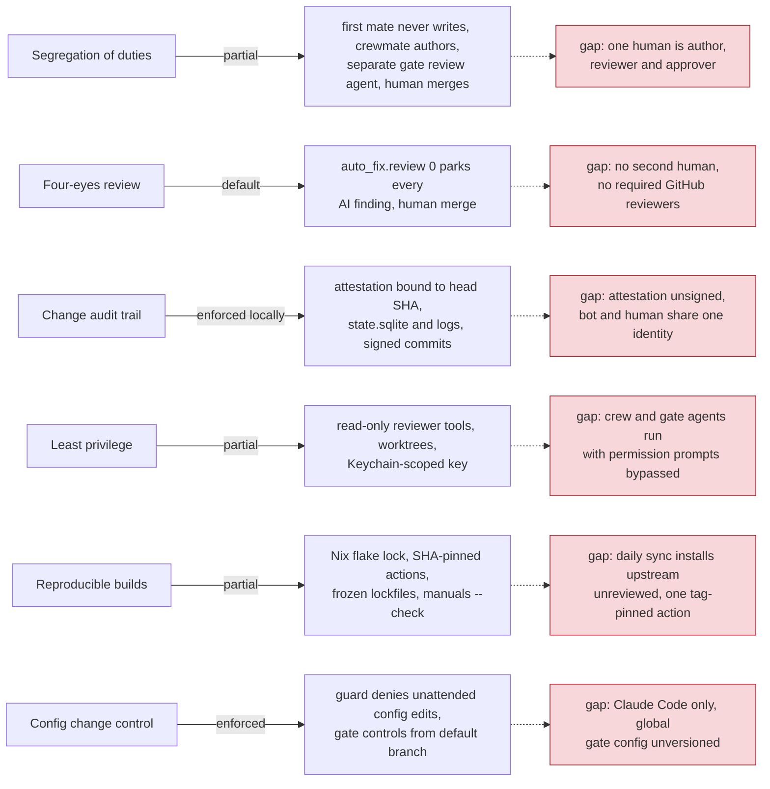

**How to explain it:**
I map each control to a concrete mechanism and then say the gap out loud, because an auditor trusts a named gap more than a clean slide.
Segregation of duties is structural: the supervisor cannot write code, a separate agent reviews, and a human merges, but on personal repos one person holds every human role.
The audit trail is the strongest: every PR carries an attestation bound to its head SHA, plus the local run database and signed commits, although the attestation is plain text rather than a signature.
Least privilege is the weakest, because unattended agents run with permission prompts bypassed and rely on the worktree and the gate instead.
Reproducibility comes from the Nix lock, pinned actions, and frozen lockfiles, with the daily unreviewed upstream sync as the known exception.

**Evidence:** [06 Safety](../06-Safety-and-Quality-Gates.md) sections 5, 8, and 9 (control table and gaps), `dotfiles-nix/flake.lock` (exists), `.fleet/manifest.yaml:19` (`--frozen-lockfile`), `.fleet/.github/workflows/fleet-sync.yml:19` (`actions/checkout@v4` by tag), `agents/.github/workflows/ci.yml` (SHA-pinned checkout, `build-manuals --check`), `no-mistakes/docs/src/content/docs/reference/repo-config.md:8-13` (trusted default-branch config).

## C.11 Secret handling - one key, one process, never global

**What it shows:** how the single harness API key travels from the Keychain into one interactive process, and which launches never receive it.

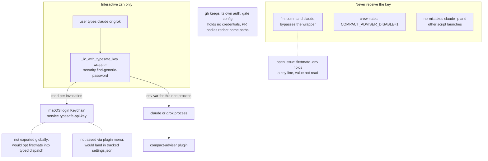

**How to explain it:**
There is exactly one harness key on the interactive path, and it lives in the login Keychain, not in a dotfile or an environment export.
A zsh wrapper reads it on each `claude` or `grok` invocation and sets it only in that child process's environment.
It is deliberately not global, because firstmate switches into typed dispatch when that variable is present, and saving it through the plugin menu would commit it into a tracked settings file.
The first mate, every crewmate, and every gate agent start without the key, since `command claude` and script launches skip shell functions and crew launches also export a disable flag.
The one open item is a key line in the firstmate `.env` file, which I found during this audit and did not read.

**Evidence:** `dotfiles-nix/files/zsh/ic-workflow.zsh:528-549` (wrapper and rationale), `:518-526` (`firstmate` uses `command`), `firstmate/bin/fm-spawn.sh:4727` (`COMPACT_ADVISER_DISABLE=1`), `dotfiles-nix/README.md:311-314`, [06 Safety](../06-Safety-and-Quality-Gates.md) section 7 (open `.env` issue, `gh` auth, home-path redaction).

## C.12 Prompt-injection threat model

**What it shows:** the untrusted inputs that reach an agent's context, the control at each input, and the action-side controls that bound what an injected instruction can do.

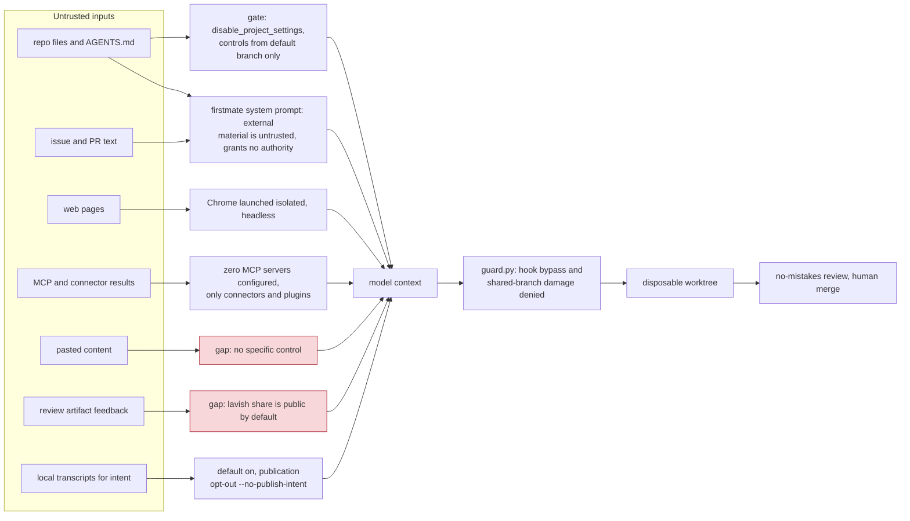

**How to explain it:**
I assume anything that did not come from me or the supervisor can carry instructions: repo files, issue text, web pages, tool results, pasted text, and review feedback.
Input-side controls are mostly prompt-level, like the firstmate system prompt that marks external material untrusted, plus a few mechanical ones, like gate settings read only from the default branch so a feature branch cannot rewrite its own gate.
Two inputs have no real control, pasted content and publicly shared review artifacts, and I say so.
So the design leans on the action side: whatever the model was told, the guard still denies hook bypass and shared-branch damage, work happens in a throwaway worktree, and nothing lands without the gate and a human merge.
The trade-off is that prompt-level trust rules are requests, not controls, which is why the mechanical layers sit behind them.

**Evidence:** `firstmate/bin/fm-spawn.sh:1857` (untrusted-content system prompt), `firstmate/.no-mistakes.yaml:3-10` (`disable_project_settings`), `no-mistakes/docs/src/content/docs/reference/repo-config.md:8-13` (default-branch config), `chrome-devtools-axi/src/bridge.ts:700-703` (isolated, headless), `lavish-axi/README.md:190-191` (public share), [06 Safety](../06-Safety-and-Quality-Gates.md) section 6 (full surface table), [claude-code-config](../components/claude-code-config.md) (zero MCP servers).

## C.13 PROPOSAL - the same gate as an AWS pipeline

**What it shows:** a proposed, not implemented, CDK-defined CodePipeline that reproduces the gate's controls for a team setting.

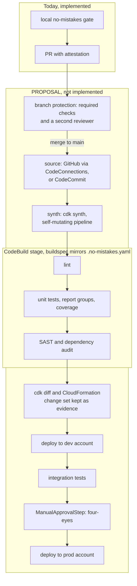

**How to explain it:**
This is a proposal to show the control design carries over; I have not built CDK, CloudFormation, or CodeBuild in this harness.
The local gate stays where it is, and branch protection closes today's biggest gap by making the gate's check and a second human reviewer required before merge.
The pipeline itself is defined in CDK and self-mutating, so a change to the pipeline goes through the same review as application code.
CodeBuild runs the same lint and test commands the gate's repo config declares, plus report groups for coverage and a security scan.
The `cdk diff` output and the CloudFormation change set play the attestation's role as evidence, and a manual approval before production, in a separate account, is the four-eyes control.

**Evidence:** [JD mapping](../interview/JD-Mapping.md) section 4 (bridge plan and the `git grep` showing no AWS code today), [Cheat sheet](../interview/Cheat-Sheet.md) (CDK Pipelines bridge line), [08 Design principles](../08-Design-Principles-and-Tradeoffs.md) section 4 (stated gap), `SDE-Interview-Prep/.no-mistakes.yaml:4-6` (commands a buildspec would mirror).
