# Diagram Atlas D - Tools, configuration, and fleet

Fourteen diagrams of the AXI tool layer, quota-driven routing, the configuration plane, fleet operations, and the apps, each drawn to complement (not repeat) the diagrams already in notes 01, 04, 05, 07 and the component notes.

## D.1 Anatomy of one AXI call, contrasted with an MCP tool call

**What it shows:** the full path of `gh-axi pr list` through the shared `axi-sdk-js` runtime, next to the MCP pattern it replaces.

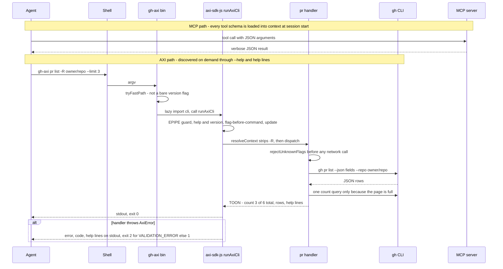

**How to explain it:**
The top two arrows are the MCP pattern: the agent pays for every tool schema up front and gets verbose JSON back.
The AXI path is a plain shell command, so the agent only learns what it asks for, and the answer is TOON with a length marker, a pre-computed total, and next-step hints.
Everything in the SDK lane is shared code: `gh-axi`, `chrome-devtools-axi`, `lavish-axi`, `tasks-axi`, and `quota-axi` all call the same `runAxiCli`, so exit codes, the error shape, `--version`, and `update` cannot drift between tools.
Unknown flags are rejected with exit 2 before any network call, which turns a silently ignored typo into a loud failure.
Upstream's GitHub benchmark put this path at 100% success and $0.050 per task versus 87% and $0.148 for the GitHub MCP server; those are upstream numbers I did not re-run.

**Evidence:** `gh-axi/bin/gh-axi.ts:5-7`, `axi/packages/axi-sdk-js/src/cli.ts:80-160`, `gh-axi/src/cli.ts:136`, `gh-axi/src/commands/pr.ts:422-453`, `axi/packages/axi-sdk-js/src/errors.ts:1-18`, `axi/README.md:37-45`, [axi](../components/axi.md) sections 4 and 7, [gh-axi](../components/gh-axi.md) section 7.

## D.2 quota-axi data pipeline, from local credentials to consumers

**What it shows:** how quota-axi turns credentials that already exist on the Mac into per-scope evidence, and who reads that evidence.

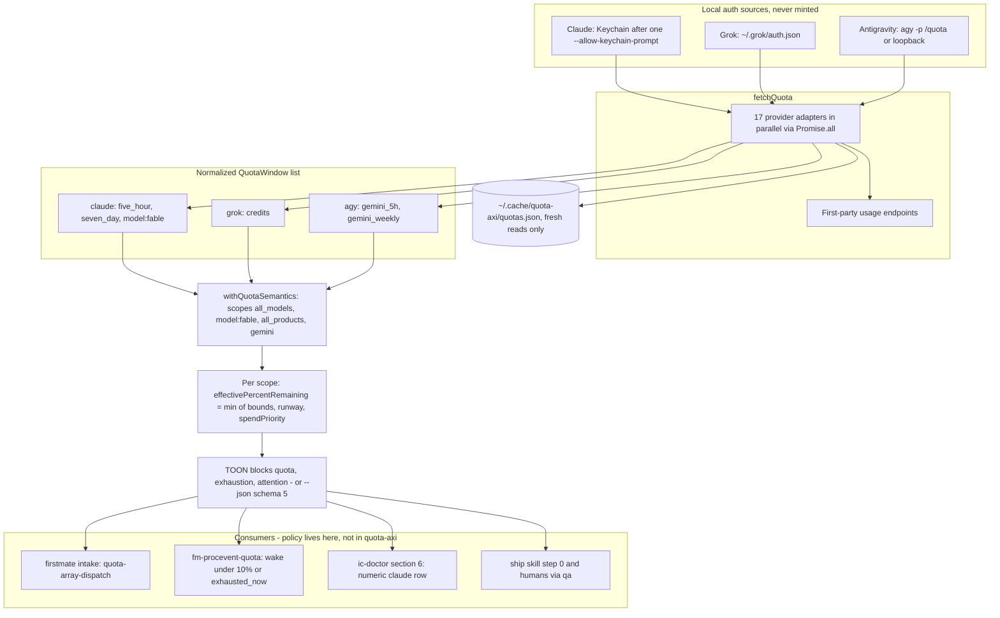

**How to explain it:**
quota-axi has no API keys of its own; it reads whatever the vendor CLIs already stored and calls only the first-party endpoint each credential authenticates.
Every vendor is normalized into the same window shape, then a per-provider semantics layer says which windows jointly bound which scope, for example Claude `all_models` is bounded by both the five-hour and the seven-day window.
A scope is only as available as its tightest bound, so effective remaining is the minimum, and runway and `spendPriority` are computed from the same bounds.
The output is deliberately data-only: rows stay in provider order so nothing reads as a ranking, and every provider without a measured row appears in `attention` so it can never be silently absent.
All routing decisions happen in the consumers at the bottom, which is the same separation as a risk-limit service that never routes orders itself.

**Evidence:** `quota-axi/src/commands.ts:221-233`, `:337-352`, `quota-axi/src/providers/claude.ts:1047-1089`, `quota-axi/src/interpretation.ts:461-496`, `:553-584`, `:840-856`, `:895-930`, `quota-axi/src/render.ts:30-34`, `:169-218`, `quota-axi/README.md:761-768`, `firstmate/bin/fm-procevent-quota.sh:11-17`, `dotfiles-nix/files/bin/ic-doctor:224-242`, [quota-axi](../components/quota-axi.md).

## D.3 From a window to a dispatch pick: spendPriority, runway, and the tier rules

**What it shows:** the exact per-window arithmetic in quota-axi, and where `crew-dispatch.json` uses or deliberately ignores it.

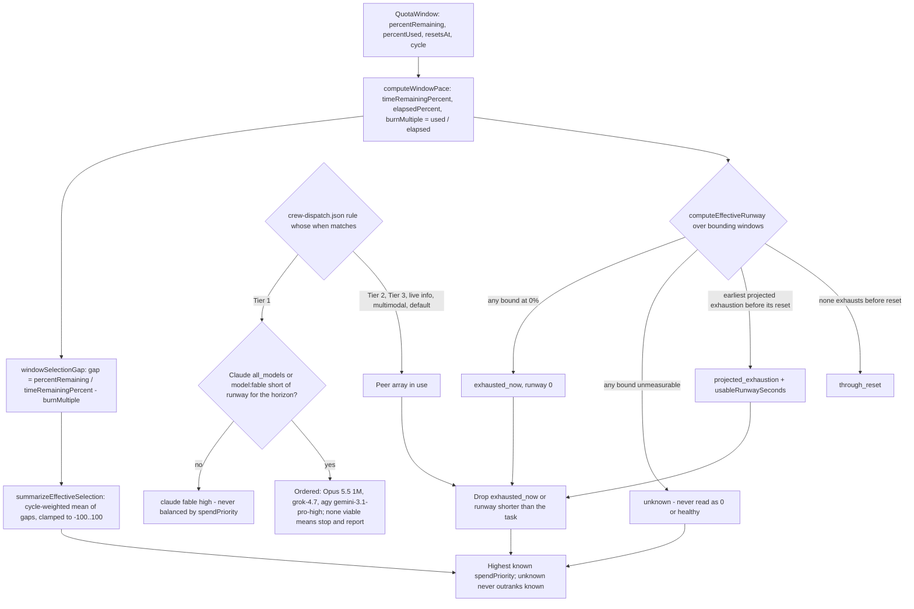

**How to explain it:**
Per window, the gap is how much allowance is on track to reach reset unused per point of remaining time, so positive means spend here or lose it.
The scope value weights each gap by cycle length, which stops a five-hour window from swamping a weekly one; on the real 2026-09-23 snapshot that gave 0.3399 for Claude `all_models`, 1.1516 for `model:fable`, and -6.2834 for exhausted Grok credits.
Runway is a separate question: the same snapshot was limited to 54% by the weekly window but ran out of runway first on the five-hour window, so a long task must be gated on runway before any score is compared.
On the policy side, every rule in `crew-dispatch.json` is a `when`, `use`, `why` triple, and Tier 1 uses a single model or an ordered fallback, never the score.
Only the peer arrays reach the argmax, and an `unknown` score, which is every `agy` row today, keeps a candidate eligible but can never beat a peer with known evidence.

**Evidence:** `quota-axi/src/pace.ts:48-102`, `:107-246`, `:324-360`, `:363-382`, `firstmate/config/crew-dispatch.json:1-57`, `firstmate/.agents/skills/quota-array-dispatch/SKILL.md:58-134`, `agents/ROUTING.md:17-19`, [04 Model routing and quota](../04-Model-Routing-and-Quota.md) section 5.

## D.4 tasks-axi backlog data model and the ready queue

**What it shows:** the types behind one `backlog.md` row, which states are stored versus derived, and the predicate that decides what is dispatchable.

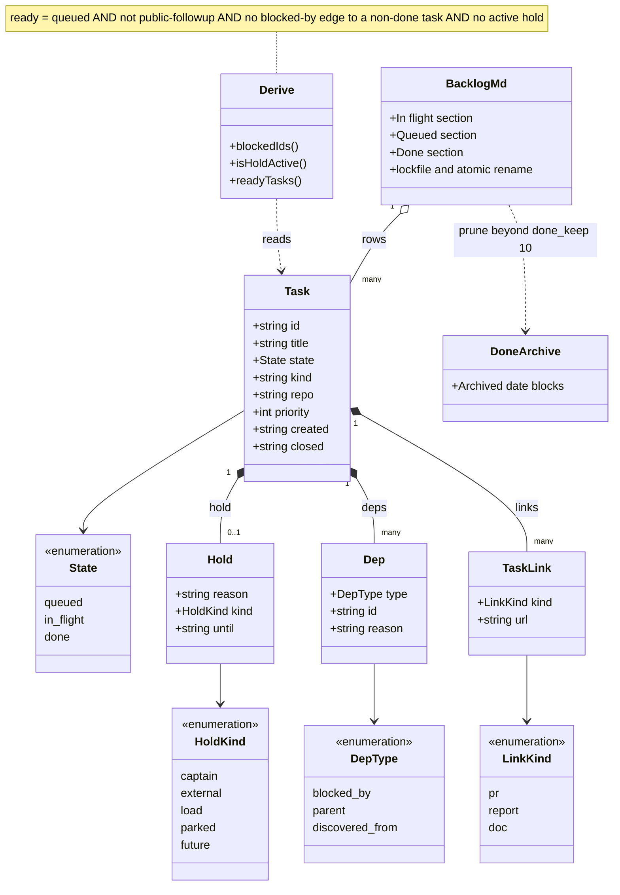

**How to explain it:**
A task stores only three states, and the section header in the Markdown file carries that state, not the bullet style.
Blocked and held are never stored: they are projections computed from dependency edges and structured holds, so they cannot drift from the data.
Only the `blocked-by` edge type gates readiness, a hold with an `until` date expires on that date, and `done --pr` stores a validated PR link that renders the row as merged.
Every write goes through a lockfile, a compare-before-write check, and a temp-file rename, and every mutation is idempotent, which is what lets firstmate replay a `done` after a crash.
In the code the dependency types are spelled `blocked-by` and `discovered-from`; the diagram uses underscores only because class diagram enums cannot contain hyphens.

**Evidence:** `tasks-axi/src/model.ts:12-90`, `tasks-axi/src/derive.ts:35-81`, `tasks-axi/src/backends/markdown.ts:68-70`, `:481-493`, `tasks-axi/src/backends/lock.ts:108-158`, `tasks-axi/src/pr-url.ts:16-31`, `tasks-axi/src/config.ts:45`, `firstmate/bin/fm-backlog-transition-lib.sh:40-51`, [tasks-axi](../components/tasks-axi.md) sections 3 and 7.

## D.5 lavish-axi review loop as run by a firstmate scout

**What it shows:** how a blocking human-review poll becomes a durable, classified event source so the agent is woken only when the captain actually said something.

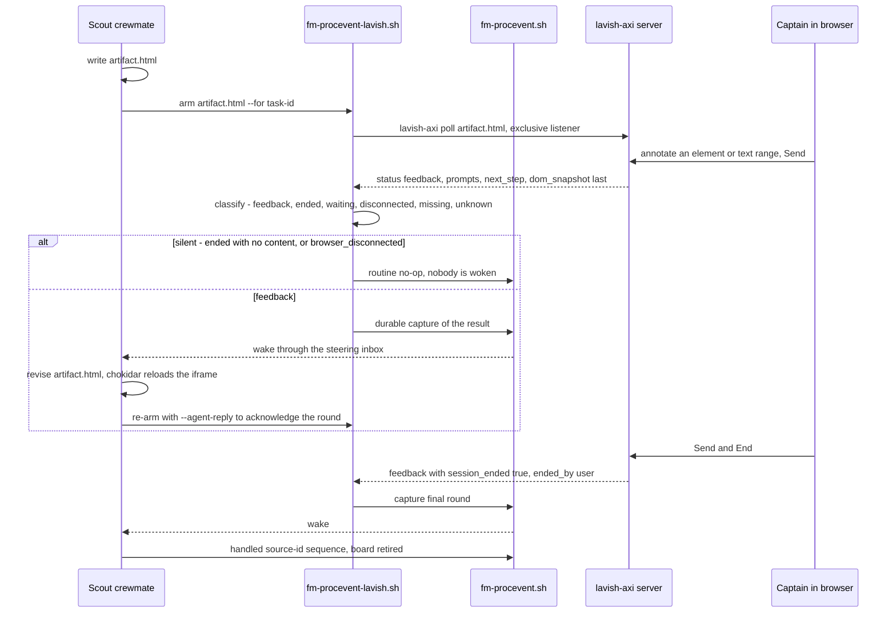

**How to explain it:**
A scout never runs `lavish-axi poll` itself; it arms an adapter, because a foreground poll would occupy its turn and a background one would be fire-and-forget.
The server holds the captain's notes in a durable queue keyed by the artifact path, and the poll takes the whole batch atomically, putting it back if the poll dies mid-delivery.
The adapter classifies every result, and its `silent` verdict suppresses the most common non-event, a board closed with nothing said, so nobody is woken for it.
Real feedback is captured durably and delivered through the scout's steering inbox; the scout revises the HTML, the browser reloads it, and the re-arm carries a reply so the captain sees the round was acknowledged.
The loop ends only on an explicit end from the captain, which is the same "explicit, auditable outcome" rule a four-eyes approval step needs.

**Evidence:** `firstmate/bin/fm-brief.sh:403-407`, `firstmate/bin/fm-procevent-lavish.sh:1-80`, `:398-400`, `lavish-axi/src/server.js:808`, `:867`, `:908`, `lavish-axi/src/session-store.js:594-651`, `lavish-axi/src/cli.js:535-584`, `lavish-axi/AGENTS.md:93-96`, [lavish-axi](../components/lavish-axi.md) sections 6 and 7.

## D.6 chrome-devtools-axi open, then click by generation-stamped ref

**What it shows:** the process chain from a short-lived CLI to Chrome, and how a stale element ref fails loudly instead of clicking the wrong thing.

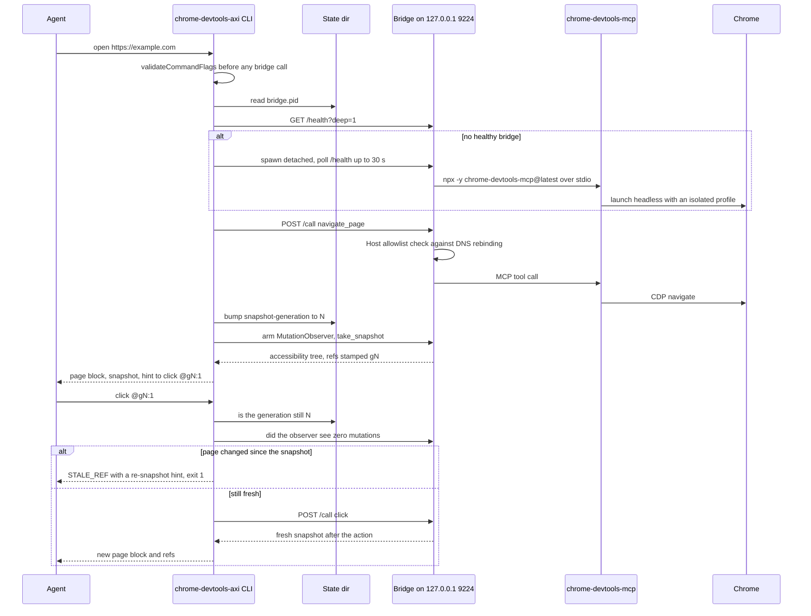

**How to explain it:**
Each command is a new short-lived process, so anything that must survive between agent turns lives either in the detached bridge or in a small state directory.
The bridge holds one MCP session and one Chrome, which removes a browser relaunch per command, and a deep health probe recycles a bridge whose browser died.
Every snapshot bumps a persisted generation counter and stamps it into the refs, and a page MutationObserver proves nothing changed before an action runs.
That is optimistic concurrency applied to the DOM: act only on the version you read, or fail with a specific error and a one-step recovery.
The same pattern matters on a trading UI where websocket ticks re-render rows constantly and a naive locator can click a different row than the one the agent read.

**Evidence:** `chrome-devtools-axi/src/cli.ts:999-1066`, `:1704`, `:1775-1792`, `chrome-devtools-axi/src/client.ts:336-353`, `:457`, `:711-730`, `chrome-devtools-axi/src/bridge.ts:1-17`, `:510-523`, `:651-713`, `:870-881`, `chrome-devtools-axi/src/uid-freshness.ts:16-60`, `chrome-devtools-axi/src/generation.ts:18-20`, [chrome-devtools-axi](../components/chrome-devtools-axi.md) sections 3 and 7.

## D.7 gh-axi command surface

**What it shows:** the 16 command families in `gh-axi` v0.1.35 grouped by purpose, with subcommand counts from each `--help`.

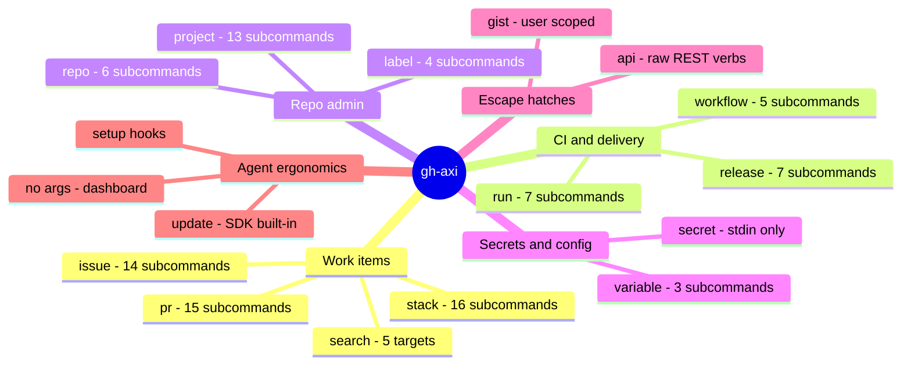

**How to explain it:**
`gh-axi` is a thin adapter over the official `gh` CLI, so auth, Enterprise hosts, and pagination stay with the vetted client and the wrapper only owns validation and presentation.
The work-items branch is where agents live: `pr` alone has 15 subcommands, and `pr merge --match-head-commit` refuses to merge if the head moved after review.
`secret set` reads its value only from stdin, so a secret never appears in argv or `ps` output, and values are never printed.
`stack` is a strict adapter over the `gh-stack` extension that forces non-interactive flags, because a prompt would hang an agent's shell.
Running it with no arguments shows live state, not a manual, which is AXI principle 8.

**Evidence:** `gh-axi --help` captured 2026-09-23, `gh-axi/src/cli.ts:31-311`, `:292-308`, `gh-axi/src/gh.ts:178-191`, `gh-axi/AGENTS.md:42-46`, `:113-114`, [gh-axi](../components/gh-axi.md) section 4.

## D.8 compact-adviser gate chain and its hook wiring

**What it shows:** every gate between a Claude Code turn ending and a compaction hint, including the harness wiring that turns the plugin off for unattended agents.

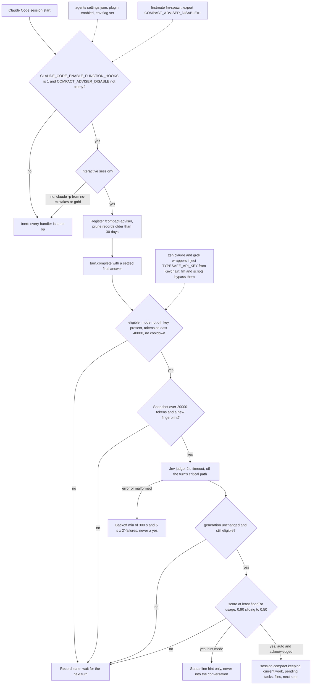

**How to explain it:**
The dotted edges are my wiring: the settings file in the agents repo enables the plugin, a zsh wrapper hands the API key only to interactive `claude` and `grok`, and firstmate exports the kill switch into every crewmate.
The key is deliberately never exported globally, because firstmate opts into typed dispatch whenever that variable exists, and the `fm` launcher uses `command claude`, so the first mate itself never gets it.
Inside the plugin, cheap local gates run first, and the network judgment is scheduled after the turn so the user never waits on it.
A generation counter is checked after the network call and right before acting, so a judgment about an old turn can never compact a new one.
The floor slides from 0.90 to 0.50 as the context fills, trading precision early for recall late, and any judge error backs off rather than counting as a yes.

**Evidence:** `compact-adviser/packages/claude-mod/hooks/register.ts:113-125`, `:217-275`, `:312-393`, `:693-739`, `compact-adviser/packages/claude-mod/lib/judge.ts:9`, `:187-251`, `compact-adviser/packages/claude-mod/lib/state.ts:77-106`, `agents/claude/settings.json:2-4`, `:41-53`, `dotfiles-nix/files/zsh/ic-workflow.zsh:518-550`, `firstmate/bin/fm-spawn.sh:4674-4689`, [compact-adviser](../components/compact-adviser.md).

## D.9 agents repo: build-manuals pipeline and its drift checks

**What it shows:** the control flow of `bin/build-manuals` in build and `--check` modes, and the three places the drift check runs.

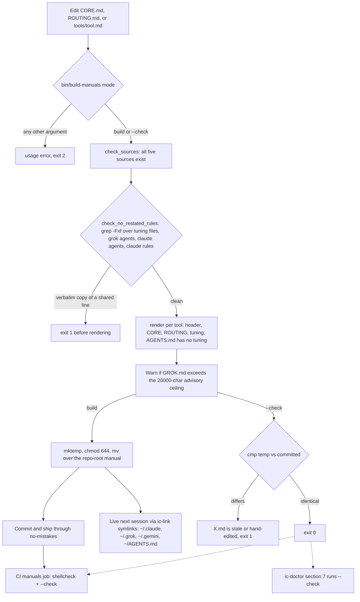

**How to explain it:**
Shared rules exist exactly once, in `CORE.md` and `ROUTING.md`, and each tool gets a thin additive tuning file.
Before anything renders, a verbatim-duplicate check refuses any tuning file, subagent, or rule that copies a shared line, because a copied rule is where two tools start to disagree.
The generated manuals are committed, so the drift check is a byte comparison rather than a heuristic, and it runs in CI and again on the live machine inside `ic-doctor`.
Because every tool's home points at these files through symlinks, a merged rule change is live in the next session with no install step.
The honest limit is written in the script itself: paraphrased duplicates are not caught mechanically and remain a review responsibility.

**Evidence:** `agents/bin/build-manuals:36-62`, `:73-90`, `:106-148`, `agents/.github/workflows/ci.yml:17-32`, `dotfiles-nix/files/bin/ic-doctor:488-494`, `dotfiles-nix/files/bin/ic-link:103-175`, [agents](../components/agents.md) sections 4 and 7.

## D.10 dotfiles-nix: fresh-Mac bring-up, the zsh entry points, and what ic-doctor proves

**What it shows:** the runbook steps on a new Mac, the shell functions they install, and which read-only doctor section verifies each result.

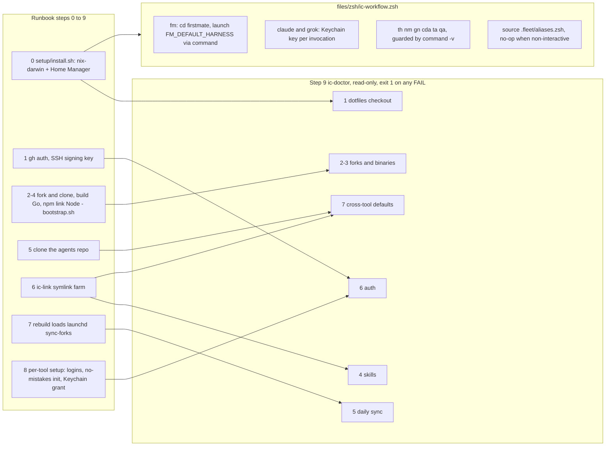

**How to explain it:**
The flake declares the machine, but the harness tools are forks built from source, so bring-up is a fixed ordered runbook rather than a single package install.
Home Manager installs the zsh layer, which is where the human entry points live: `fm` to start the first mate, the Keychain wrappers that scope one API key to two commands, and tool aliases that only exist if the binary does.
Generated fleet aliases return immediately in non-interactive shells, so agents never inherit them.
Every step has a matching read-only doctor section, so the last step of the runbook proves the first eight rather than trusting that they ran.
The doctor's result on 2026-09-23 was exit 0 with 67 `ok` lines and one warning for an uncommitted change in the agents repo.

**Evidence:** `dotfiles-nix/README.md:383-555`, `dotfiles-nix/files/zsh/ic-workflow.zsh:504-558`, `dotfiles-nix/files/bin/ic-doctor:57-508`, `.fleet/bootstrap.sh:1-11`, `.fleet/aliases.zsh:5`, [dotfiles-nix](../components/dotfiles-nix.md) sections 3 and 4.

## D.11 sync-forks: the per-repo decision at 10:00

**What it shows:** every branch a fork can take in the daily fast-forward-only sync, and the separate manual path for repos marked `sync: false`.

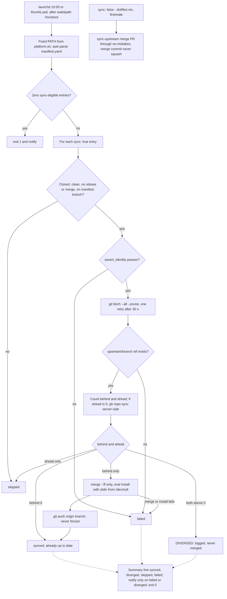

**How to explain it:**
The policy is that forks stay pristine mirrors, so the only automatic write is a fast-forward followed by a normal push.
A fork with local commits is never merged automatically: ahead-only work is left unpublished, and a truly diverged fork is reported for a human, which is how wheelhouse shows up as skipped every day.
The server-side `gh repo sync` runs only when ahead is zero, so it can never move a branch out from under unpushed local work.
Repos that deliberately carry commits are marked `sync: false` and take upstream through a reviewed merge-commit PR, because a squash drops the merge parent and the fork would read as diverged forever.
The honest gap is observability: the job exits 0 even when repos fail, so the real success signal is the summary line that `fleet-doctor` parses.

**Evidence:** `dotfiles-nix/files/bin/sync-forks:31-47`, `:97-119`, `:125-139`, `:141-262`, `dotfiles-nix/nix/home/darwin.nix:79-96`, `dotfiles-nix/AGENTS.md:37-45`, `.fleet/manifest.yaml:38-39`, `:293-294`, `.fleet/doctor.sh:132-151`, `.fleet/logs/sync-20260923.log`, [07 Fleet operations](../07-Fleet-Operations.md) sections 5 and 6.

## D.12 fleet-ops manifest entry and which script reads which key

**What it shows:** the schema of one manifest entry and the exact keys each consumer parses, which also shows which keys are documentation only.

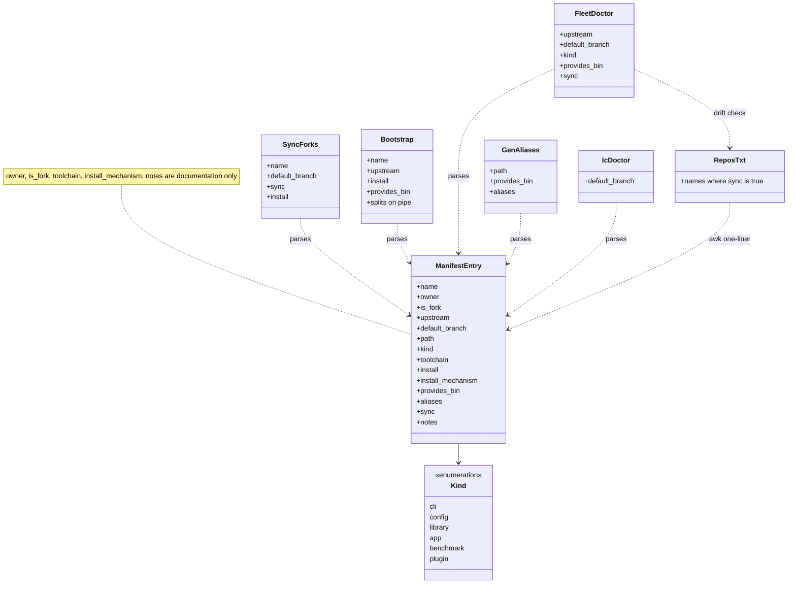

**How to explain it:**
Twenty-two forks are declared once, and five consumers read the same flat YAML with line-oriented awk, so the launchd job needs no YAML library under its minimal `PATH`.
Reading the diagram right to left answers a real review question: which script breaks if I rename a key.
`bootstrap.sh` splits its awk output on a pipe character, so an `install` string must never contain one, which the no-mistakes review step actually caught when compact-adviser was added.
Only `kind: cli` entries are smoke-tested by the fleet doctor, because running a script to smoke-test it would execute it.
`repos.txt` is the server-side copy of the `sync: true` names, and the doctor fails if it drifts from the manifest.

**Evidence:** `.fleet/manifest.yaml:5-9`, `:337`, `.fleet/bootstrap.sh:28-48`, `.fleet/doctor.sh:38-43`, `:119-130`, `:196-198`, `.fleet/gen-aliases.sh:21-29`, `dotfiles-nix/files/bin/sync-forks:60-80`, `dotfiles-nix/files/bin/ic-doctor:114-124`, [fleet-ops](../components/fleet-ops.md) section 3.

## D.13 Skills catalog grouped by purpose

**What it shows:** the 31 installed skills in `~/.agents/skills`, grouped by what they are for.

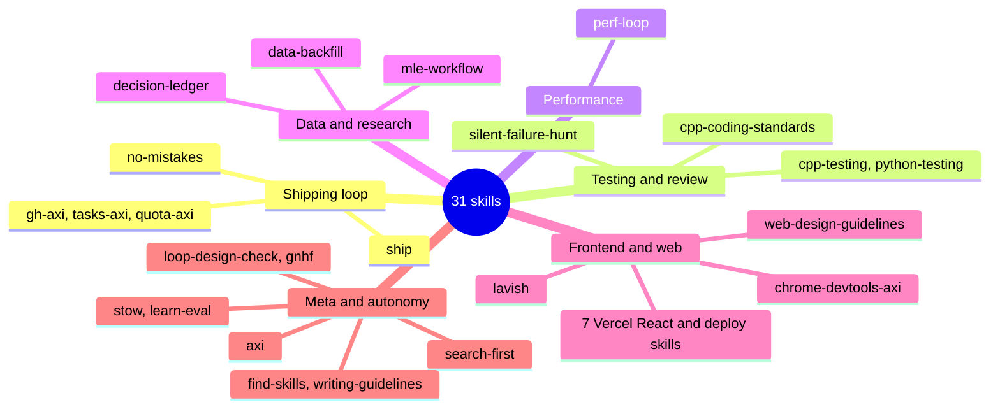

**How to explain it:**
A skill is a `SKILL.md` whose description is its trigger, so only the frontmatter costs context until the task matches.
The shipping loop is the spine: `ship` sequences quota check, backlog, worktree, implementation, the no-mistakes gate, and recording the PR.
The testing, performance, and data skills are my rewrites of MIT-licensed ECC material tuned for C++ and Python quant work, and the tool skills come from the forks and deliberately defer to the live CLI's `--help` so they cannot go stale.
The frontend group is the one closest to this role: `chrome-devtools-axi` verifies a change in a real browser, and the Vercel React skills are third-party installs.
`ic-doctor` verifies the 21 harness skills structurally in every tool's skill directory; the 10 third-party ones are not mirrored to Codex or Grok and are not checked.

**Evidence:** `~/.agents/skills/*/SKILL.md` frontmatter, `dotfiles-nix/files/skills/THIRD_PARTY_NOTICES.md:1-20`, `dotfiles-nix/files/bin/ic-link:60-95`, `dotfiles-nix/files/bin/ic-doctor:46`, `:172-179`, `~/.agents/.skill-lock.json`, [skills catalog](../components/skills-catalog.md).

## D.14 Apps and benchmarks by stack, and what the benchmarks measure

**What it shows:** the nine app and benchmark forks grouped by the stack their `package.json` or HTML actually declares, and the harness piece each one touches.

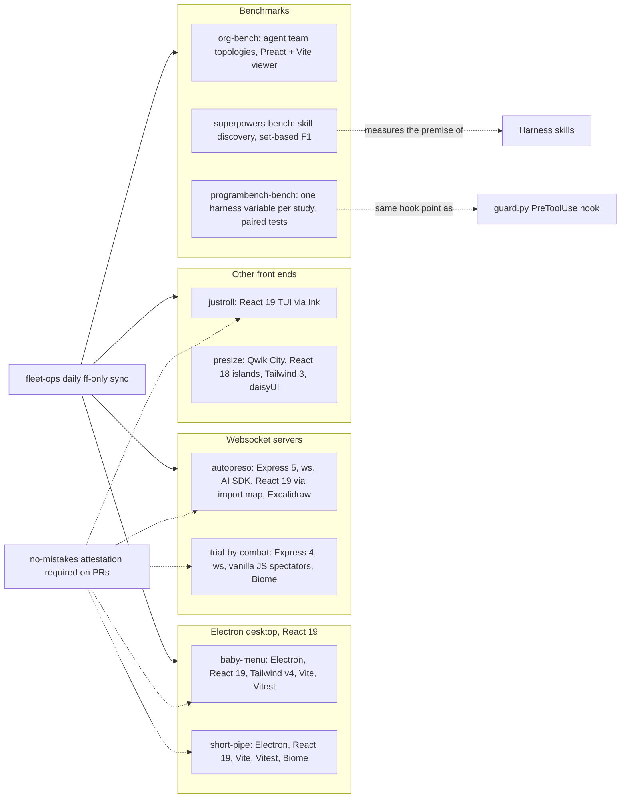

**How to explain it:**
All nine are upstream projects I track, run, and test, not code I wrote, and the stack labels come from their dependency manifests and one HTML import map.
The Electron pair is the closest analogue to an OpenFin trading desktop: main, preload, and renderer separation with context isolation and a typed IPC bridge.
The websocket pair is where I would ground a streaming discussion, and the gap to name is that neither has sequence numbers or snapshot-plus-delta replay, which a market-data feed needs.
Five of the apps require a no-mistakes pipeline attestation on every human PR, the automated analogue of a release-compliance check.
The benchmarks keep my harness choices honest: org-bench compares team topologies, superpowers-bench tests whether agents discover skills from descriptions, and programbench-bench A/B tests one harness variable at a time with n = 192 paired tasks.

**Evidence:** `baby-menu/package.json:44-59`, `short-pipe/package.json:51-62`, `autopreso/package.json:51-53`, `autopreso/public/index.html:12-16`, `trial-by-combat/src/server.js:130`, `justroll/package.json:55-56`, `presize/apps/web/package.json:8-30`, `org-bench/AGENTS.md:3`, `superpowers-bench/src/grader.ts:11`, `programbench-bench/README.md:25-41`, `baby-menu/.github/workflows/no-mistakes-required.yml:58`, [apps and benchmarks overview](../components/apps-and-benchmarks-overview.md).
