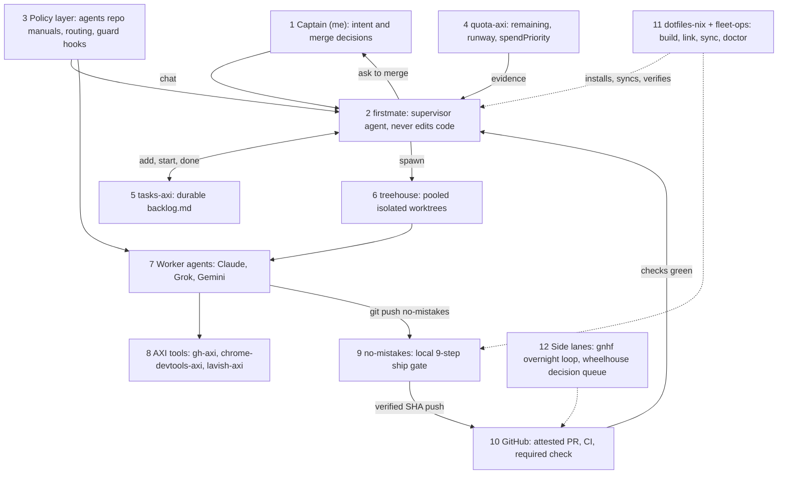

# Pitches - the agentic harness in 30 seconds, 2 minutes, and 10 minutes

All three pitches are built around one whiteboard of at most 12 boxes.
They are written to be spoken aloud: short sentences, one idea each, numbers you can defend.
Every number used here is listed with its source in [Cheat-Sheet](Cheat-Sheet.md), and the stories are in [STAR-Stories](STAR-Stories.md).

## Ground rules before you speak

- Say who built what in the first minute: the tools are mostly open-source forks (upstream author Kun Chen, `kunchenguid/*`); the policy, integration, and operations are mine.
- Never say "I wrote firstmate" or "I wrote no-mistakes"; say "I run it, configure it, patched it, and gate everything through it".
- My own code: `agents` (manual generator, guard and post-edit hooks adapted from ECC, routing policy), `dotfiles-nix` fork additions (`ic-link`, `ic-doctor`, `sync-forks`, Linux and WSL support, tests, CI), `fleet-ops` (manifest, bootstrap, doctor, server-side sync), and six firstmate fork commits (see [firstmate](../components/firstmate.md) section 10).
- Tie each architectural idea to a bank concept: gate = release control, attestation = audit evidence, quota routing = limit checks, ff-only sync = golden-source reference data.

## The whiteboard (12 boxes)

Draw it top to bottom in this order while talking; the numbers are the order you draw them.



ASCII version for a physical whiteboard:

```text
                      +----------------+
                      | 1 Captain (me) |  intent, merge decisions
                      +-------+--------+
                              | chat
 +---------------+    +-------v--------+    +---------------+
 | 3 Policy      |--->| 2 firstmate    |<---| 4 quota-axi   |
 | manuals,      |    | supervisor     |    | runway,       |
 | routing,guard |    | never edits    |    | spendPriority |
 +-------+-------+    +--+----+-----+--+    +---------------+
         |               |    |     |
         |      +--------+    |     +----------+
         |      v             v                v
         | +----------+ +-------------+ +--------------+
         | |5 tasks-  | | 6 treehouse | |12 gnhf loop, |
         | |axi       | | worktree    | |wheelhouse    |
         | |backlog   | | pool        | |queue         |
         | +----------+ +------+------+ +--------------+
         |                     v
         |              +-------------+    +---------------+
         +------------->| 7 Workers   |--->| 8 AXI tools   |
                        | Claude,Grok,|    | gh, browser,  |
                        | Gemini      |    | review        |
                        +------+------+    +---------------+
                               | git push no-mistakes
                        +------v------+
                        | 9 no-mistakes|  intent rebase review test
                        | gate         |  document lint push pr ci
                        +------+------+
                               | verified SHA + attestation
                        +------v------+
                        | 10 GitHub   |  PR, CI, required check
                        +-------------+
 [11 dotfiles-nix + fleet-ops: Nix flake, 22-fork manifest, daily ff-only sync, doctors]
```

What each arrow means, in one line each, if asked:

- 1 to 2: I talk only to the supervisor; workers never address me (`firstmate/AGENTS.md:38-40`).
- 3 to 2 and 7: one rule source compiled into every tool's manual, plus a PreToolUse guard on every shell call (`agents/bin/build-manuals:27-62`, `agents/claude/hooks/guard.py:59-65`).
- 4 to 2: quota evidence only; the tool never picks a model (`quota-axi/README.md:685`).
- 2 to 5: every dispatched task must have a backlog row (`firstmate/bin/fm-spawn.sh:3106-3112`).
- 2 to 6 to 7: each task runs in its own worktree at detached HEAD (`firstmate/bin/fm-spawn.sh:3843-3902`).
- 7 to 9 to 10: the only path to GitHub is the gate, and the push is an exact verified SHA (`no-mistakes/internal/pipeline/steps/push.go:170-205`).
- 11: the machine and the fleet are code, rebuilt and verified by doctors (`dotfiles-nix/files/bin/ic-doctor:503-508`, `.fleet/doctor.sh:215`).

## 30-second pitch

> I run a personal agentic engineering harness.
> One supervisor agent takes my intent, routes each task to the right model by task class and live quota, and runs worker agents in isolated git worktrees.
> Nothing reaches GitHub except through a local gate that reviews, tests, documents, lints, and attests every change before it opens the PR.
> The components are mostly open-source tools I forked; what I built is the policy and operations layer around them.
> That is the routing policy, a generator that compiles one rulebook into every AI tool's manual, a destructive-command guard hook with 51 tests, and Nix plus a manifest that rebuilds and syncs 22 forks.
> Across 228 changes in 17 repos, the gate caught and fixed a mistake in 58 percent of them.

Evidence for the last line: `no-mistakes stats` on 2026-09-23 printed "Total changes 228 across 17 repos", "Rescued changes 133", "Rescue rate 58%".

## 2-minute pitch

> The problem I was solving: one coding agent is easy, five in parallel turns me into a tab juggler, and agents are fast at producing plausible but unreviewed code.
> So I built a harness with three rules.
>
> Rule one: deterministic things live in scripts, judgment lives in the agent.
> The supervisor, firstmate, is an open-source agent distro I forked; it never edits code itself.
> Locks, worktree isolation, backlog transitions, and merge guards are bash scripts with tests, and the agent only decides which project, which model, and when to escalate.
>
> Rule two: there is exactly one way to publish.
> Every worker pushes to a local remote called no-mistakes, which runs a fixed pipeline: intent, rebase, review, test, document, lint, push, PR, CI.
> The push is an exact verified commit with a lease, and the PR carries an attestation bound to that commit, so a required check on GitHub can verify it.
> That is the same shape as a regulated release control: every change reviewed and tested before release, with evidence.
>
> Rule three: routing is evidence-based.
> I classify each task into three tiers, then read quota-axi, which reports remaining capacity, runway, and a spend-priority score per subscription.
> Anything that cannot finish before its window runs out is dropped, and the frontier tier never silently downgrades.
>
> My own code is the glue: the manual generator and guard hook in my agents repo, the Nix dotfiles that link and verify everything, and a fleet manifest that fast-forwards 20 forks daily and never force-pushes.
> One concrete result: when I shipped my own guard hook through the gate, review found that a heredoc with an apostrophe made it fail open and let `--no-verify` through, and on the next round it caught a regression in the fix itself.
> For this role, the transferable parts are the release gate, the test discipline, and running reliable pipelines unattended.

## 10-minute pitch (timed outline with script)

Target about 1,300 spoken words; stop at each checkpoint and invite a question.

### 0:00 to 1:00 - problem and honest framing

> I use AI coding agents daily, and I hit three problems: parallel agents collide, their output is plausible but unverified, and subscriptions run out mid-task.
> I solved it by assembling a harness from about twenty open-source tools, most written by one upstream author, and writing the policy and operations layer myself.
> I will be precise about which is which as I go.

### 1:00 to 3:00 - draw the whiteboard

Draw boxes 1 to 10 in order, narrating one line per box (use the arrow list above).
Then add box 11 underneath: "all of this is installed, linked, synced, and health-checked from code".
Then box 12 on the side: "two side lanes: an overnight loop and a GitHub-issues decision queue; neither is on the main path".

### 3:00 to 5:00 - one task end to end

> Say I ask: fix the flaky login test in project X.
> The supervisor files a backlog row and writes a brief with my words in a Captain's intent section (`firstmate/AGENTS.md:552-558`).
> It resolves a route: rules pick a tier, quota-axi supplies runway and spendPriority, and three gates run before ranking (`firstmate/.agents/skills/quota-array-dispatch/SKILL.md:58-134`).
> Spawn refuses without an explicit harness and refuses without a backlog row (`firstmate/bin/fm-spawn.sh:2088-2089`, `:3106-3112`).
> It types `treehouse get` into a new tmux window and waits until the pane is inside a distinct worktree before launching the worker (`firstmate/bin/fm-spawn.sh:3843-3902`).
> The worker runs `no-mistakes axi run` with the intent copied from my words, never with `--yes` (`firstmate/bin/fm-dod-lib.sh:285-311`).
> A bash watcher costs zero tokens and wakes the supervisor only on actionable events (`firstmate/docs/supervision-protocols/claude.md:1-9`).
> When CI is green, I get the PR URL and a merge question; merge happens only on my word, after a live re-check, with `--match-head-commit` (`firstmate/docs/architecture.md:355-359`).
> Teardown proves the work landed before returning the worktree (`firstmate/bin/fm-teardown.sh:1702-1762`).

### 5:00 to 7:00 - controls: safety, compliance, security

> Three layers of control.
> First, a PreToolUse hook I adapted from an MIT-licensed project classifies every shell command: always deny for irreversible shared damage like force-pushing main or `--no-verify`, ask a human for recoverable risk, and allow silently when no human is present so pipelines never hang (`agents/claude/hooks/guard.py:59-65`).
> It denies an unattended agent editing an existing lint or gate config, which is the classic "make the check pass by weakening it" failure.
> Second, the gate: review findings never auto-fix in my config, only mechanical steps retry up to three times (`~/.no-mistakes/config.yaml`, keys `auto_fix`), and security-relevant repo settings are read only from the default branch, so a branch cannot weaken its own gate (`no-mistakes/docs/src/content/docs/reference/repo-config.md:37-83`).
> Third, secrets: the API key a plugin needs sits in the macOS Keychain and is injected per process by a shell wrapper, never written to the versioned settings file (`dotfiles-nix/files/zsh/ic-workflow.zsh:528-550`).
> I am honest about limits: the review is probabilistic evidence, not a compliance certificate, and worktrees isolate directories, they are not a sandbox (`no-mistakes/docs/src/content/docs/reference/pipeline-steps.md:92`, `treehouse/VISION.md:13`).

### 7:00 to 8:00 - operations and reliability

> The machine is a Nix flake, and the fleet is a 22-entry manifest.
> A launchd job fast-forwards 20 forks every morning, rebuilds each tool, and never merges or force-pushes; forks carrying my own commits are marked `sync: false` with the reason recorded (`dotfiles-nix/files/bin/sync-forks:195-249`, `.fleet/manifest.yaml:26-39`).
> Two read-only doctors verify the whole chain; the last runs were 67 ok with one warning, and 130 ok with one deliberate warning.
> Reliability fixes came from real incidents: the first scheduled sync took 3.5 hours under background QoS, so it now runs at Standard (`dotfiles-nix/nix/home/darwin.nix:89-94`).

### 8:00 to 9:00 - one incident

Pick one of the three STAR stories based on the interviewer's lens:
- Quality lens: the guard-hook bypass the gate caught ([STAR-Stories](STAR-Stories.md) story 1).
- Reliability or cost lens: the quota exhaustion fallback on 2026-09-18 (story 3).
- Change-management lens: handling the diverged firstmate fork (story 2).

### 9:00 to 10:00 - gaps and what it means for this role

> What this harness does not show: AWS CDK, CloudFormation, or CodeBuild; OpenFin; Java; and markets-domain code.
> What it does show transfers directly: a release gate with evidence, disciplined testing of scripts that touch real state, idempotent unattended pipelines, and configuration as code with drift detection.
> On AWS I would rebuild the same gate as a CDK-defined CodePipeline with CodeBuild steps and a manual approval stage; I can sketch that now if useful.

## Delivery notes

- Draw while talking; never draw in silence for more than five seconds.
- If interrupted, answer, then return to the next numbered box.
- Keep one number per claim; the audience remembers "58 percent of changes had a mistake caught", not a table.
- If asked "did you write this?", answer with the exact split in the ground rules; do not hedge further.
- Related: [JD-Mapping](JD-Mapping.md), [Question-Bank](Question-Bank.md), [Cheat-Sheet](Cheat-Sheet.md).
