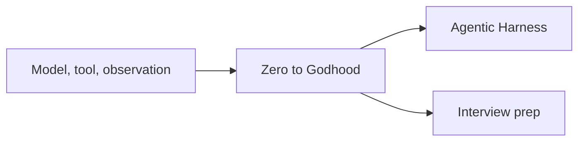

# Agentic AI

AI engineering: the Agentic AI Zero to Godhood curriculum, the Agentic Harness documentation, and the Agentic AI interview prep pack.

The book is the curriculum.
The harness notes are how a coding agent is wired.
The interview pack is the question set.
The loop on the left is the architecture every volume after the foundations assumes.
The model asks for a tool, the tool returns an observation, and the model continues until it can answer.

<!-- moc:start (generated by tools/build_mocs.py; edits inside are overwritten) -->
## Contents

**Sections**

- [Agentic AI Interview Prep](Agentic-AI-Interview-Prep/README.md)
- [Agentic Harness](Agentic-Harness/README.md)
- [Agentic AI Zero to Godhood](Agentic_AI_Zero_to_Godhood/README.md)

<!-- moc:end -->
