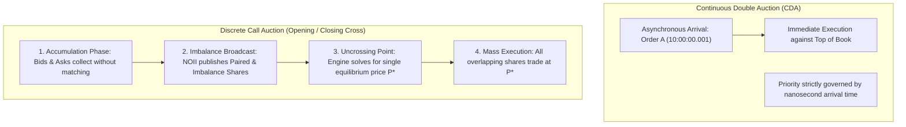

> [!summary]
> Electronic exchanges operate in two primary execution regimes: Continuous Double Auctions (CDA), where orders execute asynchronously at the instant of arrival, and Discrete Call Auctions (Opening/Closing Crosses, Volatility Halts), where orders accumulate over a time window and clear simultaneously at a single market-clearing equilibrium price that maximizes matched volume.

---

## Why it matters
While standard trading during regular market hours occurs via Continuous Double Auctions, over **20% of total daily equity volume executes in the Opening and Closing Crosses** (e.g., NASDAQ/NYSE Closing Auctions), which set the official benchmark prices used by global index funds ($20+ trillion benchmarked to S&P 500, MSCI, Russell).

Furthermore, academic market microstructure (Budish, Cramton, Shim) argues that continuous-time trading fundamentally incentivizes a socially wasteful nanosecond arms race. Understanding auction uncrossing algorithms and imbalance data feeds (NOII) is critical for executing high-volume liquidity at the open/close and trading through volatility halts.



---

## Mechanism

### 1. The Auction Uncrossing Optimization Problem
At the conclusion of the auction accumulation window, the matching engine determines the official clearing price $P^*$ by evaluating all resting buy and sell orders against a formal 4-tier objective hierarchy:

1. **Tier 1: Maximum Executable Volume**:
   $$P^* = \arg\max_P \min\left( \text{Cumulative Demand}(P), \ \text{Cumulative Supply}(P) \right)$$
   Select the price that maximizes the total number of matched shares.

2. **Tier 2: Minimum Order Imbalance (Surplus Minimization)**:
   If multiple price levels tie for maximum volume, select the price that minimizes the absolute difference between cumulative buy and sell volume:
   $$\min |\text{Cumulative Demand}(P) - \text{Cumulative Supply}(P)|$$

3. **Tier 3: Market Direction / Imbalance Side**:
   If a tie still persists:
   - If there is a buy surplus (Demand > Supply), select the higher price.
   - If there is a sell surplus (Supply > Demand), select the lower price.

4. **Tier 4: Proximity to Reference Price**:
   If still tied, select the price closest to the official reference price (e.g., previous consolidated close or midpoint).

### 2. Nasdaq Net Order Imbalance Indicator (NOII) Feed
Leading up to the Opening/Closing Cross (e.g. 15:50 to 16:00 EST), the exchange broadcasts NOII messages every second (and every 50ms in the final minutes):
- **Paired Shares**: Number of shares that would execute at the current reference price.
- **Imbalance Shares**: Number of uncommitted shares that cannot be matched.
- **Imbalance Direction**: `B` (Buy Imbalance), `S` (Sell Imbalance), `N` (No Imbalance).
- **Near Price**: The clearing price if only on-open/on-close cross orders were matched.
- **Far Price**: The clearing price if *all* orders (including continuous resting limit orders) were matched.

---

## In Practice

### High-Performance Auction Uncrossing Algorithm in C++20

```cpp
#include <cstdint>
#include <vector>
#include <algorithm>
#include <iostream>
#include <cmath>

struct AuctionPriceLevel {
    uint32_t price;
    uint64_t buy_qty{0};
    uint64_t sell_qty{0};
};

struct UncrossResult {
    uint32_t clearing_price{0};
    uint64_t matched_volume{0};
    int64_t  imbalance_qty{0}; // Positive = Buy surplus, Negative = Sell surplus
};

// Solve for the single market-clearing equilibrium price: O(N) over sorted price levels
UncrossResult calculate_uncross_price(std::vector<AuctionPriceLevel>& sorted_levels, uint32_t reference_price) {
    if (sorted_levels.empty()) return {};

    size_t num_levels = sorted_levels.size();

    // 1. Calculate Cumulative Demand (Buy volume willing to buy at >= P)
    // Demand is accumulated from highest price down to lowest price
    std::vector<uint64_t> cum_demand(num_levels, 0);
    uint64_t running_buy = 0;
    for (int i = static_cast<int>(num_levels) - 1; i >= 0; --i) {
        running_buy += sorted_levels[i].buy_qty;
        cum_demand[i] = running_buy;
    }

    // 2. Calculate Cumulative Supply (Sell volume willing to sell at <= P)
    // Supply is accumulated from lowest price up to highest price
    std::vector<uint64_t> cum_supply(num_levels, 0);
    uint64_t running_sell = 0;
    for (size_t i = 0; i < num_levels; ++i) {
        running_sell += sorted_levels[i].sell_qty;
        cum_supply[i] = running_sell;
    }

    // 3. Find price level that maximizes matched volume
    uint64_t max_volume = 0;
    uint64_t min_imbalance = UINT64_MAX;
    uint32_t best_price = reference_price;
    int64_t  best_imbalance = 0;

    for (size_t i = 0; i < num_levels; ++i) {
        uint64_t matched = std::min(cum_demand[i], cum_supply[i]);
        int64_t imbalance = static_cast<int64_t>(cum_demand[i]) - static_cast<int64_t>(cum_supply[i]);
        uint64_t abs_imbalance = std::abs(imbalance);

        if (matched > max_volume) {
            max_volume = matched;
            min_imbalance = abs_imbalance;
            best_price = sorted_levels[i].price;
            best_imbalance = imbalance;
        } else if (matched == max_volume && matched > 0) {
            // Tie-breaking: minimize absolute imbalance
            if (abs_imbalance < min_imbalance) {
                min_imbalance = abs_imbalance;
                best_price = sorted_levels[i].price;
                best_imbalance = imbalance;
            } else if (abs_imbalance == min_imbalance) {
                // Tie-breaking: choose price closest to reference price
                if (std::abs(static_cast<int64_t>(sorted_levels[i].price) - static_cast<int64_t>(reference_price)) <
                    std::abs(static_cast<int64_t>(best_price) - static_cast<int64_t>(reference_price))) {
                    best_price = sorted_levels[i].price;
                    best_imbalance = imbalance;
                }
            }
        }
    }

    return UncrossResult{best_price, max_volume, best_imbalance};
}
```

---

## Numbers

| Auction Phase / Event | Duration / Frequency | Typical Executed Volume | Latency Sensitivity |
| :--- | :--- | :--- | :--- |
| **Opening Cross (e.g. 09:30 EST)** | 1-time Discrete Uncross | **~8–12% of daily volume** | Medium (Imbalance arbitrage) |
| **Continuous Double Auction (CDA)**| Continuous (6.5 hours) | **~70% of daily volume** | **Extreme (<500 ns)** |
| **Closing Cross (e.g. 16:00 EST)** | 1-time Discrete Uncross | **~12–18% of daily volume**| High (MOC order cutoff) |
| **LULD Volatility Halt Auction** | 5-minute pause + uncross | Variable | High (Re-opening surge) |
| **Frequent Batch Auction (FBA)** | 100 ms discrete batches | Proposed theoretical | Low (Latency race eliminated) |

---

## Trade-offs

| Market Mechanism | Advantages | Market Drawbacks |
| :--- | :--- | :--- |
| **Continuous Double Auction (CDA)** | Immediate execution feedback; continuous real-time price discovery. | Generates socially costly latency arms races; exposes liquidity to front-running. |
| **Discrete Call Auction** | Concentrates liquidity; eliminates latency arbitrage; establishes true consensus price. | No continuous execution; participants cannot trade dynamically during accumulation. |
| **Frequent Batch Auctions (100ms)**| Mathematically eliminates sniping of stale quotes. | Slower execution feedback for retail and risk management hedging. |

---

> [!warning] Gotchas
> 1. **Market-On-Close (MOC) Order Cutoff Deadlines**: Regulatory rules strictly enforce MOC order entry cutoffs (e.g., 15:50 EST for NYSE/Nasdaq). Submitting an MOC cancel request at 15:50:00.001 will result in an immediate exchange rejection; once the cutoff passes, MOC orders are **legally non-cancelable**.
> 2. **Imbalance Cascades on Re-Opening**: Following a Limit Up-Limit Down (LULD) volatility halt, huge retail market order imbalances accumulate during the 5-minute halt. Attempting to uncross without price collars can cause the stock to gap another 30% on re-opening, triggering a secondary halt.

---

## Lab
**Objective**: Build a discrete call auction uncrossing engine in C++, ingest a simulated batch of 50,000 buy and sell limit orders, and compute the equilibrium clearing price, matched volume, and NOII imbalance metrics.

**Success Criteria**:
1. Prove that the uncrossing price mathematically maximizes matched share volume.
2. Verify that all buy orders with limit prices $> P^*$ and sell orders with limit prices $< P^*$ are **100% executed**.
3. Verify that orders with limit price $= P^*$ are executed up to the available matched volume with proper tie-breaking.

---

> [!question]- Self-test
> 1. **What is the primary objective function evaluated by an exchange uncrossing algorithm when calculating the clearing price of an Opening or Closing Cross?**
>    *Answer*: The primary objective (Tier 1) is to **maximize the total executable share volume** ($\max \min(\text{Cumulative Demand}, \text{Cumulative Supply})$). If multiple price levels achieve the identical maximum volume, secondary tie-breakers minimize the remaining unexecuted order imbalance and select the price closest to the benchmark reference price.
> 2. **Why does Eric Budish's Frequent Batch Auction (FBA) model eliminate high-frequency latency arbitrage on resting quotes?**
>    *Answer*: In continuous trading, if correlated asset $A$ moves, algorithms race to cancel or snipe stale quotes in asset $B$ within sub-microsecond windows, with the fastest single packet winning 100% of the trade. In an FBA, all orders arriving within a discrete time window (e.g., 100 ms) are processed together in a batch auction, eliminating the sub-microsecond speed advantage and clearing all crossing orders at a uniform equilibrium price.
> 3. **What is the difference between the "Near Price" and the "Far Price" in the Nasdaq Net Order Imbalance Indicator (NOII) data feed?**
>    *Answer*: The **Near Price** is the hypothetical clearing price calculated using both cross-eligible orders (MOC, LOC) AND standard continuous resting limit orders. The **Far Price** is the hypothetical clearing price calculated using *only* cross-eligible orders (MOC, LOC, IO), providing market participants with visibility into the pure institutional closing imbalance.

---

## Related
- [[01 - Market & Microstructure Fundamentals/Order Types and State Transitions]]
- [[01 - Market & Microstructure Fundamentals/Maker-Taker vs Inverted Fee Models]]
- [[01 - Market & Microstructure Fundamentals/Price Discovery and Microstructure Noise]]
- [[03 - Matching Engine Internals/Matching Algorithms]]
- [[01 - Market & Microstructure Fundamentals/MOC - 01 Market & Microstructure Fundamentals]]

## Sources
- [[Sources/Trading and Exchanges by Larry Harris]]
- [[Sources/The High-Frequency Trading Arms Race - Frequent Batch Auctions by Eric Budish et al]]
- [[Sources/NASDAQ TotalView-ITCH 5.0 Specification]]
