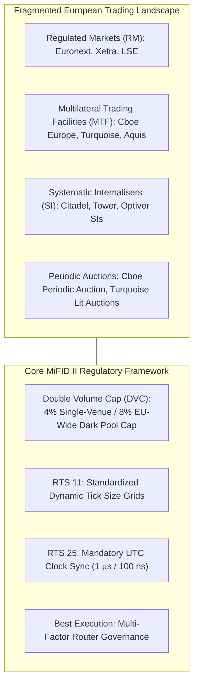

> [!summary]
> European equity and derivatives market structure is governed by MiFID II / MiFIR. Unlike the US Reg NMS framework, Europe lacks a consolidated public tape (SIP) and has no mandatory Order Protection Rule (Trade-Through Rule), relying instead on multi-factor Best Execution mandates, Double Volume Caps on dark pools, and strict RTS 25 microsecond clock synchronization standards.

---

## Why it matters
A trading architecture built for US equities cannot be deployed naively in Europe:
1. **No Trade-Through Rule**: An order on Euronext Paris can legally trade at a price inferior to the London Stock Exchange (LSE) without triggering a regulatory violation, placing the burden of **Best Execution** entirely on the broker's Smart Order Router (SOR).
2. **No Centralized Tape (The Consolidated Tape Vacuum)**: Market participants must license, normalize, and consolidate private data feeds from over 20 independent European exchanges and MTFs (Multilateral Trading Facilities).
3. **Strict Clock Synchronization Mandates (RTS 25)**: Algorithmic and HFT participants are legally required to synchronize hardware clocks to UTC within **1 microsecond** and record timestamps at **100-nanosecond resolution**.



---

## Mechanism

### 1. US Reg NMS vs European MiFID II Comparison

| Feature / Rule | US Equities (Reg NMS) | European Equities (MiFID II / MiFIR) |
| :--- | :--- | :--- |
| **Order Protection Rule** | **Mandatory (Rule 611)**: Trade-throughs strictly illegal. | **None**: No legal trade-through protection across venues. |
| **Consolidated Tape** | **Mandatory (The SIP)**: Real-time public NBBO feed. | **None**: Highly fragmented private data feeds. |
| **Dark Pool Restrictions** | Bounded only by broker agency rules. | **Double Volume Cap (DVC)**: 4% single venue / 8% EU-wide. |
| **Internalization** | Wholesale PFOF (Payment for Order Flow). | **Systematic Internalisers (SIs)**; PFOF strictly banned. |
| **Clock Synchronization** | FINRA Rule 4590 (50 ms / 1 ms sync). | **RTS 25**: **1 microsecond sync, 100 ns granularity** for HFT. |

### 2. Systematic Internalisers (SIs)
A Systematic Internaliser (SI) is an investment firm or market maker that, on an organized, frequent, and systematic basis, trades on its own account by executing client orders outside a regulated market or MTF.
- SIs provide bilateral liquidity directly to institutional brokers.
- Unlike dark pools, SIs are **exempt from the Double Volume Cap (DVC)**, making them the primary destination for non-displayed block liquidity in Europe.

### 3. RTS 11 Harmonized Tick Size Regime
To prevent market makers from stepping in front of resting orders by fractions of a penny (sub-penny jumping), MiFID II RTS 11 mandates a mandatory **Tick Size Grid** based on:
1. The **Liquidity Band** of the asset (Average Daily Number of Transactions - ADNT).
2. The **Price Level** of the security.

All European venues (lit books, MTFs, SIs) are legally bound to enforce identical tick sizes, leveling queue priority dynamics across fragmented venues.

---

## In Practice

### MiFID II RTS 11 Dynamic Tick Size Calculator in C++20

```cpp
#include <cstdint>
#include <array>
#include <iostream>

struct TickGridTier {
    uint32_t max_price_cents;
    uint32_t tick_size_mils; // 1 mil = $0.0010 = 0.1 cents
};

// Simplified RTS 11 Table for Liquidity Band 6 (Highest Liquidity: ADNT > 9000)
constexpr std::array<TickGridTier, 6> RTS11_BAND_6_GRID = {{
    { 5000,    10 }, // Price < €50.00    -> Tick: €0.01 (10 mils)
    { 10000,   20 }, // Price < €100.00   -> Tick: €0.02 (20 mils)
    { 20000,   50 }, // Price < €200.00   -> Tick: €0.05 (50 mils)
    { 50000,  100 }, // Price < €500.00   -> Tick: €0.10 (100 mils)
    { 100000, 200 }, // Price < €1000.00  -> Tick: €0.20 (200 mils)
    { UINT32_MAX, 500 } // Price >= €1000 -> Tick: €0.50 (500 mils)
}};

// Calculate legal minimum tick size under MiFID II RTS 11
inline uint32_t get_rts11_tick_size(uint32_t price_cents) noexcept {
    for (const auto& tier : RTS11_BAND_6_GRID) {
        if (price_cents < tier.max_price_cents) {
            return tier.tick_size_mils;
        }
    }
    return 500;
}
```

---

## Numbers

| Parameter / Requirement | MiFID II RTS 25 Standard | Trading Infrastructure Implication |
| :--- | :--- | :--- |
| **HFT Timestamp Granularity** | **100 nanoseconds** | Requires hardware PHY/MAC timestamping in NICs. |
| **Max Divergence from UTC** | **1 microsecond (1 µs)** | Mandatory PTP (IEEE 1588v2) Grandmaster with GPS sync. |
| **Non-HFT Algorithmic Sync**| **100 microseconds (100 µs)**| Can use optimized PTP or local NTP discipline. |
| **DVC Dark Volume Cap** | **4% Single / 8% EU Total**| Triggers 6-month dark trading bans when breached. |

---

## Trade-offs

| Trading Venue Type | Execution Advantage | Regulatory / Structural Restriction |
| :--- | :--- | :--- |
| **Regulated Market (RM - Lit Book)**| High addressable volume; primary reference price for index funds. | Highest exchange fees; lit queue competition. |
| **Systematic Internaliser (SI)** | Tailored bilateral liquidity; exempt from Double Volume Cap. | Must publicly quote two-way prices for standard retail sizes. |
| **Periodic Auction MTF** | Executes at midpoint; immune to sub-microsecond latency sniping. | Slower execution turnaround (~100ms uncrossing intervals). |

---

> [!warning] Gotchas
> 1. **The Double Volume Cap Midpoint Suspension**: Under MiFID II, if a dark pool breaches the 4% or 8% volume cap for a specific stock, the European regulator (ESMA) issues a **mandatory 6-month ban on dark midpoint trading for that stock**. Smart Order Routers that fail to dynamically track ESMA suspension feeds will see 100% of their dark orders rejected.
> 2. **RTS 25 Audit Trail Fines**: Regulatory authorities periodically audit order book event logs. If a trading firm's timestamps deviate by more than **1 microsecond from UTC** or if identical timestamps are assigned to sequential events without proper sub-microsecond serialization, regulators levy substantial fines.

---

## Lab
**Objective**: Build a MiFID II RTS 11 tick size validator and RTS 25 timestamp compliance verifier in C++, validating order prices and timestamp precision against regulatory constraints.

**Success Criteria**:
1. Validate order price inputs across €10.00 to €2,000.00 against the RTS 11 grid.
2. Verify that all emitted event timestamps have **<100ns granularity** and pass monotonic progression tests.

---

> [!question]- Self-test
> 1. **Why does European market structure NOT enforce a strict Order Protection Rule (Trade-Through Rule) like the US SEC Regulation NMS Rule 611?**
>    *Answer*: European regulators (under MiFID II) deliberately opted not to enforce a rigid price-only trade-through rule, choosing instead to mandate a broader **Best Execution** standard. European brokers are required to deliver the best overall outcome for clients taking into account price, execution speed, likelihood of execution and settlement, size, and total transaction costs, allowing them to route to faster or more reliable venues even if another exchange displays a nominally better price.
> 2. **What is the European Double Volume Cap (DVC) and what happens when an asset exceeds the threshold?**
>    *Answer*: The DVC restricts non-displayed (dark pool) trading under the Reference Price and Negotiated Trade waivers. It caps dark trading at **4% of total EU trading on a single venue** and **8% across all EU venues** over a rolling 12-month period. When a stock breaches either cap, ESMA mandates a **6-month ban on all dark pool trading in that stock** across the relevant venue(s).
> 3. **What are the technical clock synchronization requirements imposed by MiFID II RTS 25 on High-Frequency Trading systems?**
>    *Answer*: Under RTS 25, high-frequency trading (HFT) participants and algorithmic venues must synchronize all trading system clocks to UTC (derived from official time laboratories) with a **maximum divergence of 1 microsecond (1 µs)** and must record all reportable order events with a **minimum timestamp resolution of 100 nanoseconds**.

---

## Related
- [[01 - Market & Microstructure Fundamentals/Market Fragmentation and Reg NMS]]
- [[07 - Time & Measurement/Clock Sources and Hardware Timestamping]]
- [[07 - Time & Measurement/Precision Time Protocol and White Rabbit]]
- [[01 - Market & Microstructure Fundamentals/Maker-Taker vs Inverted Fee Models]]
- [[01 - Market & Microstructure Fundamentals/MOC - 01 Market & Microstructure Fundamentals]]

## Sources
- [[Sources/ESMA MiFID II - Regulatory Technical Standard 25 (RTS 25)]]
- [[Sources/ESMA MiFID II - Regulatory Technical Standard 11 (RTS 11)]]
- [[Sources/Trading and Exchanges by Larry Harris]]
