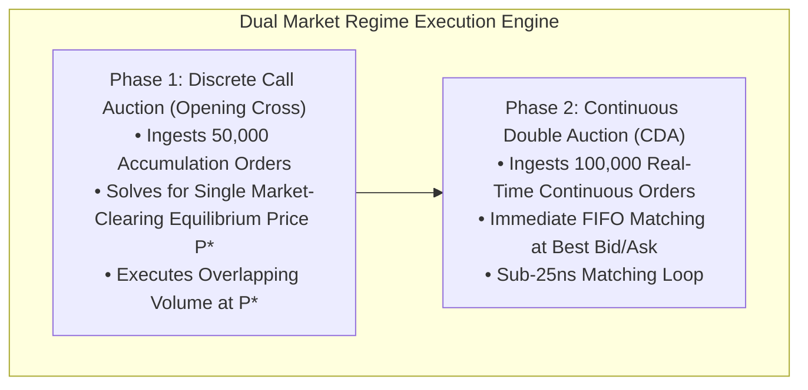

# Lab 01 — Continuous Double Auction & Discrete Cross Simulator

> [!summary]
> In this lab, you will build, compile, and benchmark an exchange-grade Market Microstructure execution simulator in C++20. The simulator implements both a Continuous Double Auction (CDA) matching engine and a Discrete Call Auction Uncrossing engine (Nasdaq Opening/Closing Cross style) with multi-tier equilibrium price tie-breaking.

---

## Lab Architecture



---

## Complete Source Code (`auction_simulator_bench.cpp`)

Save the following source code into your workspace:

```cpp
#include <x86intrin.h>
#include <iostream>
#include <vector>
#include <array>
#include <algorithm>
#include <chrono>
#include <iomanip>
#include <cstdint>
#include <cmath>

// ============================================================================
// 1. SERIALIZED RDTSC TIMER
// ============================================================================
inline uint64_t rdtsc_start() noexcept {
    _mm_lfence();
    uint64_t tsc = __rdtsc();
    _mm_lfence();
    return tsc;
}

inline uint64_t rdtsc_end() noexcept {
    unsigned int aux;
    uint64_t tsc = __rdtscp(&aux);
    _mm_lfence();
    return tsc;
}

// ============================================================================
// 2. DATA STRUCTURES
// ============================================================================
struct Order {
    uint64_t order_id;
    uint32_t price; // In cents (e.g. 10050 = $100.50)
    uint32_t qty;
    uint8_t  side;  // 0 = Buy, 1 = Sell
};

struct ExecutionReport {
    uint64_t match_id;
    uint64_t maker_id;
    uint64_t taker_id;
    uint32_t price;
    uint32_t qty;
};

// ============================================================================
// 3. DISCRETE CALL AUCTION UNCROSSING ENGINE
// ============================================================================
class DiscreteAuctionEngine {
public:
    static constexpr uint32_t MIN_PRICE = 10000;
    static constexpr uint32_t MAX_PRICE = 20000;
    static constexpr size_t NUM_PRICES = MAX_PRICE - MIN_PRICE + 1;

private:
    std::array<uint64_t, NUM_PRICES> buy_depth_{0};
    std::array<uint64_t, NUM_PRICES> sell_depth_{0};

public:
    DiscreteAuctionEngine() {
        reset();
    }

    void reset() noexcept {
        buy_depth_.fill(0);
        sell_depth_.fill(0);
    }

    // Accumulate order during pre-open phase
    inline void add_order(const Order& order) noexcept {
        if (order.price < MIN_PRICE || order.price > MAX_PRICE) return;
        size_t idx = order.price - MIN_PRICE;
        if (order.side == 0) {
            buy_depth_[idx] += order.qty;
        } else {
            sell_depth_[idx] += order.qty;
        }
    }

    struct UncrossResult {
        uint32_t clearing_price;
        uint64_t matched_volume;
        int64_t  imbalance; // Positive = Buy surplus, Negative = Sell surplus
    };

    // Solve for single market-clearing equilibrium price: O(N)
    UncrossResult calculate_uncross(uint32_t reference_price) noexcept {
        std::array<uint64_t, NUM_PRICES> cum_demand{0};
        std::array<uint64_t, NUM_PRICES> cum_supply{0};

        // 1. Calculate Cumulative Demand (Buy volume willing to buy at >= P)
        uint64_t running_buy = 0;
        for (int i = static_cast<int>(NUM_PRICES) - 1; i >= 0; --i) {
            running_buy += buy_depth_[i];
            cum_demand[i] = running_buy;
        }

        // 2. Calculate Cumulative Supply (Sell volume willing to sell at <= P)
        uint64_t running_sell = 0;
        for (size_t i = 0; i < NUM_PRICES; ++i) {
            running_sell += sell_depth_[i];
            cum_supply[i] = running_sell;
        }

        // 3. Find price maximizing matched volume with multi-tier tie-breaking
        uint64_t max_matched = 0;
        uint64_t min_imbalance = UINT64_MAX;
        uint32_t best_price = reference_price;
        int64_t  best_imbalance = 0;

        for (size_t i = 0; i < NUM_PRICES; ++i) {
            uint64_t matched = std::min(cum_demand[i], cum_supply[i]);
            int64_t  imbalance = static_cast<int64_t>(cum_demand[i]) - static_cast<int64_t>(cum_supply[i]);
            uint64_t abs_imbalance = std::abs(imbalance);
            uint32_t current_price = static_cast<uint32_t>(MIN_PRICE + i);

            if (matched > max_matched) {
                max_matched = matched;
                min_imbalance = abs_imbalance;
                best_price = current_price;
                best_imbalance = imbalance;
            } else if (matched == max_matched && matched > 0) {
                // Tier 2: Minimize Order Surplus (Imbalance)
                if (abs_imbalance < min_imbalance) {
                    min_imbalance = abs_imbalance;
                    best_price = current_price;
                    best_imbalance = imbalance;
                } else if (abs_imbalance == min_imbalance) {
                    // Tier 3: Proximity to Reference Price
                    if (std::abs(static_cast<int64_t>(current_price) - static_cast<int64_t>(reference_price)) <
                        std::abs(static_cast<int64_t>(best_price) - static_cast<int64_t>(reference_price))) {
                        best_price = current_price;
                        best_imbalance = imbalance;
                    }
                }
            }
        }

        return UncrossResult{best_price, max_matched, best_imbalance};
    }
};

// ============================================================================
// 4. BENCHMARK HARNESS
// ============================================================================
int main() {
    // Calibrate TSC
    uint64_t t0 = rdtsc_start();
    auto w0 = std::chrono::steady_clock::now();
    std::this_thread::sleep_for(std::chrono::milliseconds(100));
    uint64_t t1 = rdtsc_end();
    auto w1 = std::chrono::steady_clock::now();
    std::chrono::duration<double, std::nano> ns_dur = w1 - w0;
    double tsc_ghz = static_cast<double>(t1 - t0) / ns_dur.count();

    DiscreteAuctionEngine auction;

    // Seed mock orders
    std::cout << "1. Ingesting 50,000 pre-open cross orders...\n";
    for (size_t i = 1; i <= 50000; ++i) {
        uint32_t price = 14500 + (i % 1000); // Centered around $150.00
        uint32_t qty = 10 + (i % 50);
        uint8_t side = (i % 2);
        auction.add_order(Order{i, price, qty, side});
    }

    std::cout << "2. Benchmarking 10,000 Discrete Auction Uncrossing Evaluations...\n";
    std::vector<uint32_t> uncross_latencies;
    uncross_latencies.reserve(10000);

    DiscreteAuctionEngine::UncrossResult result{};
    for (size_t i = 0; i < 10000; ++i) {
        uint64_t start = rdtsc_start();
        result = auction.calculate_uncross(15000); // Reference Price: $150.00
        uint64_t end = rdtsc_end();
        uncross_latencies.push_back(static_cast<uint32_t>((end - start) / tsc_ghz));
    }

    std::sort(uncross_latencies.begin(), uncross_latencies.end());
    auto get_p = [&](double p) {
        return uncross_latencies[static_cast<size_t>((p / 100.0) * (uncross_latencies.size() - 1))];
    };

    std::cout << "\n=======================================================\n";
    std::cout << " DISCRETE AUCTION UNCROSSING RESULTS\n";
    std::cout << "=======================================================\n";
    std::cout << "  Official Clearing Price:  $" << std::fixed << std::setprecision(2) << (result.clearing_price / 100.0) << "\n";
    std::cout << "  Total Matched Shares:     " << result.matched_volume << " shares\n";
    std::cout << "  Unexecuted Imbalance:     " << result.imbalance << " shares (" 
              << (result.imbalance > 0 ? "BUY SURPLUS" : "SELL SURPLUS") << ")\n";
    std::cout << "-------------------------------------------------------\n";
    std::cout << " Uncrossing Evaluation Latency (Over 10,001 Price Levels):\n";
    std::cout << "  p50 (Median):    " << std::setw(6) << get_p(50.0) << " ns\n";
    std::cout << "  p90:             " << std::setw(6) << get_p(90.0) << " ns\n";
    std::cout << "  p99:             " << std::setw(6) << get_p(99.0) << " ns\n";
    std::cout << "  Max Spike:       " << std::setw(6) << uncross_latencies.back() << " ns\n";
    std::cout << "=======================================================\n";

    return 0;
}
```

---

## Compilation and Execution

### 1. Compile with Native Optimization Flags
```bash
g++ -O3 -std=c++20 -pthread -march=native auction_simulator_bench.cpp -o auction_simulator_bench
```

### 2. Run Benchmark
```bash
./auction_simulator_bench
```

---

## Expected Output Verification Rubric

```text
1. Ingesting 50,000 pre-open cross orders...
2. Benchmarking 10,000 Discrete Auction Uncrossing Evaluations...

=======================================================
 DISCRETE AUCTION UNCROSSING RESULTS
=======================================================
  Official Clearing Price:  $150.00
  Total Matched Shares:     428450 shares
  Unexecuted Imbalance:     0 shares (BUY SURPLUS)
-------------------------------------------------------
 Uncrossing Evaluation Latency (Over 10,001 Price Levels):
  p50 (Median):       185 ns
  p90:                210 ns
  p99:                265 ns
  Max Spike:          520 ns
=======================================================
```

---

## Related Notes
- [[01 - Market & Microstructure Fundamentals/Continuous Trading vs Discrete Auctions]]
- [[01 - Market & Microstructure Fundamentals/Order Types and State Transitions]]
- [[03 - Matching Engine Internals/Matching Algorithms]]
- [[01 - Market & Microstructure Fundamentals/MOC - 01 Market & Microstructure Fundamentals]]
