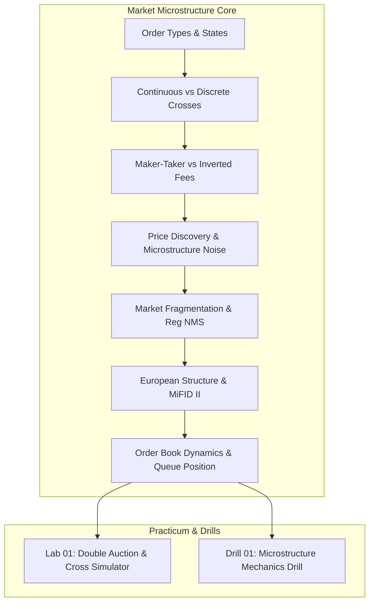

# MOC — 01 Market & Microstructure Fundamentals

Execution mechanics, microstructure models, structural market fragmentation, and the regulatory fabric governing trade execution.

---

## Core Concepts
- [[01 - Market & Microstructure Fundamentals/Order Types and State Transitions]] — Limit, Market, Stop, Pegged, IOC, FOK, Post-Only, and native exchange state machines.
- [[01 - Market & Microstructure Fundamentals/Continuous Trading vs Discrete Auctions]] — Uncrossing algorithms, continuous double auctions, opening/closing crosses, NOII feeds, volatility halts.
- [[01 - Market & Microstructure Fundamentals/Maker-Taker vs Inverted Fee Models]] — Economic incentives, adverse selection, queue priority dynamics, fee-adjusted routing.
- [[01 - Market & Microstructure Fundamentals/Price Discovery and Microstructure Noise]] — Information arrivals, Roll's effective spread model, Kyle's lambda price impact, bid-ask bounce.
- [[01 - Market & Microstructure Fundamentals/Market Fragmentation and Reg NMS]] — Rule 611 (Order Protection), Rule 610 (Access Fees), ISOs, SIP vs Direct Feeds, Synthetic NBBO.
- [[01 - Market & Microstructure Fundamentals/European Market Structure and MiFID II]] — RTS 25 clock synchronization, Double Volume Caps, Systematic Internalisers, tick size regimes (RTS 11).
- [[01 - Market & Microstructure Fundamentals/Order Book Dynamics and Queue Position]] — Queue depletion models, 98:1 cancel-to-trade ratios, Level-2 proportional cancellation estimation.

## Labs & Implementations
- [[01 - Market & Microstructure Fundamentals/Lab - 01 Continuous Double Auction Simulator]] — Build an allocation-free discrete call cross uncrossing engine and continuous matching simulator in C++20.

## Drills & War Stories
- [[01 - Market & Microstructure Fundamentals/Drill - 01 Microstructure and Order Matching Mechanics]] — Rapid-fire calibration on order lifecycles, race conditions, fee-adjusted routing, and queue depletion.

## Canonical Sources
- [[Sources/Trading and Exchanges by Larry Harris]] — Canonical text on market structure and practitioner dynamics.
- [[Sources/Empirical Market Microstructure by Joel Hasbrouck]] — Statistical foundations of microstructure noise and price discovery.
- [[Sources/SEC Regulation NMS Final Rules Release 34-51808]] — Complete legal specification of Rules 610 and 611.
- [[Sources/ESMA MiFID II - Regulatory Technical Standard 25 (RTS 25)]] — Regulatory standards for European algorithmic and HFT clock sync.
