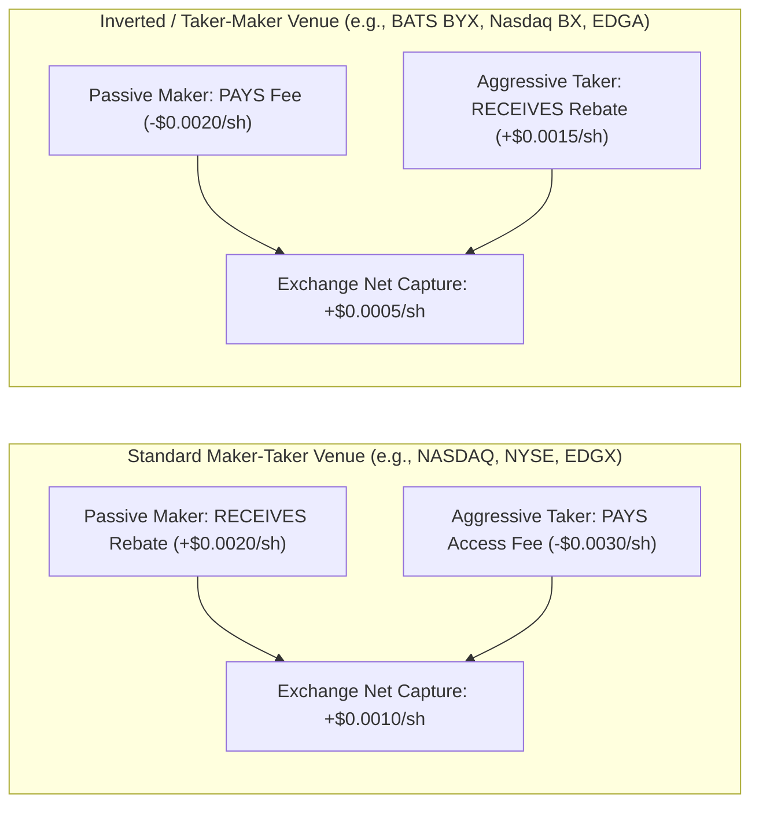

> [!summary]
> Exchange pricing models establish the economic incentives for liquidity provision. While standard Maker-Taker venues subsidize passive quotes via maker rebates and charge aggressive takers, Inverted (Taker-Maker) venues pay takers to remove liquidity and charge makers—offering faster queue execution at the cost of significantly higher adverse selection toxicity.

---

## Why it matters
In high-frequency quantitative trading, exchange fee structures represent a massive component of net PnL:
- A high-frequency market maker trading 50,000,000 shares per day with a $+20\text{ mils}$ ($+\$0.0020$/share) maker rebate collects **\$100,000 per day in exchange rebates alone** (\$25M+ annually).
- Conversely, misrouting an aggressive order to a 30-mils taker venue instead of an inverted rebate venue destroys trading alpha by **\$0.0045 per share**.

Smart Order Routers (SOR) dynamically adjust routing logic based on **net-effective pricing** and the mathematical trade-off between **queue waiting time** and **adverse selection risk**.



---

## Mechanism

### 1. Fee Model Comparison & Dynamics

| Metric / Dimension | Standard Maker-Taker (NASDAQ, NYSE Arca) | Inverted / Taker-Maker (BATS BYX, Nasdaq BX) |
| :--- | :--- | :--- |
| **Maker Incentive** | **Rebate Paid** (+$0.0020 to +$0.0030 / share) | **Fee Charged** (-$0.0018 to -$0.0020 / share) |
| **Taker Incentive** | **Fee Charged** (-$0.0028 to -$0.0030 / share) | **Rebate Paid** (+$0.0014 to +$0.0018 / share) |
| **Queue Depth** | **Deep Queues**: High competition among makers. | **Thin Queues**: Few makers willing to pay fees. |
| **Time to Fill (Queue Speed)**| **Slow**: Long wait times at the back of the queue. | **Ultra-Fast**: Takers prioritize inverted venues to collect rebates. |
| **Adverse Selection / Toxicity**| **Lower**: Orders execute against diverse flow. | **Extremely High**: Passive quotes are filled primarily when market is violently moving against them. |

### 2. Net-Effective Price (Fee-Adjusted Pricing)
To compare quotes across fragmented exchanges, a Smart Order Router calculates the **Net-Effective Price**:

$$\text{Net Bid}_{\text{Passive}} = \text{Nominal Bid} + \text{Rebate} \quad (\text{or } - \text{Fee})$$
$$\text{Net Ask}_{\text{Aggressive}} = \text{Nominal Ask} + \text{Taker Fee} \quad (\text{or } - \text{Taker Rebate})$$

*Example*: Stock $XYZ$ has quotes at $\$10.00$ Bid across two venues:
- Venue A (Standard Maker-Taker, $+20\text{ mils}$ rebate): $\text{Net Yield} = \$10.00 + \$0.0020 = \mathbf{\$10.0020}$.
- Venue B (Inverted Venue, $-20\text{ mils}$ fee): $\text{Net Yield} = \$10.00 - \$0.0020 = \mathbf{\$9.9980}$.
*A maker on Venue A yields 40 mils ($0.04\%$) more per share than on Venue B.*

### 3. Adverse Selection on Inverted Venues
Because Smart Order Routers route aggressive taking orders to **inverted venues first** (to earn the taker rebate or pay the lowest fee), a resting limit order on an inverted venue has the highest probability of being filled immediately when an informed trader sweeps the market. 
If an aggressive institutional block arrives, the passive quote on the inverted venue gets hit *first*, leaving the maker with toxic, adverse inventory.

---

## In Practice

### Smart Order Router (SOR) Fee-Adjusted Routing Logic in C++20

```cpp
#include <cstdint>
#include <string_view>
#include <array>
#include <iostream>

struct VenueQuote {
    std::string_view venue_name;
    uint32_t nominal_price_cents; // E.g. 10050 = $100.50
    int32_t  taker_fee_mils;      // Positive = Fee charged, Negative = Rebate (in 1/10th cents: mils)
    uint32_t available_qty;
};

// Calculate net cost for an aggressive buyer
inline double calculate_net_price(const VenueQuote& quote) noexcept {
    // 1 mil = $0.0010 = 0.1 cents
    double fee_cents = static_cast<double>(quote.taker_fee_mils) * 0.1;
    return static_cast<double>(quote.nominal_price_cents) + fee_cents;
}

// Select best routing destination based on fee-adjusted price
const VenueQuote* route_aggressive_buy(const VenueQuote* quotes, size_t count) noexcept {
    if (count == 0) return nullptr;

    const VenueQuote* best_venue = &quotes[0];
    double lowest_net_cost = calculate_net_price(quotes[0]);

    for (size_t i = 1; i < count; ++i) {
        double net_cost = calculate_net_price(quotes[i]);
        if (net_cost < lowest_net_cost) {
            lowest_net_cost = net_cost;
            best_venue = &quotes[i];
        }
    }
    return best_venue;
}
```

---

## Numbers

| Exchange Venue | Model | Maker Fee / Rebate (Mils) | Taker Fee / Rebate (Mils) | Typical Queue Wait Time |
| :--- | :--- | :--- | :--- | :--- |
| **NASDAQ (Tier 1)** | Maker-Taker | **+$30 mils** (+$0.0030) | **-$30 mils** (-$0.0030) | Long (Deep Queue) |
| **Cboe EDGX** | Maker-Taker | **+$20 mils** (+$0.0020) | **-$30 mils** (-$0.0030) | Medium-Long |
| **BATS BYX** | Inverted | **-$20 mils** (-$0.0020) | **+$15 mils** (+$0.0015) | **Ultra-Fast (Top of Priority)**|
| **Nasdaq BX** | Inverted | **-$18 mils** (-$0.0018) | **+$14 mils** (+$0.0014) | **Ultra-Fast** |
| **Cboe EDGA** | Inverted / Free| **-$16 mils** (-$0.0016) | **+$18 mils** (+$0.0018) | Ultra-Fast |

---

## Trade-offs

| Liquidity Destination | Best Use Case | Primary Operational Risk |
| :--- | :--- | :--- |
| **Maker-Taker Venue (Post Quote)** | High-frequency market makers with strong queue position models. | Long wait times; can be front-run by faster cancel-replaces. |
| **Inverted Venue (Post Quote)** | Urgent passive fills (e.g. inventory risk unwinding, delta hedging). | Paying maker fees; severe adverse selection penalty. |
| **Inverted Venue (Aggressive Take)**| Takers seeking cheapest execution cost (rebate captured). | Thin available liquidity depth compared to primary venues. |

---

> [!warning] Gotchas
> 1. **The SEC Reg NMS Rule 610(c) 30-Mils Access Fee Cap**: Under SEC Rule 610, an exchange is legally prohibited from charging more than **30 mils (\$0.0030 per share)** for executing against a protected quotation. Attempting to charge a 35-mils taker fee is illegal on US equities.
> 2. **Fee Tier Cliff Degradation**: Most exchanges tie rebates to monthly consolidated volume tiers (e.g., must exceed 0.50% of TCV). If a trading firm falls 0.01% short of a monthly tier on the last trading day, its maker rebate retroactively drops across all millions of monthly shares, resulting in a **hundred-thousand-dollar unexpected fee invoice**.

---

## Lab
**Objective**: Build a Smart Order Routing model in C++ that simulates routing 100,000 aggressive orders across 4 fragmented exchanges (2 standard maker-taker, 2 inverted), proving that fee-adjusted routing reduces net execution cost by >15 mils per share.

**Success Criteria**:
1. Route orders using naive nominal price vs fee-adjusted net price.
2. Verify that fee-adjusted routing automatically prioritizes inverted venues when prices are tied at the NBBO.
3. Compute total net PnL savings across the 100,000-order simulation.

---

> [!question]- Self-test
> 1. **Why do aggressive order flow routers systematically prioritize inverted exchanges (e.g., BATS BYX) over standard maker-taker exchanges when both are displaying identical nominal prices at the NBBO?**
>    *Answer*: Inverted exchanges pay a rebate to liquidity takers (or charge near-zero access fees), whereas standard maker-taker exchanges charge the maximum allowable taker access fee (~30 mils / $0.0030 per share). By routing to inverted venues first, the taker minimizes execution fees or earns an explicit cash rebate on the fill.
> 2. **Why do passive quotes resting on inverted exchanges suffer from significantly higher adverse selection compared to standard maker-taker venues?**
>    *Answer*: Because takers route to inverted exchanges first to capture rebates, resting quotes on inverted venues are hit immediately whenever an informed sweep occurs. Furthermore, because makers must pay a fee to post liquidity, few passive market makers quote there, leaving resting quotes vulnerable to being picked off during sharp directional market moves.
> 3. **What is the maximum access fee an exchange can legally charge for executing against a protected quote under SEC Regulation NMS Rule 610?**
>    *Answer*: Under SEC Rule 610(c), the access fee cap is strictly set at **30 mils (\$0.0030 per share)** for stocks priced at or above \$1.00, or 0.30% of the market price for sub-dollar securities.

---

## Related
- [[01 - Market & Microstructure Fundamentals/Order Types and State Transitions]]
- [[01 - Market & Microstructure Fundamentals/Market Fragmentation and Reg NMS]]
- [[01 - Market & Microstructure Fundamentals/Price Discovery and Microstructure Noise]]
- [[01 - Market & Microstructure Fundamentals/Order Book Dynamics and Queue Position]]
- [[01 - Market & Microstructure Fundamentals/MOC - 01 Market & Microstructure Fundamentals]]

## Sources
- [[Sources/Trading and Exchanges by Larry Harris]]
- [[Sources/SEC Regulation NMS Final Rules Release 34-51808]]
- [[Sources/Empirical Market Microstructure by Joel Hasbrouck]]
