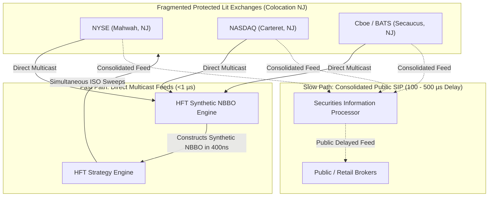

> [!summary]
> US equity trading is fragmented across 16 lit exchanges, over 30 dark pools (ATS), and wholesale internalizers, unified under SEC Regulation NMS. By exploiting the latency gap between the public Securities Information Processor (SIP) and proprietary direct market data feeds, high-frequency trading firms construct local Synthetic NBBOs to execute Intermarket Sweep Orders (ISOs) with sub-microsecond precision.

---

## Why it matters
Under the SEC's **Order Protection Rule (Rule 611)**, an exchange is legally prohibited from executing a trade at a price inferior to the National Best Bid or Offer (NBBO) displayed by any other protected lit venue (a "Trade-Through").

However:
- The public regulatory price feed (**The SIP - Securities Information Processor**) aggregates quotes with **100 to 500 microseconds of latency**.
- A high-frequency firm receiving **Direct Multicast Feeds** (e.g. Nasdaq ITCH, NYSE Integrated, BATS Multicast) constructs a **Synthetic NBBO in <1 microsecond**.

During this latency window (the "SIP Gap"), high-frequency algorithms know the *true* national best price hundreds of microseconds before the SIP updates, preventing stale quote execution and enabling sub-millisecond cross-venue arbitrage.



---

## Mechanism

### 1. Key Rules of SEC Regulation NMS (2005)
- **Rule 611 (Order Protection / Trade-Through Rule)**: Requires trading venues to establish policies preventing the execution of trades at prices inferior to the best protected displayed quotes on other national exchanges.
- **Intermarket Sweep Order (ISO)**: The critical low-latency exemption to Rule 611.
  - A participant tagging an order as an **ISO** declares: *"Execute my aggressive order immediately on your exchange; I accept full legal responsibility for simultaneously sending ISO orders to clear all better-priced protected quotes on all other exchanges."*
  - The receiving exchange executes the order **instantly without rerouting or checking external quotes**, saving milliseconds of cross-venue routing latency.
- **Rule 610 (Access Fee Cap)**: Limits exchange taker fees to a maximum of **30 mils (\$0.0030 per share)**.
- **Rule 605 & 606**: Mandates public quarterly disclosure of order execution quality (slippage, price improvement) and order routing payment statistics (PFOF).

### 2. Market Structure Composition (Lit vs Dark vs Internalized)
- **Lit Exchanges (~55–60% of total volume)**: Public order books displaying quotes to the market (Nasdaq, NYSE, Cboe, IEX, MEMX).
- **Alternative Trading Systems (ATS / Dark Pools, ~12–15%)**: Non-displayed liquidity matching institutional blocks at the midpoint (e.g. Liquidnet, Crossfinder, UBS ATS).
- **Wholesale Internalizers (~25–30%)**: Single-dealer market makers (Citadel Securities, Virtu, Two Sigma) that pay retail brokerages (Robinhood, Schwab) for non-directed retail order flow (Payment for Order Flow - PFOF) and provide fractional-cent price improvement.

---

## In Practice

### High-Performance Synthetic NBBO Aggregator in C++20

```cpp
#include <cstdint>
#include <array>
#include <algorithm>
#include <iostream>

struct VenueBBO {
    uint32_t bid_price{0};
    uint32_t bid_qty{0};
    uint32_t ask_price{UINT32_MAX};
    uint32_t ask_qty{0};
    uint64_t last_update_tsc{0};
};

struct SyntheticNBBO {
    uint32_t best_bid_price{0};
    uint32_t best_bid_qty{0};
    uint32_t best_ask_price{UINT32_MAX};
    uint32_t best_ask_qty{0};
    uint8_t  best_bid_venue_mask{0};
    uint8_t  best_ask_venue_mask{0};
};

class SyntheticNBBOEngine {
private:
    static constexpr size_t NUM_VENUES = 4; // E.g., 0=Nasdaq, 1=NYSE, 2=EDGX, 3=BATS
    std::array<VenueBBO, NUM_VENUES> venue_quotes_;
    SyntheticNBBO current_nbbo_;

public:
    // Update a single venue BBO and recompute NBBO in <10 nanoseconds
    inline void on_venue_bbo_update(size_t venue_idx, uint32_t bid_p, uint32_t bid_q, uint32_t ask_p, uint32_t ask_q) noexcept {
        venue_quotes_[venue_idx] = VenueBBO{bid_p, bid_q, ask_p, ask_q, 0};

        uint32_t max_bid = 0;
        uint32_t max_bid_qty = 0;
        uint8_t  bid_mask = 0;

        uint32_t min_ask = UINT32_MAX;
        uint32_t min_ask_qty = 0;
        uint8_t  ask_mask = 0;

        // Unrolled 4-venue SIMD/scalar evaluation
        for (size_t i = 0; i < NUM_VENUES; ++i) {
            const auto& v = venue_quotes_[i];

            // Evaluate Bid Side
            if (v.bid_price > max_bid) {
                max_bid = v.bid_price;
                max_bid_qty = v.bid_qty;
                bid_mask = (1 << i);
            } else if (v.bid_price == max_bid && max_bid > 0) {
                max_bid_qty += v.bid_qty;
                bid_mask |= (1 << i);
            }

            // Evaluate Ask Side
            if (v.ask_price < min_ask) {
                min_ask = v.ask_price;
                min_ask_qty = v.ask_qty;
                ask_mask = (1 << i);
            } else if (v.ask_price == min_ask && min_ask < UINT32_MAX) {
                min_ask_qty += v.ask_qty;
                ask_mask |= (1 << i);
            }
        }

        current_nbbo_ = SyntheticNBBO{max_bid, max_bid_qty, min_ask, min_ask_qty, bid_mask, ask_mask};
    }

    [[nodiscard]] inline const SyntheticNBBO& get_nbbo() const noexcept {
        return current_nbbo_;
    }
};
```

---

## Numbers

| Market Data Source | Feed Technology | Processing Latency | Jitter |
| :--- | :--- | :--- | :--- |
| **Public SIP (CTA / UTP)** | TCP / IP Software Consolidation | **~80–350 µs** (80,000–350,000 ns) | High (Software queueing) |
| **Direct Multicast Feeds (ITCH)** | Raw UDP Multicast (Kernel Bypass)| **~400–800 ns** | Low |
| **HFT Synthetic NBBO (Direct)** | C++ User-space In-Memory | **~10–25 ns** | **<5 ns** |
| **FPGA Hardware Synthetic NBBO** | RTL on SmartNIC (PMA/PCS) | **<100 ns (Wire-to-Wire)** | **<1 ns** |

---

## Trade-offs

| System Architecture | Latency Advantage | Engineering / Infrastructure Cost |
| :--- | :--- | :--- |
| **Direct Feeds + Synthetic NBBO** | 100x faster than SIP; eliminates latency arbitrage vulnerability. | Hundreds of thousands of dollars/year in exchange direct-feed license fees. |
| **Consolidated Public SIP Feed** | Low cost; single aggregated connection for all 16 exchanges. | **Unviable for low-latency trading**: stale quotes cause severe execution slippage. |
| **Intermarket Sweep Orders (ISO)**| Immediate local execution; eliminates broker rerouting delay. | Algorithmic liability: firm must legally guarantee clearing of all superior quotes. |

---

> [!warning] Gotchas
> 1. **The Illegal Trade-Through ISO Violation**: If an algorithm submits an order tagged as `ISO` to Exchange A without simultaneously transmitting orders to clear a protected quote on Exchange B, the firm has committed a direct federal violation of SEC Rule 611, resulting in SEC FINRA enforcement actions.
> 2. **Locked and Crossed Markets under Reg NMS**: A "Locked Market" occurs when $\text{National Best Bid} == \text{National Best Ask}$ across different exchanges; a "Crossed Market" occurs when $\text{Bid} > \text{Ask}$. SEC Rule 610(d) requires exchanges to implement automated quote sliding or rejection to prevent publishing locked/crossed quotes.

---

## Lab
**Objective**: Build a Synthetic NBBO engine in C++ that ingests independent packet feeds from 4 mock exchanges, calculates the Synthetic NBBO, and measures the microsecond latency lead time of the Synthetic NBBO over a simulated SIP feed.

**Success Criteria**:
1. Ingest 1,000,000 mock venue quotes.
2. Verify that the Synthetic NBBO updates within **<25 nanoseconds** of packet receipt.
3. Compute the SIP latency gap: demonstrate that the Synthetic NBBO detects price changes **>100 microseconds ahead of the SIP**.

---

> [!question]- Self-test
> 1. **What is an Intermarket Sweep Order (ISO) and how does it bypass the SEC Rule 611 Order Protection Rule?**
>    *Answer*: An ISO is an order tagged with a specific regulatory flag that instructs the receiving exchange to execute the order immediately against its local book without checking for or routing to better-priced protected quotes on other exchanges. The trader accepts legal responsibility under Rule 611 to simultaneously route ISO orders to execute against all displayed protected quotes on competing exchanges that are superior to the limit price.
> 2. **Why do low-latency trading firms build their own Synthetic NBBO in user-space rather than consuming the official SIP feed?**
>    *Answer*: The public Securities Information Processor (SIP) introduces 80 to 350 microseconds of latency due to software aggregation, network serialization, and centralized hub-and-spoke distribution. A firm consuming direct multicast feeds from each individual exchange calculates the local Synthetic NBBO in under 1 microsecond, giving it a massive speed advantage over SIP-reliant market participants.
> 3. **What is the difference between a Lit Exchange, a Dark Pool (ATS), and a Wholesale Internalizer in US equity market structure?**
>    *Answer*: A **Lit Exchange** publicly displays its limit order book quotes in real-time to the entire market. A **Dark Pool (ATS)** matches buy and sell orders privately without displaying resting quote sizes (often trading at the midpoint). A **Wholesale Internalizer** is a market maker that pays retail brokers for non-directed order flow and executes retail trades off-exchange against its own inventory, typically offering fractional-cent price improvement relative to the NBBO.

---

## Related
- [[01 - Market & Microstructure Fundamentals/Maker-Taker vs Inverted Fee Models]]
- [[01 - Market & Microstructure Fundamentals/Price Discovery and Microstructure Noise]]
- [[01 - Market & Microstructure Fundamentals/European Market Structure and MiFID II]]
- [[06 - Networking/UDP Multicast Market Data and A-B Feed Arbitration]]
- [[01 - Market & Microstructure Fundamentals/MOC - 01 Market & Microstructure Fundamentals]]

## Sources
- [[Sources/SEC Regulation NMS Final Rules Release 34-51808]]
- [[Sources/Trading and Exchanges by Larry Harris]]
- [[Sources/Empirical Market Microstructure by Joel Hasbrouck]]
