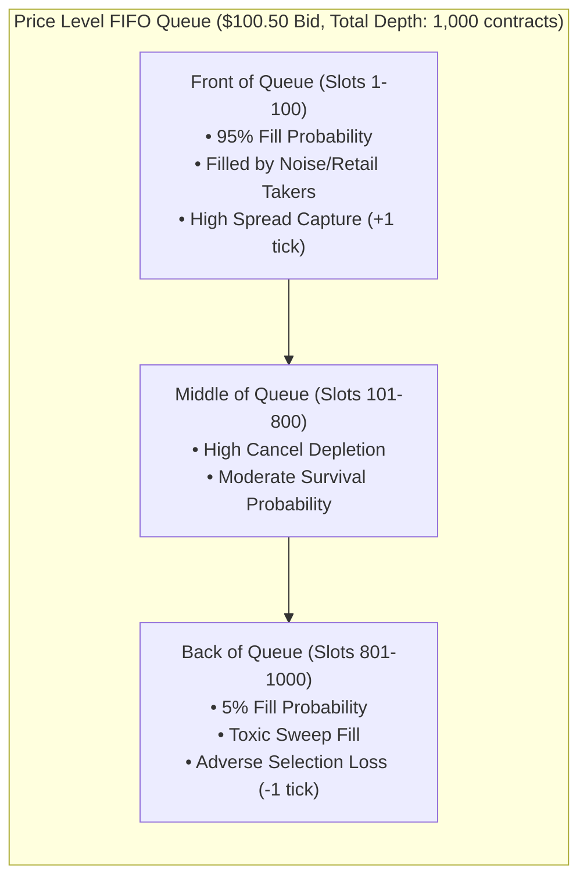

> [!summary]
> In Price-Time Priority order books, an algorithmic quote's profitability is determined primarily by its position within the price-level queue. Orders at the front of the queue capture high fill probabilities from uninformed flow, whereas orders at the back of the queue suffer from extreme adverse selection, filling only when an aggressive sweep wipes out the entire price level.

---

## Why it matters
In high-frequency market making on tick-constrained liquid products (e.g., CME E-mini S&P 500 futures, Eurodollar/SOFR, US Treasuries, SPY ETF), the bid-ask spread is locked at **1 tick for >95% of the trading day**. 

In 1-tick wide markets:
- A market maker cannot improve the price by quoting inside the spread without crossing the market.
- Profitability depends entirely on **Queue Position**:
  - **Front of Queue (First 10% of Depth)**: Fills in <500 ms; captures spread; low toxicity.
  - **Back of Queue (Last 20% of Depth)**: Sits unexecuted for minutes; if filled, it means an institutional sweep just cleared thousands of contracts, predicting an immediate 1-tick adverse price move against the quote.

Accurate queue position tracking and depletion modeling is essential for avoiding toxic fills.



---

## Mechanism

### 1. The High Cancel-to-Trade Phenomenon
In modern electronic markets, **over 98% of all order updates are Cancellations**, not trade executions:
$$\text{Cancel-to-Trade Ratio} \approx 50:1 \text{ to } 200:1$$
When the total displayed size at a price level decreases from 1,000 to 700 contracts ($\Delta Q = -300$):
- If no trade was broadcast on the feed, **100% of the reduction was cancellations**.
- Because resting orders ahead of your quote can be canceled at any time, your quote advances toward the front of the queue **faster than implied by trade executions alone**.

### 2. Level-2 Queue Position Estimation (Without Level-3 Order IDs)
When consuming Level-2 market data feeds (e.g., CME MDP 3.0, which broadcasts aggregated depth per price level rather than individual order IDs), a participant must estimate their queue position $Q(t)$:

Let:
- $Q(t)$: Estimated number of contracts ahead of our order at time $t$.
- $D(t)$: Total depth displayed at the price level at time $t$.
- $V_{\text{trade}}(t)$: Total trade volume executed at this price level during the interval.
- $V_{\text{cancel}}(t) = \max(0, \ D(t-1) - D(t) - V_{\text{trade}}(t))$: Total canceled volume at this level.

#### The Proportional Cancellation Queue Model:
Assuming cancellations are distributed uniformly across resting orders:
$$Q(t) = \max\left(0, \ Q(t-1) - V_{\text{trade}}(t) - V_{\text{cancel}}(t) \times \frac{Q(t-1)}{D(t-1)}\right)$$

- Every executed trade reduces the ahead-queue directly: $-V_{\text{trade}}$.
- Every cancellation reduces the ahead-queue proportionally to our position: $-V_{\text{cancel}} \times \frac{Q}{D}$.

---

## In Practice

### Real-Time Level-2 Queue Tracker in C++20

```cpp
#include <cstdint>
#include <algorithm>
#include <iostream>

class Level2QueueTracker {
private:
    uint32_t our_order_qty_{0};
    uint32_t our_price_{0};
    uint64_t contracts_ahead_{0};
    uint64_t last_known_depth_{0};
    bool     is_active_{false};

public:
    // Initialize tracking when our order is accepted at price level
    void on_order_placed(uint32_t price, uint32_t qty, uint64_t existing_level_depth) noexcept {
        our_price_ = price;
        our_order_qty_ = qty;
        contracts_ahead_ = existing_level_depth; // All existing orders are ahead of us in FIFO
        last_known_depth_ = existing_level_depth + qty;
        is_active_ = true;
    }

    // Update queue position when a Level-2 depth delta and trade volume arrive
    void on_level2_update(uint64_t new_total_depth, uint64_t trade_volume_at_price) noexcept {
        if (!is_active_ || last_known_depth_ == 0) return;

        // 1. Direct deduction for executed trades ahead of us
        uint64_t trade_deduction = std::min(contracts_ahead_, trade_volume_at_price);
        contracts_ahead_ -= trade_deduction;

        // 2. Compute cancellations at this price level
        int64_t raw_delta = static_cast<int64_t>(last_known_depth_) - static_cast<int64_t>(new_total_depth) - static_cast<int64_t>(trade_volume_at_price);
        uint64_t canceled_volume = (raw_delta > 0) ? static_cast<uint64_t>(raw_delta) : 0;

        // 3. Proportional cancellation deduction
        if (canceled_volume > 0 && last_known_depth_ > 0 && contracts_ahead_ > 0) {
            double queue_fraction = static_cast<double>(contracts_ahead_) / static_cast<double>(last_known_depth_);
            uint64_t cancel_deduction = static_cast<uint64_t>(canceled_volume * queue_fraction);
            contracts_ahead_ = (contracts_ahead_ >= cancel_deduction) ? (contracts_ahead_ - cancel_deduction) : 0;
        }

        last_known_depth_ = new_total_depth;
    }

    [[nodiscard]] inline uint64_t get_contracts_ahead() const noexcept { return contracts_ahead_; }
    [[nodiscard]] inline bool is_at_front() const noexcept { return contracts_ahead_ == 0; }
};
```

---

## Numbers

*Market Baseline: CME E-mini S&P 500 Futures (ES) / US 10-Year Treasury Futures (ZN).*

| Metric / Parameter | Value Range | Trading Implication |
| :--- | :--- | :--- |
| **Typical Level-1 Depth (ES Futures)** | **1,500–5,000 contracts** | Thick, multi-million dollar queues. |
| **Cancel-to-Trade Ratio** | **~92% to 98%** | Most queue movement is cancellation. |
| **Front-of-Queue Fill Probability (Top 10%)**| **~85%–95%** | Fills quickly against random order flow. |
| **Back-of-Queue Fill Probability (Bottom 20%)**| **<10%** | Almost never fills unless a toxic wipeout occurs. |
| **Average Queue Waiting Time (ES Top Level)**| **15 to 90 seconds** | Requires high queue endurance capital. |

---

## Trade-offs

| Queue Position Estimation Model | Accuracy | Computational Cost |
| :--- | :--- | :--- |
| **Level-3 Deterministic (ITCH Order IDs)**| **100% exact queue position** down to the single order. | Requires high CPU memory to track millions of individual order IDs. |
| **Level-2 Proportional Cancel Model** | ~85–92% empirical accuracy; lightweight. | Underestimates queue position if cancellations concentrate at front. |
| **Level-2 Worst-Case (Zero Cancel Ahead)**| Conservative; guarantees no overestimation. | Severely underestimates true queue priority advancement. |

---

> [!warning] Gotchas
> 1. **The Toxic Sweep Sweep-Through**: An algorithm sitting at position 3,000 of 3,500 in a Treasury queue observes its queue position advance to 0 in a single millisecond. This is not a lucky fill—it means an institutional sweep just cleared all 3,500 contracts and is about to push the market 2 ticks higher. *The strategy must immediately cancel hedging orders on the opposite side to prevent double-losses.*
> 2. **Assuming Front-Loaded Cancellations**: In illiquid stocks, cancellations are not uniformly distributed; market makers near the front of the queue cancel *faster* than retail orders at the back when prices shift. Using a uniform proportional model can overestimate queue priority during rapid selloffs.

---

## Lab
**Objective**: Build a simulation comparing the exact Level-3 ITCH queue tracker against the Level-2 Proportional Cancellation model across 100,000 simulated book events, measuring the estimation error distribution.

**Success Criteria**:
1. Run simultaneous L3 and L2 trackers over a synthetic stream with a 95:1 cancel-to-trade ratio.
2. Verify that the L2 proportional model tracks true L3 queue position within an average error margin of **<8%**.

---

> [!question]- Self-test
> 1. **Why is an execution fill obtained at the back of an order book queue significantly more toxic than a fill obtained at the front of the queue?**
>    *Answer*: An order at the front of the queue is filled by small, routine, uninformed market orders that cross the spread during normal balanced trading. An order at the very back of a thick queue (e.g. behind 3,000 contracts) is only filled when a massive, aggressive, informed sweep completely exhausts the entire price level, indicating strong directional momentum that is likely to push the market through the price level and inflict adverse selection losses.
> 2. **In a Level-2 market data environment where only aggregated depth is published, why does subtracting executed trade volume alone fail to accurately estimate queue advancement?**
>    *Answer*: In modern electronic markets, over 95% of depth reductions are caused by order cancellations, not trade executions. If an algorithm only deducts executed trades, it will severely underestimate how fast it is moving toward the front of the queue as other participants ahead of it cancel their resting quotes.
> 3. **What is the mathematical formulation of the Proportional Cancellation Level-2 queue model?**
>    *Answer*: When total depth decreases by an amount greater than trade volume ($\Delta \text{Depth} > V_{\text{trade}}$), the canceled volume is $V_{\text{cancel}} = \Delta \text{Depth} - V_{\text{trade}}$. Assuming cancellations are evenly distributed, the reduction in orders ahead is proportional to our position in the book:
>    $$Q(t) = Q(t-1) - V_{\text{trade}} - V_{\text{cancel}} \times \frac{Q(t-1)}{\text{TotalDepth}(t-1)}$$

---

## Related
- [[01 - Market & Microstructure Fundamentals/Order Types and State Transitions]]
- [[01 - Market & Microstructure Fundamentals/Maker-Taker vs Inverted Fee Models]]
- [[01 - Market & Microstructure Fundamentals/Price Discovery and Microstructure Noise]]
- [[03 - Matching Engine Internals/Order Book Data Structures]]
- [[01 - Market & Microstructure Fundamentals/MOC - 01 Market & Microstructure Fundamentals]]

## Sources
- [[Sources/Empirical Market Microstructure by Joel Hasbrouck]]
- [[Sources/Optimal Queue Position in High-Frequency Trading by Moallemi and Saglam]]
- [[Sources/Trading and Exchanges by Larry Harris]]
