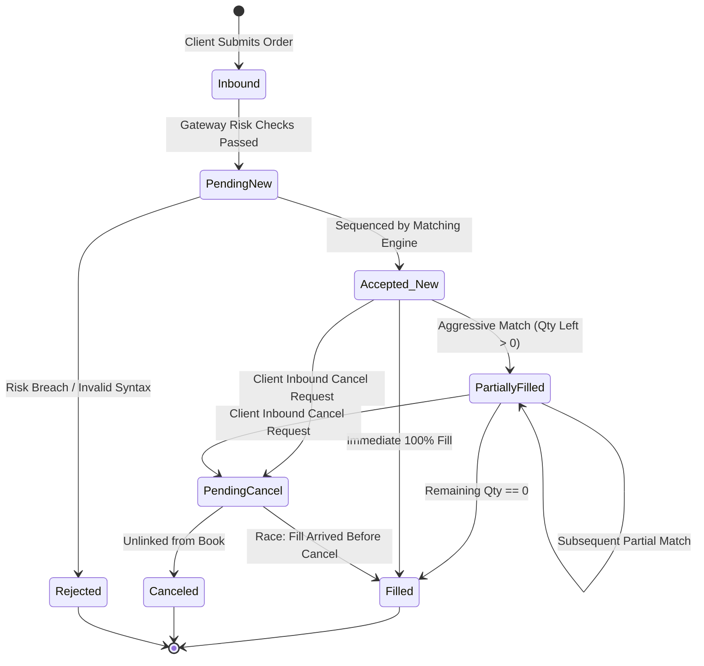

> [!summary]
> An order is a formal conditional contract instructing an electronic matching engine how and when to execute or rest liquidity. The native exchange order lifecycle is governed by an asynchronous, deterministic finite-state machine (FSM) that processes states from `PendingNew` to `Filled` or `Canceled`, handling high-frequency in-flight race conditions such as simultaneous cancel-and-fill executions.

---

## Why it matters
In high-frequency trading and market making, understanding exchange-native order types and their exact state transitions is the difference between capturing passive maker rebates and incurring catastrophic adverse execution.

If a market maker submits a quote intended to provide passive liquidity without a **Post-Only (Maker-Or-Cancel)** instruction, a fast market shift can cause the quote to cross the spread aggressively, paying taker fees instead of receiving maker rebates and executing at an adverse price. Furthermore, improperly handling in-flight state transitions (e.g., assuming a Cancel request guarantees no subsequent fill) leads to desynchronized position tracking and double-hedging risk.



---

## Mechanism

### 1. Taxonomy of Native Exchange Order Types

| Order Type | Time-in-Force (TIF) | Execution Mechanism | Microstructure Objective |
| :--- | :--- | :--- | :--- |
| **Limit Order** | `DAY`, `GTC`, `GTD` | Rests in book at fixed limit price or better. | Passive liquidity provision (captures spread + maker rebate). |
| **Market Order** | `IOC` (Immediate) | Sweeps available depth at best available prices. | Urgent execution; pays full taker fee; risks slippage. |
| **Immediate-Or-Cancel (IOC)**| `IOC` | Matches immediately up to limit price; unexecuted balance is **instantly canceled**. | Aggressive sweep without leaving resting balance in book. |
| **Fill-Or-Kill (FOK)** | `FOK` | Must execute **entire quantity immediately**; if not 100% filled, canceled entirely. | All-or-nothing execution; prevents partial fill inventory risk. |
| **Post-Only (Maker-Only)**| `DAY`, `GTC` | Enters book *only* if it does not cross the spread; if it would cross, exchange **cancels or adjusts price**. | Guarantees maker status; prevents accidental aggressive fee paying. |
| **Midpoint Peg** | `DAY`, `IOC` | Dynamically tracks $\frac{\text{Best Bid} + \text{Best Ask}}{2}$ with zero displayed size. | Trades at zero spread cost in dark venues / internal pools. |
| **Primary / Market Peg** | `DAY` | Tracks the same-side (Bid) or opposite-side (Ask) with optional tick offset. | Automated passive queue following without manual replaces. |

### 2. In-Flight Race Conditions and Invariants
The critical challenge in order state management is the **Cancel-Replace In-Flight Race Condition**:
1. **Scenario**: Participant sends `CancelOrder(ID: 101)` at $t=10.000\text{ ms}$.
2. Simultaneously, an aggressive taker arrives at the exchange and matches against `Order 101` at $t=10.001\text{ ms}$.
3. The exchange sequencer processes the Match at $t=10.001\text{ ms}$ (emitting `ExecutionReport: Filled`) and processes the Cancel at $t=10.002\text{ ms}$ (emitting `CancelReject: Order Already Filled`).
4. **State Machine Invariant**: A trading client's order state machine must handle receiving an `ExecutionReport` *after* it has already transitioned internal local state to `PendingCancel`.

---

## In Practice

### High-Speed Deterministic Order State Machine in C++20

```cpp
#include <cstdint>
#include <iostream>
#include <stdexcept>

enum class OrderState : uint8_t {
    IDLE = 0,
    PENDING_NEW,
    ACCEPTED_ACTIVE,
    PENDING_CANCEL,
    PARTIALLY_FILLED,
    FILLED,
    CANCELED,
    REJECTED
};

struct OrderStateContainer {
    uint64_t   client_order_id;
    uint64_t   exchange_order_id;
    uint32_t   price;
    uint32_t   orig_qty;
    uint32_t   cum_qty;
    uint32_t   leaves_qty;
    OrderState state;

    // Apply exchange execution report event
    void on_fill(uint32_t fill_qty, uint32_t fill_price) noexcept {
        cum_qty += fill_qty;
        leaves_qty = (orig_qty >= cum_qty) ? (orig_qty - cum_qty) : 0;

        if (leaves_qty == 0) {
            state = OrderState::FILLED;
        } else {
            state = OrderState::PARTIALLY_FILLED;
        }
    }

    // Apply exchange cancel confirmation
    void on_canceled() noexcept {
        leaves_qty = 0;
        state = OrderState::CANCELED;
    }

    // Client initiates cancel request
    bool request_cancel() noexcept {
        if (state == OrderState::ACCEPTED_ACTIVE || state == OrderState::PARTIALLY_FILLED) {
            state = OrderState::PENDING_CANCEL;
            return true;
        }
        return false; // Cannot cancel filled, rejected, or already canceled order
    }
};
```

---

## Numbers

| State Transition / Order Operation | Processing Latency | Exchange Fee Impact | Execution Jitter |
| :--- | :--- | :--- | :--- |
| **Passive Limit Order Accepted** | **~15–30 ns** | **+$0.0020 / share** (Rebate) | Low |
| **Aggressive IOC Sweep Fill** | **~25–50 ns** | **-$0.0030 / share** (Taker Fee) | Medium |
| **Post-Only Rejection (Crossed)**| **~12–20 ns** | **$0.0000** (Zero Fee) | Negligible |
| **Cancel-Replace Latency Penalty**| **~35–80 ns** | Forfeits Queue Priority | High |

---

## Trade-offs

| Order Type Configuration | Benefit | Risk / Trade-off |
| :--- | :--- | :--- |
| **Post-Only Limit Order** | Guarantees maker rebates; zero adverse taker fees. | Fails to fill if market rapidly moves away from quote. |
| **Immediate-Or-Cancel (IOC)**| Zero resting inventory risk; guaranteed instantaneous feedback. | Higher exchange fees; reveals trading intent to book without queue priority. |
| **Discretionary / Hidden Offset**| Conceals true strategy trading volume from L2/L3 market feeds. | Forfeits time priority to displayed quotes at the same price. |

---

> [!warning] Gotchas
> 1. **The Post-Only Price Sliding Trap**: Some exchanges (e.g. BATS, Nasdaq) do not reject Post-Only orders that cross the spread; instead, they silently "slide" the price to one tick away from the opposite NBBO. If an algorithmic engine is unaware of price sliding, its internal order book tracker will diverge from the exchange's true resting price.
> 2. **Cumulative Quantity Integer Overflow**: In high-frequency trading of high-volume crypto or low-priced penny equities, summing `cum_qty` across thousands of partial fills into a 32-bit integer can overflow, wrapping around to negative quantities in signed systems. *Always use `uint64_t` for cumulative volume and value tracking.*

---

## Lab
**Objective**: Build a deterministic order state machine in C++ that processes a mock sequence of 100,000 asynchronous gateway events, specifically verifying correct resolution of in-flight `Cancel` vs `Fill` race conditions.

**Success Criteria**:
1. Inject out-of-order execution events (`Fill` arriving after `RequestCancel`).
2. Assert that the state machine transitions cleanly from `PendingCancel` $\to$ `Filled` without deadlocking or asserting errors.
3. Verify that `leaves_qty + cum_qty == orig_qty` invariant holds across 100% of orders.

---

> [!question]- Self-test
> 1. **What is a "Post-Only" order and why do electronic market makers use it almost exclusively for quoting?**
>    *Answer*: A Post-Only (or Maker-Or-Cancel) order guarantees that the order will only be accepted by the matching engine if it acts as a passive liquidity provider (rests on the order book). If the order's limit price crosses the opposite side of the spread, the exchange cancels the order (or slides its price) rather than executing it aggressively, ensuring the market maker never accidentally pays taker fees or trades at an adverse selection price.
> 2. **Explain the in-flight race condition between an order cancellation request and an incoming execution fill.**
>    *Answer*: An in-flight race occurs when a client transmits a Cancel request across the network while an aggressive order crosses the client's resting quote at the exchange matching engine nearly simultaneously. The matching engine matches and fills the order before the cancel packet reaches the engine. The client's order state machine must be designed to accept an incoming `ExecutionReport: Filled` even after it has marked the order locally as `PendingCancel`.
> 3. **What is the structural difference between an Immediate-Or-Cancel (IOC) order and a Fill-Or-Kill (FOK) order?**
>    *Answer*: An **IOC** order executes immediately against whatever quantity is available at or better than its limit price, and immediately cancels any remaining unfilled residual quantity. An **FOK** order requires the *entire* requested quantity to be available immediately; if the book cannot fill 100% of the quantity in full, the order is completely rejected with zero partial execution.

---

## Related
- [[01 - Market & Microstructure Fundamentals/Continuous Trading vs Discrete Auctions]]
- [[01 - Market & Microstructure Fundamentals/Maker-Taker vs Inverted Fee Models]]
- [[03 - Matching Engine Internals/Matching Algorithms]]
- [[03 - Matching Engine Internals/Self-Match Prevention Mechanisms]]
- [[01 - Market & Microstructure Fundamentals/MOC - 01 Market & Microstructure Fundamentals]]

## Sources
- [[Sources/Trading and Exchanges by Larry Harris]]
- [[Sources/NASDAQ TotalView-ITCH 5.0 Specification]]
- [[Sources/CME iLink 3 Binary Order Entry Specification]]
