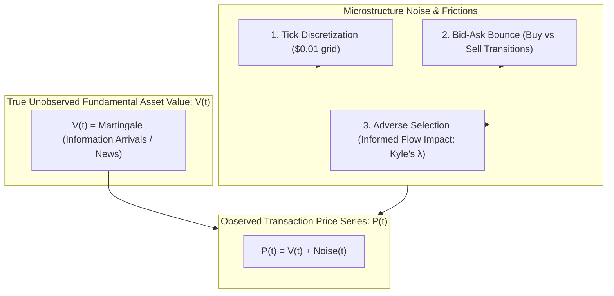

> [!summary]
> Price discovery is the continuous process through which new economic information is incorporated into asset prices via order flow. At high-frequency timescales (<1 millisecond), observed price series deviate from the fundamental asset value due to microstructure noise: discrete tick discretization, bid-ask bounce (Roll's model), and order flow toxicity (Kyle's $\lambda$).

---

## Why it matters
In quantitative high-frequency market making and statistical arbitrage, raw high-frequency returns cannot be modeled as pure Gaussian random walks. 

If an algorithmic strategy samples mid-prices every microsecond to calculate volatility or momentum without filtering for **microstructure noise**:
- **Bid-Ask Bounce** induces artificial negative serial autocorrelation ($\text{Cov}(\Delta P_t, \Delta P_{t-1}) < 0$), causing naive mean-reversion signals to trade phantom noise and bleed cash on fees.
- **Unrealized Volatility Inflation**: High-frequency sampling causes realized variance to diverge upward towards infinity (the Volatility Signature Plot phenomenon).

Decomposing the bid-ask spread into inventory, processing, and adverse selection components is the foundation of high-frequency pricing.



---

## Mechanism

### 1. Classical Microstructure Models
- **Kyle's Model (1985 - Informed Trading & Price Impact)**:
  An informed trader possesses private signal $v \sim N(p_0, \Sigma_0)$. Noise traders submit random volume $u \sim N(0, \sigma_u^2)$.
  The market maker observes only total aggregate order flow $y = x + u$ and sets price linearly:
  $$P(y) = P_0 + \lambda \cdot y$$
  Where **Kyle's Lambda ($\lambda$)** measures **market illiquidity and adverse selection price impact**:
  $$\lambda = \frac{\sqrt{\text{Var}(v)}}{2 \sigma_u}$$
  *Higher $\lambda \implies$ higher price impact per share traded.*

- **Glosten-Milgrom Model (1985 - Bid-Ask Spread Dynamics)**:
  Proves that even with competitive, zero-profit market makers with zero operational costs, a positive bid-ask spread *must* exist to compensate for losses incurred against informed traders with probability $\mu$.

### 2. The Bid-Ask Spread Decomposition
The observed bid-ask spread is decomposed into three structural components:
$$\text{Total Spread} = \text{Order Handling Costs} + \text{Inventory Holding Risk} + \text{Adverse Selection Component}$$

### 3. Bid-Ask Bounce (Roll's 1984 Model)
Because market transactions bounce randomly between the Bid ($P_{\text{mid}} - \frac{S}{2}$) and the Ask ($P_{\text{mid}} + \frac{S}{2}$), consecutive price changes $\Delta P_t$ exhibit negative first-order serial covariance.
Roll derived the **Effective Spread ($S$)** from serial covariance:
$$\text{Cov}(\Delta P_t, \Delta P_{t-1}) = -\frac{S^2}{4} \implies S = 2\sqrt{-\text{Cov}(\Delta P_t, \Delta P_{t-1})}$$

---

## In Practice

### High-Frequency Roll Spread & Kyle's Lambda Estimator in C++20

```cpp
#include <cstdint>
#include <vector>
#include <cmath>
#include <numeric>
#include <iostream>

class MicrostructureAnalyzer {
public:
    // Estimate Roll Effective Spread: S = 2 * sqrt(-Cov(dP_t, dP_{t-1}))
    static double estimate_roll_spread(const std::vector<double>& trade_prices) noexcept {
        if (trade_prices.size() < 3) return 0.0;

        size_t n = trade_prices.size() - 1;
        std::vector<double> dp(n);
        for (size_t i = 0; i < n; ++i) {
            dp[i] = trade_prices[i + 1] - trade_prices[i];
        }

        // Calculate sample means of dp[t] and dp[t-1]
        double mean_dp_t = 0.0;
        double mean_dp_prev = 0.0;
        size_t count = n - 1;

        for (size_t i = 1; i < n; ++i) {
            mean_dp_t += dp[i];
            mean_dp_prev += dp[i - 1];
        }
        mean_dp_t /= count;
        mean_dp_prev /= count;

        // Compute serial autocovariance Cov(dp_t, dp_{t-1})
        double cov = 0.0;
        for (size_t i = 1; i < n; ++i) {
            cov += (dp[i] - mean_dp_t) * (dp[i - 1] - mean_dp_prev);
        }
        cov /= count;

        // If serial covariance is negative (standard bid-ask bounce), compute spread
        if (cov < 0.0) {
            return 2.0 * std::sqrt(-cov);
        }
        return 0.0; // Positive covariance implies strong trending flow dominating bounce
    }

    // Estimate Kyle's Lambda (Price Impact): dP = lambda * SignedVolume
    static double estimate_kyles_lambda(const std::vector<double>& price_deltas, 
                                        const std::vector<double>& signed_volumes) noexcept {
        if (price_deltas.size() != signed_volumes.size() || price_deltas.empty()) return 0.0;

        double sum_vol_sq = 0.0;
        double sum_dp_vol = 0.0;

        for (size_t i = 0; i < price_deltas.size(); ++i) {
            sum_vol_sq += signed_volumes[i] * signed_volumes[i];
            sum_dp_vol += price_deltas[i] * signed_volumes[i];
        }

        if (sum_vol_sq == 0.0) return 0.0;
        return sum_dp_vol / sum_vol_sq; // OLS slope coefficient
    }
};
```

---

## Numbers

| Parameter / Metric | Liquid US Equity (e.g. SPY, AAPL) | Illiquid Small-Cap Equity | US Treasury Futures (10Y) |
| :--- | :--- | :--- | :--- |
| **Quoted Spread** | **1 tick (\$0.01 / ~1-2 bps)** | 5–25 ticks (\$0.05–0.25) | **1 tick (0.0156 / <0.5 bps)** |
| **Roll Effective Spread** | **~0.8–1.0 cents** | ~8–20 cents | ~0.015 ticks |
| **Adverse Selection Ratio**| **~40–60% of total spread** | ~70–85% of total spread | ~30–45% of total spread |
| **Noise Decay Horizon** | **<50 milliseconds** | 500 ms – 5 seconds | **<5 milliseconds** |

---

## Trade-offs

| Sampling Frequency | Signal Value | Microstructure Noise Contamination |
| :--- | :--- | :--- |
| **Ultra-High Frequency (Tick / Sub-ms)**| Maximum reaction speed to immediate order book updates. | **Extreme noise**: bid-ask bounce, quote flickering, stale ticks. |
| **Sampled Frequency (100ms – 1s)** | Balances information arrival against noise filtering. | Sacrifices top-of-book speed advantage in race conditions. |
| **Volume / Tick Time Sampling** | Samples every $N$ shares/trades; normalizes volatility. | Variable clock time intervals; complex real-time hedging. |

---

> [!warning] Gotchas
> 1. **The Roll Model Positive Covariance Breakdown**: In strongly trending or momentum-driven market regimes, aggressive directional sweeps cause $\text{Cov}(\Delta P_t, \Delta P_{t-1}) > 0$ (positive serial correlation). The naive Roll formula returns a square root of a negative number (NaN/0.0). *Production models must separate trending trade runs from pure bounce intervals.*
> 2. **Quote Flickering (Phantom Liquidity)**: High-frequency market making algorithms post and cancel quotes within 10–50 microsecond intervals. Algorithms sampling at 100ms may observe a deep book that vanishes before an aggressive sweep can arrive.

---

## Lab
**Objective**: Ingest a real or simulated 100,000-tick price stream, compute the Volatility Signature Plot across sampling frequencies from 1 ms to 10 seconds, and calculate the Roll effective spread.

**Success Criteria**:
1. Plot Realized Volatility $\text{RV}(\Delta t)$ vs sampling interval $\Delta t$.
2. Demonstrate that $\text{RV}$ spikes sharply as $\Delta t \to 1\text{ ms}$ due to microstructure noise.
3. Compute Roll's effective spread: verify it matches the simulated tick spread within $\pm 5\%$.

---

> [!question]- Self-test
> 1. **Why does high-frequency sampling (e.g., 1 millisecond intervals) cause Realized Volatility estimates to diverge upward in a Volatility Signature Plot?**
>    *Answer*: At sub-second frequencies, observed price movements are dominated by **microstructure noise** (primarily the discrete Bid-Ask Bounce as trades alternate between bid and ask quotes). Because the bid-ask bounce adds artificial variance on every single tick that does not reflect fundamental price changes, summing squared returns over millions of high-frequency intervals inflates Realized Volatility ($\text{RV} \propto \frac{1}{\Delta t}$).
> 2. **What does Kyle's Lambda ($\lambda$) measure in an electronic market and what happens to $\lambda$ when market volatility increases?**
>    *Answer*: Kyle's Lambda ($\lambda = \frac{\Delta P}{\text{Order Flow}}$) measures **price impact per unit of order volume** (adverse selection cost / illiquidity). When fundamental asset volatility ($\Sigma_0$) increases, market makers face greater adverse selection risk from informed traders, causing them to widen spreads and increase $\lambda$, which increases the price impact of every executed trade.
> 3. **Explain the mathematical intuition behind Roll's effective spread estimator ($S = 2\sqrt{-\text{Cov}(\Delta P_t, \Delta P_{t-1})}$).**
>    *Answer*: If trades alternate randomly between buyer-initiated trades (at the Ask) and seller-initiated trades (at the Bid), a price increase from Bid $\to$ Ask ($+\Delta P$) is statistically most likely to be followed by a price decrease from Ask $\to$ Bid ($-\Delta P$). This continuous bouncing creates a negative first-order autocovariance in price changes whose magnitude is directly proportional to the squared bid-ask spread ($-\frac{S^2}{4}$).

---

## Related
- [[01 - Market & Microstructure Fundamentals/Continuous Trading vs Discrete Auctions]]
- [[01 - Market & Microstructure Fundamentals/Maker-Taker vs Inverted Fee Models]]
- [[01 - Market & Microstructure Fundamentals/Order Book Dynamics and Queue Position]]
- [[01 - Market & Microstructure Fundamentals/Market Fragmentation and Reg NMS]]
- [[01 - Market & Microstructure Fundamentals/MOC - 01 Market & Microstructure Fundamentals]]

## Sources
- [[Sources/Empirical Market Microstructure by Joel Hasbrouck]]
- [[Sources/Continuous Auctions and Informed Trader by Albert S. Kyle (1985)]]
- [[Sources/A Simple Implicit Measure of the Effective Bid-Ask Spread in an Efficient Market by Richard Roll (1984)]]
