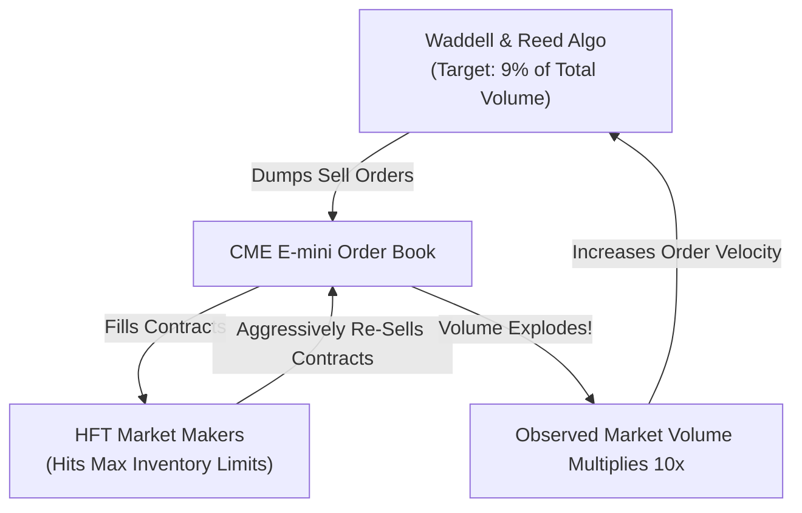

# War Story — The May 6, 2010 Flash Crash: Cross-Market Cascades & Liquidity Evaporation

> [!summary]
> On May 6, 2010, between 14:32 and 14:45 EST, the US equity and derivatives markets suffered the fastest collapse in financial history: the Dow Jones plunged ~1,000 points (~9%) in minutes, wiping out nearly \$1 trillion in market value before recovering within 20 minutes. This war story examines the cross-asset execution feedback loops, algorithmic order book depletion, stub quotes, and the resulting regulatory reforms (Limit-Up/Limit-Down & SEC Rule 15c3-5).

---

## 1. Incident Timeline & Chronology (EST)

```mermaid
timeline
    title The May 6, 2010 Flash Crash Timeline
    14:32:00 : Waddell & Reed begins selling 75,000 E-mini contracts (~$4.1B) via a naive TWAP/VWAP algorithm set to 9% participation rate.
    14:41:00 : HFT market makers absorb initial flow, accumulate maximum long inventory, and aggressively dump contracts into the order book.
    14:45:15 : CME Globex initiates a mandatory 5-second Stop Logic Pause as E-mini cascades down 60 points (~5.5%).
    14:45:28 : Liquidity evaporates across New Jersey equity venues. Internal risk engines across all HFT market makers trip, mass-canceling bids.
    14:47:00 : Stub Quotes executed: Equities trade at $0.01 (Accenture) and $100,000 (Apple).
    14:50:00 : Price discovery resumes; buyers flood in; market rebounds to pre-crash levels within 15 minutes.
```

---

## 2. Technical & Microstructural Root Cause Analysis

### A. The Defective Execution Algorithm (Waddell & Reed)
- **The Trade**: Mutual fund complex Waddell & Reed initiated a massive hedging transaction to sell **75,000 E-mini S&P 500 contracts** (notional value $\approx \$4.1\text{ billion}$).
- **The Algorithmic Flaw**: The execution algorithm was configured with a naive **Volume Participation Rate (9%)** without any price or time collars:
$$\text{Target Order Rate} = 0.09 \times \text{Observed Total Market Volume}$$
- **The Execution Feedback Loop**:
  1. The algorithm sold contracts into the market.
  2. High-frequency market makers bought the contracts, rapidly hit their risk limits, and turned around to immediately sell them to other market participants.
  3. This rapid buying and selling dramatically inflated **Total Observed Market Volume**.
  4. The naive algorithm observed the higher volume and **accelerated its own selling rate**, dumping the 75,000 contracts in just **20 minutes** (a trade that typically takes 5+ hours).



### B. Cross-Market Contagion (Chicago CME $\to$ New Jersey Equities)
1. **Lead-Lag Arbitrage**: As the CME E-mini futures crashed in Aurora, IL, automated statistical arbitrage engines detected the dislocation between futures and New Jersey cash equities (SPY ETF and S&P 500 stocks in Carteret and Mahwah).
2. **Aggressive Equity Selling**: StatArb algorithms aggressively sold SPY and individual equities across NASDAQ, NYSE, and BATS while simultaneously buying cheap E-mini futures in Chicago.
3. **Internal Risk Threshold Breaches**: As equity order books rapidly moved down, market-making firms (e.g. Getco, Tradebot, Knight) hit **maximum loss thresholds and unhedged delta limits**. Automated circuit breakers tripped, causing market makers to **completely withdraw all resting bids from lit exchange order books**.

### C. The "Stub Quote" Disaster
- **The Mechanism**: Under market-making rules at the time, certain designated market makers were required to maintain continuous two-sided quotes. To comply with the rule without taking real execution risk, firms placed automated **"Stub Quotes"** at absurd, nominal price levels:
  - Bids at **\$0.01** (1 cent)
  - Asks at **\$100,000.00**
- **The Catastrophe**: When market makers pulled real liquidity, aggressive market sell orders routed to exchanges swept through the empty order books and matched directly against the **\$0.01 Stub Quotes**:
  - Shares of blue-chip consulting giant **Accenture (`ACN`) traded down from \$40.00 to \$0.01**.
  - Over **20,000 trades** executed at prices more than 60% away from their pre-crash value.

---

## 3. Permanent Regulatory & Architectural Remediations

Following the joint CFTC-SEC investigation, the financial industry instituted permanent structural safeguards:

| Structural Vulnerability | 2010 State | Permanent Modern Remediation |
| :--- | :--- | :--- |
| **Cascading Single-Stock Collapses**| None (Continuous uncrossing). | **Limit-Up/Limit-Down (LULD / Plan NMS)**: Halts trading for 5 minutes if a stock trades $>5\%$ away from its 5-minute rolling average. |
| **Stub Quotes at \$0.01** | Permitted by exchange rules. | **Banned**: Market maker quotes must remain within a defined percentage (e.g. 8%) of the National Best Bid and Offer (NBBO). |
| **Runaway Execution Algorithms** | No mandatory client-side price checks. | **SEC Rule 15c3-5**: Mandatory, non-bypassable pre-trade price collars and order size limit gates. |
| **CME Futures Cascades** | 5-Second Stop Logic Pause. | **CME Velocity Logic & Dynamic Circuit Breakers**: Staged 10-second pauses and expanding price bands. |

---

## 4. Key Engineering Lessons for Trading Infrastructure

1. **Never Write a Volume-Participation Algo Without Price Sensitivity**: An execution algorithm must never rely solely on observed volume; it must enforce hard rate-limiters (`max_contracts_per_minute`) and price-slippage thresholds.
2. **Handle Liquidity Evaporation in StatArb Models**: Cross-market arbitrage algorithms must check whether the opposite leg's order book has sufficient displayed depth before executing an aggressive sweep. If depth is zero, the model must immediately abort.
3. **Design Graceful Market-Making Back-Off**: Instead of dropping all quotes abruptly, an algorithmic market maker should dynamically widen spreads and decrease quoting sizes proportionally to volatility and queue velocity.

---

## Related Notes
- [[01 - Market & Microstructure Fundamentals/Market Fragmentation and Reg NMS]]
- [[01 - Market & Microstructure Fundamentals/Order Book Dynamics and Queue Position]]
- [[02 - Exchange Architecture/Pre-Trade Risk Checks at Wire Speed]]
- [[13 - Reliability, Ops & Testing/Automated Kill Switches and Risk Circuit Breakers]]
- [[14 - Industry Map & Canon/MOC - 14 Industry Map & Canon]]

## Sources
- [[Sources/CFTC-SEC Joint Report on the Findings of the May 6, 2010 Flash Crash]]
- [[Sources/Flash Boys by Michael Lewis]]
- [[Sources/Trading and Exchanges by Larry Harris]]
