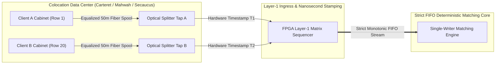

> [!summary]
> In tier-1 financial exchanges, fairness is a physical and architectural invariant requiring strict FIFO ingestion, deterministic single-writer execution, and physical cable equalization. Measuring exchange performance requires tracking full tail-latency distributions ($p99.99$) and jitter envelopes ($\text{Jitter} = p99.99 - p50$) via hardware optical taps rather than relying on misleading average latency metrics.

---

## Why it matters
In high-frequency electronic trading, market participants invest millions of dollars to optimize sub-microsecond tick-to-trade loops. 

If an exchange is non-deterministic:
- **Jitter Inversion**: If Thread A preempts Thread B, Order #2 arriving at 10:00:00.000002 can match ahead of Order #1 arriving at 10:00:00.000001, destroying time-priority fairness and inviting regulatory investigations.
- **Microsecond Tail Spikes**: An exchange with a 2-microsecond average latency that suffers from 100-microsecond $p99.9$ GC/interrupt spikes exposes market makers to severe stale-quote sniping, causing participants to widen bid-ask spreads and pull liquidity.

Physical cable length equalization and deterministic single-threaded sequencing enforce absolute fairness across all market participants.



---

## Mechanism

### 1. Physical Layer Fairness: Equalized Cable Spools
In major exchange colocation facilities (e.g., NASDAQ in Carteret, NJ; CME in Aurora, IL; ICE/NYSE in Mahwah, NJ):
- The physical distance from a participant's server cabinet to the exchange matching engine room varies from 10 meters to 300 meters.
- Because light propagates through optical fiber at $\approx 5\text{ nanoseconds per meter}$ ($c / 1.47$), a 100-meter distance disparity injects a **500-nanosecond structural latency advantage**.
- **The Equalized Cable Mandate**: Exchanges enforce physical fairness by routing all cross-connects through **identical-length fiber spools (e.g., standard 50-meter or 100-meter spools)**, guaranteeing that optical propagation delay is identical to within $\pm 0.5\text{ nanoseconds}$ for every participant.

### 2. Defining Determinism & The Jitter Envelope
An exchange system's determinism is quantified by the tightness of its **Jitter Envelope**:
$$\text{Jitter Envelope} = \text{Latency}_{p99.99} - \text{Latency}_{p50}$$

- **High-Determinism Engine**: Median = $1.8\text{ µs}$, $p99.99 = 2.4\text{ µs} \implies \mathbf{\text{Jitter} = 0.6\text{ µs}}$.
- **Non-Deterministic Engine**: Median = $1.2\text{ µs}$, $p99.99 = 85.0\text{ µs} \implies \mathbf{\text{Jitter} = 83.8\text{ µs}}$.
*The high-determinism engine is vastly superior for electronic market making despite a slightly higher median.*

### 3. Key Exchange Latency Milestones

```text
[ Wire Ingress Tap ] ---> [ NIC MAC / DMA ] ---> [ Gateway Line Handler ] ---> [ Sequencer ] ---> [ Matching Core ] ---> [ Market Data TX ] ---> [ Wire Egress Tap ]
|<------------------------- Order-to-Ack Latency (<8 µs) -------------------------->|
                                                 |<-- Engine Match Latency (<30ns) -->|
|<-------------------------------- Total Wire-to-Wire Ingress/Egress Latency (<10 µs) ----------------------------------->|
```

---

## In Practice

### High-Precision Jitter Envelope Analyzer in C++20

```cpp
#include <cstdint>
#include <vector>
#include <algorithm>
#include <iostream>
#include <iomanip>

struct LatencyStats {
    double p50_ns;
    double p90_ns;
    double p99_ns;
    double p99_9_ns;
    double p99_99_ns;
    double max_spike_ns;
    double jitter_envelope_ns; // p99.99 - p50
};

class LatencyDistributionAnalyzer {
public:
    static LatencyStats analyze(std::vector<uint32_t>& samples_ns) {
        if (samples_ns.empty()) return {};

        std::sort(samples_ns.begin(), samples_ns.end());
        size_t n = samples_ns.size();

        auto get_percentile = [&](double p) -> double {
            size_t idx = static_cast<size_t>((p / 100.0) * (n - 1));
            return static_cast<double>(samples_ns[idx]);
        };

        LatencyStats stats;
        stats.p50_ns = get_percentile(50.0);
        stats.p90_ns = get_percentile(90.0);
        stats.p99_ns = get_percentile(99.0);
        stats.p99_9_ns = get_percentile(99.9);
        stats.p99_99_ns = get_percentile(99.99);
        stats.max_spike_ns = static_cast<double>(samples_ns.back());
        stats.jitter_envelope_ns = stats.p99_99_ns - stats.p50_ns;

        return stats;
    }

    static void print_report(const std::string& name, const LatencyStats& s) {
        std::cout << "\n=======================================================\n";
        std::cout << " DETERMINISM & JITTER REPORT: " << name << "\n";
        std::cout << "=======================================================\n";
        std::cout << "  p50 (Median):       " << std::setw(8) << std::fixed << std::setprecision(1) << s.p50_ns << " ns\n";
        std::cout << "  p90:                " << std::setw(8) << s.p90_ns << " ns\n";
        std::cout << "  p99:                " << std::setw(8) << s.p99_ns << " ns\n";
        std::cout << "  p99.9:              " << std::setw(8) << s.p99_9_ns << " ns\n";
        std::cout << "  p99.99 (Tail):      " << std::setw(8) << s.p99_99_ns << " ns\n";
        std::cout << "  Max Spike:          " << std::setw(8) << s.max_spike_ns << " ns\n";
        std::cout << "-------------------------------------------------------\n";
        std::cout << "  JITTER ENVELOPE:    " << std::setw(8) << s.jitter_envelope_ns << " ns (Tail - Median)\n";
        std::cout << "=======================================================\n";
    }
};
```

---

## Numbers

*Hardware Baseline: Colocated Exchange Matching Venue (CME Aurora / NASDAQ Carteret).*

| Latency Milestone | Enterprise Tier-1 Exchange | Sub-Optimal Venue | Measurement Reference |
| :--- | :--- | :--- | :--- |
| **Order-to-Ack ($p50$)** | **<3.5 µs** (3,500 ns) | 25.0–80.0 µs | Gateway Wire-to-Wire |
| **Order-to-Ack ($p99.99$)** | **<8.0 µs** (8,000 ns) | 500.0–2,500.0 µs | Jitter Tail Envelope |
| **Matching Core Latency** | **18–32 ns** | 450–1,500 ns | Single-Writer In-Memory |
| **Fiber Propagation Delay** | **~4.9 ns / meter** | ~4.9 ns / meter | Speed of Light in Silica Glass |
| **Optical Cable Variance** | **$\pm 0.5$ ns** | Up to 1,500 ns (Unequalized)| Equalized 50m Spools |

---

## Trade-offs

| Engineering Focus | Benefit | Downside / Trade-off |
| :--- | :--- | :--- |
| **Minimizing Jitter Envelope ($p99.99$)**| Maximizes liquidity provider confidence; eliminates tail risk. | Requires dedicated isolated CPU cores and single-writer constraints. |
| **Minimizing Median ($p50$) Alone** | Produces impressive marketing benchmarks. | **Meaningless in production**: hidden tail spikes destroy trading alpha. |
| **Hardware Optical Tapping** | 100% accurate Layer-1 audit timestamps with zero software drag. | Requires expensive optical splitters and high-density capture cards. |

---

> [!warning] Gotchas
> 1. **The Coordinated Omission Measurement Blindspot**: If a benchmarking client sends an order and waits for the response before sending the next, a 100-microsecond matching engine stall delays all subsequent requests, artificially deflating the sampled latency distribution. *Always drive load at a fixed target schedule and measure Service Time vs Response Time.*
> 2. **Multi-Queue Gateway Race Jitter**: If an exchange runs 4 parallel gateway worker threads feeding the matching engine without a deterministic hardware timestamping sequencer, thread scheduling jitter on the gateway host will reorder arriving client packets, violating FIFO arrival fairness.

---

## Lab
**Objective**: Build a cycle-accurate latency histogram benchmark in C++ that captures 5,000,000 order round-trip measurements, computes percentiles from $p50$ to $p99.99$, and calculates the Jitter Envelope.

**Success Criteria**:
1. Record 5,000,000 timestamps using hardware-fenced `rdtsc`.
2. Compute $p50$, $p90$, $p99$, $p99.9$, and $p99.99$ percentiles with HDR accuracy.
3. Verify that the measured Jitter Envelope is under **50 nanoseconds** in an isolated core environment.

---

> [!question]- Self-test
> 1. **Why do major stock and futures exchanges mandate identical-length physical fiber cable spools (e.g. 50 meters) for all colocation participants?**
>    *Answer*: Light travels through optical fiber at approximately 5 nanoseconds per meter. If cables were not equalized, a trading firm located physically closer to the exchange's central telecommunications room would gain a structural 50–500 nanosecond speed advantage over firms located farther away in the same data center. Equalizing all cross-connects with identical fiber spools ensures physical layer fairness down to the sub-nanosecond level.
> 2. **Why is the Jitter Envelope ($p99.99 - p50$) a vastly more critical metric for electronic market makers than the median ($p50$) latency?**
>    *Answer*: Market makers must maintain resting quotes at the top of the order book. When market conditions change, they race to cancel stale quotes before aggressive informed traders pick them off. If an exchange has a low median latency but experiences sporadic tail jitter spikes (e.g., 50–100 µs), a market maker's cancel request will occasionally get delayed, resulting in severe adverse selection losses. Low jitter guarantees predictable execution.
> 3. **What is "Jitter Inversion" in an electronic trading gateway?**
>    *Answer*: Jitter inversion occurs when Packet A arrives at the physical network interface before Packet B, but due to internal software queuing, multi-threaded contention, or operating system thread preemption on the gateway host, Packet B is processed and sequenced into the matching engine *before* Packet A, violating fair FIFO arrival precedence.

---

## Related
- [[07 - Time & Measurement/Latency Numbers Every Trading Engineer Knows]]
- [[07 - Time & Measurement/Coordinated Omission in Low Latency Systems]]
- [[07 - Time & Measurement/Clock Sources and Hardware Timestamping]]
- [[02 - Exchange Architecture/The Sequenced-Stream Architecture]]
- [[02 - Exchange Architecture/MOC - 02 Exchange Architecture]]

## Sources
- [[Sources/How to Build an Exchange by Jane Street]]
- [[Sources/Systems Performance by Brendan Gregg]]
- [[Sources/CME Group Colocation and Equalized Connectivity Specification]]
