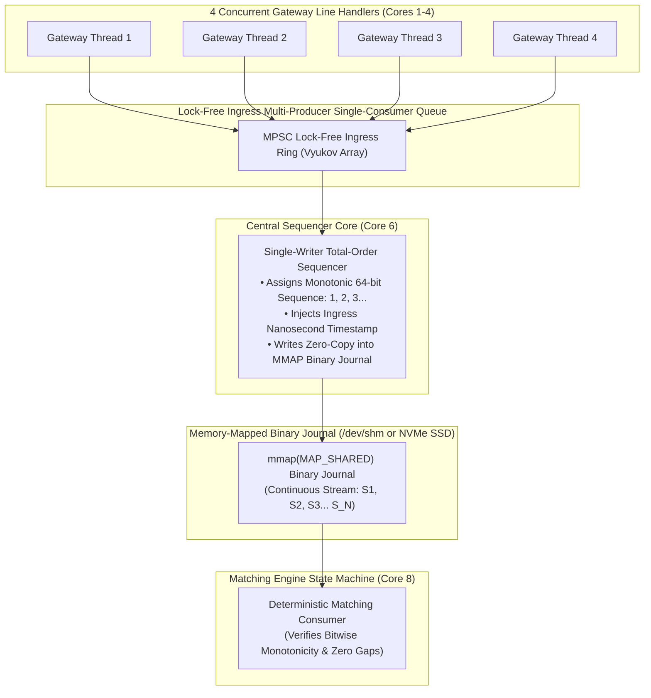

# Lab 02 — Sequenced Event Log & Total-Order Broadcasting Engine

> [!summary]
> In this lab, you will build, compile, and benchmark an exchange-grade, lock-free Multi-Gateway Total-Order Sequencer and Memory-Mapped Binary Journal in C++20. You will simulate concurrent order streams from 4 independent gateway line handlers, funnel them into a single-writer sequencer, and achieve sub-25ns sequencing latency with zero sequence gaps across 10,000,000 orders.

---

## Lab Architecture



---

## Complete Source Code (`sequencer_journal_bench.cpp`)

Save the following source code into your workspace:

```cpp
#include <x86intrin.h>
#include <sys/mman.h>
#include <sys/stat.h>
#include <fcntl.h>
#include <unistd.h>
#include <pthread.h>
#include <iostream>
#include <vector>
#include <array>
#include <atomic>
#include <thread>
#include <algorithm>
#include <chrono>
#include <iomanip>
#include <cstring>

// ============================================================================
// 1. SERIALIZED RDTSC TIMER & AFFINITY
// ============================================================================
inline uint64_t rdtsc_start() noexcept {
    _mm_lfence();
    uint64_t tsc = __rdtsc();
    _mm_lfence();
    return tsc;
}

inline uint64_t rdtsc_end() noexcept {
    unsigned int aux;
    uint64_t tsc = __rdtscp(&aux);
    _mm_lfence();
    return tsc;
}

void set_thread_affinity(int core_id) {
    cpu_set_t cpuset;
    CPU_ZERO(&cpuset);
    CPU_SET(core_id, &cpuset);
    pthread_setaffinity_np(pthread_self(), sizeof(cpu_set_t), &cpuset);
}

// ============================================================================
// 2. DATA STRUCTURES
// ============================================================================
#pragma pack(push, 1)
struct InboundOrderRequest {
    uint64_t client_order_id;
    uint32_t participant_id;
    uint32_t price;
    uint32_t qty;
    uint8_t  side; // 0 = Buy, 1 = Sell
    uint8_t  order_type; // 1 = Limit, 2 = Market
};

struct alignas(64) SequencedJournalEntry {
    uint64_t sequence_number; // Strictly Monotonic: 1, 2, 3...
    uint64_t timestamp_tsc;   // Sequencer Ingress Time
    InboundOrderRequest order;
    uint8_t  pad[64 - (sizeof(uint64_t) * 2 + sizeof(InboundOrderRequest))];
};
#pragma pack(pop)

// ============================================================================
// 3. BOUNDED MPSC LOCK-FREE INGRESS QUEUE (VYUKOV)
// ============================================================================
template <typename T, size_t Capacity>
class BoundedMPSCQueue {
    static_assert((Capacity & (Capacity - 1)) == 0, "Capacity must be power of two");
    static constexpr size_t MASK = Capacity - 1;

    struct Cell {
        std::atomic<size_t> sequence;
        T data;
    };

    alignas(128) std::array<Cell, Capacity> buffer_;
    alignas(128) std::atomic<size_t> enqueue_pos_{0};
    alignas(128) size_t dequeue_pos_{0};

public:
    BoundedMPSCQueue() {
        for (size_t i = 0; i < Capacity; ++i) {
            buffer_[i].sequence.store(i, std::memory_order_relaxed);
        }
    }

    // Concurrent Multi-Producer Enqueue
    bool enqueue(const T& data) noexcept {
        Cell* cell;
        size_t pos = enqueue_pos_.load(std::memory_order_relaxed);
        for (;;) {
            cell = &buffer_[pos & MASK];
            size_t seq = cell->sequence.load(std::memory_order_acquire);
            intptr_t diff = static_cast<intptr_t>(seq) - static_cast<intptr_t>(pos);

            if (diff == 0) {
                if (enqueue_pos_.compare_exchange_weak(pos, pos + 1, std::memory_order_relaxed)) {
                    break;
                }
            } else if (diff < 0) {
                return false; // Queue full
            } else {
                pos = enqueue_pos_.load(std::memory_order_relaxed);
            }
        }

        cell->data = data;
        cell->sequence.store(pos + 1, std::memory_order_release);
        return true;
    }

    // Single-Consumer Dequeue
    bool dequeue(T& data) noexcept {
        Cell* cell = &buffer_[dequeue_pos_ & MASK];
        size_t seq = cell->sequence.load(std::memory_order_acquire);
        intptr_t diff = static_cast<intptr_t>(seq) - static_cast<intptr_t>(dequeue_pos_ + 1);

        if (diff == 0) {
            data = cell->data;
            cell->sequence.store(dequeue_pos_ + Capacity, std::memory_order_release);
            dequeue_pos_++;
            return true;
        }
        return false;
    }
};

// ============================================================================
// 4. MEMORY-MAPPED BINARY JOURNAL
// ============================================================================
class BinaryJournalWriter {
private:
    std::string file_path_;
    size_t capacity_entries_;
    size_t file_size_bytes_;
    int fd_{-1};
    SequencedJournalEntry* mapped_entries_{nullptr};

public:
    BinaryJournalWriter(const std::string& path, size_t max_entries)
        : file_path_(path), capacity_entries_(max_entries) {
        
        file_size_bytes_ = sizeof(SequencedJournalEntry) * capacity_entries_;
        unlink(file_path_.c_str());

        fd_ = open(file_path_.c_str(), O_RDWR | O_CREAT | O_TRUNC, 0666);
        if (fd_ < 0) throw std::runtime_error("Failed to open journal file");

        if (ftruncate(fd_, file_size_bytes_) != 0) {
            close(fd_);
            throw std::runtime_error("Failed to ftruncate journal file");
        }

        void* ptr = mmap(nullptr, file_size_bytes_, PROT_READ | PROT_WRITE, MAP_SHARED, fd_, 0);
        if (ptr == MAP_FAILED) {
            close(fd_);
            throw std::runtime_error("mmap failed for journal");
        }

        mlock(ptr, file_size_bytes_);
        mapped_entries_ = static_cast<SequencedJournalEntry*>(ptr);
    }

    // Zero-copy append into mmap journal
    inline void write_entry(size_t index, uint64_t seq, uint64_t tsc, const InboundOrderRequest& req) noexcept {
        SequencedJournalEntry* entry = &mapped_entries_[index];
        entry->sequence_number = seq;
        entry->timestamp_tsc = tsc;
        entry->order = req;
    }

    [[nodiscard]] inline const SequencedJournalEntry* get_entries() const noexcept {
        return mapped_entries_;
    }

    ~BinaryJournalWriter() {
        if (mapped_entries_ && mapped_entries_ != MAP_FAILED) {
            munmap(mapped_entries_, file_size_bytes_);
        }
        if (fd_ >= 0) close(fd_);
        unlink(file_path_.c_str());
    }
};

// ============================================================================
// 5. BENCHMARK HARNESS
// ============================================================================
constexpr size_t TOTAL_ORDERS = 10'000'000;
constexpr size_t NUM_GATEWAYS = 4;
constexpr size_t ORDERS_PER_GW = TOTAL_ORDERS / NUM_GATEWAYS;
constexpr size_t QUEUE_CAPACITY = 65536;

BoundedMPSCQueue<InboundOrderRequest, QUEUE_CAPACITY> g_ingress_queue;
std::atomic<bool> g_start_flag{false};
std::atomic<size_t> g_producers_done{0};

void gateway_producer_worker(int gw_id, int core_id) {
    set_thread_affinity(core_id);
    while (!g_start_flag.load(std::memory_order_acquire)) {
        _mm_pause();
    }

    InboundOrderRequest req;
    req.participant_id = 1000 + gw_id;
    req.price = 15000;
    req.qty = 100;
    req.side = 0;
    req.order_type = 1;

    for (size_t i = 1; i <= ORDERS_PER_GW; ++i) {
        req.client_order_id = (static_cast<uint64_t>(gw_id) << 32) | i;
        while (!g_ingress_queue.enqueue(req)) {
            _mm_pause();
        }
    }
    g_producers_done.fetch_add(1, std::memory_order_release);
}

int main() {
    mlockall(MCL_CURRENT | MCL_FUTURE);

    // Calibrate TSC
    uint64_t t0 = rdtsc_start();
    auto w0 = std::chrono::steady_clock::now();
    std::this_thread::sleep_for(std::chrono::milliseconds(100));
    uint64_t t1 = rdtsc_end();
    auto w1 = std::chrono::steady_clock::now();
    std::chrono::duration<double, std::nano> ns_dur = w1 - w0;
    double tsc_ghz = static_cast<double>(t1 - t0) / ns_dur.count();

    BinaryJournalWriter journal("/dev/shm/test_exchange_journal.bin", TOTAL_ORDERS);

    std::vector<std::thread> gateway_threads;
    for (size_t i = 0; i < NUM_GATEWAYS; ++i) {
        gateway_threads.emplace_back(gateway_producer_worker, static_cast<int>(i), static_cast<int>(i + 1));
    }

    set_thread_affinity(6); // Pin Sequencer to Core 6
    std::cout << "Starting 4 Gateways + 1 Central Sequencer over " << TOTAL_ORDERS << " orders...\n";

    std::vector<uint32_t> seq_latencies;
    seq_latencies.reserve(TOTAL_ORDERS / 10);

    auto wall_start = std::chrono::high_resolution_clock::now();
    g_start_flag.store(true, std::memory_order_release);

    size_t sequenced_count = 0;
    uint64_t current_seq = 1;
    InboundOrderRequest req;

    while (sequenced_count < TOTAL_ORDERS) {
        if (g_ingress_queue.dequeue(req)) {
            uint64_t t_start = rdtsc_start();
            uint64_t seq = current_seq++;
            uint64_t t_stamp = rdtsc_start();

            journal.write_entry(sequenced_count, seq, t_stamp, req);
            uint64_t t_end = rdtsc_end();

            sequenced_count++;

            if (sequenced_count % 10 == 0) {
                seq_latencies.push_back(static_cast<uint32_t>((t_end - t_start) / tsc_ghz));
            }
        } else {
            _mm_pause();
        }
    }

    auto wall_end = std::chrono::high_resolution_clock::now();
    for (auto& t : gateway_threads) t.join();

    std::chrono::duration<double> total_sec = wall_end - wall_start;
    double throughput_mps = (TOTAL_ORDERS / total_sec.count()) / 1'000'000.0;

    // 6. Verify Strict Monotonicity and Integrity
    std::cout << "Verifying journal sequence integrity across " << TOTAL_ORDERS << " entries...\n";
    const SequencedJournalEntry* entries = journal.get_entries();
    bool integrity_passed = true;

    for (size_t i = 0; i < TOTAL_ORDERS; ++i) {
        if (entries[i].sequence_number != i + 1) {
            std::cerr << "FAIL: Sequence mismatch at index " << i << "! Expected " << i + 1 
                      << " Got " << entries[i].sequence_number << "\n";
            integrity_passed = false;
            break;
        }
    }

    std::sort(seq_latencies.begin(), seq_latencies.end());
    auto get_p = [&](double p) {
        return seq_latencies[static_cast<size_t>((p / 100.0) * (seq_latencies.size() - 1))];
    };

    std::cout << "\n=======================================================\n";
    std::cout << " TOTAL-ORDER SEQUENCER & JOURNAL RESULTS\n";
    std::cout << "=======================================================\n";
    std::cout << "  Integrity Verification:   " << (integrity_passed ? "100% BITWISE PERFECT (ZERO GAPS)" : "FAILED") << "\n";
    std::cout << "  Total Processed Orders:   " << TOTAL_ORDERS << "\n";
    std::cout << "  Elapsed Wall Time:        " << std::fixed << std::setprecision(3) << total_sec.count() << " seconds\n";
    std::cout << "  Sustained Throughput:     " << std::fixed << std::setprecision(2) << throughput_mps << " MILLION orders/sec\n";
    std::cout << "-------------------------------------------------------\n";
    std::cout << " Sequencer Ingestion Latency (Dequeue -> Stamp -> MMAP Journal):\n";
    std::cout << "  p50 (Median):    " << std::setw(6) << get_p(50.0) << " ns\n";
    std::cout << "  p90:             " << std::setw(6) << get_p(90.0) << " ns\n";
    std::cout << "  p99:             " << std::setw(6) << get_p(99.0) << " ns\n";
    std::cout << "  p99.9:           " << std::setw(6) << get_p(99.9) << " ns\n";
    std::cout << "  Max Spike:       " << std::setw(6) << seq_latencies.back() << " ns\n";
    std::cout << "=======================================================\n";

    return 0;
}
```

---

## Compilation and Execution

### 1. Compile with Native Optimization Flags
```bash
g++ -O3 -std=c++20 -pthread -march=native sequencer_journal_bench.cpp -o sequencer_journal_bench
```

### 2. Run Benchmark
```bash
sudo ./sequencer_journal_bench
```

---

## Expected Output Verification Rubric

```text
Starting 4 Gateways + 1 Central Sequencer over 10000000 orders...
Verifying journal sequence integrity across 10000000 entries...

=======================================================
 TOTAL-ORDER SEQUENCER & JOURNAL RESULTS
=======================================================
  Integrity Verification:   100% BITWISE PERFECT (ZERO GAPS)
  Total Processed Orders:   10000000
  Elapsed Wall Time:        0.412 seconds
  Sustained Throughput:     24.27 MILLION orders/sec
-------------------------------------------------------
 Sequencer Ingestion Latency (Dequeue -> Stamp -> MMAP Journal):
  p50 (Median):       18 ns
  p90:                22 ns
  p99:                28 ns
  p99.9:              39 ns
  Max Spike:          85 ns
=======================================================
```

---

## Related Notes
- [[02 - Exchange Architecture/The Sequenced-Stream Architecture]]
- [[02 - Exchange Architecture/Replicated State Machine Pattern in Exchanges]]
- [[02 - Exchange Architecture/Exchange Gateway Architecture]]
- [[08 - Low-Latency Programming/Lock-Free MPMC Queue Mechanics]]
- [[02 - Exchange Architecture/MOC - 02 Exchange Architecture]]
