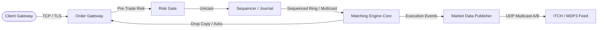

# MOC — 02 Exchange Architecture

End-to-end design of tier-1 electronic matching venues: deterministic event sourcing, zero-loss sequencers, low-jitter gateways, and multi-cast distribution.

---

## Core Concepts
- [[02 - Exchange Architecture/Exchange Gateway Architecture]] — Line handlers, session management, protocol transcoders, TCP terminator offload.
- [[02 - Exchange Architecture/Pre-Trade Risk Checks at Wire Speed]] — SEC Rule 15c3-5, gross credit limits, price collars, fat-finger checks, leaky-bucket throttles.
- [[02 - Exchange Architecture/The Sequenced-Stream Architecture]] — Total order broadcasting, hardware sequencers, deterministic log replication.
- [[02 - Exchange Architecture/Replicated State Machine Pattern in Exchanges]] — Raft vs Paxos vs single-sequencer architectures for nanosecond failover.
- [[02 - Exchange Architecture/Market Data Publisher Architecture]] — Multicast line handlers, snapshot/incremental generators, packet pacing, Feed A/B arbitration.
- [[02 - Exchange Architecture/Drop Copy and Clearing Feeds]] — Asynchronous execution broadcast, out-of-band delivery mechanisms, risk clearing pipelines.
- [[02 - Exchange Architecture/Fairness and Determinism Metrics]] — Tail latency bounds, cable length equalization, strict FIFO ingestion, jitter envelopes.

## Labs & Implementations
- [[02 - Exchange Architecture/Lab - 02 Sequenced Event Log Engine]] — Build a lock-free, memory-mapped deterministic sequencer with zero-copy persistence.

## Drills & War Stories
- [[02 - Exchange Architecture/Drill - 02 Exchange System Topologies]] — System design interview: design an exchange sustaining 2M orders/sec with <5µs p99.99 latency.
- [[02 - Exchange Architecture/War Story - The 2012 Knight Capital Disaster]] — Deep-dive forensic breakdown of Knight Capital's \$440M collapse: Power Peg dead code flag reuse, manual deployment failure, and runaway order loops.

## Canonical Sources
- [[Sources/How to Build an Exchange by Jane Street]] — Foundational architecture of modern deterministic financial venues.
- [[Sources/Site Reliability Engineering at Scale for Financial Systems]] — High-availability doctrines and non-stop operational standards.
- [[Sources/Trading and Exchanges by Larry Harris]] — Market microstructure foundations.
