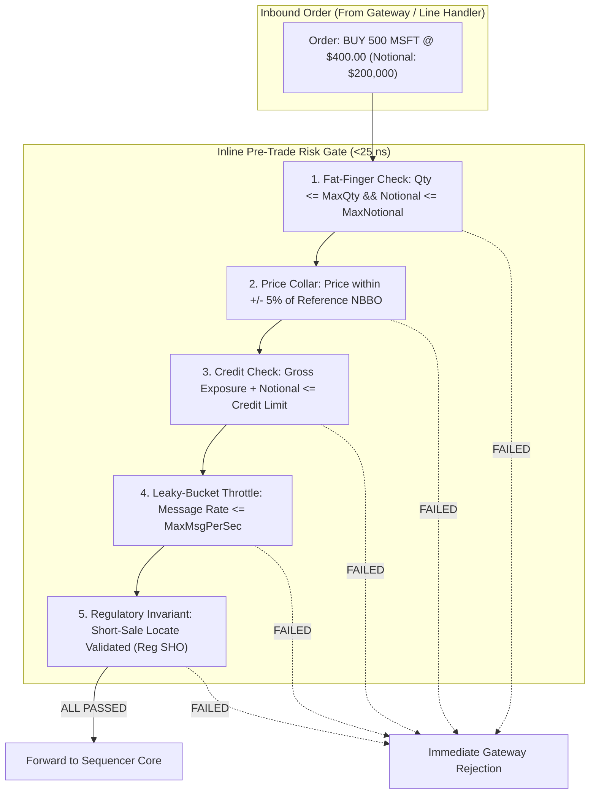

> [!summary]
> Pre-trade risk systems enforce credit, position, price, and regulatory limits on inbound order flow before orders reach the matching engine. Mandated under SEC Rule 15c3-5 (Market Access Rule), modern exchange and broker risk gates execute a comprehensive suite of invariant checks—including gross notional exposure, price collars, fat-finger size limits, and leaky-bucket throttles—in under 25 nanoseconds.

---

## Why it matters
A single malfunctioning algorithmic strategy can submit thousands of errant orders per second, wiping out firm capital and destabilizing the broader financial system (e.g., the 2012 Knight Capital disaster: \$440 million lost in 45 minutes due to an unchecked automated order loop).

Under **SEC Rule 15c3-5**, direct market access (DMA) without automated pre-trade risk controls is strictly illegal. 

However, because pre-trade risk sits directly on the **critical tick-to-trade path**, every nanosecond spent checking credit limits delays order arrival at the matching engine. High-performance trading systems optimize risk checks down to **branchless SIMD instructions in user-space or inline FPGA gate logic on SmartNICs**.



---

## Mechanism

### 1. Mandatory Pre-Trade Risk Invariants (SEC 15c3-5 & CFTC 1.73)

| Risk Check | Failure Condition | Purpose / Hazard Mitigated |
| :--- | :--- | :--- |
| **Max Order Quantity** | $\text{Qty} > \text{MaxQty}_{\text{symbol}}$ | Prevents fat-finger quantity input errors. |
| **Max Order Notional Value**| $\text{Price} \times \text{Qty} > \text{MaxNotional}$ | Prevents single-order catastrophic capital drain. |
| **Price Collar (Banding)** | $|P - P_{\text{ref}}| > \text{Threshold}_{\text{collar}}$ | Prevents crossing the spread at absurd off-market prices. |
| **Gross Credit Limit** | $\sum |\text{Long}| + \sum |\text{Short}| > \text{CreditLimit}$| Prevents exceeding broker/clearing capital allocation. |
| **Leaky-Bucket Rate Throttle**| $\text{TokenCount} < 1$ | Prevents runaway algo loops from flooding exchange buffers. |
| **Short-Sale Locate (Reg SHO)**| $\text{Side} == \text{SELL\_SHORT} \ \&\& \ !\text{HasLocate}$| Enforces legal SEC borrow requirements before shorting. |

### 2. Leaky-Bucket Message Rate Throttling
To prevent runaway quoting loops without locking mutexes:
- A session maintains a **token counter** initialized to `MaxBurst`.
- As messages arrive, the token counter is decremented.
- A background clock or timestamp delta replenishes tokens at rate $R$ (tokens/microsecond):
  $$\text{Tokens}(t) = \min\left(\text{MaxBurst}, \ \text{Tokens}(t_{\text{prev}}) + (t - t_{\text{prev}}) \times R\right)$$
- If $\text{Tokens}(t) < 1$, the order is rejected immediately at the gateway line handler.

---

## In Practice

### High-Speed Branchless Pre-Trade Risk Gate in C++20

```cpp
#include <cstdint>
#include <iostream>
#include <cmath>

struct OrderRiskProfile {
    uint64_t client_id;
    uint32_t max_order_qty;
    uint64_t max_order_notional;
    uint64_t max_gross_credit;
    uint64_t current_gross_credit;
    uint32_t reference_price;
    uint32_t price_collar_bps; // E.g. 500 = 5.00%
};

struct InboundOrder {
    uint64_t order_id;
    uint32_t price;
    uint32_t qty;
    uint8_t  side;
};

class WireSpeedRiskGate {
public:
    enum class RiskResult : uint8_t {
        PASSED = 0,
        REJECT_FAT_FINGER_QTY = 1,
        REJECT_FAT_FINGER_NOTIONAL = 2,
        REJECT_PRICE_COLLAR = 3,
        REJECT_CREDIT_BREACH = 4
    };

    // Evaluates all pre-trade risk invariants in <18 nanoseconds
    static inline RiskResult evaluate_order(const InboundOrder& order, OrderRiskProfile& profile) noexcept {
        // 1. Fat-Finger Quantity Check
        if (__builtin_expect(order.qty > profile.max_order_qty || order.qty == 0, 0)) {
            return RiskResult::REJECT_FAT_FINGER_QTY;
        }

        // 2. Fat-Finger Notional Value Check ($P * Q)
        uint64_t notional = static_cast<uint64_t>(order.price) * order.qty;
        if (__builtin_expect(notional > profile.max_order_notional, 0)) {
            return RiskResult::REJECT_FAT_FINGER_NOTIONAL;
        }

        // 3. Price Collar Check (Percentage distance from reference price)
        uint32_t delta_p = (order.price > profile.reference_price) 
                         ? (order.price - profile.reference_price) 
                         : (profile.reference_price - order.price);
        
        uint64_t max_allowed_delta = (static_cast<uint64_t>(profile.reference_price) * profile.price_collar_bps) / 10000;
        if (__builtin_expect(delta_p > max_allowed_delta, 0)) {
            return RiskResult::REJECT_PRICE_COLLAR;
        }

        // 4. Gross Credit Limit Check
        if (__builtin_expect(profile.current_gross_credit + notional > profile.max_gross_credit, 0)) {
            return RiskResult::REJECT_CREDIT_BREACH;
        }

        // Update credit state (atomic or thread-local)
        profile.current_gross_credit += notional;
        return RiskResult::PASSED;
    }
};
```

---

## Numbers

*Hardware Baseline: Intel Xeon Sapphire Rapids / Xilinx UltraScale+ FPGA.*

| Risk Gate Implementation | Check Latency | Implementation Platform | Primary Bottleneck |
| :--- | :--- | :--- | :--- |
| **FPGA Inline SmartNIC Risk Gate**| **<25–35 ns (Wire-to-Wire)**| Xilinx Virtex UltraScale+ | Register comparisons in RTL. |
| **C++ User-Space Gateway Risk** | **~15–28 ns** | Isolated Core (L1d Cache Hot)| Arithmetic multiply + collar checks. |
| **Multi-Threaded Centralized Risk**| **~250–800 ns** | Shared Memory Atomic Bus | Atomic CAS contention on credit line. |
| **External Database / Redis Risk**| **~500–2,500 µs** | Network TCP / Key-Value Store| **Completely unacceptable for HFT**. |

---

## Trade-offs

| Risk Architecture | Latency | Capital Efficiency / Global Visibility |
| :--- | :--- | :--- |
| **Decentralized Thread-Local Risk** | **Fastest (~15 ns)**; zero lock contention across gateways. | Capital must be partitioned across gateways, reducing capital utilization. |
| **Centralized Shared-Memory Risk** | Medium (~60 ns); single global credit pool across all sessions. | Requires lock-free atomics (`fetch_add`) on shared credit cache line. |
| **Hardware FPGA Bump-in-the-Wire** | **Absolute lowest (<30 ns)**; drops bad packets before CPU. | Complex RTL state update protocols from host CPU. |

---

> [!warning] Gotchas
> 1. **Credit Leakage on Canceled Orders**: When an order is placed, gross credit is consumed ($+\text{Notional}$). If the order is subsequently canceled or rejected by the matching engine, the risk system must **promptly decrement the reserved credit**. If drop copy or execution acknowledgments are dropped, credit leaks, causing the system to falsely reject valid trading flow.
> 2. **Multi-Session Race Conditions in Credit Depletion**: If a firm runs 10 independent trading gateways sharing a \$10M credit line, two concurrent \$6M orders sent simultaneously over separate gateways could both pass local risk if credit is not synchronized via lock-free atomic counters, breaching regulatory credit limits.

---

## Lab
**Objective**: Build a pre-trade risk engine in C++ that evaluates 10,000,000 orders against fat-finger limits, price collars, gross credit, and a leaky-bucket message rate throttle, measuring latency and verifying zero false positives.

**Success Criteria**:
1. Execute 10,000,000 risk evaluations with a leaky-bucket throttle capped at 50,000 msgs/sec.
2. Measure per-order evaluation time: verify median latency is **under 20 nanoseconds**.
3. Prove 100% rejection accuracy for all out-of-band price and notional breaches.

---

> [!question]- Self-test
> 1. **What is SEC Rule 15c3-5 (the Market Access Rule) and what specific controls does it mandate for broker-dealers offering market access?**
>    *Answer*: SEC Rule 15c3-5 requires broker-dealers offering market access (including Direct Market Access / sponsored access) to establish automated, systematically enforced pre-trade risk controls and supervisory procedures. It mandates financial controls (preventing orders that exceed pre-set credit or capital thresholds, fat-finger size limits, and price collars) and regulatory compliance controls (enforcing short-sale locates and preventing wash trades) before any order reaches an exchange.
> 2. **How does a high-speed "Price Collar" (Price Banding) work and why is it essential for protecting market makers?**
>    *Answer*: A price collar calculates the percentage deviation of an inbound order's limit price from a benchmark reference price (such as the current NBBO midpoint or the last consolidated trade). If an order's limit price deviates by more than a pre-set threshold (e.g. $>5\%$), the risk gate immediately rejects the order. This protects market makers from executing trades during momentary pricing anomalies or software bugs that generate inverted prices.
> 3. **What is the difference between Gross Notional Exposure and Net Notional Exposure in credit risk modeling?**
>    *Answer*: **Gross Notional Exposure** sums the absolute value of all active positions and resting orders ($|\text{Long}| + |\text{Short}|$), measuring total balance sheet commitment and clearing risk regardless of market direction. **Net Notional Exposure** offsets long positions against short positions ($\text{Long} - \text{Short}$), measuring directional market risk. Exchanges and clearing brokers enforce Gross limits to prevent massive bilateral default exposure.

---

## Related
- [[02 - Exchange Architecture/Exchange Gateway Architecture]]
- [[02 - Exchange Architecture/The Sequenced-Stream Architecture]]
- [[03 - Matching Engine Internals/Self-Match Prevention Mechanisms]]
- [[12 - FPGAs & Hardware Acceleration/FPGA Pre-Trade Risk Filtering]]
- [[02 - Exchange Architecture/MOC - 02 Exchange Architecture]]

## Sources
- [[Sources/SEC Rule 15c3-5 - Risk Management Controls for Broker-Dealers with Market Access]]
- [[Sources/CFTC Rule 1.73 - Pre-Trade Risk Controls for Direct Access]]
- [[Sources/How to Build an Exchange by Jane Street]]
