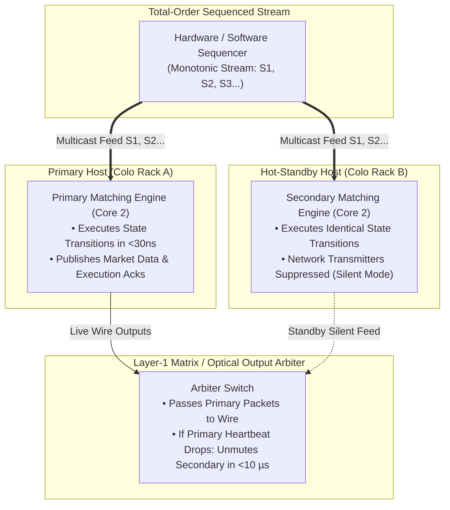

> [!summary]
> In electronic exchanges, high availability and fault tolerance are achieved through the Replicated State Machine (RSM) pattern. Rather than using distributed network consensus protocols (such as Raft or Paxos) on the critical path, exchanges decouple total-order sequencing from execution, enabling hot-standby and active-active lockstep matching engines to replicate state with zero execution latency and sub-15-microsecond failover.

---

## Why it matters
An exchange matching engine cannot tolerate downtime, data loss, or non-deterministic state recovery. If a hardware failure crashes the primary matching host:
- Traditional distributed consensus protocols (Raft, Paxos) require **multi-phase network round trips (50 to 500 microseconds)** to commit every single order before execution, making sub-microsecond trading physically impossible.
- The **Single-Sequencer Replicated State Machine** model streams monotonically sequenced events ($1, 2, 3, \dots, N$) to independent matching engine instances, allowing backup nodes to execute state transitions in parallel in **<25 nanoseconds**.



---

## Mechanism

### 1. The Replicated State Machine Invariant
A deterministic state machine is formally defined by:
$$\text{State}(T) = \text{State}(0) + \sum_{i=1}^{N} \text{Event}_i$$
If two independent matching engine instances (Node A and Node B) start from the same initial state $\text{State}(0)$ and process the exact same sequence of events in identical order, their final states are **guaranteed to be bit-for-bit identical**:
$$\text{State}_A(N) \equiv \text{State}_B(N)$$

### 2. High-Availability Architectural Models

| Architecture | Critical-Path Latency | Failover Latency | Resilience Guarantee |
| :--- | :--- | :--- | :--- |
| **Distributed Consensus (Raft / Paxos)**| **50–300 µs** (Network Quorum)| 500 ms – 3 sec | Byzantine & network partition safe. |
| **Active-Passive Hot Standby** | **<30 ns** (Zero network sync) | **<10–25 µs** | Zero data loss; instantaneous takeover. |
| **Active-Active Dual Lockstep** | **<30 ns** (Wire speed) | **<1 µs (Zero drop)**| Dual hardware execution; Layer-1 de-duplication. |

### 3. Active-Active Lockstep with Layer-1 De-duplication
In tier-1 futures and equity venues:
1. Both Primary (Host A) and Secondary (Host B) receive the identical sequenced market stream over low-latency optical splitters.
2. Both engines match orders concurrently and emit identical execution packets.
3. An FPGA Layer-1 switch (e.g. Arista 7130) at the network egress forwards whichever packet arrives first on the physical wire and silences/drops the duplicate packet.
4. **Result: Failover time is literally 0 nanoseconds with zero lost packets.**

---

## In Practice

### Deterministic State Machine Engine Skeleton in C++20

```cpp
#include <cstdint>
#include <iostream>
#include <array>

struct SequencedOrderEvent {
    uint64_t sequence_id;      // Strictly monotonic: 1, 2, 3...
    uint64_t timestamp_ns;     // Master Sequencer Ingress Time
    uint32_t client_id;
    uint32_t price;
    uint32_t qty;
    uint8_t  side;
    uint8_t  action_type;      // 1 = New, 2 = Cancel, 3 = Modify
};

class DeterministicRSM {
private:
    uint64_t last_applied_sequence_{0};
    uint64_t state_checksum_{0};
    bool is_primary_{false};

public:
    explicit DeterministicRSM(bool is_primary) : is_primary_(is_primary) {}

    // Pure deterministic transition function
    inline void apply_event(const SequencedOrderEvent& event) noexcept {
        // 1. Verify strict sequence integrity
        if (__builtin_expect(event.sequence_id != last_applied_sequence_ + 1, 0)) {
            handle_sequence_gap(event.sequence_id, last_applied_sequence_ + 1);
            return;
        }
        last_applied_sequence_ = event.sequence_id;

        // 2. Execute business logic deterministically
        switch (event.action_type) {
            case 1: // NEW ORDER
                execute_new_order(event);
                break;
            case 2: // CANCEL
                execute_cancel(event);
                break;
            default:
                break;
        }

        // 3. Update continuous CRC state checksum
        state_checksum_ ^= (event.sequence_id * 31) ^ (static_cast<uint64_t>(event.price) << 32) ^ event.qty;
    }

    [[nodiscard]] inline uint64_t get_checksum() const noexcept { return state_checksum_; }

private:
    void execute_new_order(const SequencedOrderEvent& e) noexcept {
        // Deterministic matching loop...
    }

    void execute_cancel(const SequencedOrderEvent& e) noexcept {
        // Deterministic cancel...
    }

    void handle_sequence_gap(uint64_t received, uint64_t expected) noexcept {
        std::cerr << "CRITICAL: Sequence Gap! Received: " << received << " Expected: " << expected << "\n";
    }
};
```

---

## Numbers

*Hardware Baseline: Enterprise Dual-Socket Server @ 4.0 GHz.*

| Replication Metric | Active-Active Lockstep | Hot Standby (Active-Passive) | Raft Consensus |
| :--- | :--- | :--- | :--- |
| **Order Matching Latency** | **18–32 ns** | **18–32 ns** | 45,000–120,000 ns |
| **Failover Takeover Time** | **<1 µs** | **<15 µs** | 1,500,000–3,000,000 ns |
| **Max Processed Throughput**| **>40M events/sec** | **>40M events/sec** | ~0.15M events/sec |
| **State Divergence Risk** | **0.0% (Bitwise CRC)** | **0.0% (Bitwise CRC)** | 0.0% |

---

## Trade-offs

| Replication Strategy | Latency Advantage | Cost / Operational Complexity |
| :--- | :--- | :--- |
| **Single-Sequencer RSM** | Maximum speed; single-digit nanosecond execution. | Requires dedicated hot-standby pair per symbol partition. |
| **Active-Active Layer-1 Lockstep**| Zero-nanosecond packet failover. | High hardware cost (duplicate FPGA switches and fiber runs). |
| **Raft / Distributed Consensus** | Simplifies cluster consensus across 5+ nodes. | **Unviable for HFT matching engines** due to network RTTs. |

---

> [!warning] Gotchas
> 1. **Uninitialized Memory Struct Garbage**: If an inbound message struct has 4 bytes of uninitialized compiler padding and is written to the journal log, Primary and Secondary will compute different CRC state checksums, triggering false-alarm failover alarms. *Always `std::memset` all event buffers to zero.*
> 2. **Split-Brain Network Partition**: In an Active-Passive architecture, if the heartbeat link between Primary and Secondary is severed while both can still reach the market data network, Secondary may promote itself to Primary, causing two engines to publish conflicting trade executions for the same order IDs. *Use hardware fencing (e.g. IPMI/Layer-1 matrix kill switches) to guarantee mutual exclusion.*

---

## Lab
**Objective**: Build a dual-node Replicated State Machine test harness in C++ that processes 10,000,000 randomized orders on Node A and Node B, verifying that both nodes arrive at identical state checksums and order book depth down to the last byte.

**Success Criteria**:
1. Execute 10,000,000 events on Primary and Secondary instances.
2. Verify `StateChecksum(Node A) == StateChecksum(Node B)` after every 100,000 events.
3. Simulate a failover at Event #5,000,000 and verify zero dropped or duplicated execution events.

---

> [!question]- Self-test
> 1. **Why do tier-1 electronic exchanges avoid using Raft or Paxos distributed consensus directly inside the matching engine critical path?**
>    *Answer*: Raft and Paxos require multi-phase network round trips (leader-to-follower quorum confirmations over TCP/UDP) to commit each individual state transition, adding 50 to 300 microseconds of network latency per order. Exchanges achieve sub-microsecond latencies by using a hardware/software sequencer to establish a totally-ordered event stream, allowing independent matching engine nodes to execute state transitions asynchronously in memory in <30 nanoseconds.
> 2. **What is Active-Active Lockstep replication and how does Layer-1 de-duplication eliminate failover delays?**
>    *Answer*: In Active-Active Lockstep, two identical matching engines run simultaneously on separate physical servers, consuming the exact same sequenced multicast stream and generating identical execution output packets. A downstream Layer-1 FPGA matrix switch forwards whichever packet arrives first on the wire and discards the duplicate. If one server fails, the switch continues forwarding packets from the surviving server with **zero failover delay and zero lost packets**.
> 3. **What non-deterministic inputs must be strictly eliminated from an exchange matching engine core to guarantee Replicated State Machine determinism?**
>    *Answer*: The engine core must eliminate: (1) all direct system clock syscalls (`clock_gettime`, `now()`), using only sequencer-assigned timestamps; (2) random number generators; (3) memory pointer address branching; (4) thread concurrency inside the core loop; and (5) uninitialized struct padding bytes that contaminate binary state checksums.

---

## Related
- [[02 - Exchange Architecture/The Sequenced-Stream Architecture]]
- [[03 - Matching Engine Internals/Deterministic Matching Engine State Recovery]]
- [[09 - Messaging & IPC/Aeron Messaging Transport]]
- [[03 - Matching Engine Internals/Order Book Data Structures]]
- [[02 - Exchange Architecture/MOC - 02 Exchange Architecture]]

## Sources
- [[Sources/How to Build an Exchange by Jane Street]]
- [[Sources/The LMAX Architecture by Martin Fowler]]
- [[Sources/Aeron Open-Source Repository and Wiki by Real Logic]]
