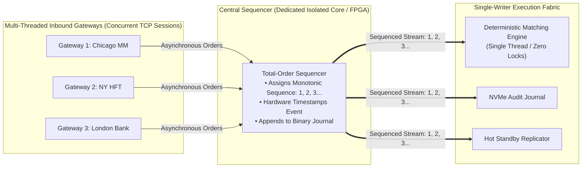

> [!summary]
> The Sequenced-Stream Architecture is the foundational design pattern of modern financial exchanges. By funneling concurrent, asynchronous order gateway streams into a dedicated hardware or software Sequencer that assigns a strictly monotonic sequence number ($1, 2, 3, \dots, N$) before reaching the matching engine, the exchange enforces absolute time priority fairness and guarantees deterministic state replication across backup nodes.

---

## Why it matters
In a tier-1 exchange, thousands of market participants submit orders concurrently over hundreds of independent TCP/FIX/OUCH gateway sessions. 

If the matching engine attempted to consume from all gateway sockets directly:
1. **Unfairness & Race Conditions**: Thread scheduling and socket polling orders would decide who gets filled, creating non-deterministic favoritism.
2. **Lock Contention**: Multi-threaded access to the order book destroys throughput via mutexes or CAS retries.
3. **Impossible Disaster Recovery**: Replaying concurrent, un-sequenced network inputs on a backup node produces different trade execution outputs.

The Sequencer solves this by converting multi-threaded network chaos into a **single, totally-ordered, deterministic event stream**.



---

## Mechanism

### 1. Inbound Sequence Assignment
When an order arrives from any gateway line handler:
1. The gateway executes preliminary pre-trade risk and protocol validation.
2. The gateway forwards the normalized event into the **Sequencer Ring**.
3. The Sequencer assigns the next 64-bit integer:
   $$\text{Sequence Number} = \text{sequence\_counter}++$$
4. The Sequencer timestamps the packet using the master hardware clock.
5. The stamped, sequenced event is broadcast simultaneously to the **Matching Engine, Journaler, and Standby Replicators**.

### 2. Hardware vs Software Sequencers
- **Hardware FPGA Sequencer (Layer-1/2 Matrix)**: Implemented directly on FPGA SmartNICs or Layer-1 matrix switches (e.g., Arista 7130 / Metamako). The FPGA timestamps and stamps the sequence number into the raw Ethernet frame header at wire speed with **<30 nanoseconds** latency.
- **Software Shared-Memory Sequencer**: Implemented on an isolated CPU core running a lock-free single-writer or MPSC Disruptor ring over shared memory (**~15–40 nanoseconds**).

---

## In Practice

### High-Throughput Inbound Software Sequencer in C++20

```cpp
#include <atomic>
#include <cstdint>
#include <new>
#include <iostream>

struct OrderRequest {
    uint64_t client_order_id;
    uint32_t participant_id;
    uint32_t price;
    uint32_t qty;
    uint8_t  side;
};

struct alignas(64) SequencedMessage {
    uint64_t sequence_number;  // 1, 2, 3...
    uint64_t hardware_time_ns; // Ingress timestamp
    OrderRequest order;
};

class ExchangeSequencer {
private:
    static constexpr size_t CACHE_LINE_SIZE = 128;
    
    // Monotonically increasing sequence counter isolated on its own cache line
    alignas(CACHE_LINE_SIZE) std::atomic<uint64_t> sequence_{1};
    uint8_t pad_[CACHE_LINE_SIZE - sizeof(std::atomic<uint64_t>)];

public:
    ExchangeSequencer() = default;

    // Sequence and frame an inbound order at wire speed
    inline SequencedMessage sequence_order(const OrderRequest& req, uint64_t ingress_time_ns) noexcept {
        // Single-cycle atomic increment
        uint64_t seq = sequence_.fetch_add(1, std::memory_order_relaxed);

        return SequencedMessage{
            seq,
            ingress_time_ns,
            req
        };
    }

    [[nodiscard]] inline uint64_t current_sequence() const noexcept {
        return sequence_.load(std::memory_order_relaxed);
    }
};
```

---

## Numbers

*Hardware Baseline: Intel Xeon Sapphire Rapids / AMD EPYC Genoa @ 4.0 GHz.*

| Sequencer Architecture | Sequencing Overhead | Throughput Limit | Hardware Platform |
| :--- | :--- | :--- | :--- |
| **FPGA Wire Sequencer (Arista 7130)**| **~25–45 ns** | **Line Rate (10G/25G)**| Xilinx UltraScale+ FPGA |
| **Software SHM Sequencer (Single Core)**| **~14–28 ns** | **~40M msgs/sec** | Dedicated Isolated x86 Core |
| **Multi-Threaded MPSC Sequencer** | **~60–120 ns** | ~15M msgs/sec | Contended Atomic RMW Loop |
| **Database / Raft Consensus Sequencer**| **~50,000–250,000 ns**| ~0.05M msgs/sec | Distributed Network Quorum |

---

## Trade-offs

| Sequencer Implementation | Advantages | Operational Challenges |
| :--- | :--- | :--- |
| **Centralized Single Sequencer** | Absolute FIFO determinism; zero consensus overhead; lowest latency. | Single point of failure (requires hot-standby pair). |
| **Hardware FPGA Sequencer** | Sub-30ns latency; zero CPU jitter; immune to OS scheduling. | High hardware cost; complex Verilog/RTL maintenance. |
| **Distributed Consensus (Raft)** | High availability across remote geographic data centers. | **Too slow for matching**: 50–200 µs network round-trips. |

---

> [!warning] Gotchas
> 1. **The Sequence Gap Deadlock**: If an upstream gateway experiences packet loss and fails to deliver Sequence #501 to the Matching Engine while Sequence #502 arrives, the Matching Engine must **halt and buffer** all subsequent events until #501 is resolved. *The Sequencer must maintain a local in-memory replay buffer to satisfy immediate NAK re-requests in <500 ns.*
> 2. **Clock Source Skew Across Sequencer Cards**: In multi-chassis FPGA sequencing topologies, if the PTP synchronization signal drifts between two sequencer cards by even 15 ns, the chronological timestamp order can contradict the sequence number order. *Always use sequence numbers as the primary state machine ordering key, treating timestamps as metadata.*

---

## Lab
**Objective**: Build a high-throughput software Sequencer that accepts order streams from 4 concurrent gateway threads, sequences them into a monotonic 64-bit log over shared memory, and verifies zero sequence gaps across 10,000,000 orders.

**Success Criteria**:
1. Run 4 concurrent producer threads feeding a central Sequencer.
2. Produce 10,000,000 sequenced events.
3. Validate with a consumer thread that every sequence number from $1$ to $10,000,000$ is delivered **strictly in monotonic sequence with zero dropped or duplicate numbers**.

---

> [!question]- Self-test
> 1. **Why must the Sequencer assign sequence numbers to orders BEFORE they reach the matching engine rather than having the matching engine assign them?**
>    *Answer*: Assigning sequence numbers before the matching engine decouples multi-threaded network ingestion from core execution. It creates a single, immutable, total-order event log that allows multiple downstream consumers (the matching engine, the NVMe audit journaler, the market data publisher, and the hot-standby backup engine) to process and replicate identical state in parallel without contention.
> 2. **What is the difference between chronological timestamp ordering and sequence number ordering in an exchange matching venue?**
>    *Answer*: Timestamps reflect physical clock time (derived from PTP or GPS), which can experience sub-nanosecond jitter or clock adjustments. Sequence numbers are discrete, monotonically increasing integers ($1, 2, 3, \dots$) that define the definitive, legally binding order of execution and state transitions within the matching engine.
> 3. **How does an FPGA-based Layer-1 matrix switch (e.g., Arista 7130) perform hardware sequencing?**
>    *Answer*: The Layer-1 matrix switch receives physical optical signals from multiple participant connections, multiplexes the raw Ethernet bitstreams through an internal FPGA crossbar, injects a 64-bit monotonic sequence number and GPS-disciplined hardware timestamp directly into the Ethernet frame preamble/header at line rate, and outputs the single aggregated stream in <30 nanoseconds.

---

## Related
- [[Notes/Deterministic Matching Engine State Recovery]]
- [[Notes/Replicated State Machine Pattern in Exchanges]]
- [[Notes/Exchange Gateway Architecture]]
- [[Notes/The LMAX Disruptor Architecture]]
- [[Notes/Aeron Messaging Transport]]
- [[MOC - 02 Exchange Architecture]]
- [[MOC - 09 Messaging & IPC]]

## Sources
- [[Sources/How to Build an Exchange by Jane Street]]
- [[Sources/The LMAX Architecture by Martin Fowler]]
- [[Sources/CME iLink 3 Binary Order Entry Specification]]
