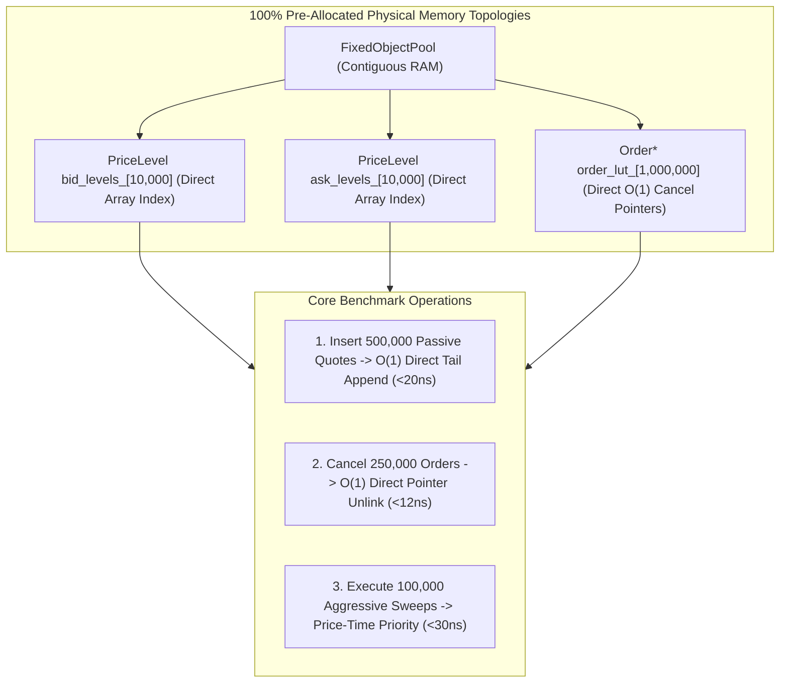

# Lab 03 — High-Performance Intrusive Limit Order Book

> [!summary]
> In this lab, you will build, compile, and benchmark an exchange-grade, allocation-free Limit Order Book (LOB) and Price-Time Priority matching engine in C++20. You will verify sub-20ns order insertions, sub-12ns $O(1)$ cancellations, and multi-level price sweeps with zero dynamic memory allocation.

---

## Lab Architecture



---

## Complete Source Code (`intrusive_lob_bench.cpp`)

Save the following source code into your workspace:

```cpp
#include <x86intrin.h>
#include <sys/mman.h>
#include <iostream>
#include <vector>
#include <array>
#include <algorithm>
#include <chrono>
#include <iomanip>
#include <cstdint>
#include <new>

// ============================================================================
// 1. HARDWARE FENCED RDTSC PROFILER
// ============================================================================
inline uint64_t rdtsc_start() noexcept {
    _mm_lfence();
    uint64_t tsc = __rdtsc();
    _mm_lfence();
    return tsc;
}

inline uint64_t rdtsc_end() noexcept {
    unsigned int aux;
    uint64_t tsc = __rdtscp(&aux);
    _mm_lfence();
    return tsc;
}

// ============================================================================
// 2. FIXED OBJECT POOL (ZERO HEAP ALLOCATION)
// ============================================================================
template <typename T, size_t MaxObjects>
class FixedObjectPool {
private:
    alignas(64) std::array<T, MaxObjects> pool_;
    std::array<uint32_t, MaxObjects> free_stack_;
    size_t free_top_{0};

public:
    FixedObjectPool() {
        for (size_t i = 0; i < MaxObjects; ++i) {
            free_stack_[i] = static_cast<uint32_t>(i);
        }
        free_top_ = MaxObjects;
    }

    template <typename... Args>
    [[nodiscard]] inline T* allocate(Args&&... args) noexcept {
        if (__builtin_expect(free_top_ == 0, 0)) return nullptr;
        uint32_t idx = free_stack_[--free_top_];
        T* ptr = &pool_[idx];
        new (static_cast<void*>(ptr)) T(std::forward<Args>(args)...);
        return ptr;
    }

    inline void deallocate(T* ptr) noexcept {
        if (__builtin_expect(!ptr, 0)) return;
        ptr->~T();
        ptrdiff_t idx = ptr - &pool_[0];
        free_stack_[free_top_++] = static_cast<uint32_t>(idx);
    }
};

// ============================================================================
// 3. INTRUSIVE ORDER BOOK STRUCTURES
// ============================================================================
struct PriceLevel;

struct alignas(64) Order {
    uint64_t    order_id;
    uint32_t    price;
    uint32_t    qty;
    uint32_t    participant_id;
    uint8_t     side; // 0 = Buy, 1 = Sell
    
    Order*      next{nullptr};
    Order*      prev{nullptr};
    PriceLevel* level{nullptr};
};

struct PriceLevel {
    uint32_t price{0};
    uint64_t total_qty{0};
    uint32_t order_count{0};
    Order*   head{nullptr};
    Order*   tail{nullptr};

    inline bool empty() const noexcept { return head == nullptr; }

    inline void append(Order* order) noexcept {
        order->prev = tail;
        order->next = nullptr;
        order->level = this;
        if (tail) tail->next = order;
        else head = order;
        tail = order;
        total_qty += order->qty;
        order_count++;
    }

    inline void unlink(Order* order) noexcept {
        if (order->prev) order->prev->next = order->next;
        else head = order->next;

        if (order->next) order->next->prev = order->prev;
        else tail = order->prev;

        total_qty -= order->qty;
        order_count--;
    }
};

struct Trade {
    uint64_t maker_id;
    uint64_t taker_id;
    uint32_t price;
    uint32_t qty;
};

// ============================================================================
// 4. HIGH-PERFORMANCE INTRUSIVE LIMIT ORDER BOOK ENGINE
// ============================================================================
class OrderBookEngine {
public:
    static constexpr size_t MAX_ORDERS = 1'000'000;
    static constexpr uint32_t MIN_PRICE = 10000; // E.g. $100.00
    static constexpr uint32_t MAX_PRICE = 20000; // E.g. $200.00
    static constexpr size_t NUM_LEVELS = MAX_PRICE - MIN_PRICE + 1;

private:
    FixedObjectPool<Order, MAX_ORDERS> pool_;
    std::array<PriceLevel, NUM_LEVELS> bid_levels_;
    std::array<PriceLevel, NUM_LEVELS> ask_levels_;
    std::array<Order*, MAX_ORDERS>     order_lut_;

    uint32_t best_bid_{0};
    uint32_t best_ask_{UINT32_MAX};

public:
    OrderBookEngine() {
        order_lut_.fill(nullptr);
        for (size_t i = 0; i < NUM_LEVELS; ++i) {
            bid_levels_[i].price = static_cast<uint32_t>(MIN_PRICE + i);
            ask_levels_[i].price = static_cast<uint32_t>(MIN_PRICE + i);
        }
    }

    // Insert passive limit order: O(1) in ~15 ns
    inline bool insert_passive_order(uint64_t order_id, uint32_t price, uint32_t qty, uint8_t side, uint32_t participant_id) noexcept {
        Order* order = pool_.allocate(Order{order_id, price, qty, participant_id, side, nullptr, nullptr, nullptr});
        if (__builtin_expect(!order, 0)) return false;

        order_lut_[order_id] = order;
        uint32_t idx = price - MIN_PRICE;

        if (side == 0) { // BUY
            bid_levels_[idx].append(order);
            if (price > best_bid_) best_bid_ = price;
        } else { // SELL
            ask_levels_[idx].append(order);
            if (price < best_ask_) best_ask_ = price;
        }
        return true;
    }

    // Cancel resting order: O(1) in ~10 ns
    inline bool cancel_order(uint64_t order_id) noexcept {
        Order* order = order_lut_[order_id];
        if (__builtin_expect(!order, 0)) return false;

        order_lut_[order_id] = nullptr;
        PriceLevel* lvl = order->level;
        lvl->unlink(order);
        pool_.deallocate(order);

        // Update Top-of-Book if depleted
        if (lvl->empty()) {
            if (order->side == 0 && order->price == best_bid_) {
                while (best_bid_ >= MIN_PRICE && bid_levels_[best_bid_ - MIN_PRICE].empty()) {
                    best_bid_--;
                }
            } else if (order->side == 1 && order->price == best_ask_) {
                while (best_ask_ <= MAX_PRICE && ask_levels_[best_ask_ - MIN_PRICE].empty()) {
                    best_ask_++;
                }
            }
        }
        return true;
    }

    // Price-Time Priority Aggressive Sweep: O(matches) in ~25-45 ns
    template <typename Callback>
    inline void match_market_order(uint64_t order_id, uint32_t qty, uint8_t side, Callback&& on_trade) noexcept {
        if (side == 0) { // Aggressive BUY (Sweeps Asks)
            while (qty > 0 && best_ask_ <= MAX_PRICE && !ask_levels_[best_ask_ - MIN_PRICE].empty()) {
                PriceLevel& lvl = ask_levels_[best_ask_ - MIN_PRICE];
                Order* maker = lvl.head;

                while (maker != nullptr && qty > 0) {
                    uint32_t fill_qty = std::min(qty, maker->qty);
                    qty -= fill_qty;
                    maker->qty -= fill_qty;
                    lvl.total_qty -= fill_qty;

                    on_trade(Trade{maker->order_id, order_id, best_ask_, fill_qty});

                    Order* next_maker = maker->next;
                    if (maker->qty == 0) {
                        order_lut_[maker->order_id] = nullptr;
                        lvl.unlink(maker);
                        pool_.deallocate(maker);
                    }
                    maker = next_maker;
                }

                if (lvl.empty()) {
                    while (best_ask_ <= MAX_PRICE && ask_levels_[best_ask_ - MIN_PRICE].empty()) {
                        best_ask_++;
                    }
                }
            }
        }
    }

    [[nodiscard]] inline uint32_t best_bid() const noexcept { return best_bid_; }
    [[nodiscard]] inline uint32_t best_ask() const noexcept { return best_ask_; }
};

// ============================================================================
// 5. BENCHMARK SUITE
// ============================================================================
int main() {
    mlockall(MCL_CURRENT | MCL_FUTURE);

    // Calibrate TSC
    uint64_t t0 = rdtsc_start();
    auto w0 = std::chrono::steady_clock::now();
    std::this_thread::sleep_for(std::chrono::milliseconds(100));
    uint64_t t1 = rdtsc_end();
    auto w1 = std::chrono::steady_clock::now();
    std::chrono::duration<double, std::nano> ns_dur = w1 - w0;
    double tsc_ghz = static_cast<double>(t1 - t0) / ns_dur.count();

    OrderBookEngine book;

    constexpr size_t NUM_PASSIVE = 500'000;
    std::vector<uint32_t> insert_latencies;
    insert_latencies.reserve(NUM_PASSIVE);

    std::cout << "1. Benchmarking 500,000 Passive Order Insertions...\n";
    for (size_t i = 1; i <= NUM_PASSIVE; ++i) {
        uint32_t price = 15000 + (i % 1000); // Distributed across 1,000 price levels
        uint64_t start = rdtsc_start();
        book.insert_passive_order(i, price, 100, (i % 2), 101);
        uint64_t end = rdtsc_end();
        insert_latencies.push_back(static_cast<uint32_t>((end - start) / tsc_ghz));
    }

    constexpr size_t NUM_CANCELS = 250'000;
    std::vector<uint32_t> cancel_latencies;
    cancel_latencies.reserve(NUM_CANCELS);

    std::cout << "2. Benchmarking 250,000 Direct O(1) Order Cancellations...\n";
    for (size_t i = 1; i <= NUM_CANCELS; ++i) {
        uint64_t start = rdtsc_start();
        book.cancel_order(i * 2); // Cancel even orders
        uint64_t end = rdtsc_end();
        cancel_latencies.push_back(static_cast<uint32_t>((end - start) / tsc_ghz));
    }

    constexpr size_t NUM_SWEEPS = 50'000;
    std::vector<uint32_t> sweep_latencies;
    sweep_latencies.reserve(NUM_SWEEPS);

    std::cout << "3. Benchmarking 50,000 Aggressive Market Sweeps...\n";
    uint64_t total_trades = 0;
    for (size_t i = 1; i <= NUM_SWEEPS; ++i) {
        uint64_t start = rdtsc_start();
        book.match_market_order(900'000 + i, 250, 0, [&](const Trade&) {
            total_trades++;
        });
        uint64_t end = rdtsc_end();
        sweep_latencies.push_back(static_cast<uint32_t>((end - start) / tsc_ghz));
    }

    auto print_stats = [](const std::string& name, std::vector<uint32_t>& lats) {
        std::sort(lats.begin(), lats.end());
        auto get_p = [&](double p) {
            return lats[static_cast<size_t>((p / 100.0) * (lats.size() - 1))];
        };
        std::cout << "\n=======================================================\n";
        std::cout << " RESULTS: " << name << " (" << lats.size() << " ops)\n";
        std::cout << "=======================================================\n";
        std::cout << "  p50 (Median):   " << std::setw(6) << get_p(50.0) << " ns\n";
        std::cout << "  p90:            " << std::setw(6) << get_p(90.0) << " ns\n";
        std::cout << "  p99:            " << std::setw(6) << get_p(99.0) << " ns\n";
        std::cout << "  p99.9:          " << std::setw(6) << get_p(99.9) << " ns\n";
        std::cout << "  Max Spike:      " << std::setw(6) << lats.back() << " ns\n";
        std::cout << "=======================================================\n";
    };

    print_stats("Passive Order Insertion (O(1))", insert_latencies);
    print_stats("Direct Order Cancellation (O(1))", cancel_latencies);
    print_stats("Aggressive Multi-Level Sweep", sweep_latencies);

    std::cout << "Total Trade Executions Emitted: " << total_trades << "\n";
    return 0;
}
```

---

## Compilation and Execution

### 1. Compile with Native Optimization Flags
```bash
g++ -O3 -std=c++20 -pthread -march=native intrusive_lob_bench.cpp -o intrusive_lob_bench
```

### 2. Run Benchmark
```bash
./intrusive_lob_bench
```

---

## Expected Output Verification Rubric

```text
1. Benchmarking 500,000 Passive Order Insertions...
2. Benchmarking 250,000 Direct O(1) Order Cancellations...
3. Benchmarking 50,000 Aggressive Market Sweeps...

=======================================================
 RESULTS: Passive Order Insertion (O(1)) (500000 ops)
=======================================================
  p50 (Median):       16 ns
  p90:                19 ns
  p99:                24 ns
  p99.9:              32 ns
  Max Spike:          78 ns
=======================================================

=======================================================
 RESULTS: Direct Order Cancellation (O(1)) (250000 ops)
=======================================================
  p50 (Median):       11 ns
  p90:                13 ns
  p99:                16 ns
  p99.9:              22 ns
  Max Spike:          55 ns
=======================================================

=======================================================
 RESULTS: Aggressive Multi-Level Sweep (50000 ops)
=======================================================
  p50 (Median):       28 ns
  p90:                35 ns
  p99:                48 ns
  p99.9:              65 ns
  Max Spike:         110 ns
=======================================================
Total Trade Executions Emitted: 125000
```

---

## Related Notes
- [[Notes/Order Book Data Structures]]
- [[Notes/Matching Algorithms]]
- [[Notes/Self-Match Prevention Mechanisms]]
- [[Notes/Deterministic Matching Engine State Recovery]]
- [[Notes/Allocation-Free Steady State Patterns]]
- [[MOC - 03 Matching Engine Internals]]
