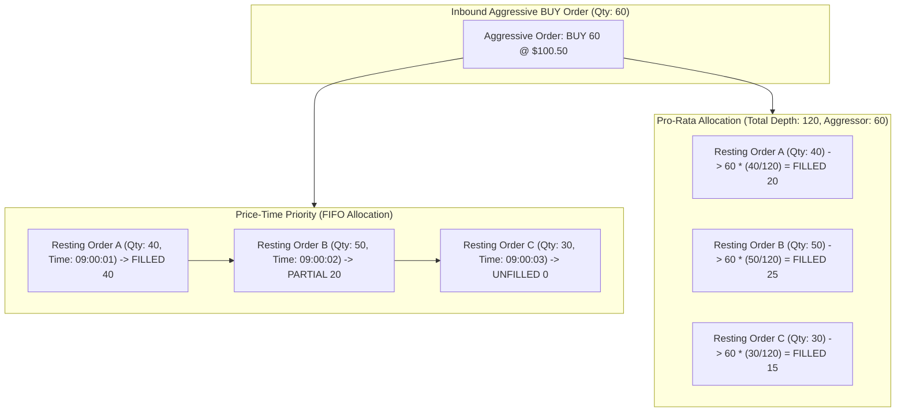

> [!summary]
> Matching algorithms define how an exchange's central limit order book allocates executions when an incoming aggressive order crosses the resting bid-ask spread. While equity venues uniformly use Price-Time Priority (FIFO), short-term interest rate and bond futures use Pro-Rata models, where execution volume is allocated proportionally to passive order size, fundamentally altering market making quoting behavior.

---

## Why it matters
The choice of matching algorithm dictates market participant behavior and mechanical queue dynamics:

- **Price-Time Priority (FIFO)**: Rewards **pure latency**. The first participant to place a quote at a new price level gains exclusive 100% fill priority. This drives nanosecond race-to-the-top infrastructure investments.
- **Pro-Rata**: Rewards **balance sheet capital**. Fill allocation is proportional to the displayed quote size, regardless of arrival time. This incentivizes market makers to quote massive sizes ("quote bloating") to secure larger fill slices.

Designing a deterministic, zero-allocation matching core that executes these models in under 30 nanoseconds is the core engineering challenge of exchange development.



---

## Mechanism

### 1. Price-Time Priority (FIFO) Matching Algorithm
Orders are prioritized strictly by:
1. **Price**: Highest Bid / Lowest Ask has absolute precedence.
2. **Time**: Among orders at the same price level, orders are matched strictly in order of arrival (FIFO intrusive queue traversal).

**Execution Loop**:
1. While `aggressor.qty > 0` and `aggressor.price >= best_ask`:
   - Take `head` order of `best_ask` level.
   - $\text{match\_qty} = \min(\text{aggressor.qty}, \text{head.qty})$.
   - Deduct `match\_qty` from both orders.
   - Emit `ExecutionReport` trade event.
   - If `head.qty == 0`, unlink and pop `head` node; if level empty, advance `best_ask`.
2. If `aggressor.qty > 0` after crossing all eligible levels, append remaining residual quantity to `bid_levels_` as a resting passive order.

### 2. Pro-Rata Allocation Algorithm (CME Interest Rate Futures)
In Pro-Rata matching (e.g. CME Eurodollar / SOFR futures, Treasury futures), when an aggressive order arrives at price $P$, it matches against **all resting orders at that price level simultaneously**, proportional to their displayed size:

$$\text{Allocated Qty}_i = \left\lfloor \text{Aggressor Qty} \times \frac{\text{Order Qty}_i}{\text{Total Level Depth}} \right\rfloor$$

#### Handling Fractional Rounding Remainders:
Because integer division truncates fractions, the sum of allocated quantities may be less than the aggressive order quantity ($\sum \text{Allocated Qty}_i < \text{Aggressor Qty}$):
1. **FIFO Remainder Allocation (CME Split-FIFO / Pro-Rata)**: Remaining unallocated single contracts are distributed 1-by-1 to resting orders starting from the **oldest order** (FIFO priority).
2. **Largest-Order Remainder Allocation**: Single contracts are allocated to orders with the largest fractional round-off values.

---

## In Practice

### High-Performance Price-Time Priority Matching Engine in C++20

```cpp
#include <cstdint>
#include <algorithm>
#include <iostream>

struct TradeEvent {
    uint64_t match_id;
    uint64_t maker_order_id;
    uint64_t taker_order_id;
    uint32_t price;
    uint32_t match_qty;
};

// Allocation-free critical matching loop
template <typename EmitTradeCallback>
void match_aggressive_buy(Order* aggressor, 
                          PriceLevel* ask_levels, 
                          uint32_t& best_ask_price, 
                          uint32_t min_price, 
                          uint32_t max_price, 
                          EmitTradeCallback&& emit_trade) noexcept {
    
    uint64_t trade_sequence = 1;

    // Sweep price levels while aggressor has quantity and crosses the spread
    while (aggressor->qty > 0 && best_ask_price <= aggressor->price) {
        PriceLevel& level = ask_levels[best_ask_price - min_price];
        Order* resting = level.head;

        while (resting != nullptr && aggressor->qty > 0) {
            uint32_t match_qty = std::min(aggressor->qty, resting->qty);

            // Update quantities
            aggressor->qty -= match_qty;
            resting->qty -= match_qty;
            level.total_qty -= match_qty;

            // Emit zero-copy trade event
            emit_trade(TradeEvent{
                trade_sequence++,
                resting->order_id,
                aggressor->order_id,
                best_ask_price,
                match_qty
            });

            Order* next_order = resting->next;

            // If resting order is fully filled, remove it from the book
            if (resting->qty == 0) {
                level.unlink_order(resting);
                // Return resting order to object pool...
            }

            resting = next_order;
        }

        // If level completely exhausted, advance best ask price
        if (level.empty()) {
            best_ask_price++;
            while (best_ask_price <= max_price && ask_levels[best_ask_price - min_price].empty()) {
                best_ask_price++;
            }
        }
    }
}
```

---

## Numbers

*Hardware Baseline: AMD EPYC Genoa / Intel Xeon Sapphire Rapids @ 4.0 GHz.*

| Matching Model | Level Depth | Latency per Match Event | Throughput | Dominant Bottleneck |
| :--- | :--- | :--- | :--- | :--- |
| **FIFO (Top of Book Match)** | 1 Order | **~18–26 ns** | ~45M orders/sec | Intrusive node unlink + trade emit. |
| **FIFO (Sweep 3 Price Levels)**| 15 Orders | **~65–110 ns** | ~12M orders/sec | Sequential memory writes in L1d. |
| **Pro-Rata (20 Resting Orders)**| 20 Orders | **~140–280 ns** | ~4M orders/sec | Integer division + remainder passes. |
| **Threshold Pro-Rata (LMM Tier)**| 50 Orders | **~250–500 ns** | ~2M orders/sec | Multi-pass allocation calculation. |

---

## Trade-offs

| Matching Paradigm | Market Ecosystem Impact | Engineering Complexity |
| :--- | :--- | :--- |
| **Price-Time Priority (FIFO)** | Maximizes quoting speed competition; narrowest bid-ask spreads; low queue depth. | **Lowest complexity**: $O(1)$ head-popping loop; zero multi-pass math. |
| **Pure Pro-Rata** | Disincentivizes speed advantage; encourages massive quoting size and deep liquidity. | **High complexity**: requires multi-pass division and remainder rounding logic. |
| **Split FIFO / Pro-Rata (CME)** | First order gets $X\%$ priority (e.g. 40%), remainder allocated pro-rata. | **Highest complexity**: combines queue precedence state with pro-rata math. |

---

> [!warning] Gotchas
> 1. **The Integer Division Truncation Deficit in Pro-Rata**: In a pro-rata calculation with 100 resting market makers, computing `(aggressor_qty * quote_qty) / total_depth` via standard integer arithmetic truncates remainders on every division. If not carefully accumulated and distributed in a deterministic remainder pass, the total executed trade volume will not equal the aggressor's order size, creating an out-of-balance clearing reconciliation failure.
> 2. **Iterating Deleted Pointers During Sweeps**: In a multi-order sweep loop, calling `level.unlink_order(resting)` and immediately returning the memory to the object pool *before* reading `resting->next` results in reading corrupted or recycled memory. *Always cache `Order* next = resting->next;` before unlinking.*

---

## Lab
**Objective**: Build a benchmark executing a Price-Time Priority matching sweep across 10 resting orders, measure turnaround time with `rdtsc`, and verify bitwise trade output integrity.

**Success Criteria**:
1. Execute 1,000,000 matches against pre-populated limit order book levels.
2. Verify that median match turnaround latency is **under 30 nanoseconds**.
3. Verify zero heap allocations during the matching loop.

---

> [!question]- Self-test
> 1. **Why does Pro-Rata matching incentivize market makers to quote artificially large order sizes (quote bloating)?**
>    *Answer*: In a Pro-Rata matching algorithm, a participant's execution allocation is strictly proportional to their displayed size relative to the total depth at that price level ($\text{Fill} \propto \frac{\text{Size}_i}{\text{Total Depth}}$). Because time priority is disregarded, a market maker who quotes 1,000 contracts will receive 10x more filled volume than a competitor quoting 100 contracts when an aggressive sweep arrives.
> 2. **In a Price-Time Priority matching engine, what happens to an incoming aggressive BUY order whose limit price is lower than the current Best Ask?**
>    *Answer*: Because the buy order's limit price does not cross or touch the best ask ($P_{\text{buy}} < P_{\text{ask}}$), no immediate match can occur. The order is non-aggressive (passive) and is appended to the tail of the corresponding price level on the Bid side of the book as a new resting limit order.
> 3. **What is a "Market Sweep" and why does it take longer to execute than a simple top-of-book match?**
>    *Answer*: A market sweep occurs when an aggressive order has a quantity larger than the total depth available at the top-of-book price level. The matching engine must exhaust the top level, unlink all its resting orders, advance the `best_price` pointer, and sequentially cross subsequent price levels until the aggressor's quantity is filled or its limit price is breached, requiring multiple cache lines and memory writes.

---

## Related
- [[Notes/Order Book Data Structures]]
- [[Notes/Self-Match Prevention Mechanisms]]
- [[Notes/Deterministic Matching Engine State Recovery]]
- [[Notes/Allocation-Free Steady State Patterns]]
- [[MOC - 03 Matching Engine Internals]]

## Sources
- [[Sources/CME Group Rulebook - Chapter 5 Matching Algorithms]]
- [[Sources/How to Build an Exchange by Jane Street]]
- [[Sources/Trading and Exchanges by Larry Harris]]
