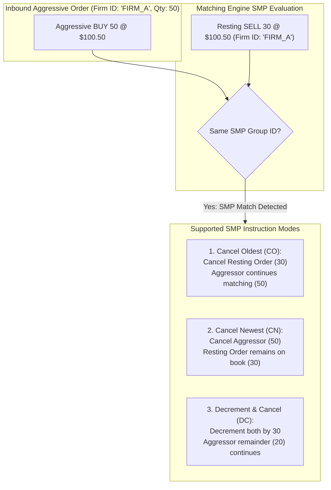

> [!summary]
> Self-Match Prevention (SMP) is an exchange-native risk feature that prevents two orders belonging to the same trading firm or algorithm from executing against each other. Implementing SMP at the matching engine core prevents illegal wash trades under SEC, CFTC, and MAR regulations while avoiding unnecessary exchange transaction fees through deterministic cancellation rules.

---

## Why it matters
In high-frequency market making, multiple independent strategy instances (e.g., delta-neutral ETF arb, statistical arbitrage, and options hedging) run concurrently across thousands of symbols. 

Without exchange-level Self-Match Prevention:
1. **Regulatory Violation (Wash Trading)**: Trading against yourself creates artificial volume without changing beneficial ownership, violating **CFTC Rule 1.38, SEC Section 9(a)(1), and EU MAR (Market Abuse Regulation)**, risking massive regulatory fines and license revocation.
2. **Wasted Transaction & Clearing Fees**: A firm executing against itself pays double exchange fees and double clearing fees on zero net inventory change.
3. **Internal Feedback Loops**: Algorithmic quoting strategies can misinterpret internal fills as external market flow, causing runaway quoting cascades.

SMP must execute **inline inside the inner matching loop** in under 5 nanoseconds without stalling the engine.



---

## Mechanism

### 1. The SMP Identification Token
When a participant submits an order, the binary protocol message includes an **SMP Group Identifier** (e.g., NASDAQ `SMP ID`, CME `SelfMatchPreventionID` Tag 7928):
- **Firm-Wide SMP**: Prevents matches across any account within the legal broker-dealer.
- **Strategy-Level SMP**: Prevents matches only between instances of the same algorithmic model while permitting cross-trades between distinct internal desks.

### 2. Standard SMP Action Types
When an aggressive order encounters a resting order with a matching SMP ID:

| SMP Instruction Mode | Action on Resting (Maker) Order | Action on Inbound (Taker) Order | Use Case |
| :--- | :--- | :--- | :--- |
| **Cancel Oldest (CO)** | **Canceled** from order book. | **Continues** matching or resting. | Trend-following strategies prioritizing aggressive orders. |
| **Cancel Newest (CN)** | **Preserved** on the book (keeps queue priority). | **Canceled** immediately. | Market makers protecting high-priority resting queue spots. |
| **Decrement and Cancel (DC)**| Decremented by matched qty; canceled if 0. | Decremented by matched qty; remainder continues. | Minimizes order book distortion while clearing overlaps. |

---

## In Practice

### High-Speed Inline SMP Evaluator in C++20

```cpp
#include <cstdint>
#include <iostream>

enum class SmpMode : uint8_t {
    NONE = 0,
    CANCEL_OLDEST = 1, // Cancel maker (resting)
    CANCEL_NEWEST = 2, // Cancel taker (aggressive)
    DECREMENT_CANCEL = 3 // Decrement both
};

struct Order {
    uint64_t order_id;
    uint32_t price;
    uint32_t qty;
    uint32_t smp_group_id; // 0 = No SMP
    SmpMode  smp_mode;
    uint8_t  side;
    Order*   next{nullptr};
    Order*   prev{nullptr};
};

// Inline SMP resolution inside matching loop
// Returns true if matching should continue, false if taker is exhausted/canceled
inline bool handle_self_match_prevention(Order* taker, Order* maker, PriceLevel& level) noexcept {
    // 1. Fast path: Check if either order has SMP disabled (smp_group_id == 0)
    if (__builtin_expect(taker->smp_group_id == 0 || maker->smp_group_id == 0, 1)) {
        return true; // No SMP conflict, proceed with trade
    }

    // 2. Check if SMP IDs match
    if (__builtin_expect(taker->smp_group_id != maker->smp_group_id, 1)) {
        return true; // Different firms, proceed with trade
    }

    // 3. SMP CONFLICT DETECTED: Execute SMP Policy
    SmpMode mode = (taker->smp_mode != SmpMode::NONE) ? taker->smp_mode : maker->smp_mode;

    switch (mode) {
        case SmpMode::CANCEL_NEWEST:
            // Cancel taker (incoming order) completely
            taker->qty = 0;
            return false; // Stop matching loop

        case SmpMode::CANCEL_OLDEST: {
            // Cancel maker (resting order) completely from the book
            Order* next_maker = maker->next;
            level.unlink_order(maker);
            // Return maker to object pool...
            return true; // Taker continues matching against next resting order
        }

        case SmpMode::DECREMENT_CANCEL: {
            uint32_t decrement_qty = std::min(taker->qty, maker->qty);
            taker->qty -= decrement_qty;
            maker->qty -= decrement_qty;
            level.total_qty -= decrement_qty;

            if (maker->qty == 0) {
                level.unlink_order(maker);
                // Return maker to object pool...
            }
            return taker->qty > 0;
        }

        default:
            return true;
    }
}
```

---

## Numbers

*Hardware Baseline: Intel Xeon Sapphire Rapids @ 4.0 GHz.*

| SMP Check Operation | Latency (Cycles) | Latency (Time) | Branch Prediction Impact |
| :--- | :--- | :--- | :--- |
| **SMP Fast Path (Different Firms)** | 2–3 cycles | **~0.5–0.75 ns** | Highly predictable (99.9% pass rate). |
| **Cancel Newest (CN) Execution** | 4–6 cycles | **~1.0–1.5 ns** | Taker zeroed; immediate loop exit. |
| **Cancel Oldest (CO) Execution** | 12–18 cycles | **~3.0–4.5 ns** | Intrusive unlink + object pool return. |
| **Decrement and Cancel (DC)** | 8–14 cycles | **~2.0–3.5 ns** | In-place arithmetic update. |

---

## Trade-offs

| SMP Mode | Best For | Operational Risk |
| :--- | :--- | :--- |
| **Cancel Newest (CN)** | **Market Makers**: preserves hard-earned passive queue priority at the front of the book. | Aggressive execution strategies may fail to fill intended liquidity targets. |
| **Cancel Oldest (CO)** | **Aggressive Liquidity Takers**: ensures current momentum order executes immediately. | Destroys resting passive queue position, forfeiting maker fee rebates. |
| **Decrement and Cancel (DC)**| **Arbitrage Engines**: minimizes market footprint by canceling only overlapping size. | Can leave small odd-lot residuals resting on the order book. |

---

> [!warning] Gotchas
> 1. **Queue Priority Forfeiture on Modify**: In Cancel Oldest (CO), an aggressive order deletes the firm's resting order. If the aggressive order fails to fill its remaining balance against other market participants and rests on the book, it is placed at the **tail of the queue**, forfeiting the older order's front-of-queue priority.
> 2. **SMP Token Leakage / Collisions**: Using small 16-bit integer IDs for SMP group identification across a large multi-tenant exchange can lead to accidental SMP token collisions between unrelated hedge funds, causing unexpected order cancellations. *Exchanges must namespace SMP IDs by participant membership ID (MPID).*

---

## Lab
**Objective**: Integrate the SMP evaluation logic into an intrusive Limit Order Book matching engine, simulate an aggressive order matching against an internal resting quote, and verify that Cancel Oldest and Cancel Newest execute without emitting wash trade records.

**Success Criteria**:
1. Submit resting SELL 100 with SMP ID `101`.
2. Submit aggressive BUY 100 with SMP ID `101` and mode `CANCEL_NEWEST`.
3. Verify that zero trade execution events are emitted and the resting SELL order remains on the book.
4. Repeat with `CANCEL_OLDEST` and verify the resting SELL order is unlinked and zero trades occur.

---

> [!question]- Self-test
> 1. **What legal and regulatory violations occur if a financial institution trades against its own orders on an electronic exchange without SMP?**
>    *Answer*: Executing trades against oneself constitutes **Wash Trading**, which violates Section 9(a)(1) of the US Securities Exchange Act, CFTC Rule 1.38, and Article 12 of the EU Market Abuse Regulation (MAR). Wash trading creates artificial trade volume and misleading market activity without altering beneficial ownership or economic risk.
> 2. **Why do automated market makers overwhelmingly choose `Cancel Newest (CN)` as their default SMP instruction?**
>    *Answer*: Market makers invest heavily in low-latency infrastructure to obtain front-of-queue priority on passive resting limit orders. Choosing `Cancel Newest` ensures that an accidental crossing order submitted by an internal hedging desk does not cancel the market maker's valuable resting quote at the top of the queue.
> 3. **What is the `Decrement and Cancel (DC)` SMP instruction and how does it handle unequal order quantities?**
>    *Answer*: `Decrement and Cancel` deducts the overlapping matched quantity from both the resting and aggressive orders without generating a trade execution. If the resting order has size 30 and the aggressive order has size 50, 30 contracts are subtracted from both: the resting order is filled/canceled to 0, and the aggressive order's remaining 20 contracts continue matching through the book.

---

## Related
- [[Notes/Order Book Data Structures]]
- [[Notes/Matching Algorithms]]
- [[Notes/Deterministic Matching Engine State Recovery]]
- [[Notes/Order Types and State Transitions]]
- [[MOC - 03 Matching Engine Internals]]
- [[MOC - 01 Market & Microstructure Fundamentals]]

## Sources
- [[Sources/CME Group Rulebook - Chapter 5 Matching Algorithms]]
- [[Sources/NASDAQ TotalView-ITCH 5.0 Specification]]
- [[Sources/Trading and Exchanges by Larry Harris]]
