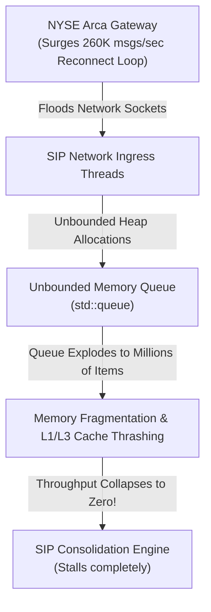

# War Story — The August 22, 2013 NASDAQ 3-Hour SIP Freeze: Buffer Exhaustion & Failover Cascades

> [!summary]
> On August 22, 2013, between 12:14:03 and 15:25:00 EST, the NASDAQ stock market suffered a total trading halt across all Tape C securities (over 3,000 stocks including Apple, Microsoft, and Google). A surge of invalid disconnect/reconnect cycles from NYSE Arca triggered an internal buffer exhaustion and memory corruption cascade in the Securities Information Processor (UTP SIP), revealing critical flaws in capacity planning, backpressure handling, and failover synchronization.

---

## 1. Incident Timeline & Chronology (August 22, 2013)

```mermaid
timeline
    title The August 22, 2013 NASDAQ SIP Outage Timeline
    12:14:03 : NYSE Arca attempts to reconnect to the NASDAQ UTP SIP processor over 20 times in 1 second, repeatedly opening and tearing down TCP sessions.
    12:14:15 : Each connection attempt generates massive burst traffic. The UTP SIP input queue capacity (10,000 msgs/sec capacity) is exceeded by a 26x surge (>260,000 msgs/sec).
    12:14:50 : Internal SIP memory queues exhaust; quote dissemination freezes. Primary SIP processor stops publishing the National Best Bid and Offer (NBBO).
    12:15:30 : NASDAQ attempts automated failover to the Secondary SIP processor. The Secondary processor is immediately overwhelmed by the same buffered queue flood and crashes.
    12:20:00 : NASDAQ halts all trading across Tape C equities to prevent un-priced executions.
    15:25:00 : After clearing corrupt buffers, restarting processors, and conducting cross-industry conference calls, trading resumes cleanly.
```

---

## 2. Technical & Architectural Root Cause Analysis

### A. The Ingress Surge & NYSE Arca Disconnect Loop
- **The Protocol Defect**: NYSE Arca’s gateway software experienced an internal state desynchronization, causing it to transmit a stream of **duplicate connect, disconnect, and quote registration frames** to the NASDAQ UTP SIP.
- **The Volume Multiplier**: Because each reconnection request required the SIP to query and transmit all resting quote states, the burst generated an aggregate inbound load of **over 260,000 messages per second**—more than **26 times the SIP’s tested peak capacity (10,000 msgs/sec)**.

### B. The Memory Queue Exhaustion & Unbounded Buffering Flaw
- **The Architecture**: The 2013 UTP SIP was designed with a naive **unbounded heap queue** (`std::queue` / linked lists) between its network receive threads and its single-threaded matching/consolidation engine.
- **The Execution Cascade**:
  1. Network threads read packets from sockets and pushed them into the heap queue.
  2. The single-threaded processor could not consume the queue at 260,000 msgs/sec.
  3. The heap allocated millions of tiny node objects, triggering massive **L1/L2/L3 cache thrashing and memory allocator lock contention**.
  4. The process exceeded its virtual memory limit, resulting in severe CPU page-thrashing and eventual unresponsiveness.



### C. The Cascading Failover Collapse
- When the Primary SIP failed to emit heartbeat pulses, NASDAQ’s automated supervisor triggered failover to the **Secondary SIP instance**.
- **The Architectural Flaw**: The Secondary SIP was configured to drain the exact same network ingress buffer. The moment the Secondary instance took over, it was **instantly hit by the backlogged 260,000 msg/sec flood, immediately exhausted its memory, and crashed**.

---

## 3. The 3 Fundamental Architectural Mistakes

| Architectural Area | 2013 SIP Design Flaw | Modern Low-Latency Engineering Standard |
| :--- | :--- | :--- |
| **Ingress Backpressure** | Unbounded memory queues that accepted data until the process ran out of RAM. | **Bounded Ring Buffers with Drop Policies**: Fixed-capacity ring buffers; excess traffic is dropped at the NIC level with hardware drop counters. |
| **Ingress Rate Limiting** | No participant-level message throttle on SIP ingress lines. | **Hardware Leaky-Bucket Rate Limiters**: Inbound gateway connections enforce hard limits (e.g. max 5,000 msgs/sec per participant). |
| **Failover Isolation** | Secondary node was exposed to the same unfiltered toxic network backlog. | **Isolated Replicated State Machines (RSM)**: Standby nodes maintain pre-filtered deterministic streams; poison messages are quarantined before hitting the core. |

---

## 4. Key Engineering Lessons for Exchange Systems

1. **Never Use Unbounded Queues in Production Systems**: Every queue, buffer, and message ring in a low-latency architecture must have a **fixed, pre-allocated capacity** (`static constexpr size_t RING_SIZE = 65536;`). If a ring fills, the system must drop packets or apply strict backpressure, never dynamically allocate heap memory.
2. **Implement Input Rate Limiting at the Network Perimeter**: An exchange gateway must police inbound participant flow at the socket / NIC level. If a participant exceeds its contracted bandwidth, the gateway must drop packets or throttle the connection before it reaches internal messaging buses.
3. **Failover Must Be Tested Against Malformed Data**: If a system fails due to a "poison pill" message or an extreme microburst, failing over to a secondary node that immediately processes the exact same poison stream will merely crash the secondary node.

---

## Related Notes
- [[02 - Exchange Architecture/The Sequenced-Stream Architecture]]
- [[03 - Matching Engine Internals/Matching Engine Architecture Overview]]
- [[09 - Messaging & IPC/Lock-Free Ring Buffers and Disruptor Pattern]]
- [[13 - Reliability, Ops & Testing/Disaster Recovery and High Availability Topologies]]
- [[14 - Industry Map & Canon/MOC - 14 Industry Map & Canon]]

## Sources
- [[Sources/SEC Report on NASDAQ SIP Outage of August 22, 2013]]
- [[Sources/Site Reliability Engineering at Scale for Financial Systems]]
- [[Sources/How to Build an Exchange by Jane Street]]
