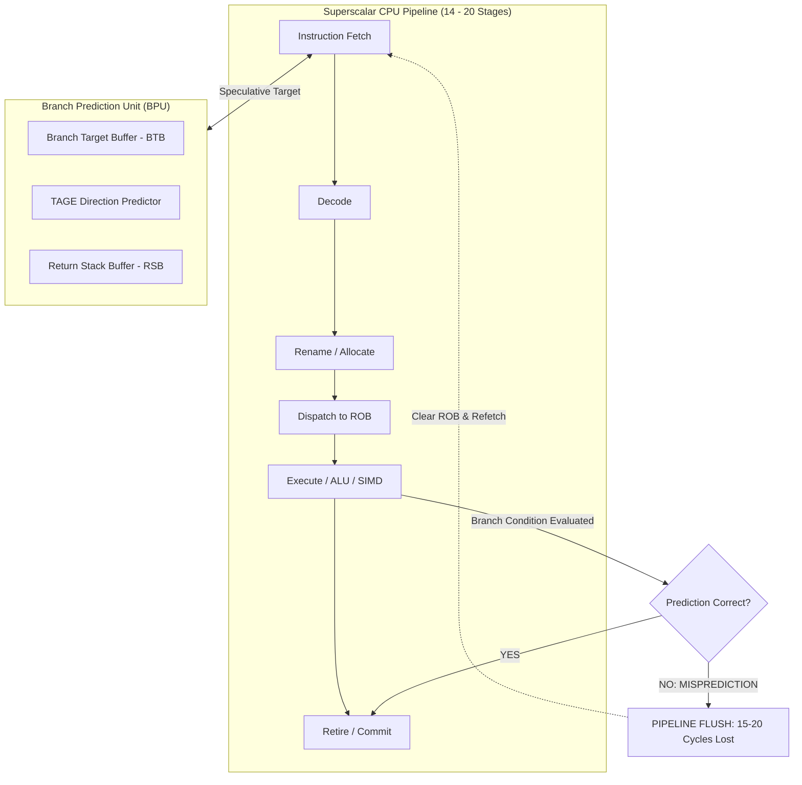

> [!summary]
> Modern CPU architectures use deeply pipelined superscalar execution engines (14–20 stages) that rely on dynamic branch predictors to speculatively fetch instructions. When a branch is mispredicted, the entire pipeline must be flushed and refilled from the Reorder Buffer (ROB), wasting 12–20 cycles (3–5 ns). Eliminating unpredictable branches using branchless C++ idioms, conditional moves (`CMOV`), and lookup tables is essential for sub-microsecond determinism.

---

## Why it matters
In high-frequency market data parsing and order execution, branches occur at every decision point: message type identification, price validation, risk bounds checking, and order matching logic.

- A **correctly predicted branch** costs **0 to 1 cycle (~0.25 ns)** due to branch target buffering and instruction fusion.
- An **unpredictable / mispredicted branch** costs **12 to 20 cycles (3.0 to 5.0 ns)**.

If your market data feed parser processes 1,000,000 messages per second and suffers a 5% branch misprediction rate on an inner loop, you waste **200,000 nanoseconds per second** in stalled pipeline execution, introducing massive jitter into the tail ($p99.9$) of your tick-to-trade distribution.



---

## Mechanism

### 1. The Deep Out-of-Order Execution Pipeline
To reach clock speeds of 4.0–5.5 GHz, modern x86 cores split instruction execution into 14–20 discrete pipeline stages. Because the CPU cannot wait 15 cycles to know whether an `if (price > best_bid)` condition evaluates to true, the **Branch Prediction Unit (BPU)** speculates:
1. **Branch Target Buffer (BTB)**: Caches the target memory address of previously executed jumps.
2. **Direction Predictor (TAGE / Perceptron)**: Uses historical execution bit-patterns to predict whether a conditional jump (`JNE`, `JE`, `JG`) will be `TAKEN` or `NOT TAKEN`.
3. **Return Stack Buffer (RSB)**: A dedicated hardware stack predicting `RET` instruction targets for function calls.

### 2. The Cost of a Misprediction (Pipeline Squash)
If the BPU speculates that a branch will be `TAKEN`, instructions along that speculative path are fetched, decoded, and executed speculatively in the **Reorder Buffer (ROB)**.
When the branch condition reaches execution in the ALU and evaluates to `NOT TAKEN`:
1. The CPU detects a **Branch Misprediction Exception**.
2. All speculative instructions currently in the ROB and execution units must be **squashed / flushed**.
3. All register renames are rolled back.
4. The instruction fetch unit must flush its buffers and issue a memory fetch for the correct instruction stream from L1i cache or L2 cache (**14–20 cycles penalty**).

---

## In Practice

### 1. Branchless Math via Bitmasking & Conditional Move (`CMOV`)
Replace data-dependent `if/else` jumps with branchless arithmetic or compiler-generated `CMOVcc` instructions.

```cpp
#include <cstdint>
#include <algorithm>

// Anti-Pattern: Unpredictable branch on random market prices
// If order prices fluctuate around collar, branch predictor hits a 50% failure rate
inline uint32_t clamp_price_branched(uint32_t price, uint32_t min_limit, uint32_t max_limit) {
    if (price < min_limit) return min_limit; // Conditional JMP (Can mispredict)
    if (price > max_limit) return max_limit; // Conditional JMP (Can mispredict)
    return price;
}

// Production-Grade: Branchless Clamp using C++20 std::clamp
// Modern compilers (GCC/Clang) compile std::clamp to CMOV (Conditional Move)
inline uint32_t clamp_price_branchless(uint32_t price, uint32_t min_limit, uint32_t max_limit) noexcept {
    return std::clamp(price, min_limit, max_limit);
    // Emits:
    // cmp    edi, esi
    // cmovb  edi, esi
    // cmp    edi, edx
    // cmova  edi, edx
    // mov    eax, edi
    // Zero branches, deterministic 2-cycle execution!
}

// Branchless Boolean Flag Selection: Returns a if flag is true, b if false
inline uint64_t select_branchless(bool flag, uint64_t a, uint64_t b) noexcept {
    // Cast bool to mask: true -> 0xFFFFFFFFFFFFFFFF, false -> 0x0
    const uint64_t mask = -static_cast<int64_t>(flag);
    return (a & mask) | (b & ~mask);
}

// C++20 [[likely]] and [[unlikely]] attributes
// NOTE: These do NOT eliminate branches! They reorder basic blocks in assembly
// so the likely path falls through sequentially without a jump, optimizing the L1i cache.
void process_inbound_order(uint32_t order_qty, uint32_t max_risk_limit) {
    if (order_qty > max_risk_limit) [[unlikely]] {
        // Cold code path placed at the end of the binary segment
        reject_order_risk_breach(order_qty);
        return;
    }
    
    // Hot code path falls through sequentially without jump instruction
    execute_order_core(order_qty);
}
```

---

## Numbers

*Hardware Baseline: AMD Zen 4 / Intel Core 13th Gen @ 4.0 GHz.*

| Instruction / Scenario | Latency (Cycles) | Latency (Time) | Predictability Impact |
| :--- | :--- | :--- | :--- |
| **Predicted Branch (Taken/Not Taken)** | 0–1 cycle | **~0.25 ns** | Zero pipeline disruption. |
| **Mispredicted Branch (Pipeline Flush)**| 14–20 cycles | **~3.5–5.0 ns** | Flushes 15+ execution stages. |
| **Conditional Move (`CMOVcc`)** | 1–2 cycles | **~0.25–0.5 ns** | **100% deterministic (Zero branches).** |
| **Bitwise Select (`(a & m) \| (b & ~m)`)**| 2–3 cycles | **~0.5–0.75 ns**| **100% deterministic.** |
| **Function Pointer / Virtual Call Miss**| 25–40 cycles | **~6.0–10.0 ns** | Indirect BTB miss + I-cache stall. |

---

## Trade-offs: When Branchless Code is Slower!

> [!important] The Branchless Fallacy
> Branchless code is **not always faster**. A branch that is **>98% predictable** (e.g., checking an error condition that almost never triggers) executes in **0 cycles** via pipeline fusion. Replacing a highly predictable branch with branchless bit manipulation or `CMOV` introduces longer data-dependency chains that inhibit instruction-level parallelism (ILP).

| Scenario | Choose Branched | Choose Branchless |
| :--- | :--- | :--- |
| **Predictability > 95%** (e.g., rare risk rejections, packet error checks) | **YES** (0–1 cycle fast path). | No (wastes instructions). |
| **Predictability 50%–90%** (e.g., market tick up/down, order side BUY/SELL) | No (severe mispredict penalties). | **YES** (guaranteed 2-cycle determinism). |
| **Data Dependency Critical Path** | Choose whichever shortens the dependency chain. | Verify with LLVM MCA / `perf`. |

---

> [!warning] Gotchas
> 1. **Misunderstanding `[[likely]]` / `[[unlikely]]`**: Many engineers assume `[[likely]]` eliminates the branch instruction. It does not. It only guides the compiler's basic block layout so the common case is placed sequentially in memory (improving instruction cache prefetching) while the cold path requires a jump.
> 2. **Virtual Functions on the Critical Path**: Calling virtual functions (`vtable` lookup) or raw function pointers forces the CPU to use the **Indirect Branch Target Buffer**. If multiple instruments call different polymorphic handlers, the indirect predictor misses continuously (**~30 cycles lost**). *Always use CRTP, templates, or `std::variant` on hot paths.*

---

## Lab
**Objective**: Measure the exact latency difference between a 50% predictable branched loop and a branchless `CMOV` implementation on 10,000,000 iterations.

**Success Criteria**:
1. Run branched benchmark with random data ($50\%$ branch probability):
   ```bash
   perf stat -e branches,branch-misses,cycles,instructions ./bench_branched
   ```
2. Run branchless benchmark with `CMOV`:
   ```bash
   perf stat -e branches,branch-misses,cycles,instructions ./bench_branchless
   ```
3. Demonstrate that the branchless version eliminates branch misses completely and runs **3x to 4x faster**.

---

> [!question]- Self-test
> 1. **Why does an unpredictable branch cost 15–20 cycles on a modern x86 CPU instead of just 1 cycle?**
>    *Answer*: Modern CPUs have deep out-of-order pipelines (14–20 stages). The CPU executes instructions speculatively past the branch. When the condition evaluates to false at the execution stage, all speculatively executed instructions in the Reorder Buffer (ROB) must be flushed, register allocations rolled back, and the instruction fetch unit redirected to fetch from the correct path, wasting all cycles invested in the speculative window.
> 2. **What does the `CMOVcc` instruction do, and why is it branchless?**
>    *Answer*: `CMOVcc` (Conditional Move) copies data from a source register to a destination register only if a CPU condition flag (e.g., Zero, Carry, Sign) is met; otherwise, it behaves as a no-op. It is a single instruction executed directly by the ALU pipeline without issuing a jump or altering the instruction pointer (`RIP`), completely bypassing the branch prediction unit.
> 3. **Under what conditions is a branched implementation faster than a branchless `CMOV` implementation?**
>    *Answer*: When the branch is highly predictable ($>98\%$ of the time taking the same path, such as fatal error checks or extreme market outliers). A predictable branch costs virtually 0 cycles due to branch target buffering, whereas a branchless `CMOV` adds an extra instruction and creates a data dependency on the condition evaluation, preventing the CPU from executing independent downstream instructions in parallel.

---

## Related
- [[Notes/Latency Numbers Every Trading Engineer Knows]]
- [[Notes/Static vs Virtual Dispatch in Hot Paths]]
- [[Notes/Branchless Programming Idioms]]
- [[Notes/CPU Cache Hierarchy and Line Alignment]]
- [[MOC - 04 Hardware Mechanical Sympathy]]
- [[MOC - 08 Low-Latency Programming]]

## Sources
- [[Sources/CppCon 2017 - When a Microsecond is an Eternity by Carl Cook]]
- [[Sources/Intel 64 and IA-32 Architectures Optimization Reference Manual]]
- [[Sources/Computer Architecture - A Quantitative Approach by Hennessy and Patterson]]
