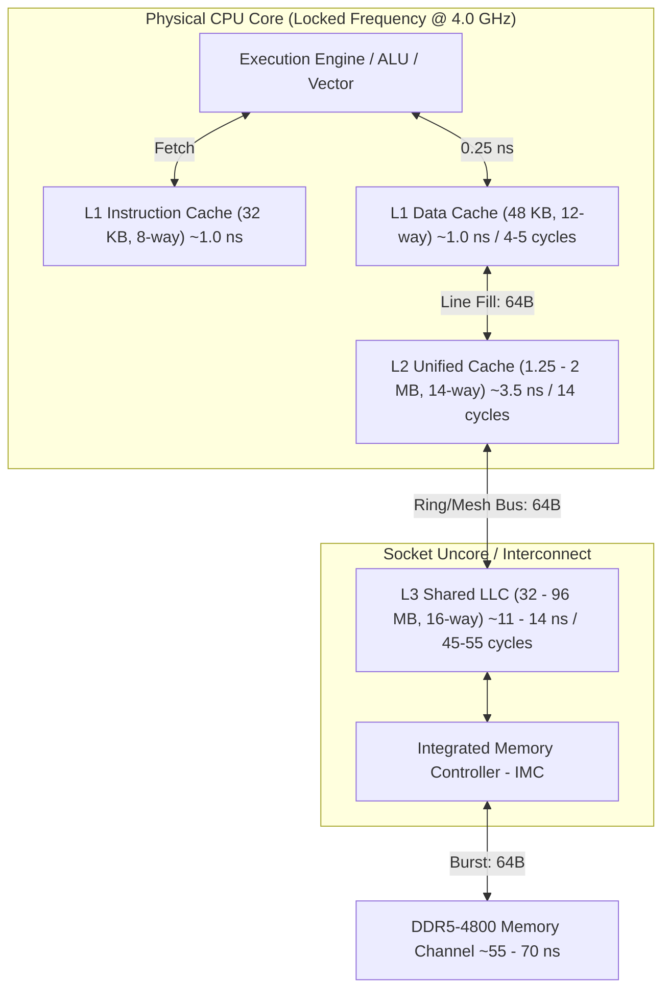

> [!summary]
> CPU caches bridge the massive speed disparity between the execution pipeline (~0.25 ns cycle) and DRAM (~60 ns) using small, ultra-fast SRAM organized into 64-byte lines. Aligning hot data structures to 64-byte boundaries and designing memory access to avoid set conflict misses keeps the matching and pricing critical path executing within 1–4 nanoseconds.

---

## Why it matters
In high-frequency trading engines, every cache miss on the critical path is catastrophic. An L1d hit takes ~1.0 ns (4–5 cycles); an L3 hit takes ~10–13 ns; a DRAM fetch costs ~50–70 ns (200–280 cycles). 

If an order book lookup crosses an unaligned 64-byte boundary, it requires **two cache line fetches** instead of one. If hot variables map to the same cache set (set conflict alias), they evict each other continuously even if the cache is 95% empty. Designing with strict cache line alignment ensures deterministic, minimum-latency execution.



---

## Mechanism

### 1. The 64-Byte Cache Line Unit
Modern x86-64 (Intel Core/Xeon, AMD Zen) and ARM Neoverse CPUs transfer data between main memory and caches exclusively in discrete **64-byte chunks** (cache lines). 
- An address is split into three parts: `[Tag | Set Index | Offset]`.
- With a 64-byte line, the lowest 6 bits (`2^6 = 64`) represent the **byte offset** within the line.
- Unaligned memory accesses that span across two 64-byte chunks trigger two memory transactions and split-lock penalties if atomic.

### 2. Set Associativity and Conflict Misses
An $N$-way set-associative cache divides memory into $S$ sets, where each set holds $N$ cache lines:
$$\text{Number of Sets } S = \frac{\text{Total Cache Size}}{\text{Line Size (64 B)} \times N}$$
*Example (Intel Golden Cove L1d)*: $48\text{ KB}$, 12-way associative $\implies \frac{49152}{64 \times 12} = 64\text{ sets}$.
- Bits 0–5: Offset (64 bytes).
- Bits 6–11: Set Index (64 sets $\implies 6\text{ bits}$).
- Bits 12–63: Cache Tag.

> [!important] Set Conflict (Aliasing) Hazard
> If your application accesses multiple memory addresses whose bits 6–11 are identical, they all compete for the **same 12 slots** in that set. If more than 12 such addresses are accessed in a hot loop, the CPU will repeatedly evict them to L2/L3—even if the other 63 sets in L1d are completely empty. This causes a massive performance cliff ($4\text{ cycles} \to 14\text{ cycles}$).

### 3. Spatial and Adjacent Cache Line Prefetching
Modern CPUs incorporate hardware prefetchers:
- **Stream/L2 Prefetcher**: Detects sequential forward or backward line access and fetches subsequent lines ahead of time.
- **Spatial Prefetcher (Intel 128-byte pair)**: Automatically fetches the adjacent 64-byte line to complete a 128-byte aligned pair. 
*Low-latency implication*: Hot structures should either fit within 64 bytes or be padded to 128 bytes to align with hardware prefetch pairs.

---

## In Practice

```cpp
#include <cstdint>
#include <new>

// Cache line size constant for modern x86/ARM
constexpr size_t CACHE_LINE_SIZE = 64;

// Aligned order book top-of-book entry
// Packed to ensure critical read-fields sit in the same 64-byte line
struct alignas(CACHE_LINE_SIZE) BestBidOffer {
    uint64_t bid_price;       // 8 bytes
    uint64_t ask_price;       // 8 bytes
    uint32_t bid_qty;         // 4 bytes
    uint32_t ask_qty;         // 4 bytes
    uint32_t bid_order_count; // 4 bytes
    uint32_t ask_order_count; // 4 bytes
    uint64_t last_update_tsc; // 8 bytes
    uint32_t instrument_id;   // 4 bytes
    uint8_t  book_status;     // 1 byte
    
    // Explicit padding to fill exactly 64 bytes
    uint8_t  reserved[64 - 45];
};
static_assert(sizeof(BestBidOffer) == 64, "BestBidOffer must be exactly 64 bytes");

// Example of bad layout: Straddling two cache lines
struct UnalignedOrder {
    uint8_t  flag;            // 1 byte
    // Compiler pads 7 bytes here without explicit packing,
    // but if placed in an unaligned array, an 8-byte uint64 can span 
    // across byte 63 and byte 64 (crossing two cache lines).
    uint64_t order_id;        
    uint64_t price;
};
```

---

## Numbers

*Hardware Baseline: Intel Xeon Sapphire Rapids / AMD EPYC Genoa @ 4.0 GHz.*

| Cache Level | Capacity | Associativity | Latency (Cycles) | Latency (Time) | Bandwidth per Core |
| :--- | :--- | :--- | :--- | :--- | :--- |
| **L1d (Data)** | 48 KB | 12-way | 4–5 cycles | **~1.0–1.2 ns** | ~250–350 GB/s |
| **L1i (Instruction)** | 32 KB | 8-way | 3 cycles | **~0.75–1.0 ns** | ~100 GB/s |
| **L2 (Unified)** | 2 MB | 16-way | 14 cycles | **~3.5 ns** | ~120–180 GB/s |
| **L3 (Shared LLC)** | 32–96 MB | 16-way | 45–55 cycles | **~11.0–14.0 ns** | ~50–80 GB/s |
| **Main Memory (DDR5)** | 64–512 GB | N/A | 200–280 cycles | **~50–70 ns** | ~35–45 GB/s |

---

## Trade-offs

| Optimization Technique | Latency Benefit | Cost / Trade-off |
| :--- | :--- | :--- |
| **`alignas(64)` Padding** | Eliminates split-line cache fetches (saves ~1.0–3.5 ns per access). | Increases memory footprint; reduces overall cache capacity efficiency. |
| **Structure-of-Arrays (SoA)** | Maximizes cache line density when scanning specific fields (e.g. prices only). | More complex pointer indexing; slower when single full records are passed. |
| **Array-of-Structures (AoS)** | Ideal for single-order lookup where all fields (price, qty, id) are read together. | Wastes cache bandwidth if only 1 field of the 64-byte line is read during scans. |

---

> [!warning] Gotchas
> 1. **Cache Set Aliasing in Power-of-Two Buffers**: Allocating multiple large lookup tables at exact power-of-two strides (e.g., $64\text{ KB}$ offsets) causes all corresponding elements to map to the exact same cache set index (bits 6–11). This triggers violent set thrashing and 10x slower execution. *Remedy: Add prime or odd-sized padding offsets.*
> 2. **Split Locks on Unaligned Atomics**: If an atomic variable spans across a 64-byte line boundary, an atomic operation triggers a hardware **bus lock** or split lock, locking the system memory bus for hundreds of cycles and stalling all CPU cores on the socket.

---

## Lab
**Objective**: Demonstrate and measure the exact latency penalty of unaligned memory access vs 64-byte aligned access across 10,000,000 pointer dereferences using `rdtsc`.

**Success Criteria**:
1. Prove an unaligned struct straddling two cache lines incurs a ~2x latency increase per read compared to an `alignas(64)` struct.
2. Verify using Linux `perf stat -e L1-dcache-load-misses` that the unaligned version generates 2x the L1 misses.

---

> [!question]- Self-test
> 1. **What are the three components of a virtual/physical memory address used to locate data in an $N$-way set-associative cache?**
>    *Answer*: (1) **Offset bits** (lowest 6 bits for 64B lines) select the exact byte within the line; (2) **Set Index bits** select which set/bucket contains the candidate lines; (3) **Tag bits** (upper address bits) are compared in parallel against the tags of all $N$ lines in that set to detect a hit.
> 2. **Why does an unaligned 8-byte integer read that spans bytes 60 through 67 cost significantly more than an aligned read?**
>    *Answer*: Bytes 60–63 reside in Cache Line $K$, while bytes 64–67 reside in Cache Line $K+1$. The CPU memory execution unit must issue two separate cache line lookups, perform two cache accesses, and stitch the results together in the register, doubling L1 cache port pressure and doubling miss probabilities.
> 3. **If you have a 48 KB 12-way L1d cache, how many cache sets exist, and which address bits determine the set index?**
>    *Answer*: Line size is 64 B. Total lines $= 48\text{ KB} / 64\text{ B} = 768\text{ lines}$. With 12 ways per set, Number of sets $= 768 / 12 = 64\text{ sets}$. $64 = 2^6$, so exactly 6 bits are required: bits 6 through 11 of the memory address.

---

## Related
- [[Notes/Latency Numbers Every Trading Engineer Knows]]
- [[Notes/False Sharing and Cache Contention]]
- [[Notes/Cache-Conscious Data Layout]]
- [[Notes/CPU Timestamp Counter RDTSC Mechanics]]
- [[MOC - 04 Hardware Mechanical Sympathy]]

## Sources
- [[Sources/What Every Programmer Should Know About Memory by Ulrich Drepper]]
- [[Sources/Mechanical Sympathy by Martin Thompson]]
- [[Sources/Intel 64 and IA-32 Architectures Optimization Reference Manual]]
