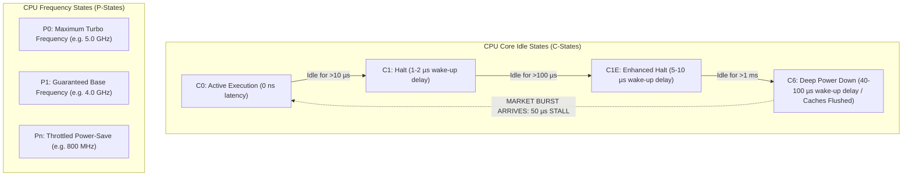

> [!summary]
> Dynamic CPU power-saving states (C-states for idle sleep, P-states for frequency throttling) are the single largest source of multi-microsecond latency tail spikes on unoptimized Linux servers. Waking a CPU core from deep C-state sleep (C6) takes 10–100 µs. Eliminating power-management jitter requires forcing fixed base CPU frequencies, locking PM-QoS to 0 µs via `/dev/cpu_dma_latency`, and booting with `intel_idle.max_cstate=0 idle=poll`.

---

## Why it matters
When market volume is quiet, an unconfigured CPU core detects no immediate work and enters a power-saving **C-state (C1E, C3, or C6)**, shutting down internal clock trees, flushing L1/L2 caches to L3, and lowering core voltage.

When a sudden market data burst arrives from the exchange:
1. The NIC DMAs the packet into RAM.
2. The core receives the wake-up signal.
3. The voltage regulator module (VRM) must ramp up voltage and stabilize internal PLL clock oscillators.
4. **The wake-up delay injects 10 to 100 microseconds (10,000–100,000 ns) of dead latency into your first fill.**

For high-frequency trading, CPU cores must be permanently pinned in **C0 state (100% active spinning)** at a fixed, unthrottled clock frequency.



---

## Mechanism

### 1. C-States (Processor Idle States)
- **C0 (Operational)**: The CPU is executing instructions actively.
- **C1 (Halt - `HLT` instruction)**: The core clock is gated; execution units stop. Wake-up latency: **~1–2 µs**.
- **C6 (Deep Power-Down)**: The core execution voltage is reduced to near-zero; the core state is saved, and internal L1/L2 caches are completely flushed to L3 or invalidated. Wake-up latency: **~40–100 µs**.

### 2. P-States & Dynamic Voltage/Frequency Scaling (DVFS)
Under standard Linux governors (`powersave` or `ondemand`), the CPU dynamically adjusts its operating frequency based on utilization:
- When idle, the CPU frequency drops to **800 MHz** to conserve energy.
- When an order arrives, the CPU takes **20 to 50 microseconds** to transition up to 4.0 GHz.
- During this frequency transition window, instructions execute at 1/5th normal speed.

### 3. Turbo Boost Jitter & Thermal Throttling
While Intel Turbo Boost can temporarily increase a single core's clock speed from 4.0 GHz to 5.2 GHz, it introduces two severe failure modes:
1. **Frequency Instability**: As soon as other cores on the socket wake up or AVX-512 instructions execute, the CPU thermal control circuit throttles clock speed back down to 4.0 GHz or lower.
2. **TSC Calibration Skew**: On legacy systems, frequency shifts break cycle-to-nanosecond calibration.

> [!important] Production Frequency Strategy
> Low-latency production servers lock CPU frequency at a **fixed, static maximum all-core base frequency** (e.g., locked at 4.2 GHz) with Turbo Boost disabled in the BIOS. This guarantees 100% deterministic clock-cycle timing across all hours of the trading day.

---

## In Practice

### 1. Linux PM-QoS Interface (`/dev/cpu_dma_latency`)
Linux provides the Power Management Quality of Service (PM-QoS) interface. Opening `/dev/cpu_dma_latency` and writing a 32-bit integer `0` instructs the kernel power management subsystem never to allow any CPU core to enter a sleep state deeper than $0\text{ µs}$.

```cpp
#include <fcntl.h>
#include <unistd.h>
#include <cstdint>
#include <iostream>
#include <stdexcept>

class LatencyGovernor {
private:
    int fd_ = -1;

public:
    LatencyGovernor() {
        // Open the PM-QoS interface
        fd_ = open("/dev/cpu_dma_latency", O_RDWR);
        if (fd_ < 0) {
            std::cerr << "Warning: Could not open /dev/cpu_dma_latency. Run with root/sudo.\n";
            return;
        }

        // Write 0 to request 0 microseconds maximum acceptable latency
        int32_t target_latency_us = 0;
        if (write(fd_, &target_latency_us, sizeof(target_latency_us)) != sizeof(target_latency_us)) {
            close(fd_);
            fd_ = -1;
            throw std::runtime_error("Failed to write to /dev/cpu_dma_latency");
        }
        std::cout << "PM-QoS: Successfully locked CPU C-states to 0 µs latency\n";
    }

    ~LatencyGovernor() {
        if (fd_ >= 0) {
            close(fd_); // Closing the FD restores default kernel power management
        }
    }

    // Non-copyable
    LatencyGovernor(const LatencyGovernor&) = delete;
    LatencyGovernor& operator=(const LatencyGovernor&) = delete;
};
```

### 2. OS Power Tuning Script
Execute at host boot to lock CPU performance governors:

```bash
#!/usr/bin/env bash
set -euo pipefail

# 1. Set performance governor across all cores
for gov in /sys/devices/system/cpu/cpu*/cpufreq/scaling_governor; do
    echo "performance" > "$gov"
done

# 2. Disable all idle C-states deeper than C0/C1
for state_disable in /sys/devices/system/cpu/cpu*/cpuidle/state[1-9]/disable; do
    if [ -f "$state_disable" ]; then
        echo "1" > "$state_disable"
    fi
done

# 3. Lock energy performance preference to performance
for epp in /sys/devices/system/cpu/cpu*/cpufreq/energy_performance_preference; do
    if [ -f "$epp" ]; then
        echo "performance" > "$epp"
    fi
done

echo "CPU frequency and C-states successfully locked to maximum performance."
```

---

## Numbers

*Hardware Baseline: Intel Xeon Platinum 8480+ @ 3.8 GHz.*

| Power State / Event | Transition / Wake-up Latency | Execution Impact |
| :--- | :--- | :--- |
| **C0 (Active Polling)** | **0 ns** | Instant execution. |
| **C1 Wake-up (`HLT`)** | **1.2–2.5 µs** (1,200–2,500 ns) | Stalls initial packet reception. |
| **C1E Wake-up (Enhanced Halt)** | **5.0–12.0 µs** | Drops top-of-queue priority. |
| **C6 Wake-up (Deep Power-Down)**| **40.0–100.0 µs** | Complete latency blowout on first tick. |
| **P-State DVFS Transition (800MHz $\to$ 4GHz)**| **20.0–50.0 µs** | 5x slower execution during ramp-up. |

---

## Trade-offs

| Configuration | Latency Impact | Operational Cost |
| :--- | :--- | :--- |
| **`idle=poll` + Disabled C-States** | Zero wake-up delay; instant response to market events. | Maximum server power consumption (350W+ per socket); requires heavy datacenter cooling. |
| **Dynamic Turbo Boost Enabled** | Highest single-thread peak speed (e.g. 5.2 GHz) during short bursts. | Unpredictable thermal throttling; frequency drops when other cores become active. |
| **Locked Static Frequency (All-Core)** | 100% deterministic clock cycle execution throughout the day. | Sacrifices peak single-core turbo frequency by ~15–20%. |

---

> [!warning] Gotchas
> 1. **The FD Lifetime Bug in `/dev/cpu_dma_latency`**: The PM-QoS constraint is tied to the open File Descriptor. If your application creates the file descriptor in a local helper function and lets it fall out of scope, the kernel immediately closes the FD and restores deep C-states! *The FD must remain open for the entire process lifetime.*
> 2. **BIOS C-State Overrides**: Setting Linux kernel parameters is useless if the server motherboard BIOS has "C-States: Enabled" or "Energy Efficient Turbo: Enabled" hardcoded. *Always disable C-states, C1E, and energy-saving modes directly in the BIOS setup.*

---

## Lab
**Objective**: Measure the latency penalty of waking a CPU core from deep sleep (C6) vs active polling (C0) using `rdtsc` after a 1-millisecond sleep.

**Success Criteria**:
1. Run a benchmark that calls `usleep(1000)` and measures the first cycle duration immediately upon waking.
2. Observe a 20–60 µs spike due to C-state wake-up.
3. Lock `/dev/cpu_dma_latency` to `0` and disable C-states: verify that wake-up jitter is completely eliminated.

---

> [!question]- Self-test
> 1. **What is the difference between a CPU C-state and a P-state?**
>    *Answer*: C-states (Idle/Sleep States) control the power-saving depth of an inactive CPU core (from C0 active execution down to C6 deep power-down where clocks are gated and voltage is dropped). P-states (Performance/Frequency States) control the operating voltage and clock frequency of an active core in the C0 state (e.g., scaling frequency from 800 MHz up to 4.2 GHz).
> 2. **Why does closing the file descriptor to `/dev/cpu_dma_latency` cause immediate latency degradation?**
>    *Answer*: The Linux PM-QoS subsystem enforces latency constraints only while the requesting process holds an open file descriptor. As soon as the file descriptor is closed (or the process exits), the kernel tears down the latency request and allows the CPU cores to return to power-saving deep C-states.
> 3. **Why do high-frequency trading firms prefer locking CPU cores to a static base frequency rather than using dynamic Turbo Boost?**
>    *Answer*: Dynamic Turbo Boost introduces non-deterministic frequency fluctuations based on thermal headroom and the number of active cores. When sudden market bursts occur and multiple cores activate, the CPU throttles frequency down, injecting latency jitter. A static, locked all-core frequency guarantees completely predictable and uniform execution speed.

---

## Related
- [[Notes/Kernel Boot Parameters for Core Isolation]]
- [[Notes/Linux Thread Pinning and Core Affinity]]
- [[Notes/Latency Numbers Every Trading Engineer Knows]]
- [[Notes/CPU Timestamp Counter RDTSC Mechanics]]
- [[MOC - 04 Hardware Mechanical Sympathy]]
- [[MOC - 05 OS & Kernel Tuning]]

## Sources
- [[Sources/Red Hat Enterprise Linux for Real Time Tuning Guide]]
- [[Sources/Intel 64 and IA-32 Architectures Optimization Reference Manual]]
- [[Sources/Systems Performance by Brendan Gregg]]
