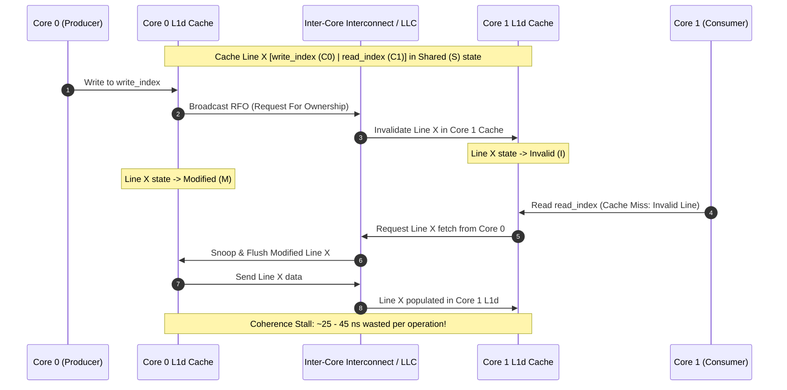

> [!summary]
> False sharing occurs when independent threads running on distinct CPU cores modify distinct variables that reside within the same 64-byte cache line. The hardware cache coherence protocol (MESI/MOESI) forces the entire cache line to bounce between core caches, transforming what appears to be lock-free multi-threaded code into a serialized 20–40 nanosecond memory interconnect bottleneck.

---

## Why it matters
In high-frequency trading engines and multi-threaded order routing fabrics, false sharing is one of the most insidious performance killers. It does not produce compiler errors, race conditions, or incorrect results—it simply destroys throughput by **80–95%** and injects massive tail-latency jitter.

A classic example: in a Single-Producer Single-Consumer ([[Notes/Lock-Free SPSC Ring Buffer Design|SPSC Ring Buffer]]), if the producer's `write_index` and the consumer's `read_index` share a single 64-byte cache line, every single push and pop invalidates the other core's L1/L2 cache, degrading a 5 ns queue operation to a 35–50 ns interconnect stall.



---

## Mechanism

### 1. The MESI Cache Coherence Protocol
To maintain a single, coherent view of system memory across multiple cores, x86 processors implement variations of the **MESI** protocol:
- **Modified (M)**: The line is present *only* in this core's cache and is dirty (modified relative to DRAM). This core has exclusive write permission.
- **Exclusive (E)**: The line is present *only* in this core's cache and is clean (matches DRAM).
- **Shared (S)**: The line is present in this core's cache and potentially in other cores' caches. It is read-only.
- **Invalid (I)**: The line does not contain valid data; any read or write triggers a cache miss.

*(AMD processors utilize **MOESI**, adding the **Owner (O)** state to allow sharing modified lines without writing back to DRAM first).*

### 2. Request For Ownership (RFO) and Line Bouncing
When Core 0 writes to Variable $A$ on Cache Line $X$ (currently in `Shared` state across Core 0 and Core 1):
1. Core 0's cache controller issues an **RFO (Request For Ownership)** over the ring/mesh bus.
2. Core 1's cache controller receives the invalidation snoop and transitions its copy of Line $X$ from `Shared` to `Invalid`.
3. Core 0 transitions Line $X$ to `Modified` and completes the write.
4. When Core 1 attempts to read Variable $B$ (located on the same Line $X$), Core 1 hits an `Invalid` line miss.
5. Core 1 must stall its execution pipeline while it snoops Line $X$ from Core 0's L1d across the inter-core interconnect, forcing Core 0 to transition Line $X$ to `Shared` (or write it back).
6. This continuous ping-pong of cache lines across the bus is termed **Cache Line Bouncing**.

---

## In Practice

In modern C++ (C++17 and later), prevent false sharing by enforcing cache line separation with `std::hardware_destructive_interference_size` and explicit alignment.

```cpp
#include <atomic>
#include <new>
#include <cstdint>

// Standard cache line size fallback if macro unavailable
#ifdef __cpp_lib_hardware_interference_size
    using std::hardware_destructive_interference_size;
#else
    constexpr size_t hardware_destructive_interference_size = 64;
#endif

// Anti-Pattern: Severe False Sharing
struct BadQueueIndexes {
    std::atomic<uint64_t> write_index{0}; // Bytes 0 - 7
    std::atomic<uint64_t> read_index{0};  // Bytes 8 - 15
    // Both variables sit in the EXACT SAME 64-byte cache line!
    // Producer on Core 0 and Consumer on Core 1 will thrash MESI states.
};

// Production-Grade Pattern: Cache-Padded & Aligned
struct alignas(hardware_destructive_interference_size) GoodQueueIndexes {
    // Producer core state (Core 0 only writes here)
    alignas(hardware_destructive_interference_size) std::atomic<uint64_t> write_index{0};
    
    // Explicit padding ensures read_index cannot fall on the same cache line
    // or adjacent hardware prefetch line (128-byte safety margin).
    uint8_t pad1[hardware_destructive_interference_size - sizeof(std::atomic<uint64_t>)];

    // Consumer core state (Core 1 only writes here)
    alignas(hardware_destructive_interference_size) std::atomic<uint64_t> read_index{0};
    
    uint8_t pad2[hardware_destructive_interference_size - sizeof(std::atomic<uint64_t>)];
};
```

---

## Numbers

*Hardware Baseline: Intel Xeon Platinum 8480+ (Sapphire Rapids) @ 3.8 GHz.*

| Scenario / Contention State | Latency per Access | Effective Bandwidth | Notes |
| :--- | :--- | :--- | :--- |
| **Independent Cache Lines (No Contention)** | **1.0–1.2 ns** (4 cycles) | >300 GB/s | Pure L1d hits in parallel across cores. |
| **False Sharing (Intra-Socket Cores)** | **25–40 ns** (100–160 cycles) | ~15–25 GB/s | RFO invalidation across intra-socket mesh. |
| **False Sharing (Cross-Socket NUMA)** | **120–220 ns** (450–850 cycles) | ~2–5 GB/s | Coherence snoops cross UPI/QPI interconnect. |
| **Atomic RMW Contention (`lock xadd`)** | **15–30 ns** (60–120 cycles) | ~20 GB/s | Serialized cache-line ownership transitions. |

---

## Trade-offs

| Strategy | Latency Benefit | Memory / Architecture Cost |
| :--- | :--- | :--- |
| **64-Byte / 128-Byte Padding** | Completely eliminates RFO invalidation stalls (~30 ns per write). | Increases struct size; can cause cache bloat if applied indiscriminately to read-only data. |
| **Single-Writer Ring Architecture** | Eliminates all atomic cross-core write contention. | Requires strict pipeline topology (e.g. SPSC / Disruptor) instead of MPMC. |
| **Batching Ring Updates** | Amortizes cross-thread sync cost across $N$ elements. | Increases instantaneous latency for individual ticks (unacceptable for ultra-fast pricing). |

---

> [!warning] Gotchas
> 1. **Spatial Prefetcher False Sharing (128-byte Line Pairs)**: Modern Intel and AMD processors have spatial prefetchers that fetch **128-byte pairs** (two adjacent 64-byte lines). If Producer writes to line $N$ and Consumer writes to line $N+1$, the spatial prefetcher can still cause cross-core line invalidation. *Remedy: Pad inter-thread variables by 128 bytes, not just 64 bytes.*
> 2. **Global Counters & Metrics**: Adding an unpadded global statistics counter (e.g., `uint64_t total_orders_processed`) updated by multiple worker threads will silently destroy the performance of adjacent variables on that same line.

---

## Lab
**Objective**: Build a high-throughput multi-threaded benchmark with two threads pinned to separate physical CPU cores, modifying adjacent `uint64_t` variables. Measure throughput with and without 64-byte/128-byte padding.

**Success Criteria**:
1. Demonstrate that adding `alignas(64)` or padding between variables increases throughput by at least **5x to 10x**.
2. Capture the hardware events with Linux `perf`:
   ```bash
   perf stat -e mem_load_retired.l1_miss,ocr.demand_data_rd.l3_miss,cache-misses ./benchmark
   ```
   Show a massive drop in cache line invalidations and cross-core snoops.

---

> [!question]- Self-test
> 1. **Why does false sharing NOT violate thread safety or cause data corruption?**
>    *Answer*: The hardware cache coherence protocol (MESI/MOESI) guarantees strict memory consistency at the hardware level by invalidating stale cache lines and synchronizing data across cores before any read or write completes. The program produces mathematically correct results, but incurs severe latency penalties due to hardware serialization.
> 2. **What is an RFO (Request For Ownership) and when is it issued by the CPU?**
>    *Answer*: An RFO is a bus transaction broadcast by a core when it attempts to write to a memory address that is either not in its local cache (a write miss) or is present in its cache in the `Shared` (read-only) state. The RFO demands exclusive ownership of the 64-byte line, forcing all other cores to invalidate their local copies and supply dirty data if modified.
> 3. **Why is padding to 64 bytes sometimes insufficient to prevent cache-line interference on modern Intel CPUs?**
>    *Answer*: Modern CPUs include an L2 Spatial/Adjacent Line Prefetcher that automatically pairs adjacent 64-byte chunks into 128-byte blocks. If two variables sit in adjacent 64-byte lines belonging to the same 128-byte aligned pair, prefetch activity can trigger cross-core coherence traffic. Using a 128-byte boundary completely isolates the variables.

---

## Related
- [[Notes/CPU Cache Hierarchy and Line Alignment]]
- [[Notes/Latency Numbers Every Trading Engineer Knows]]
- [[Notes/Lock-Free SPSC Ring Buffer Design]]
- [[Notes/C++ Memory Model and Memory Orders]]
- [[MOC - 04 Hardware Mechanical Sympathy]]

## Sources
- [[Sources/Mechanical Sympathy by Martin Thompson]]
- [[Sources/What Every Programmer Should Know About Memory by Ulrich Drepper]]
- [[Sources/CppCon 2017 - When a Microsecond is an Eternity by Carl Cook]]
