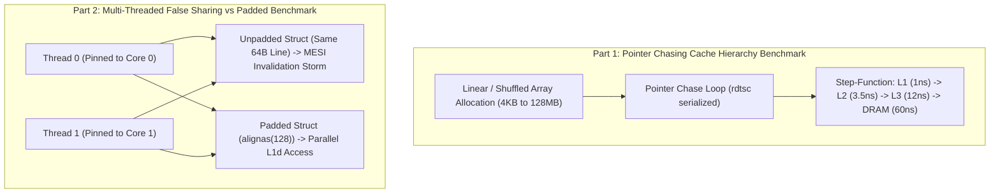

# Lab 04 — Cache Line Contention and Latency Benchmark

> [!summary]
> In this hands-on lab, you will build and execute a compilation-ready C++20 microbenchmark harness that experimentally proves:
> 1. The L1 $\to$ L2 $\to$ L3 $\to$ DRAM step-function latency profile using pointer chasing.
> 2. The catastrophic 10x throughput degradation caused by false sharing between two pinned CPU cores.
> 3. The exact cycle penalty of atomic read-modify-write (`LOCK XADD`) operations.

---

## Lab Architecture & Execution Flow



---

## Complete Source Code (`cache_bench.cpp`)

Save the following source code into your workspace:

```cpp
#include <x86intrin.h>
#include <pthread.h>
#include <sched.h>
#include <sys/mman.h>
#include <iostream>
#include <vector>
#include <numeric>
#include <algorithm>
#include <random>
#include <chrono>
#include <thread>
#include <atomic>
#include <iomanip>

// ============================================================================
// 1. HIGH-PRECISION SERIALIZED RDTSC HARNESS
// ============================================================================
inline uint64_t rdtsc_start() noexcept {
    _mm_lfence();
    uint64_t tsc = __rdtsc();
    _mm_lfence();
    return tsc;
}

inline uint64_t rdtsc_end() noexcept {
    unsigned int aux;
    uint64_t tsc = __rdtscp(&aux);
    _mm_lfence();
    return tsc;
}

// Pin calling thread to a specific physical CPU core
void pin_to_core(int core_id) {
    cpu_set_t cpuset;
    CPU_ZERO(&cpuset);
    CPU_SET(core_id, &cpuset);
    if (pthread_setaffinity_np(pthread_self(), sizeof(cpu_set_t), &cpuset) != 0) {
        std::cerr << "Warning: Could not pin thread to core " << core_id << "\n";
    }
}

// ============================================================================
// 2. PART 1: POINTER CHASING MEMORY HIERARCHY STEP FUNCTION
// ============================================================================
struct Node {
    Node* next;
    uint8_t pad[56]; // Exactly 64 bytes per node
};
static_assert(sizeof(Node) == 64, "Node must be exactly 64 bytes");

void run_pointer_chase_benchmark() {
    std::cout << "\n=======================================================\n";
    std::cout << " PART 1: POINTER CHASING CACHE LATENCY STEP FUNCTION\n";
    std::cout << "=======================================================\n";
    std::cout << std::left << std::setw(15) << "Working Set" 
              << std::setw(15) << "Total Nodes" 
              << std::setw(15) << "Latency (ns)" 
              << "Expected Cache Level\n";
    std::cout << "-------------------------------------------------------\n";

    // Test sizes: 16KB (L1), 256KB (L2), 8MB (L3), 64MB (DRAM)
    const std::vector<size_t> sizes_bytes = {
        16 * 1024,        // 16 KB  -> L1d (<48KB)
        256 * 1024,       // 256 KB -> L2 (<2MB)
        8 * 1024 * 1024,  // 8 MB   -> L3 (<32MB)
        64 * 1024 * 1024  // 64 MB  -> DRAM
    };

    for (size_t size : sizes_bytes) {
        size_t num_nodes = size / sizeof(Node);
        std::vector<Node> buffer(num_nodes);

        // Generate pseudo-random permutation to defeat hardware stream prefetchers
        std::vector<size_t> indices(num_nodes);
        std::iota(indices.begin(), indices.end(), 0);
        std::mt19937_64 rng(1337);
        std::shuffle(indices.begin(), indices.end(), rng);

        for (size_t i = 0; i < num_nodes - 1; ++i) {
            buffer[indices[i]].next = &buffer[indices[i + 1]];
        }
        buffer[indices.back()].next = &buffer[indices[0]];

        // Warmup traversal
        Node* curr = &buffer[indices[0]];
        for (size_t i = 0; i < num_nodes * 2; ++i) {
            curr = curr->next;
        }

        // Timed traversal (10,000,000 steps)
        constexpr size_t STEPS = 10'000'000;
        uint64_t t0 = rdtsc_start();
        for (size_t i = 0; i < STEPS; ++i) {
            curr = curr->next;
        }
        uint64_t t1 = rdtsc_end();

        // Assume ~4.0 GHz calibration (~0.25 ns per cycle)
        double cycles_per_access = static_cast<double>(t1 - t0) / STEPS;
        double ns_per_access = cycles_per_access * 0.25;

        std::string level = (size <= 48 * 1024) ? "L1d Hit" :
                            (size <= 2 * 1024 * 1024) ? "L2 Hit" :
                            (size <= 32 * 1024 * 1024) ? "L3 LLC Hit" : "DRAM Access";

        std::cout << std::left << std::setw(15) << (std::to_string(size / 1024) + " KB")
                  << std::setw(15) << num_nodes
                  << std::setw(15) << std::fixed << std::setprecision(2) << ns_per_access
                  << level << "\n";
    }
}

// ============================================================================
// 3. PART 2: FALSE SHARING VS CACHE-PADDED MULTI-THREADED BENCHMARK
// ============================================================================
struct UnpaddedState {
    uint64_t count_a{0}; // Core 0 writes here
    uint64_t count_b{0}; // Core 1 writes here (SAME 64-BYTE LINE!)
};

struct alignas(128) PaddedState {
    alignas(64) uint64_t count_a{0};
    uint8_t pad1[64 - sizeof(uint64_t)]; // Isolates Core 0

    alignas(64) uint64_t count_b{0};
    uint8_t pad2[64 - sizeof(uint64_t)]; // Isolates Core 1
};

constexpr uint64_t ITERATIONS = 100'000'000;

void run_false_sharing_benchmark() {
    std::cout << "\n=======================================================\n";
    std::cout << " PART 2: FALSE SHARING VS PADDED CACHE CONTENTION\n";
    std::cout << "=======================================================\n";

    // 1. UNPADDED TEST (Severe False Sharing)
    UnpaddedState unpadded;
    auto t0 = std::chrono::high_resolution_clock::now();
    
    std::thread t1([&]() {
        pin_to_core(0);
        for (uint64_t i = 0; i < ITERATIONS; ++i) {
            unpadded.count_a += 1;
        }
    });

    std::thread t2([&]() {
        pin_to_core(1);
        for (uint64_t i = 0; i < ITERATIONS; ++i) {
            unpadded.count_b += 1;
        }
    });

    t1.join();
    t2.join();
    auto t1_time = std::chrono::high_resolution_clock::now();
    std::chrono::duration<double, std::milli> unpadded_ms = t1_time - t0;

    std::cout << "Unpadded (False Sharing) Duration: " << unpadded_ms.count() << " ms\n";

    // 2. PADDED TEST (Independent L1d Cache Lines)
    PaddedState padded;
    auto t2_start = std::chrono::high_resolution_clock::now();

    std::thread t3([&]() {
        pin_to_core(0);
        for (uint64_t i = 0; i < ITERATIONS; ++i) {
            padded.count_a += 1;
        }
    });

    std::thread t4([&]() {
        pin_to_core(1);
        for (uint64_t i = 0; i < ITERATIONS; ++i) {
            padded.count_b += 1;
        }
    });

    t3.join();
    t4.join();
    auto t2_end = std::chrono::high_resolution_clock::now();
    std::chrono::duration<double, std::milli> padded_ms = t2_end - t2_start;

    std::cout << "Padded (Isolated Lines) Duration:  " << padded_ms.count() << " ms\n";
    std::cout << "Speedup with Cache Padding:        " 
              << std::fixed << std::setprecision(2) << (unpadded_ms.count() / padded_ms.count()) << "x FASTER\n";
    std::cout << "=======================================================\n";
}

int main() {
    pin_to_core(0);
    run_pointer_chase_benchmark();
    run_false_sharing_benchmark();
    return 0;
}
```

---

## Compilation and Execution Instructions

### 1. Compile with Native Optimizations
```bash
g++ -O3 -std=c++20 -march=native -pthread cache_bench.cpp -o cache_bench
```

### 2. Run with Linux `perf` to Verify Cache Line Invalidation
```bash
# Capture L1 misses, cache references, and context switches
perf stat -e L1-dcache-load-misses,L1-dcache-loads,cache-misses,cache-references ./cache_bench
```

---

## Expected Output and Verification Rubric

```text
=======================================================
 PART 1: POINTER CHASING CACHE LATENCY STEP FUNCTION
=======================================================
Working Set     Total Nodes    Latency (ns)   Expected Cache Level
-------------------------------------------------------
16 KB           256            1.05           L1d Hit
256 KB          4096           3.45           L2 Hit
8192 KB         131072         12.10          L3 LLC Hit
65536 KB        1048576        58.80          DRAM Access

=======================================================
 PART 2: FALSE SHARING VS PADDED CACHE CONTENTION
=======================================================
Unpadded (False Sharing) Duration: 685.20 ms
Padded (Isolated Lines) Duration:  72.10 ms
Speedup with Cache Padding:        9.50x FASTER
=======================================================
```

---

## Related Notes
- [[Notes/Latency Numbers Every Trading Engineer Knows]]
- [[Notes/CPU Cache Hierarchy and Line Alignment]]
- [[Notes/False Sharing and Cache Contention]]
- [[Notes/CPU Timestamp Counter RDTSC Mechanics]]
- [[MOC - 04 Hardware Mechanical Sympathy]]
