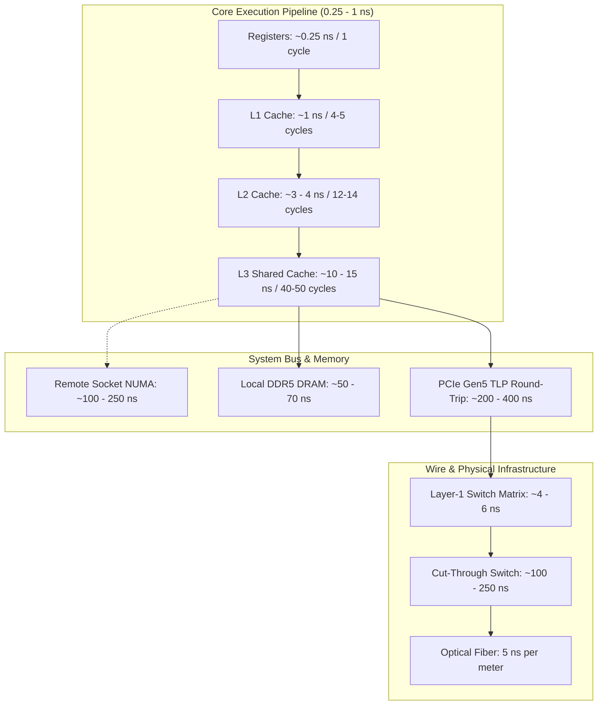

> [!summary]
> Modern low-latency trading systems operate on a physical budget where 1 nanosecond equals ~20–30 cm of speed-of-light propagation in copper or optical fiber and 3–5 CPU clock cycles. Designing sub-microsecond tick-to-trade architectures requires an absolute, hardware-up grasp of access times across CPU pipelines, cache hierarchies, buses, kernel-bypass network interfaces, and physical infrastructure.

---

## Why it matters
In high-frequency trading and matching engine design, mean latency is a hygiene factor; tail latency ($p99$, $p99.9$, max jitter) determines PnL and risk survival. 

If your tick-to-trade loop touches main memory (DRAM), you lose 50–70 ns. If your thread suffers a cache line bounce across a dual-socket NUMA interconnect (UPI/QPI), you lose 150–300 ns. If your core takes a kernel interrupt or a context switch, you lose 1,000–5,000 ns. 

Understanding these physical bounds dictates data structure layout, core pinning, memory allocation, and hardware selection.



---

## Mechanism

### 1. CPU Clock and Instruction Pipeline
At a fixed clock frequency of 4.0 GHz (a common base target for locked HFT server cores), one CPU clock cycle is:
$$\tau = \frac{1}{4.0 \times 10^9 \text{ s}^{-1}} = 0.25 \text{ ns}$$
Modern superscalar architectures (e.g., Intel Golden Cove / Raptor Cove, AMD Zen 4/5) can execute 4–6 instructions per cycle (IPC) in optimal conditions using out-of-order execution pipelines. However:
- A **predicted branch** costs 1 cycle (or 0 cycles via instruction fusing).
- A **mispredicted branch** forces a complete pipeline flush, costing **12–20 cycles (3–5 ns)**.

### 2. Cache Hierarchy & Memory Subsystem
Accessing data requires traversing cache levels, bounded by the speed of light on silicon and transistor switching delays:
- **L1 Data Cache (32–48 KB per core)**: 4–5 cycles (**~1.0–1.2 ns**).
- **L2 Cache (1–2 MB per core)**: 12–14 cycles (**~3.0–3.5 ns**).
- **L3 Cache (Shared LLC, 32–96 MB per socket / 3D V-Cache)**: 40–60 cycles (**~10–15 ns**).
- **DRAM (Local DDR4/DDR5 via Integrated Memory Controller)**: **50–70 ns**.
- **Remote NUMA Node Access (Cross-Socket via UPI/Infinity Fabric)**: **100–250 ns** (penalized by coherence traffic and directory lookups).

### 3. Memory Bus & PCIe Mechanics
When communicating with a Network Interface Card (NIC) or FPGA:
- A read over PCIe requires a Transaction Layer Packet (TLP) round-trip: **~200–400 ns**.
- Direct Memory Access (DMA) writes by the NIC directly to host RAM (or L3 via Intel Data Direct I/O / DDIO) bypass the CPU execution pipeline, taking **~100–150 ns** from physical PHY to L3 cache residency.

### 4. Physical Medium Propagation
Electricity in copper and light in standard single-mode optical fiber ($n \approx 1.468$) travel at approximately:
$$v = \frac{c}{n} = \frac{3 \times 10^8 \text{ m/s}}{1.468} \approx 2.04 \times 10^8 \text{ m/s} \approx 0.204 \text{ m/ns} \implies \mathbf{4.9 \text{ ns / meter}}$$
- A 1-meter fiber patch cable in a colocation rack adds **~5 ns round-trip**.
- Hollow-core fiber ($n \approx 1.05$) reduces this to **~3.5 ns / meter**.
- Microwave / Millimeter-wave line-of-sight propagation through air ($n \approx 1.0003$) operates at **~3.3 ns / meter**.

---

## In Practice

In production C++ code, keeping critical hot paths inside L1/L2 and avoiding atomic bus contention is the difference between a 400 ns and a 4 µs tick-to-trade engine.

```cpp
#include <x86intrin.h>
#include <cstdint>
#include <new>

// Ensure data structures are cache-line aligned (64 bytes)
// and padded to prevent false sharing across concurrent threads.
struct alignas(64) HotOrderState {
    uint64_t order_id;
    uint32_t price;
    uint32_t qty;
    char symbol[8];
    uint64_t client_timestamp_tsc;
    
    // Explicit padding to guarantee next core's state is on a different line
    uint8_t pad[64 - 32];
};
static_assert(sizeof(HotOrderState) == 64, "Must occupy exactly one cache line");

// Measurement harness with memory fences to prevent out-of-order execution
inline uint64_t rdtsc_start() noexcept {
    unsigned int aux;
    // Serialize instruction stream before reading TSC
    _mm_lfence();
    return __rdtsc();
}

inline uint64_t rdtsc_end() noexcept {
    unsigned int aux;
    // rdtscp serializes prior instructions and reads TSC atomically
    uint64_t tsc = __rdtscp(&aux);
    _mm_lfence();
    return tsc;
}
```

---

## Numbers: Reference Latency Budget (Modern Server Platforms)

*Hardware Baseline: Intel Xeon Sapphire Rapids / AMD EPYC Genoa @ 3.8–4.2 GHz, DDR5-4800, PCIe Gen5, Solarflare XtremeScale X2521 / Mellanox ConnectX-6 Dx.*

| Operation / Boundary | Latency (Cycles @ 4 GHz) | Latency (Time) | Engineering Consequence |
| :--- | :--- | :--- | :--- |
| **CPU Register Read/Write** | 1 cycle | **0.25 ns** | Keep working state in registers / stack. |
| **L1d Cache Hit** | 4–5 cycles | **1.0–1.2 ns** | Hot order book top must fit in L1d. |
| **Branch Misprediction** | 12–20 cycles | **3.0–5.0 ns** | Eliminate branches via lookup tables / CMOV. |
| **L2 Cache Hit** | 14 cycles | **3.5 ns** | Keep active symbol books in L2. |
| **L3 Cache Hit (Local LLC)** | 40–50 cycles | **10–13 ns** | Last line of defense before DRAM penalty. |
| **Atomic CAS (`LOCK CMPXCHG`)** | 40–80 cycles | **10–20 ns** | Avoid cross-thread atomics in hot loop. |
| **False Sharing (Same Cache Line)** | 100–160 cycles | **25–40 ns** | Invalidate remote L1/L2; pad structures to 64B. |
| **Local DRAM Access (DDR5)** | 200–280 cycles | **50–70 ns** | Steady-state processing must never page fault or allocate. |
| **Remote NUMA DRAM Access** | 400–1000 cycles | **100–250 ns** | Pin memory to local socket using `numactl`. |
| **OS Context Switch (Pinned Core)** | 4,000–12,000 cycles | **1.0–3.0 µs** | Never yield; run dedicated spinning threads. |
| **Linux Kernel Socket Path (Syscall)**| 8,000–20,000 cycles | **2.0–5.0 µs** | Mandatory kernel bypass (`ef_vi`, DPDK). |
| **Solarflare `ef_vi` Wire-to-Host** | — | **400–700 ns** | Ingress frame to L1 user-space packet handler. |
| **FPGA Wire-to-Wire Parse & Filter**| — | **30–80 ns** | Direct hardware pipeline execution. |
| **Layer-1 Switch (Metamako/Arista)** | — | **4–6 ns** | Zero-buffer physical layer packet tapping. |
| **Cut-Through Switch (Arista 7150)** | — | **100–250 ns** | Layer-2 packet forwarding inside colocation. |
| **Fiber Optic Cable Propagation** | — | **~5 ns / meter** | Equalize cable lengths across server racks. |

---

## Trade-offs

| Design Choice | Latency Benefit | Cost / Trade-off |
| :--- | :--- | :--- |
| **Spinning Polling vs. `epoll`/blocking** | Saves 1.5–3.0 µs (no context switch, no sleep state). | Consumes 100% of a dedicated physical CPU core; thermal heat. |
| **Intrusive Pointers vs. Array Indexing** | Intrusive lists give $O(1)$ operations without re-indexing. | Pointer chasing risks cache misses if nodes are not allocated contiguously. |
| **Local Cache Padding (64 Bytes)** | Eliminates false sharing (saves 30–50 ns per contention event). | Increases memory footprint, decreases L1/L2 cache density. |
| **Software Kernel Bypass vs. FPGA** | C++ is agile, easier to update, and supports complex state logic. | FPGA has 5–10x lower latency (sub-100ns) and zero jitter, but slow dev cycle. |

---

> [!warning] Gotchas
> 1. **The Out-of-Order RDTSC Trap**: Executing `__rdtsc()` without an accompanying `_mm_lfence()` allows the CPU's out-of-order execution engine to reorder the timestamp read *after* or *before* the code being profiled, yielding false or negative measurements.
> 2. **C-State Jitter Injections**: If an idle core enters C6 power-saving state, waking it back up to C0 when a packet arrives takes **10–100 µs**, completely destroying $p99.9$ latency. All deep C-states must be disabled in the BIOS and kernel.
> 3. **Skylake/Icelake AVX-512 Frequency Downclocking**: Using 512-bit vector instructions on older Intel chips draws high current, triggering CPU voltage regulators to reduce core clock frequency by 10–20% across all cores on the socket.

---

## Lab
**Objective**: Experimentally measure and verify the cost of L1 cache hit vs. L3 cache hit vs. DRAM access vs. cross-socket NUMA access on your local Linux environment using a pointer-chasing array benchmark.

**Success Criteria**:
1. Output an accurate nanosecond timing report showing an unambiguous step function: $\approx 1\text{ ns}$ (L1), $\approx 10\text{ ns}$ (L3), $\approx 60\text{ ns}$ (DRAM).
2. Measure the exact cycle penalty of introducing a single atomic `lock xadd` instruction inside the loop.

---

> [!question]- Self-test
> 1. **Why does an unpinned thread experience massive latency jitter even if the CPU load on the system is low?**
>    *Answer*: The OS scheduler can migrate the thread between physical cores or NUMA nodes. Core migration invalidates L1/L2 caches (requiring cold-cache repopulation, costing hundreds of nanoseconds) and triggers inter-core cache-coherency invalidations, while NUMA migration causes subsequent memory reads to cross the high-latency inter-socket interconnect.
> 2. **What is the exact physical mechanism that makes false sharing so expensive between two cores?**
>    *Answer*: False sharing occurs when two cores write to different variables that reside on the same 64-byte cache line. Under the MESI/MOESI cache coherence protocol, whenever Core A writes to its variable, the entire cache line in Core B's L1/L2 cache is invalidated (transitioning to Invalid `I`). When Core B attempts to read or write its own variable, it incurs a cache miss and must fetch the line across the slow inter-core interconnect from Core A (transitioning the line to Modified `M` or Shared `S`), wasting 20–40 ns per write.
> 3. **If a fiber-optic cable is 20 meters longer than a competitor's, what is your minimum round-trip time latency deficit before processing a single byte of data?**
>    *Answer*: Propagation in standard fiber is ~5 ns per meter. For 20 meters, one-way propagation is $20 \times 5 = 100\text{ ns}$. The round-trip deficit (packet ingress + order egress) is $2 \times 100\text{ ns} = \mathbf{200\text{ ns}}$.

---

## Related
- [[MOC - 04 Hardware Mechanical Sympathy]]
- [[Notes/CPU Cache Hierarchy and Line Alignment]]
- [[Notes/False Sharing and Cache Contention]]
- [[Notes/CPU Timestamp Counter RDTSC Mechanics]]
- [[Notes/Kernel Boot Parameters for Core Isolation]]

## Sources
- [[Sources/What Every Programmer Should Know About Memory by Ulrich Drepper]]
- [[Sources/Mechanical Sympathy by Martin Thompson]]
- [[Sources/Systems Performance by Brendan Gregg]]
