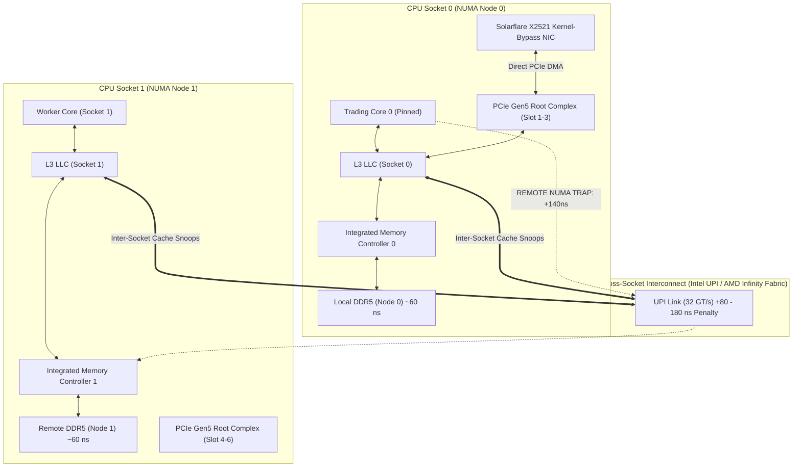

> [!summary]
> Non-Uniform Memory Access (NUMA) describes multi-socket systems where memory access latency depends on the physical location of the memory controller relative to the requesting CPU core. In high-frequency trading, accessing remote NUMA memory traverses cross-socket interconnects (Intel UPI, AMD Infinity Fabric), adding 80–180 nanoseconds of latency, cutting bandwidth in half, and triggering severe inter-socket cache snooping jitter.

---

## Why it matters
In a dual-socket trading server, Core 0 (Socket 0) accessing local DRAM takes **~55–65 ns**. If that same core accesses memory allocated on Socket 1, the request must traverse the Ultra Path Interconnect (UPI), inflating latency to **~140–250 ns**—a **3x to 4x latency penalty**.

Furthermore, high-speed Network Interface Cards (Solarflare, Mellanox) and FPGA acceleration cards are physically wired to the PCIe lanes of a **specific CPU socket** (Root Complex). If your trading process runs on Socket 0 but the NIC is plugged into a PCIe slot wired to Socket 1, every incoming packet descriptor and Direct Memory Access (DMA) transfer must cross the UPI bus, injecting non-deterministic jitter into the critical tick-to-trade path.



---

## Mechanism

### 1. The NUMA Memory Architecture
Modern enterprise CPUs integrate the memory controller (IMC) directly onto the processor die. 
- Memory attached directly to Socket 0's IMC is **Local Memory** for Socket 0.
- Memory attached to Socket 1's IMC is **Remote Memory** for Socket 0.
- When Core 0 issues a load instruction for an address mapped to Node 1:
  1. Core 0 misses in local L1, L2, and Socket 0's shared L3 (LLC).
  2. Socket 0's caching/routing agent wraps the request into an inter-socket packet and transmits it across the **UPI (Intel Ultra Path Interconnect)** or **xGMI (AMD Infinity Fabric)** link.
  3. Socket 1's home agent receives the packet, queries its local cache directory, and issues a read to Socket 1's IMC.
  4. The DRAM data traverses back across the UPI link to Socket 0, where it is finally placed into Core 0's L1/L2 caches.

### 2. Cross-Socket Cache Coherence (Directory-Based Snooping)
In a single socket, cores snoop the shared L3 cache ring or mesh directly. Across sockets, broadcast snooping would saturate the UPI links. Therefore, CPUs use **Directory-Based Coherence**:
- A directory table in the Home Agent tracks which socket currently holds copies of a given cache line.
- When Core 0 modifies a line that Socket 1 holds in `Shared` state, directory lookups and cross-socket invalidation messages introduce **100–250 ns** of stall time on atomic operations (`LOCK CMPXCHG`) and false sharing events.

### 3. PCIe Root Complex Locality & Peer-to-Peer Routing
PCIe slots are not shared equally. Slots 1–3 connect directly to the PCIe Root Complex of Socket 0; Slots 4–6 connect to Socket 1.
- If the NIC DMAs data to host RAM on Node 0, but the NIC is attached to Socket 1's PCIe lanes, the DMA transaction must traverse the UPI interconnect **twice**: once for the payload and once for the MSI-X interrupt/completion signal.

---

## In Practice

In production low-latency applications, you must enforce strict NUMA node binding using `libnuma`, kernel pinning, and local memory allocation.

```cpp
#include <numa.h>
#include <numaif.h>
#include <sched.h>
#include <pthread.h>
#include <sys/mman.h>
#include <iostream>
#include <stdexcept>

// Configure a low-latency thread to run strictly on a specific NUMA node
void bind_thread_to_numa_node(int target_cpu_core, int target_numa_node) {
    if (numa_available() < 0) {
        throw std::runtime_error("NUMA support not available on this system");
    }

    // 1. Pin thread to physical CPU core
    cpu_set_t cpuset;
    CPU_ZERO(&cpuset);
    CPU_SET(target_cpu_core, &cpuset);
    if (pthread_setaffinity_np(pthread_self(), sizeof(cpu_set_t), &cpuset) != 0) {
        throw std::runtime_error("Failed to set thread affinity");
    }

    // 2. Bind memory allocations to the local NUMA node strictly (MPOL_BIND)
    struct bitmask* nodemask = numa_allocate_nodemask();
    numa_bitmask_setbit(nodemask, target_numa_node);
    
    // Enforce that all future allocations (malloc, mmap) strictly come from this node.
    // If the node runs out of memory, allocation fails rather than falling back to remote node.
    numa_set_membind(nodemask);
    numa_free_nodemask(nodemask);
}

// Allocate a hugepage-backed buffer explicitly on a specific NUMA node
void* allocate_numa_local_buffer(size_t size_bytes, int numa_node) {
    void* ptr = numa_alloc_onnode(size_bytes, numa_node);
    if (!ptr) {
        throw std::runtime_error("Failed to allocate NUMA-local memory");
    }
    
    // Pre-fault and lock the memory into physical RAM to eliminate page faults
    if (mlock(ptr, size_bytes) != 0) {
        numa_free(ptr, size_bytes);
        throw std::runtime_error("Failed to mlock NUMA buffer");
    }
    
    // Explicitly write to every page to ensure physical page table binding
    char* byte_ptr = static_cast<char*>(ptr);
    for (size_t i = 0; i < size_bytes; i += 4096) {
        byte_ptr[i] = 0;
    }
    
    return ptr;
}
```

---

## Numbers

*Hardware Baseline: Dual-Socket Intel Xeon Platinum 8480+ (Sapphire Rapids) @ 3.8 GHz, 3x UPI Links @ 32 GT/s.*

| Access Pathway | Latency (Cycles @ 4.0 GHz) | Latency (Time) | Bandwidth per Socket |
| :--- | :--- | :--- | :--- |
| **Local L1d Hit** | 4–5 cycles | **~1.0–1.2 ns** | ~350 GB/s |
| **Local L2 Hit** | 14 cycles | **~3.5 ns** | ~180 GB/s |
| **Local L3 Hit (LLC)** | 45–50 cycles | **~11–13 ns** | ~80 GB/s |
| **Local DRAM Access (Node 0)** | 220–260 cycles | **~55–65 ns** | ~300 GB/s (8 channels DDR5) |
| **Remote NUMA DRAM (Node 1 via UPI)**| 560–900 cycles | **~140–225 ns** | ~90–120 GB/s (UPI limited) |
| **Cross-Socket Cache Line Bounce (RFO)**| 600–1000 cycles | **~150–250 ns** | Severely degraded by snoops |
| **Local PCIe DMA (NIC on Socket 0)** | — | **~100–150 ns** | Direct Root Complex |
| **Remote PCIe DMA (NIC on Socket 1 -> Node 0)**| — | **~250–400 ns** | Traverses UPI twice |

---

## Trade-offs

| Architectural Approach | Latency / Performance Impact | Operational Complexity |
| :--- | :--- | :--- |
| **Strict Single-Socket Deployment** | Completely eliminates all NUMA jitter; guaranteed ~60ns DRAM access. | Wastes 50% of the server's compute capacity (Socket 1 left idle or for batch tasks). |
| **Dual-Socket Partitioning** | Run two independent trading instances: Instance A on Node 0, Instance B on Node 1. | Requires strict PCIe device allocation; no shared state or cross-socket locks allowed. |
| **Interleaved Memory (`numactl --interleave`)**| Balances memory bandwidth across sockets for high-throughput batch systems. | **Fatal for low latency**: guaranteed 50% of all memory accesses take the ~180ns remote path. |

---

> [!warning] Gotchas
> 1. **The PCIe Slot Misalignment Trap**: Buying an ultra-fast $5,000 Solarflare NIC and plugging it into PCIe Slot 5 (wired to Socket 1) while running your trading engine pinned to Core 2 (Socket 0). Every tick received incurs an automatic **~200 ns cross-socket penalty**. *Always inspect `lspci -tv` and `/sys/class/net/<interface>/device/numa_node`.*
> 2. **Memory Migration via `autonuma`**: The Linux kernel includes an automatic NUMA balancing daemon (`kernel.numa_balancing`). If enabled, the kernel will periodically scan pages, unmap them, generate soft page faults, and migrate memory across sockets while the trading engine is running. *MANDATORY: `sysctl -w kernel.numa_balancing=0`.*
> 3. **C++ `std::thread` Default Allocations**: Initializing memory in the main thread (running on Core 0 / Node 0) and then passing pointers to a worker thread pinned to Node 1 causes the worker thread to silently read remote Node 0 memory for its entire lifecycle.

---

## Lab
**Objective**: Measure the exact latency and bandwidth delta between local NUMA memory reads and remote NUMA memory reads using a pointer-chasing harness and Linux `numactl`.

**Success Criteria**:
1. Run benchmark pinned to Node 0 with memory allocated on Node 0 (`numactl --cpunodebind=0 --membind=0 ./bench`).
2. Run benchmark pinned to Node 0 with memory allocated on Node 1 (`numactl --cpunodebind=0 --membind=1 ./bench`).
3. Graph the latency distribution: verify an exact ~100–150 ns shift in memory access latency.

---

> [!question]- Self-test
> 1. **How do you determine the physical NUMA node of a network interface card in Linux without third-party tools?**
>    *Answer*: Read the `numa_node` sysfs attribute: `cat /sys/class/net/<interface_name>/device/numa_node`. A return value of `0` indicates Socket 0, `1` indicates Socket 1, and `-1` indicates no NUMA affinity detected.
> 2. **Why must `kernel.numa_balancing` be disabled on trading hosts?**
>    *Answer*: Automatic NUMA balancing (`autonuma`) periodically marks memory pages as non-accessible to detect which thread accesses them. When the trading thread accesses the page, it triggers a page fault trap to the kernel, causing a 5–20 µs latency spike while the kernel assesses whether to migrate the page across sockets.
> 3. **What is the first-touch memory allocation policy in Linux, and how does it create hidden remote NUMA penalties?**
>    *Answer*: Linux allocates physical memory pages on the NUMA node of the CPU core that *first writes* to the memory address (not the thread that called `malloc`/`mmap`). If a configuration/startup thread running on Node 0 initializes data structures that are later consumed by a trading worker pinned to Node 1, that memory resides physically on Node 0, forcing the worker into permanent cross-socket remote access.

---

## Related
- [[Notes/Latency Numbers Every Trading Engineer Knows]]
- [[Notes/CPU Cache Hierarchy and Line Alignment]]
- [[Notes/False Sharing and Cache Contention]]
- [[Notes/Linux Thread Pinning and Core Affinity]]
- [[Notes/Kernel Boot Parameters for Core Isolation]]
- [[MOC - 04 Hardware Mechanical Sympathy]]

## Sources
- [[Sources/What Every Programmer Should Know About Memory by Ulrich Drepper]]
- [[Sources/Intel 64 and IA-32 Architectures Optimization Reference Manual]]
- [[Sources/Systems Performance by Brendan Gregg]]
