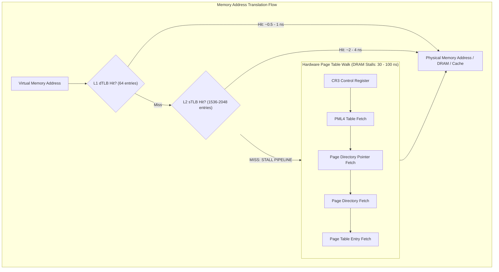

> [!summary]
> The Translation Lookaside Buffer (TLB) caches virtual-to-physical address mappings. A TLB miss forces the Memory Management Unit (MMU) into a multi-level Page Table Walk, stalling execution for 30–100 cycles. Using explicit 2MB or 1GB Huge Pages eliminates TLB thrashing across large order books and ring buffers, while avoiding the catastrophic multi-millisecond jitter of Transparent Huge Pages (THP).

---

## Why it matters
Every memory access in user-space operates on virtual addresses. If the translation for an address is not cached in the CPU's TLB, the hardware MMU must perform a **4-level (or 5-level) Page Table Walk** through DRAM, adding **30–100 nanoseconds** of stall time to what should have been a 1 ns L1 cache access.

In low-latency systems with large memory structures (e.g., a 64 MB historical market data ring buffer or multi-gigabyte order books):
- With standard **4 KB pages**, caching 64 MB of RAM requires **16,384 TLB entries** (far exceeding the ~2,000 entries in the hardware TLB), triggering constant TLB misses.
- With **2 MB Huge Pages**, that same 64 MB requires only **32 TLB entries**, guaranteeing a **100% TLB hit rate**.



---

## Mechanism

### 1. The Multi-Level Page Table Walk
Under standard 64-bit x86 architecture (4-level paging):
1. The CPU register `CR3` points to the base of the **PML4** (Page Map Level 4) table in DRAM.
2. The virtual address is sliced into 9-bit indices:
   $$\text{VA} = [\text{PML4 (9b)} \mid \text{PDP (9b)} \mid \text{PD (9b)} \mid \text{PT (9b)} \mid \text{Offset (12b)}]$$
3. On a TLB miss, the MMU must sequentially dereference:
   $$\text{PML4} \xrightarrow{\text{Memory Read}} \text{PDP} \xrightarrow{\text{Memory Read}} \text{PD} \xrightarrow{\text{Memory Read}} \text{PT} \xrightarrow{\text{Physical Base}}$$
4. If these page table entries are not in L1/L2/L3 caches, this triggers **up to 4 independent DRAM accesses**, taking **~100–250 ns**.

### 2. Standard Pages vs Huge Pages
| Page Type | Page Size | Offset Bits | TLB Reach per 64 L1 TLB Entries | Page Table Levels Required |
| :--- | :--- | :--- | :--- | :--- |
| **Standard Page** | **4 KB** ($2^{12}$ B) | 12 bits | $64 \times 4\text{ KB} = \mathbf{256\text{ KB}}$ | 4 levels (PML4 $\to$ PDP $\to$ PD $\to$ PT) |
| **Huge Page (2MB)**| **2 MB** ($2^{21}$ B) | 21 bits | $64 \times 2\text{ MB} = \mathbf{128\text{ MB}}$ | 3 levels (PML4 $\to$ PDP $\to$ PD) |
| **Gigantic Page (1GB)**| **1 GB** ($2^{30}$ B) | 30 bits | $64 \times 1\text{ GB} = \mathbf{64\text{ GB}}$ | 2 levels (PML4 $\to$ PDP) |

By switching from 4KB to 2MB pages, the TLB coverage (reach) of the same 64 L1 TLB entries increases by a factor of **512x** ($256\text{ KB} \to 128\text{ MB}$), keeping your entire trading working set permanently in the L1/L2 TLB.

---

## In Practice

### 1. Explicit HugeTLBFS Allocation in C++
Never rely on `malloc` or standard `mmap` for critical ring buffers and order books. Allocate directly from the Linux kernel's explicit 2MB HugeTLB pool.

```cpp
#include <sys/mman.h>
#include <unistd.h>
#include <cstdint>
#include <cstring>
#include <iostream>
#include <stdexcept>

// Allocate 2MB HugePage-backed memory block
void* allocate_hugepage_2mb(size_t size_bytes) {
    // 2MB alignment requirement
    constexpr size_t HUGEPAGE_2MB_SIZE = 2 * 1024 * 1024;
    size_t aligned_size = ((size_bytes + HUGEPAGE_2MB_SIZE - 1) / HUGEPAGE_2MB_SIZE) * HUGEPAGE_2MB_SIZE;

    // Use MAP_HUGETLB and MAP_ANONYMOUS
    void* ptr = mmap(
        nullptr,
        aligned_size,
        PROT_READ | PROT_WRITE,
        MAP_PRIVATE | MAP_ANONYMOUS | MAP_HUGETLB | MAP_POPULATE,
        -1,
        0
    );

    if (ptr == MAP_FAILED) {
        throw std::runtime_error("Failed to allocate 2MB HugePage. Ensure vm.nr_hugepages is configured in kernel.");
    }

    // Lock the pages into physical RAM: guarantees ZERO page faults during trading
    if (mlock(ptr, aligned_size) != 0) {
        munmap(ptr, aligned_size);
        throw std::runtime_error("mlock failed on hugepage allocation");
    }

    // Explicitly pre-fault / write to all pages to populate hardware page tables
    std::memset(ptr, 0, aligned_size);

    return ptr;
}

void free_hugepage_2mb(void* ptr, size_t size_bytes) {
    constexpr size_t HUGEPAGE_2MB_SIZE = 2 * 1024 * 1024;
    size_t aligned_size = ((size_bytes + HUGEPAGE_2MB_SIZE - 1) / HUGEPAGE_2MB_SIZE) * HUGEPAGE_2MB_SIZE;
    munlock(ptr, aligned_size);
    munmap(ptr, aligned_size);
}
```

---

## Numbers

*Hardware Baseline: Intel Xeon Sapphire Rapids @ 4.0 GHz.*

| Subsystem / Operation | Capacity / Latency (Cycles) | Latency (Time) | Impact |
| :--- | :--- | :--- | :--- |
| **L1 dTLB Hit (4KB)** | 64 entries | **0.5–1.0 ns** (2–4 cycles) | Zero pipeline stall. |
| **L1 dTLB Hit (2MB/1GB)** | 32–64 entries | **0.5–1.0 ns** (2–4 cycles) | Full working set covered. |
| **L2 sTLB Hit** | 1536–2048 entries | **2.5–3.5 ns** (10–14 cycles) | Minor stall. |
| **Page Table Walk (Cached)** | 4 page levels (L2/L3 hit) | **10–25 ns** (40–100 cycles) | Noticeable latency penalty. |
| **Page Table Walk (DRAM)** | 4 page levels (DRAM hit) | **80–220 ns** (320–880 cycles) | Severe pipeline stall. |
| **Minor Page Fault (Kernel)** | Trap to OS kernel | **1,500–5,000 ns** (1.5–5.0 µs) | Drops packet on wire. |
| **THP Compaction Spike (`khugepaged`)**| Background memory defrag | **1,000,000–25,000,000 ns** (**1–25 ms**)| Total system blackout. |

---

## Trade-offs

| Strategy | Advantages | Disadvantages / Failure Modes |
| :--- | :--- | :--- |
| **Explicit Huge Pages (`MAP_HUGETLB`)** | Zero TLB misses; zero runtime page faults; deterministic memory access. | Must be pre-allocated at OS boot (`vm.nr_hugepages`); cannot be resized dynamically. |
| **Standard 4 KB Pages** | Fine-grained memory allocation; minimal internal fragmentation. | High TLB miss rates on large datasets (>2MB); higher page table memory overhead. |
| **Transparent Huge Pages (THP)** | Automatic promotion of 4KB pages to 2MB by kernel without code changes. | **FATAL FOR TRADING**: `khugepaged` daemon triggers non-deterministic 10ms jitter spikes. |

---

> [!warning] Gotchas
> 1. **The Transparent Huge Pages (THP) Catastrophe**: Linux enables THP by default. The kernel daemon `khugepaged` periodically scans memory to combine 4KB pages into 2MB pages. When it runs, it acquires the memory lock (`mmap_sem`), freezes page tables, and copies physical memory, stalling your trading threads for **10 to 50 milliseconds**. *MANDATORY OS TUNING: `echo never > /sys/kernel/mm/transparent_hugepage/enabled` and `echo never > /sys/kernel/mm/transparent_hugepage/defrag`.*
> 2. **Minor Page Faults on Unpopulated Buffers**: Calling `malloc(100 * 1024 * 1024)` does **not** allocate physical memory; Linux returns virtual addresses and relies on lazy allocation. The *first time* your matching engine writes to a page during live market hours, the CPU triggers a Page Fault interrupt to the kernel (**~3 µs penalty**). *Always use `MAP_POPULATE` and `memset` at startup.*

---

## Lab
**Objective**: Build a benchmark that randomly accesses a 128 MB array using 4 KB standard pages vs 2 MB Huge Pages. Measure the throughput and TLB miss rate with `perf`.

**Success Criteria**:
1. Run benchmark with 4KB pages and capture hardware counters:
   ```bash
   perf stat -e dTLB-load-misses,dTLB-loads,dtlb_load_misses.walk_duration ./bench_4k
   ```
2. Run benchmark with 2MB Huge Pages (`MAP_HUGETLB`) and capture counters.
3. Prove that 2MB Huge Pages reduce `dTLB-load-misses` by **>99%** and cut execution latency in half.

---

> [!question]- Self-test
> 1. **Why does a 64-entry L1 dTLB provide only 256 KB of memory coverage with standard pages, but 128 MB of coverage with 2 MB huge pages?**
>    *Answer*: Each TLB entry maps exactly one page regardless of page size. With 4 KB pages: $64 \times 4096\text{ bytes} = 262,144\text{ bytes} = 256\text{ KB}$. With 2 MB pages: $64 \times (2 \times 1024 \times 1024)\text{ bytes} = 134,217,728\text{ bytes} = 128\text{ MB}$.
> 2. **What is the exact operational danger of leaving Transparent Huge Pages (THP) enabled in an HFT server environment?**
>    *Answer*: THP uses the background kernel daemon `khugepaged` to compact and defragment physical memory into 2MB blocks. When `khugepaged` compacts memory, it acquires global memory management locks (`mmap_sem`/`mm_lock`), marks pages as inaccessible, and physically copies memory in DRAM, introducing unpredictable, catastrophic latency spikes of 5–50 milliseconds.
> 3. **How does `mlockall(MCL_CURRENT | MCL_FUTURE)` prevent production latency spikes?**
>    *Answer*: `mlockall` forces the kernel to immediately allocate physical RAM for all existing and future virtual memory mappings and locks them into physical RAM. This guarantees that pages are never swapped out to disk and prevents the CPU from taking minor page faults during critical live trading execution.

---

## Related
- [[Notes/Latency Numbers Every Trading Engineer Knows]]
- [[Notes/Kernel Boot Parameters for Core Isolation]]
- [[Notes/Memory Locking and Zero Page Faults]]
- [[Notes/Transparent Huge Pages vs Explicit HugeTLBFS]]
- [[MOC - 04 Hardware Mechanical Sympathy]]
- [[MOC - 05 OS & Kernel Tuning]]

## Sources
- [[Sources/What Every Programmer Should Know About Memory by Ulrich Drepper]]
- [[Sources/Systems Performance by Brendan Gregg]]
- [[Sources/Red Hat Enterprise Linux for Real Time Tuning Guide]]
