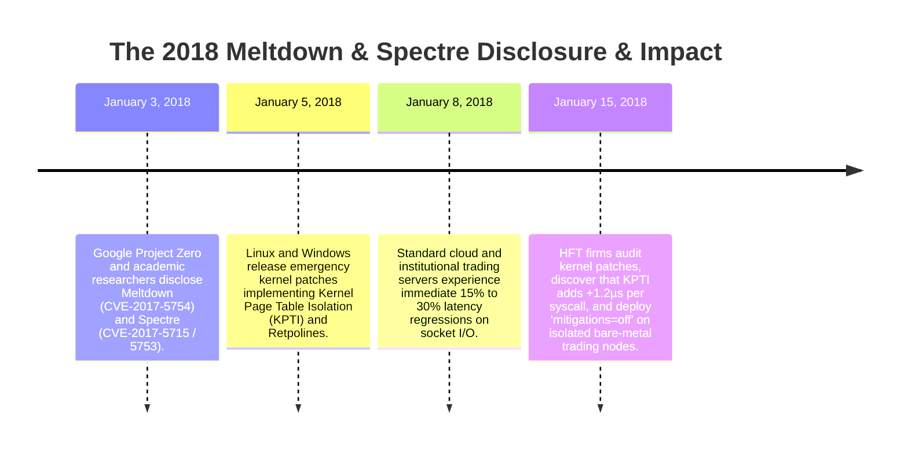
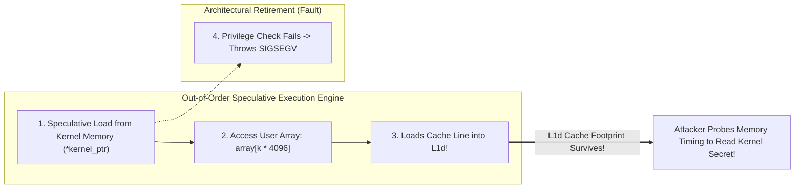

# War Story — The 2018 Meltdown & Spectre Vulnerabilities: Microarchitectural Side-Channels & Syscall Penalties

> [!summary]
> In January 2018, security researchers disclosed Meltdown and Spectre—two catastrophic hardware vulnerabilities embedded in the out-of-order and speculative execution engines of modern superscalar CPUs. The resulting operating system mitigations (Kernel Page Table Isolation - KPTI, Retpolines, and IBRS microcode updates) injected **up to 800–2,500 nanoseconds of latency per system call**, revolutionizing low-latency systems engineering and cementing kernel bypass as a mandatory architecture.

---

## 1. Incident Timeline & Chronology (January 2018)



---

## 2. Technical & Microarchitectural Root Cause Analysis

### A. Meltdown (CVE-2017-5754): Speculative Kernel Memory Leak
- **The Hardware Flaw**: Modern Intel CPUs execute instructions speculatively ahead of privilege permission checks.
- **The Attack**: An unprivileged user-space thread reads an address in kernel memory (`char k = *kernel_ptr;`). The CPU pipeline executes the load speculatively and uses the secret byte to index an array in user space (`dummy = user_array[k * 4096];`).
- Although the CPU eventually raises a segmentation fault (`SIGSEGV`) when the permission check retires, **the secret byte `k` has already left a physical footprint in the CPU L1 data cache** (the cache line for `user_array[k * 4096]` was loaded into cache). By timing memory access latencies across `user_array`, an attacker can read arbitrary kernel and physical RAM memory!



### B. The Performance Disaster: Kernel Page Table Isolation (KPTI)
- To fix Meltdown in software, Linux introduced **KPTI (Kernel Page Table Isolation)**.
- **The Latency Impact**:
  - Previously, user and kernel page tables shared the same virtual address space, so transitioning from user to kernel mode (`syscall`) required zero page table swaps.
  - Under KPTI, user and kernel spaces use completely separate page tables. Every single system call (`read`, `write`, `epoll_wait`, `send`) forces the CPU to **reload the `CR3` control register**, flushing the Translation Lookaside Buffer (TLB) and invalidating address translations!
  - **Result**: System call overhead jumped from **~70 nanoseconds to over 1,200–2,500 nanoseconds per call**.

### C. Spectre & Retpoline Latency Penalties
- **Spectre (Variant 2)**: Manipulates the CPU's **Branch Target Buffer (BTB)** to mistrain indirect branch prediction units.
- **The Mitigation (Retpoline)**: Compilers replace fast indirect function calls (`call *%rax`) with a sequence of `push/ret` trampoline instructions that prevent speculative execution.
- **Result**: Every C++ virtual function call and function pointer invocation incurred a **+15 to 45 nanosecond latency penalty**.

---

## 3. The Low-Latency Systems Engineering Response

| Operating System Mitigation | Latency Impact on Trading Systems | High-Frequency Trading Solution |
| :--- | :--- | :--- |
| **KPTI (Page Table Swaps)** | $+800\text{ ns}$ to $+2,500\text{ ns}$ per syscall. | **100% Kernel Bypass**: Use Solarflare `ef_vi` or DPDK Poll Mode Drivers to eliminate all system calls from the hot path. |
| **Retpoline / IBRS** | $+25\text{ ns}$ per virtual function call. | **Compile-Time Polymorphism (CRTP)**: Eliminate virtual functions and function pointers entirely in favor of static templates. |
| **Multi-Tenant Cloud Patches** | High jitter and cache flushing. | **Dedicated Bare-Metal with `mitigations=off`**: On single-tenant, physically isolated colocation servers with no third-party code execution, disable mitigations at boot. |

---

## 4. Key Engineering Lessons for Hardware Sympathetic Systems

1. **Kernel Bypass is an Architectural Imperative**: Relying on Linux kernel system calls for trading critical paths leaves software vulnerable to kernel security patch regressions. Kernel bypass drivers map hardware NIC queues directly into user-space memory, maintaining sub-microsecond determinism regardless of OS patch levels.
2. **Eliminate Runtime Polymorphism in Hot Loops**: Virtual functions (`virtual void match()`) not only inhibit compiler inlining, but also suffer from indirect branch prediction stalls and retpoline overhead. Use the **Curiously Recurring Template Pattern (CRTP)** or `std::variant` with `std::visit` for zero-overhead static dispatch.
3. **Hardware Boot Hardening on Dedicated Clusters**: On private, air-gapped trading servers where only vetted internal binaries execute, disable kernel speculative execution mitigations to recover up to 25% of baseline CPU performance:
   ```bash
   # GRUB kernel command line on isolated bare-metal trading nodes:
   mitigations=off nopti nospectre_v1 nospectre_v2
   ```

---

## Related Notes
- [[04 - Hardware Mechanical Sympathy/CPU Pipeline Branch Prediction and Speculative Execution]]
- [[06 - Networking/Kernel Bypass Technologies Overview]]
- [[06 - Networking/Solarflare ef_vi Zero-Copy API]]
- [[05 - OS & Kernel Tuning/Kernel Boot Parameters for Core Isolation]]
- [[14 - Industry Map & Canon/MOC - 14 Industry Map & Canon]]

## Sources
- [[Sources/Intel 64 and IA-32 Architectures Software Developer's Manual]]
- [[Sources/Systems Performance by Brendan Gregg]]
- [[Sources/Google Project Zero: Reading privileged memory with a side-channel]]
