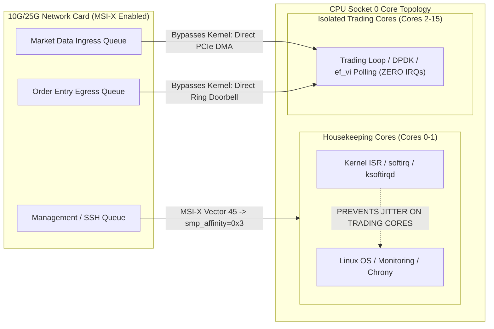

> [!summary]
> Hardware interrupts (IRQs) preempt running CPU cores to service peripheral devices, causing context switches, register spills, and cache pollution. Message Signaled Interrupts Extended (MSI-X) allows per-queue interrupt steering; in low-latency systems, all hardware IRQs must be strictly routed to housekeeping cores via `smp_affinity`, while trading cores use kernel-bypass polling to eliminate interrupt overhead entirely.

---

## Why it matters
When a standard Network Interface Card (NIC) receives an Ethernet frame, it raises a hardware interrupt to signal the CPU. The CPU must immediately suspend user-space code, execute the kernel's Interrupt Service Routine (ISR), schedule a softirq (`NET_RX`), and poll the driver ring via NAPI.

This interrupt-driven path introduces:
1. **Direct Preemption Jitter**: **2.0 to 10.0 µs** stall while the kernel processes the packet.
2. **Cache Pollution**: The kernel interrupt handler evicts your order book and strategy parameters from L1i and L1d caches.
3. **Random Interruption**: Under high packet rates (bursty market open), thousands of IRQs per second overwhelm the CPU (Interrupt Storm).

Eliminating interrupts on trading cores and isolating them on housekeeping cores is mandatory for deterministic execution.



---

## Mechanism

### 1. The Interrupt Execution Lifecycle
1. **PCIe MSI-X Write**: The NIC writes a specific 32-bit address/data payload directly to the Local Advanced Programmable Interrupt Controller (LAPIC) of a target CPU core.
2. **Interrupt Service Routine (ISR / Top Half)**: The CPU pauses execution, saves registers to the kernel stack, disables local interrupts, clears the hardware line, and schedules the bottom-half softirq (`ksoftirqd/N`).
3. **NAPI Polling (Bottom Half)**: The kernel softirq runs, drains packets from the NIC descriptor ring into Linux `sk_buff` structures, and passes them up through the kernel TCP/IP stack.

### 2. MSI-X vs Legacy INTx
- **Legacy INTx**: All queues share a single physical interrupt line, forcing the kernel to query every driver to find the source.
- **MSI-X (Message Signaled Interrupts Extended)**: The NIC can allocate up to **2,048 distinct interrupt vectors**. Each RX/TX queue receives its own unique interrupt vector, which can be routed to a specific physical CPU core via `/proc/irq/<irq_num>/smp_affinity`.

### 3. Kernel Bypass Polling (Zero-Interrupt Model)
In high-frequency trading pipelines using Solarflare `ef_vi` or DPDK Poll Mode Drivers (PMD):
- The trading thread runs an infinite user-space polling loop that continuously inspects the NIC's hardware RX descriptor ring in host memory.
- **Hardware interrupts are completely disabled** on the market data queues. The CPU detects packet arrival within **10–30 nanoseconds** of PCIe DMA completion without ever entering the kernel.

---

## In Practice

### 1. Disable the `irqbalance` Daemon
The `irqbalance` daemon periodically moves IRQs across random CPU cores to distribute thermal load. It must be permanently killed:
```bash
sudo systemctl stop irqbalance
sudo systemctl disable irqbalance
sudo systemctl mask irqbalance
```

### 2. Isolate System Hardware IRQs to Housekeeping Cores
Route all peripheral interrupts (storage, USB, timer, management interfaces) strictly to Cores 0 and 1:

```bash
#!/usr/bin/env bash
set -euo pipefail

# Bitmask for Core 0 and Core 1 (Binary 0011 -> Hex 0x3)
HOUSEKEEPING_MASK="3"

echo "Routing all system interrupts to housekeeping cores (0, 1)..."

for irq_dir in /proc/irq/*; do
    if [ -d "$irq_dir" ]; then
        irq=$(basename "$irq_dir")
        # Ignore non-numeric directories
        if [[ "$irq" =~ ^[0-9]+$ ]]; then
            # Write CPU affinity mask to smp_affinity
            if echo "$HOUSEKEEPING_MASK" > "/proc/irq/$irq/smp_affinity" 2>/dev/null; then
                echo "IRQ $irq successfully bound to mask 0x$HOUSEKEEPING_MASK"
            fi
        fi
    fi
done
```

### 3. Verify Interrupt Distribution
Check `/proc/interrupts` to ensure that isolated trading cores (e.g., Cores 2–15) have **zero** hardware interrupts incrementing:
```bash
watch -n 1 "cat /proc/interrupts | grep -E '(CPU0|CPU1|CPU2|CPU3)'"
```

---

## Numbers

*Hardware Baseline: Solarflare X2521 25G NIC on Intel Sapphire Rapids @ 4.0 GHz.*

| Ingress Mechanism | Wire-to-Application Latency | Jitter ($p99.9$) | CPU Utilization |
| :--- | :--- | :--- | :--- |
| **Standard Linux Kernel Socket (IRQ driven)** | **2,500–6,000 ns** (2.5–6.0 µs) | **15.0–45.0 µs** | Low (Sleeps on epoll) |
| **Linux Kernel Socket + NAPI Polling (`busy_poll`)**| **1,200–2,200 ns** | **4.0–8.0 µs** | 100% Core Spin |
| **Solarflare OpenOnload (Kernel Bypass)** | **750–1,200 ns** | **1.2–2.5 µs** | 100% Core Spin |
| **Solarflare `ef_vi` (Zero-Copy User Polling)** | **400–650 ns** | **<800 ns** | 100% Dedicated Core |
| **DPDK Poll Mode Driver (PMD)** | **420–700 ns** | **<850 ns** | 100% Dedicated Core |

---

## Trade-offs

| Approach | Advantages | Disadvantages / Costs |
| :--- | :--- | :--- |
| **Kernel-Bypass Polling (Zero-IRQ)** | Sub-microsecond latency; zero context switches; zero interrupt jitter. | Consumes 100% of a dedicated physical CPU core; continuous power/heat draw. |
| **Interrupt-Driven Sockets (`epoll`)** | Power-efficient; CPU sleeps when no market data is arriving; supports 10,000s of sockets. | Terrible latency (3–8 µs); massive jitter on sudden market bursts. |
| **RPS/RFS (Software Packet Steering)** | Distributes network packet processing across multiple cores in software. | **Destroys low latency**: adds inter-core cache invalidations and memory copying. |

---

> [!warning] Gotchas
> 1. **Receive Packet Steering (RPS) Poisoning**: If RPS or RFS is enabled on your network interface (`/sys/class/net/<iface>/queues/rx-*/rps_cpus`), the Linux kernel will intercept packets and use Inter-Processor Interrupts (IPIs) to push packet processing to other CPU cores, injecting **5–15 µs** of cross-core latency. *Always set `rps_cpus=0`.*
> 2. **Network Driver Resets Overwriting Affinity**: When a network link goes down/up or the network interface restarts (`ifconfig down/up`), the NIC driver resets its MSI-X allocation and restores default interrupt affinities, re-introducing interrupts onto your isolated trading cores. *Always re-apply interrupt binding scripts after network link state changes.*

---

## Lab
**Objective**: Inspect the hardware interrupt routing of your Linux system, identify which interrupts are firing on your candidate trading cores, and write an automation script that eliminates all non-housekeeping interrupts.

**Success Criteria**:
1. Run `cat /proc/interrupts` before and after running your tuning script.
2. Prove that the interrupt rate on Cores 2+ drops to **0 interrupts per second** while generating network traffic on the host.

---

> [!question]- Self-test
> 1. **What is an MSI-X vector and why is it superior to legacy INTx interrupts in multi-core network systems?**
>    *Answer*: An MSI-X (Message Signaled Interrupts Extended) vector is an in-band PCIe memory write that targets a specific CPU core's Local APIC. Unlike legacy INTx, which shares a single interrupt line across all devices, MSI-X supports up to 2,048 independent interrupt vectors per device, allowing each network queue to be statically mapped to a dedicated CPU core without cross-queue contention.
> 2. **Why must the `irqbalance` service be disabled on low-latency trading servers?**
>    *Answer*: `irqbalance` is a daemon that periodically redistributes interrupts across all available CPU cores to balance system load. On a trading host, it will silently migrate network and storage interrupts onto your isolated trading cores, causing random interrupt preemption and cache-line invalidations during live market execution.
> 3. **Why does kernel-bypass networking (e.g., Solarflare `ef_vi` or DPDK) completely disable interrupts on the market data path?**
>    *Answer*: Kernel bypass uses user-space polling (Poll Mode Drivers). The application thread continuously spins on the NIC's RX descriptor ring in host memory. Because the application checks for new descriptors every few nanoseconds, hardware interrupts are unnecessary and would only introduce destructive context switching and CPU preemption penalties.

---

## Related
- [[Notes/Kernel Boot Parameters for Core Isolation]]
- [[Notes/Linux Thread Pinning and Core Affinity]]
- [[Notes/Network Interface Card Architecture]]
- [[Notes/Solarflare ef_vi Zero-Copy API]]
- [[Notes/DPDK Architecture for Trading]]
- [[MOC - 05 OS & Kernel Tuning]]
- [[MOC - 06 Networking]]

## Sources
- [[Sources/Red Hat Enterprise Linux for Real Time Tuning Guide]]
- [[Sources/Systems Performance by Brendan Gregg]]
- [[Sources/Solarflare ef_vi User Guide]]
