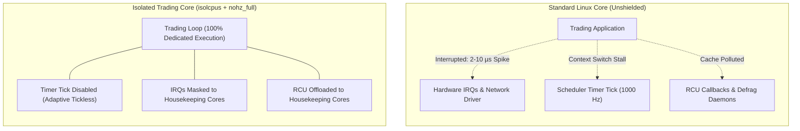

> [!summary]
> In a standard Linux kernel, background tasks, timer ticks, RCU callbacks, and hardware interrupts periodically interrupt running CPU cores, injecting 5–50 µs latency spikes. Configuring kernel boot parameters (`isolcpus`, `nohz_full`, `rcu_nocbs`, `irqaffinity`) isolates dedicated physical cores, turning them into bare-metal execution environments where trading loops spin without OS preemption.

---

## Why it matters
A modern Linux kernel is optimized for throughput and fairness, not deterministic microsecond latency. Every 1 to 4 milliseconds, the kernel scheduler fires a timer interrupt (`CONFIG_HZ`) to calculate CPU usage, check timeslices, and process Read-Copy-Update (RCU) callbacks.

If a timer interrupt fires while your matching engine is evaluating an inbound order, the CPU must:
1. Save register context to the kernel stack.
2. Execute the kernel interrupt handler and scheduler code (polluting L1i and L1d caches).
3. Restore user-space registers and resume.

This sequence takes **1.5 to 5.0 µs**, completely destroying $p99.9$ tail latencies. Proper core isolation eliminates this jitter entirely.



---

## Mechanism

### 1. `isolcpus=domain,managed_irq,<cpulist>`
Tells the Linux CFS (Completely Fair Scheduler) not to balance or assign user-space tasks to the specified cores.
- `domain`: Removes the isolated cores from the kernel's CPU scheduling domains. No threads will ever be placed on these cores unless explicitly bound with `pthread_setaffinity_np` or `taskset`.
- `managed_irq`: Prevents the kernel from automatically routing device-managed interrupts (e.g., PCIe MSI-X queues) to these cores.

### 2. `nohz_full=<cpulist>` (Full Tickless / Adaptive Ticking)
Standard Linux kernels run a periodic timer tick at 250 Hz or 1000 Hz (`CONFIG_NO_HZ_IDLE` stops the tick only when idle).
- `nohz_full` enables **Adaptive-Ticks Mode**: when an isolated core has **only one runnable task**, the kernel completely shuts off the periodic timer interrupt on that core.
- The thread runs in uninterrupted userspace without scheduler timer interruptions.

### 3. `rcu_nocbs=<cpulist>` and `rcu_nocb_poll`
Read-Copy-Update (RCU) is Linux's internal synchronization mechanism. By default, cores that trigger RCU operations must execute the associated callback functions.
- `rcu_nocbs` offloads RCU callback execution to dedicated kernel worker threads (`rcuox/N`).
- `rcu_nocb_poll` forces these worker threads to poll rather than issuing wake-up IPIs (Inter-Processor Interrupts) to isolated cores.

### 4. `irqaffinity=<housekeeping_cpulist>`
Forces all system hardware interrupts (timers, disk, management NICs, serial consoles) to be routed exclusively to non-isolated "housekeeping" cores (typically Cores 0 and 1).

---

## In Practice

### Production GRUB Kernel Command-Line Configuration
On an enterprise trading host (e.g., 32-core dual-socket server, Cores 0–1 reserved for OS, Cores 2–15 isolated on Socket 0):

Edit `/etc/default/grub` and append to `GRUB_CMDLINE_LINUX`:

```bash
# Core Partitioning: Cores 0-1 Housekeeping, Cores 2-15 Isolated for Trading Engine
isolcpus=domain,managed_irq,2-15 \
nohz_full=2-15 \
rcu_nocbs=2-15 \
rcu_nocb_poll \
irqaffinity=0,1 \
\
# Power Management & Frequency Jitter Elimination
intel_idle.max_cstate=0 \
processor.max_cstate=0 \
idle=poll \
intel_pstate=passive \
cpufreq.default_governor=performance \
\
# Disable Kernel Watchdogs and Jitter Daemons
nmi_watchdog=0 \
nowatchdog \
nosoftlockup \
audit=0 \
mce=ignore_ce \
\
# TSC and Timing Stability
tsc=reliable \
clocksource=tsc \
\
# Memory & Huge Pages
transparent_hugepage=never \
hugepagesz=2M \
hugepages=2048
```

Update grub and reboot:
```bash
sudo grub2-mkconfig -o /boot/grub2/grub.cfg
sudo reboot
```

---

## Numbers

*Hardware Baseline: Intel Xeon Platinum 8480+ @ 3.8 GHz.*

| Kernel Configuration | Median Latency ($p50$) | 99th Percentile ($p99$) | Max Tail Spike ($p99.999$) |
| :--- | :--- | :--- | :--- |
| **Default Linux Kernel (`SCHED_OTHER`)**| **~1.2 µs** | **8.5 µs** | **45.0–120.0 µs** |
| **Thread Pinning Only (`pthread_setaffinity`)**| **~650 ns** | **2.8 µs** | **18.0–35.0 µs** |
| **Full Core Isolation (`isolcpus` + `nohz_full`)**| **~220 ns** | **310 ns** | **<1.2 µs** |
| **Full Isolation + C-State Disabling (`idle=poll`)**| **~180 ns** | **210 ns** | **<450 ns** |

---

## Trade-offs

| Kernel Parameter | Latency Benefit | Operational Cost / Trade-off |
| :--- | :--- | :--- |
| **`isolcpus`** | Prevents OS task preemption. | Cores are invisible to general OS; unused cycles cannot be harvested by batch tasks. |
| **`nohz_full`** | Eliminates 1000Hz timer tick. | Must leave at least one non-isolated core (Core 0) to maintain global timebase. |
| **`idle=poll`** | Zero C-state wake-up delay. | CPU runs at 100% duty cycle constantly, generating maximum thermal heat and power draw. |

---

> [!warning] Gotchas
> 1. **Multiple Tasks on `nohz_full` Cores**: If you launch *two* threads on a core configured with `nohz_full`, the kernel immediately re-enables the 1000Hz timer tick to time-slice between them. `nohz_full` only eliminates timer ticks when **exactly one runnable thread** occupies the core.
> 2. **Forgetting Core 0**: Never isolate Core 0. The Linux kernel requires Core 0 to handle global system housekeeping, clock synchronization, and specific unbound kernel threads. Always dedicate Cores 0 (and its hyperthread sibling) to the OS.
> 3. **The `irqbalance` Daemon Override**: The user-space daemon `irqbalance` runs by default on Linux distributions and dynamically re-routes hardware interrupts across all cores, completely overriding your kernel boot parameters. *MANDATORY: `systemctl disable --now irqbalance`.*

---

## Lab
**Objective**: Verify core isolation in your Linux environment. Measure interrupt frequency and verify zero timer ticks on an isolated spinning core.

**Success Criteria**:
1. Check `/proc/cmdline` to confirm `isolcpus` and `nohz_full` are active.
2. Run a spinning C++ program pinned to an isolated core for 60 seconds.
3. Check `/proc/interrupts` and verify the Local Timer Interrupt (`LOC`) counter on the isolated core increases by **0 (or <5)** over the 60-second window, compared to thousands on Core 0.

---

> [!question]- Self-test
> 1. **Why must at least one CPU core (usually Core 0) remain non-isolated when using `nohz_full`?**
>    *Answer*: The Linux kernel relies on a master timekeeping core to update `jiffies`, track global wall-clock time, handle RCU state transitions, and process system-wide timers. If all cores were configured with `nohz_full`, the kernel's internal timekeeping would stall.
> 2. **What happens if two high-priority spinning threads are pinned to the same `isolcpus` core?**
>    *Answer*: The CFS scheduler will be forced to context-switch between them. Because more than one runnable thread is present, the kernel automatically reactivates the periodic scheduler timer tick, invalidating `nohz_full` and injecting severe timer and context-switching jitter.
> 3. **Why is `rcu_nocbs` necessary even when `isolcpus` and `nohz_full` are already set?**
>    *Answer*: Read-Copy-Update (RCU) operations generate asynchronous callbacks. Without `rcu_nocbs`, the core that triggered the RCU operation must invoke the callback handler locally, stealing execution cycles from the pinned trading loop. `rcu_nocbs` offloads callback execution to dedicated kernel kthreads running on housekeeping cores.

---

## Related
- [[Notes/Linux Thread Pinning and Core Affinity]]
- [[Notes/Interrupt Routing and MSI-X Tuning]]
- [[Notes/CPU Power States and Jitter Sources]]
- [[Notes/Memory Locking and Zero Page Faults]]
- [[MOC - 05 OS & Kernel Tuning]]

## Sources
- [[Sources/Red Hat Enterprise Linux for Real Time Tuning Guide]]
- [[Sources/Systems Performance by Brendan Gregg]]
- [[Sources/Linux Kernel Documentation - kernel-parameters.txt]]
