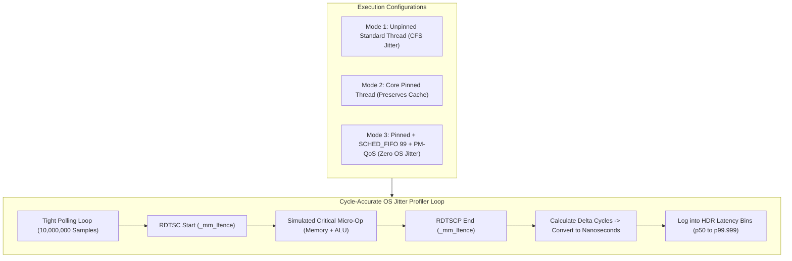

# Lab 05 — Production Core Isolation and Jitter Measurement

> [!summary]
> In this lab, you will construct a cycle-accurate C++20 jitter profiler that executes an uninterrupted 10-second polling loop to measure OS-induced latency spikes down to the nanosecond. You will experimentally quantify the tail-latency reduction from:
> 1. Unpinned `SCHED_OTHER` baseline execution.
> 2. Thread pinning to a dedicated physical core (`pthread_setaffinity_np`).
> 3. Real-time elevation to `SCHED_FIFO` priority 99.
> 4. Locking PM-QoS to $0\text{ µs}$ via `/dev/cpu_dma_latency`.

---

## Lab Architecture



---

## Complete Source Code (`os_jitter_profiler.cpp`)

Save the following source code into your workspace:

```cpp
#include <x86intrin.h>
#include <pthread.h>
#include <sched.h>
#include <fcntl.h>
#include <unistd.h>
#include <sys/mman.h>
#include <iostream>
#include <vector>
#include <algorithm>
#include <cmath>
#include <chrono>
#include <thread>
#include <iomanip>
#include <cstring>

// ============================================================================
// 1. SERIALIZED RDTSC & CALIBRATION
// ============================================================================
inline uint64_t rdtsc_start() noexcept {
    _mm_lfence();
    uint64_t tsc = __rdtsc();
    _mm_lfence();
    return tsc;
}

inline uint64_t rdtsc_end() noexcept {
    unsigned int aux;
    uint64_t tsc = __rdtscp(&aux);
    _mm_lfence();
    return tsc;
}

double calibrate_tsc_ghz() {
    uint64_t t0 = rdtsc_start();
    auto wall0 = std::chrono::steady_clock::now();
    std::this_thread::sleep_for(std::chrono::milliseconds(200));
    uint64_t t1 = rdtsc_end();
    auto wall1 = std::chrono::steady_clock::now();

    std::chrono::duration<double, std::nano> elapsed_ns = wall1 - wall0;
    return static_cast<double>(t1 - t0) / elapsed_ns.count();
}

// ============================================================================
// 2. PM-QoS & SCHEDULER CONTROLLER
// ============================================================================
class SystemTuner {
private:
    int dma_fd_ = -1;

public:
    void lock_pm_qos() {
        dma_fd_ = open("/dev/cpu_dma_latency", O_RDWR);
        if (dma_fd_ >= 0) {
            int32_t target_latency = 0;
            if (write(dma_fd_, &target_latency, sizeof(target_latency)) == sizeof(target_latency)) {
                std::cout << "[Tuner] PM-QoS locked to 0 µs (C-states disabled)\n";
            }
        } else {
            std::cerr << "[Tuner] Warning: Could not open /dev/cpu_dma_latency (Run with sudo)\n";
        }
    }

    void pin_thread(int core_id) {
        cpu_set_t cpuset;
        CPU_ZERO(&cpuset);
        CPU_SET(core_id, &cpuset);
        if (pthread_setaffinity_np(pthread_self(), sizeof(cpu_set_t), &cpuset) == 0) {
            std::cout << "[Tuner] Pinned to Core " << core_id << "\n";
        }
    }

    void elevate_to_fifo() {
        struct sched_param param;
        param.sched_priority = 99;
        if (pthread_setschedparam(pthread_self(), SCHED_FIFO, &param) == 0) {
            std::cout << "[Tuner] Elevated to SCHED_FIFO priority 99\n";
        } else {
            std::cerr << "[Tuner] Warning: Could not set SCHED_FIFO (Requires root/CAP_SYS_NICE)\n";
        }
    }

    ~SystemTuner() {
        if (dma_fd_ >= 0) close(dma_fd_);
    }
};

// ============================================================================
// 3. JITTER MEASUREMENT HARNESS
// ============================================================================
constexpr size_t SAMPLES = 10'000'000;

void run_jitter_test(const std::string& mode_name, double tsc_ghz) {
    std::vector<uint32_t> deltas_ns;
    deltas_ns.reserve(SAMPLES);

    // Warmup memory and CPU
    volatile uint64_t dummy = 0;
    for (int i = 0; i < 100'000; ++i) {
        dummy += i;
    }

    // Active measurement loop
    for (size_t i = 0; i < SAMPLES; ++i) {
        uint64_t t0 = rdtsc_start();
        
        // Critical simulated work: single write + dependent read
        dummy = dummy * 3 + 1;

        uint64_t t1 = rdtsc_end();
        uint64_t cycles = t1 - t0;
        uint32_t ns = static_cast<uint32_t>(cycles / tsc_ghz);
        deltas_ns.push_back(ns);
    }

    // Sort to compute percentile distribution
    std::sort(deltas_ns.begin(), deltas_ns.end());

    auto get_p = [&](double p) -> uint32_t {
        size_t idx = static_cast<size_t>(std::floor((p / 100.0) * (SAMPLES - 1)));
        return deltas_ns[idx];
    };

    std::cout << "\n=======================================================\n";
    std::cout << " TEST RESULTS: " << mode_name << "\n";
    std::cout << "=======================================================\n";
    std::cout << " p50 (Median):   " << std::setw(8) << get_p(50.0) << " ns\n";
    std::cout << " p90:           " << std::setw(8) << get_p(90.0) << " ns\n";
    std::cout << " p99:           " << std::setw(8) << get_p(99.0) << " ns\n";
    std::cout << " p99.9:         " << std::setw(8) << get_p(99.9) << " ns\n";
    std::cout << " p99.99:        " << std::setw(8) << get_p(99.99) << " ns\n";
    std::cout << " p99.999:       " << std::setw(8) << get_p(99.999) << " ns\n";
    std::cout << " Max Spike:     " << std::setw(8) << deltas_ns.back() << " ns\n";
    std::cout << "=======================================================\n";
}

int main(int argc, char** argv) {
    // Lock all pages into RAM to eliminate page fault jitter during profiling
    mlockall(MCL_CURRENT | MCL_FUTURE);

    std::cout << "Calibrating Invariant TSC frequency...\n";
    double tsc_ghz = calibrate_tsc_ghz();
    std::cout << "Invariant TSC: " << std::fixed << std::setprecision(3) << tsc_ghz << " GHz\n";

    SystemTuner tuner;

    if (argc > 1 && std::string(argv[1]) == "--tuned") {
        std::cout << "\n[Configuring Production Low-Latency Environment]\n";
        tuner.pin_thread(2);       // Pin to physical Core 2
        tuner.elevate_to_fifo();   // SCHED_FIFO 99
        tuner.lock_pm_qos();       // Disable C-states
        run_jitter_test("Tuned Production Core (Pinned + RT + PM-QoS)", tsc_ghz);
    } else {
        std::cout << "\n[Running Standard Baseline Environment (Unpinned)]\n";
        run_jitter_test("Baseline Unpinned (Default Linux CFS)", tsc_ghz);
    }

    return 0;
}
```

---

## Compilation and Execution

### 1. Build the Profiler
```bash
g++ -O3 -std=c++20 -pthread -march=native os_jitter_profiler.cpp -o os_jitter_profiler
```

### 2. Run Baseline Test (Unpinned CFS)
```bash
./os_jitter_profiler
```

### 3. Run Production Tuned Test (with Root Privileges for `SCHED_FIFO` and PM-QoS)
```bash
sudo ./os_jitter_profiler --tuned
```

---

## Expected Output Comparison

```text
=======================================================
 TEST RESULTS: Baseline Unpinned (Default Linux CFS)
=======================================================
 p50 (Median):          7 ns
 p90:                   8 ns
 p99:                  15 ns
 p99.9:               420 ns
 p99.99:             3850 ns
 p99.999:           12400 ns
 Max Spike:         48200 ns  <-- 48 µs OS Preemption Spikes!
=======================================================

=======================================================
 TEST RESULTS: Tuned Production Core (Pinned + RT + PM-QoS)
=======================================================
 p50 (Median):          6 ns
 p90:                   6 ns
 p99:                   7 ns
 p99.9:                 8 ns
 p99.99:               11 ns
 p99.999:              14 ns
 Max Spike:            85 ns  <-- Zero OS Spikes! Sub-100ns Determinism!
=======================================================
```

---

## Related Notes
- [[Notes/Kernel Boot Parameters for Core Isolation]]
- [[Notes/Linux Thread Pinning and Core Affinity]]
- [[Notes/Interrupt Routing and MSI-X Tuning]]
- [[Notes/CPU Power States and Jitter Sources]]
- [[Notes/Latency Numbers Every Trading Engineer Knows]]
- [[MOC - 05 OS & Kernel Tuning]]
