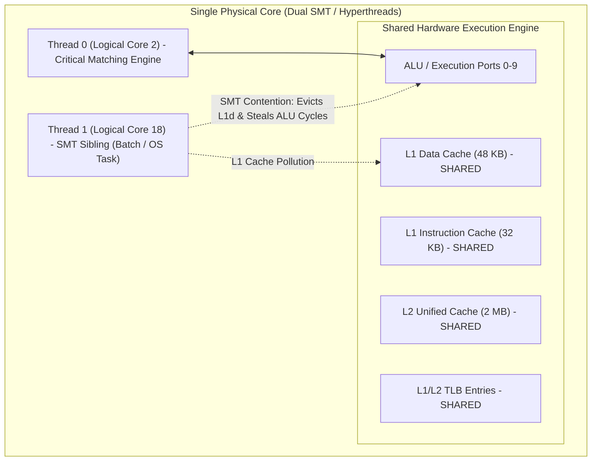

> [!summary]
> Thread pinning binds critical execution loops to dedicated physical CPU cores using `pthread_setaffinity_np`, preventing the OS scheduler from migrating threads across cores or NUMA nodes. Combining thread pinning with real-time scheduling (`SCHED_FIFO` priority 99) and isolating Simultaneous Multi-Threading (SMT / Hyperthreading) sibling cores eliminates context switches, preserves L1/L2 cache warmth, and guarantees sub-microsecond determinism.

---

## Why it matters
When a thread is not pinned, the Linux Completely Fair Scheduler (CFS) dynamically balances CPU load. If another process starts or an interrupt fires, the scheduler can migrate your trading thread to a different core:
1. **L1 and L2 Caches are cold**: All cached order book state, lookup tables, and stack data must be refetched from L3 or DRAM (**~50–70 ns per miss**).
2. **TLB Entries are flushed**: The new core has no address translations cached (**~30–100 ns page table walk stalls**).
3. **Cross-NUMA Migration Hazard**: If the thread is moved to a core on Socket 1 while its memory resides on Socket 0, all future reads traverse the UPI interconnect (**~180 ns penalty**).

Pinning guarantees that your critical thread stays permanently mapped to a dedicated hardware execution pipeline and local L1/L2 caches.



---

## Mechanism

### 1. `pthread_setaffinity_np` vs `sched_setaffinity`
- `pthread_setaffinity_np`: Operates on POSIX thread handles (`pthread_t`), setting the CPU affinity mask for the specific calling or target thread.
- `sched_setaffinity`: Linux-specific syscall operating on kernel thread IDs (`tid / pid`).
- Under the hood, both modify the kernel task structure's `cpus_allowed` bitmask. Once set, the kernel scheduler will never select a CPU outside this mask for the thread.

### 2. The Simultaneous Multi-Threading (SMT / Hyperthreading) Contention Trap
In x86 CPUs with Hyperthreading (SMT), a single physical CPU core presents itself to the OS as **two logical cores** (e.g., Core 2 and Core 18):
- Both logical cores **share the exact same physical execution units (ALUs, vector units), L1i cache, L1d cache, L2 cache, and TLB**.
- If your critical trading loop runs on Core 2 while an unrelated background logging or OS task runs on its sibling Core 18, Core 18 will:
  1. Compete for instruction dispatch ports, cutting Core 2's execution throughput by **30–50%**.
  2. Evict Core 2's hot lines from L1d and L2 caches (**MESI contention**).
  3. Flush entries from the shared TLB.

> [!important] Production Rule for Hyperthreading
> Either **disable Hyperthreading in the BIOS entirely** on production trading hosts, or identify sibling pairs via `lscpu -e` and leave the SMT sibling logical core completely **idle / unassigned**.

### 3. Real-Time Scheduling: `SCHED_FIFO`
By default, threads run under `SCHED_OTHER` (time-sliced by CFS). 
- `SCHED_FIFO` (First-In, First-Out Real-Time Policy) assigns a fixed static priority from 1 (lowest) to 99 (highest).
- A `SCHED_FIFO` priority 99 thread running on a dedicated isolated core **will never be preempted** by any standard user-space task or kernel worker thread.

---

## In Practice

### Production C++ Thread Pinning and Real-Time Priority Helper

```cpp
#include <pthread.h>
#include <sched.h>
#include <unistd.h>
#include <sys/syscall.h>
#include <iostream>
#include <stdexcept>
#include <string>

class ThreadAffinity {
public:
    // Pin calling thread to a specific physical core and elevate to SCHED_FIFO 99
    static void pin_and_elevate(int core_id, int rt_priority = 99) {
        // 1. Set CPU Affinity Mask
        cpu_set_t cpuset;
        CPU_ZERO(&cpuset);
        CPU_SET(core_id, &cpuset);

        pthread_t current_thread = pthread_self();
        if (pthread_setaffinity_np(current_thread, sizeof(cpu_set_t), &cpuset) != 0) {
            throw std::runtime_error("Failed to set thread affinity to Core " + std::to_string(core_id));
        }

        // 2. Set Real-Time FIFO Scheduling Policy
        if (rt_priority > 0) {
            struct sched_param param;
            param.sched_priority = rt_priority; // Max priority is 99

            if (pthread_setschedparam(current_thread, SCHED_FIFO, &param) != 0) {
                // Note: Requires root privileges or CAP_SYS_NICE capability
                std::cerr << "Warning: Could not set SCHED_FIFO priority " << rt_priority 
                          << " (Run as root or grant CAP_SYS_NICE)\n";
            }
        }
    }

    // Verify current pinned core
    static int get_current_core() noexcept {
        return sched_getcpu();
    }
};
```

---

## Numbers

*Hardware Baseline: Intel Xeon Platinum 8480+ @ 3.8 GHz.*

| Thread Placement / Configuration | Latency Variance (Jitter) | L1d Hit Rate | Context Switches / Sec |
| :--- | :--- | :--- | :--- |
| **Unpinned Thread (`SCHED_OTHER`)** | **1,500–15,000 ns** | ~82–88% | 200–1,000 / sec |
| **Pinned to Core with Active SMT Sibling**| **400–2,500 ns** | ~91–94% | 0 / sec (Contention) |
| **Pinned to Dedicated Physical Core** | **180–350 ns** | **>99.5%** | **0 / sec** |
| **Pinned + `SCHED_FIFO` + `isolcpus`** | **150–220 ns** | **>99.9%** | **0 / sec (Deterministic)**|

---

## Trade-offs

| Strategy | Advantages | Operational Cost / Trade-off |
| :--- | :--- | :--- |
| **BIOS Hyperthreading Disabled** | Zero risk of accidental SMT resource stealing; clean 1:1 hardware topology. | Cuts total logical core count in half; reduces throughput for non-latency batch tasks. |
| **`SCHED_FIFO` Priority 99** | Complete immunity from OS CFS preemption. | If a spinning thread has an infinite loop bug, it can starve the OS kernel unless watchdog is active. |
| **Manual CPU Pinning Mapping** | Absolute control over cache domains and NUMA boundaries. | Fragile to hardware changes; requires strict configuration management across server fleets. |

---

> [!warning] Gotchas
> 1. **The Linux CPU Numbering Myth**: Never assume logical CPU 0 and CPU 1 are on the same physical core. On many multi-socket Linux servers, physical Core 0 contains logical CPUs 0 and 32 (SMT pair), while logical CPU 1 is on physical Core 1. *Always verify sibling maps with `cat /sys/devices/system/cpu/cpu0/topology/thread_siblings_list`.*
> 2. **Process Forking Affinity Inheritance**: When a process calls `fork()`, the child process inherits the parent's CPU affinity mask. If your trading engine spawns a child worker or logging script, that script will run on the **exact same isolated core** as the critical trading engine until explicitly repinned.

---

## Lab
**Objective**: Build a multi-threaded test verifying that thread migration causes cold-cache latency spikes, and prove that running on SMT siblings degrades throughput by >30%.

**Success Criteria**:
1. Run a tight benchmark loop with thread migration allowed (`sched_yield()` across cores).
2. Measure latency spikes exceeding 1.5 µs due to L1d/L2 cache misses.
3. Pin the thread to a single isolated core: verify median latency drops to ~200 ns and max tail latency stays below 500 ns.

---

> [!question]- Self-test
> 1. **Why does running two computationally intensive threads on SMT sibling cores (e.g., CPU 2 and CPU 18) degrade performance compared to two separate physical cores?**
>    *Answer*: SMT sibling cores share the underlying physical core's execution pipelines (ALU/FPU/SIMD ports), L1 instruction/data caches, L2 unified cache, and TLB buffers. Simultaneous execution causes instruction dispatch stalls, cache eviction thrashing, and port contention.
> 2. **What Linux capability is required to execute `pthread_setschedparam` with `SCHED_FIFO` without running as the `root` user?**
>    *Answer*: The `CAP_SYS_NICE` Linux capability. It can be granted to a binary using `setcap cap_sys_nice=+ep /path/to/trading_binary`.
> 3. **How does `sched_getcpu()` determine which CPU core is currently executing the thread?**
>    *Answer*: On modern x86 Linux, `sched_getcpu()` uses the VDSO (Virtual Dynamic Shared Object) to read the CPU ID directly from CPU registers (via the `RDPID` instruction or segment register lookups) without making an expensive kernel system call.

---

## Related
- [[Notes/Kernel Boot Parameters for Core Isolation]]
- [[Notes/NUMA Topologies and Inter-Socket Jitter]]
- [[Notes/CPU Cache Hierarchy and Line Alignment]]
- [[Notes/Interrupt Routing and MSI-X Tuning]]
- [[MOC - 05 OS & Kernel Tuning]]

## Sources
- [[Sources/Red Hat Enterprise Linux for Real Time Tuning Guide]]
- [[Sources/Systems Performance by Brendan Gregg]]
- [[Sources/Intel 64 and IA-32 Architectures Optimization Reference Manual]]
