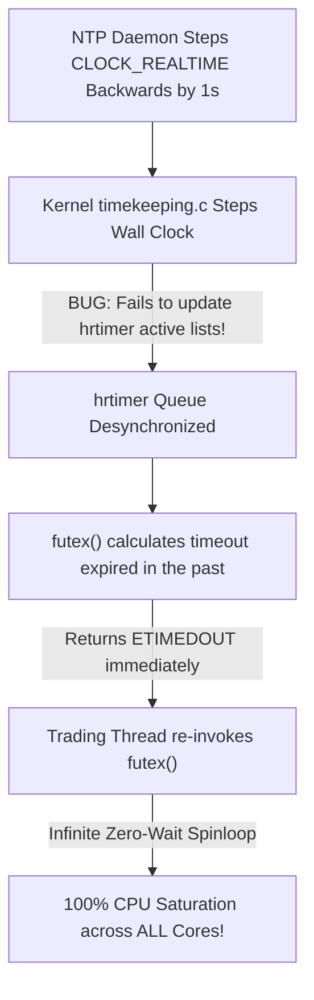

# War Story — The June 30, 2012 Leap Second Bug: Linux Futex Spinlock Cascades & 100% CPU Freezes

> [!summary]
> On June 30, 2012, at 23:59:60 UTC, the International Earth Rotation and Reference Systems Service (IERS) inserted a positive "Leap Second" to synchronize UTC with Earth's rotation. A dormant bug in the Linux kernel's timekeeping and high-resolution timer (`hrtimer`) subsystem caused millions of multi-threaded server applications worldwide—including high-frequency trading systems, exchange gateways, and database clusters—to enter catastrophic, unyielding 100% CPU spinlocks.

---

## 1. Incident Timeline & Chronology (June 30, 2012 UTC)

```mermaid
timeline
    title The June 30, 2012 Leap Second Lockup Timeline
    23:59:59 : NTP servers broadcast the leap second flag (leap=01).
    23:59:60 : UTC time reaches the inserted leap second: 23:59:59 -> 23:59:60 -> 00:00:00.
    00:00:00 : Linux kernel timekeeping subsystem decrements CLOCK_REALTIME by 1 second to repeat the 59th second.
    00:00:01 : Kernel hrtimer subsystem fails to update internal timer expirations, setting all future futex() sleep timeouts into the past.
    00:00:05 : Multi-threaded C++ and Java trading processes invoking pthread_cond_timedwait() and futex() enter infinite tight spinloops at 100% CPU load.
    00:05:00 : Trading servers become completely unresponsive; exchange gateways drop TCP sessions; global sysadmins execute emergency server reboots.
```

---

## 2. Technical & Kernel Microarchitectural Root Cause Analysis

### A. The NTP Leap Second Insertion Mechanism
- Earth's rotation is slightly irregular, causing Astronomical Solar Time (UT1) to drift from Atomic Clock Time (UTC).
- When the drift approaches 0.9 seconds, a **Leap Second** is added by inserting a 61st second (`23:59:60 UTC`) at midnight.
- When an NTP daemon (such as `ntpd`) detects the leap indicator flag, it steps the Linux kernel's system wall clock backwards by 1 second at `00:00:00 UTC`:
$$\text{Clock Step}: \quad T_{\text{new}} = T_{\text{current}} - 1.000000000\text{ second}$$

### B. The Linux Kernel `hrtimer` Subsystem Defect
- **The Bug Location**: In the Linux kernel's timekeeping subsystem (`kernel/time/timekeeping.c`), when the clock was stepped backwards by 1 second, the kernel updated `CLOCK_REALTIME`, but **failed to notify the High-Resolution Timer (`hrtimer`) subsystem to adjust existing active timer queue expiration targets**.
- **The Futex Spinlock Cascade**:
  1. Multi-threaded applications frequently invoke `pthread_cond_timedwait()` or `futex(FUTEX_WAIT_BITSET)` with absolute timeouts based on `CLOCK_REALTIME`.
  2. Because the kernel clock jumped backwards by 1 second while internal `hrtimer` state remained unadjusted, the kernel calculated that the timer had **already expired in the past**.
  3. The `futex()` system call returned `ETIMEDOUT` immediately.
  4. User-space worker threads (e.g. thread pools, background loggers, JVM garbage collectors) caught the timeout and immediately re-entered the wait loop.
  5. The loop repeated millions of times per second with **zero sleep delay**, consuming **100% of all CPU cores** in a catastrophic livelock!



---

## 3. Permanent Operational & Engineering Remediations

To ensure financial systems survive leap seconds without disruption, the electronic trading industry established three permanent technical standards:

| Problem Domain | 2012 Failure Mode | Modern Production Trading Standard |
| :--- | :--- | :--- |
| **Clock Synchronization** | Stepping the clock backwards by 1.0 second abruptly. | **NTP/PTP Leap Second Smearing (Google / AWS / Exchange Standard)**: The 1-second adjustment is smoothly smeared across a 24-hour window ($\pm 11.57\text{ µs/sec}$), ensuring monotonic, step-free time. |
| **Internal Software Clocks** | Using `CLOCK_REALTIME` for timer timeouts. | **Strict Monotonic Clocks (`CLOCK_MONOTONIC_RAW` / `__rdtsc`)**: Internal timeouts, wait queues, and performance profiling exclusively use monotonically increasing clock sources that can **never step backwards**. |
| **Exchange Operations** | Operating through the leap second transition. | **Trading Session Halts & Maintenance Windows**: Financial exchanges schedule leap second adjustments outside market trading hours (e.g. Saturday 00:00 UTC). |

---

## 4. Key Engineering Lessons for Low-Latency Systems

1. **Never Use `CLOCK_REALTIME` for Internal Latency Timing**: `CLOCK_REALTIME` reflects human wall-clock time and can be stepped backwards by NTP, system administrators, or leap seconds. For internal timeouts, queue timeouts, and latency profiling, **always use `CLOCK_MONOTONIC_RAW` or direct CPU `__rdtsc()` cycles**.
2. **Implement Leap Smearing on Internal PTP Grandmasters**: Production trading infrastructure must configure its GPS-disciplined PTP Grandmaster clocks to perform linear 24-hour leap smearing, completely shielding trading host kernels from abrupt 1-second clock steps.
3. **Audit Thread Pool Wait Loops**: When writing event loops that wait on condition variables or timers, always verify that the loop handles spurious wakeups and negative time deltas gracefully without entering unbounded spinloops.

---

## Related Notes
- [[07 - Time & Measurement/Clock Sources and Hardware Timestamping]]
- [[07 - Time & Measurement/PTP IEEE 1588 and White Rabbit Network Synchronization]]
- [[05 - OS & Kernel Tuning/Kernel Boot Parameters for Core Isolation]]
- [[13 - Reliability, Ops & Testing/Disaster Recovery and High Availability Topologies]]
- [[14 - Industry Map & Canon/MOC - 14 Industry Map & Canon]]

## Sources
- [[Sources/Linux Kernel Git Commit 6b43ae5: Fix Leap Second hrtimer Subsystem Bug]]
- [[Sources/Google Public NTP Leap Smearing Documentation]]
- [[Sources/Systems Performance by Brendan Gregg]]
