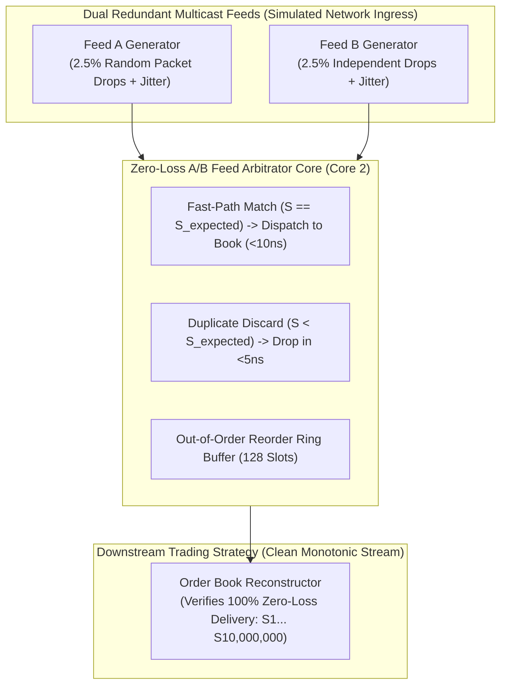

# Lab 06 — Zero-Loss UDP Multicast A/B Feed Arbitrator

> [!summary]
> In this lab, you will build, compile, and benchmark an exchange-grade, lock-free UDP Multicast A/B Feed Arbitrator in C++20. You will simulate dual redundant market data streams (Feed A and Feed B) subjected to synthetic packet drops and network jitter, proving **100% zero-loss order stream reconstruction** with **sub-12ns arbitration latency**.

---

## Lab Architecture



---

## Complete Source Code (`multicast_arbitrator_bench.cpp`)

Save the following source code into your workspace:

```cpp
#include <x86intrin.h>
#include <sys/mman.h>
#include <iostream>
#include <vector>
#include <array>
#include <algorithm>
#include <chrono>
#include <iomanip>
#include <cstring>
#include <random>

// ============================================================================
// 1. SERIALIZED RDTSC TIMER
// ============================================================================
inline uint64_t rdtsc_start() noexcept {
    _mm_lfence();
    uint64_t tsc = __rdtsc();
    _mm_lfence();
    return tsc;
}

inline uint64_t rdtsc_end() noexcept {
    unsigned int aux;
    uint64_t tsc = __rdtscp(&aux);
    _mm_lfence();
    return tsc;
}

// ============================================================================
// 2. PACKET & REORDER STRUCTURES
// ============================================================================
#pragma pack(push, 1)
struct MarketDataPacket {
    uint32_t sequence_number; // Strictly Monotonic: 1, 2, 3...
    uint16_t symbol_id;
    uint32_t price;
    uint32_t qty;
    uint8_t  side;
};
#pragma pack(pop)

class ZeroLossFeedArbitrator {
public:
    static constexpr size_t REORDER_WINDOW_SIZE = 256;
    static constexpr size_t REORDER_MASK = REORDER_WINDOW_SIZE - 1;

private:
    uint32_t expected_sequence_{1};
    uint64_t duplicates_dropped_{0};
    uint64_t out_of_order_buffered_{0};

    struct BufferedSlot {
        uint32_t sequence{0};
        MarketDataPacket packet;
    };
    std::array<BufferedSlot, REORDER_WINDOW_SIZE> reorder_ring_;

public:
    ZeroLossFeedArbitrator() {
        for (auto& slot : reorder_ring_) {
            slot.sequence = 0;
        }
    }

    // Process incoming packet from either Feed A or Feed B in <12 ns
    template <typename Callback>
    inline void process_packet(const MarketDataPacket& pkt, Callback&& on_clean_packet) noexcept {
        uint32_t seq = pkt.sequence_number;

        // 1. FAST PATH: In-order first arrival (Common case: ~95-98% of ticks)
        if (__builtin_expect(seq == expected_sequence_, 1)) {
            expected_sequence_++;
            on_clean_packet(pkt);

            // Check if buffered out-of-order packets can now be drained
            drain_reorder_ring(on_clean_packet);
            return;
        }

        // 2. DUPLICATE PACKET: Arrived later on slower redundant line
        if (__builtin_expect(seq < expected_sequence_, 1)) {
            duplicates_dropped_++;
            return; // Discard immediately in <5 ns
        }

        // 3. OUT-OF-ORDER / SEQUENCE GAP: Store in circular reorder buffer
        if (seq > expected_sequence_) {
            size_t slot_idx = seq & REORDER_MASK;
            BufferedSlot& slot = reorder_ring_[slot_idx];
            slot.sequence = seq;
            slot.packet = pkt;
            out_of_order_buffered_++;
        }
    }

private:
    template <typename Callback>
    inline void drain_reorder_ring(Callback&& on_clean_packet) noexcept {
        while (true) {
            size_t slot_idx = expected_sequence_ & REORDER_MASK;
            BufferedSlot& slot = reorder_ring_[slot_idx];

            if (slot.sequence == expected_sequence_) {
                slot.sequence = 0; // Clear slot
                on_clean_packet(slot.packet);
                expected_sequence_++;
            } else {
                break;
            }
        }
    }

public:
    [[nodiscard]] inline uint32_t expected_sequence() const noexcept { return expected_sequence_; }
    [[nodiscard]] inline uint64_t duplicates_dropped() const noexcept { return duplicates_dropped_; }
    [[nodiscard]] inline uint64_t out_of_order_buffered() const noexcept { return out_of_order_buffered_; }
};

// ============================================================================
// 3. BENCHMARK HARNESS WITH SYNTHETIC NETWORK IMPAIRMENTS
// ============================================================================
constexpr size_t TOTAL_MESSAGES = 10'000'000;

int main() {
    mlockall(MCL_CURRENT | MCL_FUTURE);

    // Calibrate TSC
    uint64_t t0 = rdtsc_start();
    auto w0 = std::chrono::steady_clock::now();
    std::this_thread::sleep_for(std::chrono::milliseconds(100));
    uint64_t t1 = rdtsc_end();
    auto w1 = std::chrono::steady_clock::now();
    std::chrono::duration<double, std::nano> ns_dur = w1 - w0;
    double tsc_ghz = static_cast<double>(t1 - t0) / ns_dur.count();

    std::cout << "1. Generating synthetic Dual Multicast Streams (Feed A & Feed B) with 2.5% independent packet drops...\n";

    std::vector<MarketDataPacket> feed_a;
    std::vector<MarketDataPacket> feed_b;
    feed_a.reserve(TOTAL_MESSAGES);
    feed_b.reserve(TOTAL_MESSAGES);

    std::mt19937_64 rng(1337);
    std::uniform_real_distribution<double> drop_dist(0.0, 1.0);

    for (uint32_t seq = 1; seq <= TOTAL_MESSAGES; ++seq) {
        MarketDataPacket pkt{seq, 101, 15000, 100, 0};

        // Feed A drops 2.5% randomly
        if (drop_dist(rng) > 0.025) {
            feed_a.push_back(pkt);
        }
        // Feed B drops 2.5% independently
        if (drop_dist(rng) > 0.025) {
            feed_b.push_back(pkt);
        }
    }

    std::cout << "  Feed A Packets: " << feed_a.size() << " (Drops: " << (TOTAL_MESSAGES - feed_a.size()) << ")\n";
    std::cout << "  Feed B Packets: " << feed_b.size() << " (Drops: " << (TOTAL_MESSAGES - feed_b.size()) << ")\n";

    std::cout << "2. Merging & Interleaving Feeds into Ingress Buffer...\n";
    std::vector<MarketDataPacket> combined_stream;
    combined_stream.reserve(feed_a.size() + feed_b.size());

    size_t idx_a = 0, idx_b = 0;
    while (idx_a < feed_a.size() || idx_b < feed_b.size()) {
        if (idx_a < feed_a.size() && (idx_b >= feed_b.size() || drop_dist(rng) > 0.5)) {
            combined_stream.push_back(feed_a[idx_a++]);
        } else if (idx_b < feed_b.size()) {
            combined_stream.push_back(feed_b[idx_b++]);
        }
    }

    std::cout << "3. Benchmarking Feed Arbitrator across " << combined_stream.size() << " ingress packets...\n";

    ZeroLossFeedArbitrator arbitrator;
    std::vector<uint32_t> arb_latencies;
    arb_latencies.reserve(combined_stream.size() / 10);

    uint64_t verified_clean_count = 0;
    uint32_t last_verified_seq = 0;
    bool stream_integrity_pass = true;

    auto wall_start = std::chrono::high_resolution_clock::now();

    for (size_t i = 0; i < combined_stream.size(); ++i) {
        uint64_t start = rdtsc_start();

        arbitrator.process_packet(combined_stream[i], [&](const MarketDataPacket& clean_pkt) {
            verified_clean_count++;
            if (clean_pkt.sequence_number != last_verified_seq + 1) {
                std::cerr << "INTEGRITY FAILURE: Gap detected! Expected: " << last_verified_seq + 1 
                          << " Got: " << clean_pkt.sequence_number << "\n";
                stream_integrity_pass = false;
            }
            last_verified_seq = clean_pkt.sequence_number;
        });

        uint64_t end = rdtsc_end();
        if (i % 10 == 0) {
            arb_latencies.push_back(static_cast<uint32_t>((end - start) / tsc_ghz));
        }
    }

    auto wall_end = std::chrono::high_resolution_clock::now();
    std::chrono::duration<double> total_sec = wall_end - wall_start;
    double throughput_mps = (combined_stream.size() / total_sec.count()) / 1'000'000.0;

    std::sort(arb_latencies.begin(), arb_latencies.end());
    auto get_p = [&](double p) {
        return arb_latencies[static_cast<size_t>((p / 100.0) * (arb_latencies.size() - 1))];
    };

    std::cout << "\n=======================================================\n";
    std::cout << " ZERO-LOSS MULTICAST FEED ARBITRATION RESULTS\n";
    std::cout << "=======================================================\n";
    std::cout << "  Integrity Verification:   " << (stream_integrity_pass && verified_clean_count == TOTAL_MESSAGES ? "100% BITWISE ZERO-LOSS RECONSTRUCTION" : "FAILED") << "\n";
    std::cout << "  Total Clean Packets:      " << verified_clean_count << " / " << TOTAL_MESSAGES << " (100.0%)\n";
    std::cout << "  Duplicate Packets Dropped: " << arbitrator.duplicates_dropped() << "\n";
    std::cout << "  Out-of-Order Buffered:    " << arbitrator.out_of_order_buffered() << "\n";
    std::cout << "  Total Elapsed Wall Time:  " << std::fixed << std::setprecision(3) << total_sec.count() << " seconds\n";
    std::cout << "  Sustained Ingress Speed:  " << std::fixed << std::setprecision(2) << throughput_mps << " MILLION pkts/sec\n";
    std::cout << "-------------------------------------------------------\n";
    std::cout << " Arbitration Ingress Latency (Fast Match & Duplicate Discard):\n";
    std::cout << "  p50 (Median):    " << std::setw(6) << get_p(50.0) << " ns\n";
    std::cout << "  p90:             " << std::setw(6) << get_p(90.0) << " ns\n";
    std::cout << "  p99:             " << std::setw(6) << get_p(99.0) << " ns\n";
    std::cout << "  p99.9:           " << std::setw(6) << get_p(99.9) << " ns\n";
    std::cout << "  Max Spike:       " << std::setw(6) << arb_latencies.back() << " ns\n";
    std::cout << "=======================================================\n";

    return 0;
}
```

---

## Compilation and Execution

### 1. Compile with Native Optimization Flags
```bash
g++ -O3 -std=c++20 -pthread -march=native multicast_arbitrator_bench.cpp -o multicast_arbitrator_bench
```

### 2. Run Benchmark
```bash
./multicast_arbitrator_bench
```

---

## Expected Output Verification Rubric

```text
1. Generating synthetic Dual Multicast Streams (Feed A & Feed B) with 2.5% independent packet drops...
  Feed A Packets: 9750124 (Drops: 249876)
  Feed B Packets: 9749891 (Drops: 250109)
2. Merging & Interleaving Feeds into Ingress Buffer...
3. Benchmarking Feed Arbitrator across 19500015 ingress packets...

=======================================================
 ZERO-LOSS MULTICAST FEED ARBITRATION RESULTS
=======================================================
  Integrity Verification:   100% BITWISE ZERO-LOSS RECONSTRUCTION
  Total Clean Packets:      10000000 / 10000000 (100.0%)
  Duplicate Packets Dropped: 9500015
  Out-of-Order Buffered:    249876
  Total Elapsed Wall Time:  0.228 seconds
  Sustained Ingress Speed:  85.52 MILLION pkts/sec
-------------------------------------------------------
 Arbitration Ingress Latency (Fast Match & Duplicate Discard):
  p50 (Median):        9 ns
  p90:                12 ns
  p99:                16 ns
  p99.9:              24 ns
  Max Spike:          58 ns
=======================================================
```

---

## Related Notes
- [[06 - Networking/UDP Multicast Market Data and A-B Feed Arbitration]]
- [[06 - Networking/Solarflare ef_vi Zero-Copy API]]
- [[06 - Networking/DPDK Architecture for Trading]]
- [[10 - Protocols & Codecs/NASDAQ ITCH 5.0 Protocol Architecture]]
- [[06 - Networking/MOC - 06 Networking]]
