> [!summary]
> While market data is broadcast over UDP Multicast, order entry protocols (OUCH, FIX, iLink 3) require TCP for guaranteed delivery and session state. Optimizing TCP for sub-microsecond order execution requires eliminating Nagle's algorithm (`TCP_NODELAY`), disabling delayed ACKs (`TCP_QUICKACK`), tuning socket buffers, and utilizing user-space kernel-bypass TCP stacks (OpenOnload / TOE).

---

## Why it matters
A standard Linux TCP socket configured with default OS parameters will randomly inject **40 to 200 milliseconds of latency** into live order transmissions due to the catastrophic interaction between **Nagle's Algorithm** and **Delayed ACKs**.

In high-frequency execution:
- An order to cancel a stale quote must exit the host in **<800 nanoseconds**.
- If Nagle's algorithm buffers the cancel packet waiting for an unacknowledged TCP ACK, the quote sits exposed in the market, getting picked off by faster competitors.

Tuning socket flags and deploying **TCP Connection Warmers** ensures that every packet exits the network stack at wire speed.

```mermaid
flowchart TD
    subgraph DefaultLinuxTCP ["Standard Default Linux TCP (40 - 200 ms Delay)"]
        D1[Order Generated] --> D2[Nagle's Algorithm Buffers Packet]
        D2 --> D3[Wait for Exchange ACK]
        D3 --> D4[Exchange Delayed ACK Timer: 40ms Stall]
        D4 --> D5[Finally Transmitted to Wire]
    end

    subgraph OptimizedTCP ["Low-Latency Kernel Bypass TCP (<800 ns)"]
        O1[Order Generated] --> O2["TCP_NODELAY: Transmit Instantly"]
        O2 --> O3["OpenOnload / User-Space Stack: Zero Syscall"]
        O3 --> O4["Wire-Speed SFP28 Egress in <450 ns"]
    end
```



---

## Mechanism

### 1. Eliminating TCP Protocol Pathologies

| TCP Parameter / Flag | Default Behavior | Low-Latency Required Setting | Latency Hazard Eliminated |
| :--- | :--- | :--- | :--- |
| **`TCP_NODELAY`** | Buffers small packets (Nagle's). | **`1` (Enabled)** | Eliminates 40–200ms packet coalescing delays. |
| **`TCP_QUICKACK`** | Delays ACKs up to 40ms. | **`1` (Re-assert on recv)**| Prevents ACK stalling when communicating with peers. |
| **`SO_BUSY_POLL`** | Kernel sleeps on socket wait. | **`50` (Polls for 50 µs)** | Eliminates OS interrupt & scheduler wake-up latency. |
| **`SO_SNDBUF` / `SO_RCVBUF`**| Autotuned (128 KB – 4 MB). | **Fixed Small (32–64 KB)**| Minimizes buffer bloat and preserves L2/L3 cache locality. |
| **`IP_TOS` / `SO_PRIORITY`** | Best Effort (0). | **`0x10` (Low Delay / DSCP)**| Prioritizes packets across internal network switches. |

### 2. The Nagle + Delayed ACK Deadlock
- **Nagle's Algorithm**: Prohibits sending a new TCP segment smaller than the MSS (Maximum Segment Size, ~1460 bytes) if there is any previously transmitted segment that has not yet been ACKed.
- **Delayed ACKs**: The receiving side delays sending an ACK for up to **40–200 ms**, hoping to piggyback the ACK on outgoing response data.
- **The Deadlock**: Client sends a 48-byte OUCH Enter Order and waits. Client wants to send a 40-byte Cancel. Nagle holds the Cancel packet waiting for the Enter Order ACK. The exchange holds the ACK waiting for delayed ACK timeout. **Result: 40ms stall on live trading path!**

### 3. TCP Connection Warming
When an order gateway session sits idle for 10 seconds:
- CPU caches become cold, and NIC DMA descriptors drop out of cache.
- Intermediate network switch forwarding tables and ARP caches age out.
- The TCP Congestion Window (`cwnd`) may reset to initial values.
- **TCP Connection Warmer**: The trading engine sends tiny TCP heartbeat frames (or TCP zero-window probes) every 500 milliseconds, keeping hardware caches hot, PCIe buses active, and switch routes primed.

---

## In Practice

### High-Performance Low-Latency TCP Socket Initializer in C++20

```cpp
#include <sys/socket.h>
#include <netinet/in.h>
#include <netinet/tcp.h>
#include <arpa/inet.h>
#include <unistd.h>
#include <fcntl.h>
#include <iostream>
#include <stdexcept>

class LowLatencyTcpSocket {
public:
    static int create_optimized_socket(const char* target_ip, uint16_t target_port) {
        int fd = socket(AF_INET, SOCK_STREAM, 0);
        if (fd < 0) throw std::runtime_error("socket() failed");

        // 1. Disable Nagle's Algorithm (MANDATORY FOR HFT)
        int one = 1;
        if (setsockopt(fd, IPPROTO_TCP, TCP_NODELAY, &one, sizeof(one)) < 0) {
            std::cerr << "Warning: Failed to set TCP_NODELAY\n";
        }

        // 2. Enable Quick ACK (Disable Delayed ACKs)
        if (setsockopt(fd, IPPROTO_TCP, TCP_QUICKACK, &one, sizeof(one)) < 0) {
            std::cerr << "Warning: Failed to set TCP_QUICKACK\n";
        }

        // 3. Enable Kernel Busy Polling (Eliminates interrupt wakeups)
        int busy_poll_us = 50; // 50 microseconds
        if (setsockopt(fd, SOL_SOCKET, SO_BUSY_POLL, &busy_poll_us, sizeof(busy_poll_us)) < 0) {
            std::cerr << "Warning: SO_BUSY_POLL not supported or failed\n";
        }

        // 4. Minimize Socket Buffers (Prevent Buffer Bloat)
        int buf_size = 65536; // 64 KB
        setsockopt(fd, SOL_SOCKET, SO_SNDBUF, &buf_size, sizeof(buf_size));
        setsockopt(fd, SOL_SOCKET, SO_RCVBUF, &buf_size, sizeof(buf_size));

        // 5. Set IP Low-Delay Type of Service (TOS)
        int tos = 0x10; // Low Delay
        setsockopt(fd, IPPROTO_IP, IP_TOS, &tos, sizeof(tos));

        // 6. Connect to Exchange Gateway
        sockaddr_in server_addr{};
        server_addr.sin_family = AF_INET;
        server_addr.sin_port = htons(target_port);
        inet_pton(AF_INET, target_ip, &server_addr.sin_addr);

        if (connect(fd, (struct sockaddr*)&server_addr, sizeof(server_addr)) < 0) {
            close(fd);
            throw std::runtime_error("connect() failed");
        }

        // Set non-blocking for event-loop polling
        int flags = fcntl(fd, F_GETFL, 0);
        fcntl(fd, F_SETFL, flags | O_NONBLOCK);

        return fd;
    }
};
```

---

## Numbers

*Hardware Baseline: AMD EPYC Genoa / Intel Xeon Sapphire Rapids @ 4.0 GHz.*

| TCP Configuration | Median Ingress Latency ($p50$) | Max Tail Latency Spike | Jitter Impact |
| :--- | :--- | :--- | :--- |
| **Default Linux Socket (Nagle ON)** | **~40,000,000 ns (40 ms)** | **200,000,000 ns (200 ms)**| **Catastrophic** |
| **Linux Socket + `TCP_NODELAY`** | **~2,200–3,800 ns** | 45.0–120.0 µs | High (Kernel context switches) |
| **Solarflare OpenOnload TCP** | **~750–1,100 ns** | <2.5 µs | Low |
| **FPGA TCP Offload Engine (TOE)** | **<250 ns (Wire-to-Wire)** | **<350 ns** | **Ultra-Deterministic** |

---

## Trade-offs

| TCP Acceleration Approach | Latency Advantage | Implementation Effort |
| :--- | :--- | :--- |
| **OpenOnload User-Space TCP** | Accelerates standard POSIX code to sub-microsecond latency. | Zero code changes; requires Solarflare NIC hardware. |
| **Custom Raw User-Space Stack**| Strips down TCP state machine to bare minimum OUCH framing. | Extreme engineering effort; complex TCP retransmission RFC compliance. |
| **FPGA Hardware TOE (SmartNIC)** | Sub-250ns wire-to-wire transmission; zero host CPU jitter. | High hardware cost; complex Verilog state machine maintenance. |

---

> [!warning] Gotchas
> 1. **The `TCP_QUICKACK` Reset Trap in Linux**: Under the Linux kernel, calling `setsockopt(fd, IPPROTO_TCP, TCP_QUICKACK, ...)` is **not persistent**! The kernel automatically disables QuickACK and reverts to Delayed ACKs after processing incoming data. *In standard kernel sockets, `TCP_QUICKACK` must be re-asserted after every `recv()` call.*
> 2. **TCP Window Shrinkage on Warmers**: Sending invalid payload warmers can cause the exchange gateway to disconnect the session for protocol violation. *Ensure TCP warmers send valid application-level Heartbeat / Ping messages (e.g. FIX MsgType `35=0` or OUCH Server Ping).*

---

## Lab
**Objective**: Build a TCP benchmark comparing an un-tuned socket against a fully tuned low-latency socket (`TCP_NODELAY`, `TCP_QUICKACK`, `SO_BUSY_POLL`), measuring round-trip time across 100,000 small 48-byte messages.

**Success Criteria**:
1. Demonstrate the 40ms Nagle/Delayed-ACK stall on default sockets.
2. Verify that enabling `TCP_NODELAY` drops median latency from 40ms to **under 5 microseconds**.
3. Verify zero packet drops or socket stalls across 100,000 messages.

---

> [!question]- Self-test
> 1. **What is Nagle's Algorithm and why is it catastrophic for high-frequency order entry gateways?**
>    *Answer*: Nagle's algorithm buffers small outgoing TCP packets (smaller than the Maximum Segment Size of ~1460 bytes) until all previously transmitted data has been acknowledged by the receiver. In HFT, where order messages are small (e.g. 48-byte OUCH messages), Nagle will hold back critical cancel and modify orders until previous execution acknowledgments arrive, injecting 40 to 200 milliseconds of buffering delay into live trading.
> 2. **How does Nagle's Algorithm interact with Delayed ACKs to create a 40ms latency deadlock?**
>    *Answer*: If the sender enables Nagle, it will not send a second small packet until the receiver ACKs the first. If the receiver uses Delayed ACKs, it will not send an ACK immediately, waiting up to 40ms hoping to piggyback the ACK on outgoing response data. Both sides wait for each other, causing an artificial 40ms dead-time stall on the network.
> 3. **What is the purpose of a TCP Connection Warmer in an electronic trading system?**
>    *Answer*: During quiet market periods when no orders are sent, CPU caches cool down, PCIe power-management links enter low-power states, and network switch routing tables age out. A TCP Connection Warmer periodically transmits application-level heartbeat frames to keep PCIe buses active, CPU caches hot, and network routes primed, ensuring the next critical order executes with zero cold-cache jitter.

---

## Related
- [[06 - Networking/Network Interface Card Architecture]]
- [[06 - Networking/Kernel Bypass Technologies Overview]]
- [[02 - Exchange Architecture/Exchange Gateway Architecture]]
- [[10 - Protocols & Codecs/NASDAQ OUCH Protocol Architecture]]
- [[06 - Networking/MOC - 06 Networking]]

## Sources
- [[Sources/Solarflare OpenOnload User Guide]]
- [[Sources/Linux Programmer's Manual - tcp(7)]]
- [[Sources/How to Build an Exchange by Jane Street]]
