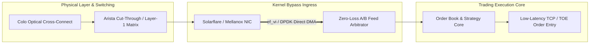

# MOC — 06 Networking

Kernel bypass technologies, UDP multicast market data feeds, TCP low-latency stacks, network hardware, and physical topologies.

---

## Core Concepts
- [[06 - Networking/Network Interface Card Architecture]] — RX/TX rings, DMA engines, packet descriptors, ring buffer overflow, PCIe bottlenecks.
- [[06 - Networking/Kernel Bypass Technologies Overview]] — Solarflare OpenOnload, Solarflare `ef_vi`, DPDK, AF_XDP comparison matrix.
- [[06 - Networking/Solarflare ef_vi Zero-Copy API]] — Direct descriptor ring access, hardware filters, zero-copy packet processing, HugePage memreg.
- [[06 - Networking/DPDK Architecture for Trading]] — Poll Mode Drivers (PMD), HugePages, memory pools (`rte_mempool`), core affinity, burst RX.
- [[06 - Networking/UDP Multicast Market Data and A-B Feed Arbitration]] — Sequence gap detection, packet reordering, zero-loss feed arbitration.
- [[06 - Networking/Low-Latency TCP for Order Entry]] — `TCP_NODELAY`, `TCP_QUICKACK`, `SO_BUSY_POLL`, socket buffer tuning, TCP connection warmers.
- [[06 - Networking/Switch Architectures in Trading]] — Store-and-Forward vs Cut-Through switches, Layer-1 matrix switches (Metamako/Arista 7130).
- [[06 - Networking/Colocation and Physical Layer Infrastructure]] — Optical cross-connects, fiber propagation speed ($4.89\text{ ns/m}$), glass vs microwave RF.

## Labs & Implementations
- [[06 - Networking/Lab - 06 Zero-Loss Multicast Feed Arbitrator]] — Build an A/B multicast gap detection and arbitration engine with synthetic packet drops and jitter.

## Drills & War Stories
- [[06 - Networking/Drill - 06 Multicast Packet Drop Diagnostics]] — Troubleshoot dropped packets and switch microbursts during the 09:30:00 market open.
- [[06 - Networking/War Story - The 2015 CME Globex Multicast Freeze]] — Deep-dive forensic breakdown of market open microbursts, shallow switch buffer exhaustion, and the cascading TCP gap-fill storm.

## Canonical Sources
- [[Sources/Systems Performance by Brendan Gregg]] — Network stack performance and NIC observability.
- [[Sources/Flash Boys by Michael Lewis]] — Physical telecommunications propagation speeds (glass vs microwave).
- [[Sources/How to Build an Exchange by Jane Street]] — High-throughput network topologies.
