> [!summary]
> Network switches connect trading servers, exchange gateways, and market data feeds. In low-latency trading, standard Store-and-Forward switches are replaced by Cut-Through switches (such as the Arista 7150 and Cisco Nexus 3548), which forward packets in under 350 nanoseconds, and Layer-1 matrix switches (Arista 7130 / Metamako), which replicate optical bitstreams at the physical PHY layer in under 5 nanoseconds.

---

## Why it matters
In a colocation data center, an order packet traverses multiple switch hops (Participant Host $\to$ Top-of-Rack Switch $\to$ Exchange Aggregation Switch $\to$ Gateway Host).

If standard enterprise network switches are used:
- **Store-and-Forward Latency Drag**: Standard switches buffer entire frames before forwarding, adding **1,200 to 3,500 nanoseconds per switch hop**.
- **Buffer Bloat & Microburst Drops**: When thousands of market updates arrive simultaneously, shallow switch egress buffers fill up, dropping market data packets and causing 15-millisecond TCP recovery stalls.

Understanding switch ASIC architectures, cut-through forwarding, and Layer-1 matrix crossbars is essential for designing sub-microsecond trading topologies.

```mermaid
flowchart TD
    subgraph StoreAndForward ["1. Store-and-Forward Switch (~1,200 - 3,500 ns)"]
        S1["Ingest Entire 1500-Byte Frame"] --> S2["Verify CRC32 Checksum"]
        S2 --> S3["Lookup MAC / Route"]
        S3 --> S4["Transmit Out Egress Port"]
    end

    subgraph CutThrough ["2. Cut-Through Switch (~100 - 350 ns)"]
        C1["Ingest First 64 Bytes (Dst MAC)"] --> C2["Immediate ASIC Crossbar Lookup"]
        C2 --> C3["Begin Transmitting Out Egress Port\n(Before Packet Tail Arrives!)"]
    end

    subgraph Layer1Matrix ["3. Layer-1 Physical Crossbar Switch (<5 ns)"]
        L1["Optical Bitstream Ingress"] --> L2["Direct Silicon Physical Matrix Replicate"]
        L2 --> L3["Transmit Out Egress Port in <5 ns"]
    end
```



---

## Mechanism

### 1. The Three Switching Paradigms

| Switching Architecture | Forwarding Mechanism | Latency per Hop | Packet Size Dependent? | Common Trading Hardware |
| :--- | :--- | :--- | :--- | :--- |
| **Store-and-Forward** | Buffers entire frame; verifies CRC before forwarding. | **1,200–3,500 ns** | **Yes** ($\text{Latency} \propto \text{Size}$) | Cisco Catalyst, Arista 7050 |
| **Cut-Through (Layer 2/3)**| Reads destination MAC (64 bytes); begins streaming egress immediately. | **~100–350 ns** | **No** (Constant ASIC delay) | Arista 7150S, Cisco Nexus 3548 |
| **Layer-1 Matrix (L1)** | Pure physical-layer electronic crossbar / FPGA multiplexer. | **<4–5 ns** | **No** (Direct bitstream) | Arista 7130 (Metamako), ExaLINK |

### 2. Cut-Through Switching Mechanics
In a Cut-Through switch:
$$\text{Forwarding Latency} = \text{Time to receive 64 bytes} + \text{ASIC Pipeline Delay}$$
- At 10Gbps, 64 bytes arrive in **51.2 nanoseconds**.
- The switch ASIC determines the egress port via CAM lookup in **~50–150 nanoseconds**.
- The switch begins transmitting the packet preamble onto the egress fiber **while the rest of the payload is still traveling down the ingress cable**.
- *Trade-off*: If the packet suffers a CRC corruption, the cut-through switch forwards the corrupted frame anyway (the receiving NIC drops it at the host).

### 3. Switch Buffer Architectures & Microbursts
- **Shallow Buffer Switches (Low Latency)**: Small on-chip SRAM buffers (e.g. 12–32 MB shared). Offers ultra-low forwarding latency (<200ns), but can drop packets during sudden microsecond volume spikes.
- **Deep Buffer Switches (WAN / Big Data)**: Large off-chip DRAM buffers (several GBs). Prevents packet loss, but buffers cause **Buffer Bloat**, queuing packets for tens of milliseconds.

---

## In Practice

### Layer-1 Switch Topologies in Production Trading

```text
                                [ Exchange Matching Engine (Carteret, NJ) ]
                                                    |
                                       [ 10G / 25G Optical Fiber ]
                                                    |
                                      [ Arista 7130 Layer-1 Switch ]
                                                    |
             +--------------------------------------+--------------------------------------+
             |                                      |                                      |
   [ Optical Tap (3.5 ns) ]               [ Packet Mux / Aggregator ]            [ FPGA Nanosecond Sniffer ]
             |                                      |                                      |
[ Trading Server 1 (Strategy) ]         [ Trading Server 2 (Passive Quoter) ]    [ PCAP Hardware Capture ]
```

---

## Numbers

*Hardware Baseline: Enterprise Top-of-Rack Switches in Equinix NY4 / Carteret Colo.*

| Switch Model | Architecture | Port-to-Port Latency | Buffer Capacity | Use Case |
| :--- | :--- | :--- | :--- | :--- |
| **Arista 7130 (Metamako)** | Layer-1 Matrix / FPGA | **~3.5–5.0 ns** | N/A (Direct Wire) | Cross-connect tapping & muxing |
| **Cisco Nexus 3548 (Warp Mode)**| Cut-Through Layer-2 | **~190–240 ns** | 18 MB Shared SRAM | Top-of-Rack Colocation switch |
| **Arista 7150S** | Cut-Through Layer-2/3 | **~350–380 ns** | 16 MB Shared SRAM | Low-latency market distribution |
| **Standard Enterprise Switch** | Store-and-Forward | **~1,800–3,500 ns** | 32 MB+ DRAM | **Unviable for HFT** |

---

## Trade-offs

| Switch Class | Latency Advantage | Operational Limitations |
| :--- | :--- | :--- |
| **Layer-1 Matrix (Arista 7130)** | Lowest possible latency in physics (<5ns). | Cannot route based on IP/UDP; pure physical/FPGA mapping. |
| **Cut-Through L2/L3 Switch** | Sub-350ns latency; supports IGMP multicast and VLAN routing. | Will forward corrupted CRC frames; shallow buffers require pacing. |
| **Store-and-Forward Switch** | Drops all corrupted frames before reaching servers. | **Too slow for trading (1.5–3.5 µs penalty)**. |

---

> [!warning] Gotchas
> 1. **Speed Mismatch Buffer Bloat (25G to 10G)**: If an incoming market data feed arrives on a 25Gbps switch port and is forwarded out a 10Gbps participant port, the switch must buffer the speed delta. Under burst conditions, the egress queue fills instantly, dropping packets regardless of cut-through mode.
> 2. **Port-to-Port Latency Asymmetry on Multi-ASIC Switches**: On large 48-port switches with multiple internal crossbar ASICs, packets traveling between ports on the *same* ASIC take **190 ns**, while packets crossing between *different* internal ASICs take **380 ns**, introducing invisible 190ns jitter based on physical port assignments.

---

## Lab
**Objective**: Calculate the theoretical cut-through forwarding delay vs store-and-forward delay across 64-byte, 512-byte, and 1500-byte packets at 10Gbps and 25Gbps line rates, and measure switch transit jitter using hardware timestamps.

**Success Criteria**:
1. Prove mathematically that Cut-Through latency remains constant across all packet sizes.
2. Demonstrate that Store-and-Forward latency increases linearly with packet size ($\approx 1.2\text{ µs}$ for 1500-byte frames at 10G).
3. Identify the optimal port mapping configuration to avoid multi-ASIC crossbar traversal.

---

> [!question]- Self-test
> 1. **What is the fundamental architectural difference between Cut-Through switching and Store-and-Forward switching?**
>    *Answer*: A **Store-and-Forward** switch reads the entire incoming Ethernet frame into memory, verifies the 32-bit CRC checksum, and then forwards the frame to the egress port, resulting in latency that scales linearly with packet size (1.2–3.5 µs). A **Cut-Through** switch reads only the first 64 bytes (the destination MAC address), performs an immediate CAM lookup, and begins streaming the packet out the egress port *before* the remainder of the packet has even arrived, maintaining a constant sub-350ns latency regardless of packet size.
> 2. **How does a Layer-1 matrix switch (e.g., Arista 7130 / Metamako) achieve sub-5-nanosecond port-to-port latency?**
>    *Answer*: A Layer-1 matrix switch operates purely at the physical (PHY) electrical/optical layer without inspecting MAC addresses, IP headers, or computing CRC checksums. It acts as an ultra-fast electronic crossbar switch or FPGA transceiver repeater that mirrors raw optical bitstreams directly from an input port to one or more output ports in under 5 nanoseconds.
> 3. **Why do deep packet buffers in network switches create "Buffer Bloat" hazards for trading systems?**
>    *Answer*: Deep packet buffers prevent packet drops during heavy congestion by queuing megabytes of data in off-chip DRAM. However, when market volume surges, thousands of packets get backed up in the queue, delaying market data delivery by tens of milliseconds. In trading, stale market data is toxic; dropping a packet and recovering it instantly via redundant A/B feeds is vastly preferable to receiving market data 50 milliseconds late.

---

## Related
- [[06 - Networking/Network Interface Card Architecture]]
- [[06 - Networking/UDP Multicast Market Data and A-B Feed Arbitration]]
- [[06 - Networking/Colocation and Physical Layer Infrastructure]]
- [[07 - Time & Measurement/Latency Numbers Every Trading Engineer Knows]]
- [[06 - Networking/MOC - 06 Networking]]

## Sources
- [[Sources/Arista 7150 Series Low Latency Switch Architecture]]
- [[Sources/Cisco Nexus 3548 Switch Architecture Guide]]
- [[Sources/Arista 7130 (Metamako) Layer 1 Architecture Specification]]
