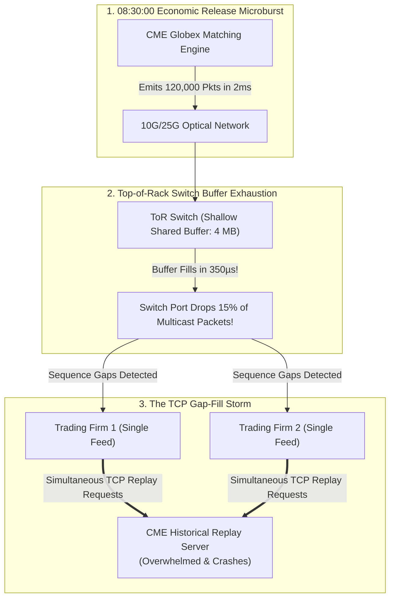

# War Story — The CME Globex Multicast Microburst Freeze: Switch Buffer Exhaustion & TCP Gap-Fill Storms

> [!summary]
> In high-frequency futures trading on CME Globex, market volatility surges frequently trigger extreme network microbursts—concentrating over 100,000 UDP multicast packets into a single 2-millisecond window. This war story analyzes how shallow Top-of-Rack switch buffers and naive single-feed participant architectures caused cascading packet drops, overwhelming CME historical TCP gap-fill servers and driving the industry-wide adoption of dual-feed (A/B) line-rate arbitration.

---

## 1. Incident Mechanism: The Anatomy of a Market Open Microburst

In electronic derivatives trading (e.g. CME E-mini S&P and Treasury 10-Year futures in Aurora, IL):
- At exactly **08:30:00 EST (US Non-Farm Payrolls or CPI Economic Release)**, hundreds of quantitative trading engines simultaneously submit orders and cancel resting quotes.
- The CME Globex matching engine emits market data updates (MDP 3.0 SBE) across **UDP Multicast Feed A and Feed B**.

---

## 2. Technical & Network Root Cause Analysis

### A. The Shallow Switch Buffer Bottleneck
- **The Network Reality**: A 10Gbps optical Ethernet link transmits **1 byte every 0.8 nanoseconds** (or one 1500-byte frame every $1.2\text{ µs}$).
- **The Microburst**: When CME emitted 120,000 market data packets in a 2-millisecond burst, the instantaneous line-rate bandwidth spiked to **$9.6\text{ Gbps}$**.
- **The Buffer Overflow**:
  - Legacy cut-through Top-of-Rack (ToR) switches configured with **shallow shared packet buffers (e.g. 4MB to 9MB total buffer space)** exhausted their ingress buffer queues in **less than 400 microseconds**.
  - Once the switch buffer filled, the switch had no choice but to **tail-drop incoming UDP multicast packets**, discarding entire sequence number spans.

### B. The TCP Gap-Fill Storm (The Amplification Cascade)
- In the early days of CME MDP 3.0, many trading firms listened to only **Feed A** (to save NIC port costs and reduce software parsing complexity).
- When Feed A packets were dropped by the switch:
  1. Hundreds of participant feed handlers simultaneously detected sequence number gaps ($Seq = 1000 \to 1050$).
  2. Every participant feed handler automatically established a **TCP connection to CME's Historical Replay Server** to request the missing 50 packets.
  3. The CME TCP Replay servers were hit with **tens of thousands of simultaneous TCP retransmission requests in under 10 milliseconds**.
  4. The TCP servers experienced SYN flood exhaustion, connection resets, and latency inflation exceeding **500 milliseconds**, during which trading firms remained completely blind to live market prices!

---

## 3. The 3 Architectural Remediations

| Failure Domain | Legacy Vulnerable Architecture | Modern Low-Latency Production Standard |
| :--- | :--- | :--- |
| **Market Data Ingestion** | Single-feed listening (Feed A only). | **Hardware Dual A/B Feed Arbitration**: Ingest Feed A and Feed B simultaneously on separate physical NIC ports; arbitrate packet-by-packet in <10ns. |
| **Network Switch Topology** | Shallow-buffer switches with shared output queues. | **Deep Dynamic Buffer Switches (e.g. Arista 7050X3 / 7280R3)**: 32MB+ packet buffers capable of absorbing 100ms microbursts. |
| **NIC Ring Sizing** | Default 512-entry RX descriptor rings. | **Tuned 4096-Entry RX Descriptor Rings with HugePages**: Prevents host CPU memory drops during microbursts (`ethtool -G eth0 rx 4096`). |

---

## 4. Key Engineering Takeaways for Low-Latency Systems

1. **Always Implement Dual-Feed (A/B) Arbitration**: In UDP multicast trading networks, never assume a single feed is reliable. Feed A and Feed B travel across physically disjoint optical paths. If Feed A drops a packet due to a switch microburst, Feed B will arrive intact 99.99% of the time, eliminating the need for TCP gap fills.
2. **Size RX Descriptor Rings for Worst-Case Microbursts**: In high-frequency trading, average bandwidth is meaningless; **peak microburst bandwidth** governs system survival. Set host NIC descriptor rings to the hardware maximum (4,096 descriptors) and lock DMA memory with HugePages.
3. **Handle Gap-Fill Recovery Asynchronously**: Never block the main trading thread waiting for a TCP gap-fill response. If a gap occurs that cannot be resolved via Feed B, the trading engine must immediately withdraw active quotes, transition to a "Stale Book" state, and allow a background worker thread to handle TCP recovery.

---

## Related Notes
- [[06 - Networking/UDP Multicast Market Data and A-B Feed Arbitration]]
- [[06 - Networking/Switch Architectures in Trading]]
- [[06 - Networking/Network Interface Card Architecture]]
- [[10 - Protocols & Codecs/CME MDP 3.0 and Simple Binary Encoding SBE]]
- [[14 - Industry Map & Canon/MOC - 14 Industry Map & Canon]]

## Sources
- [[Sources/CME MDP 3.0 Market Data Protocol Specification]]
- [[Sources/Systems Performance by Brendan Gregg]]
- [[Sources/How to Build an Exchange by Jane Street]]
